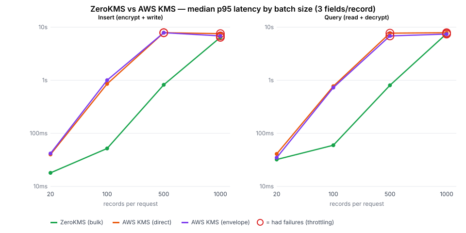
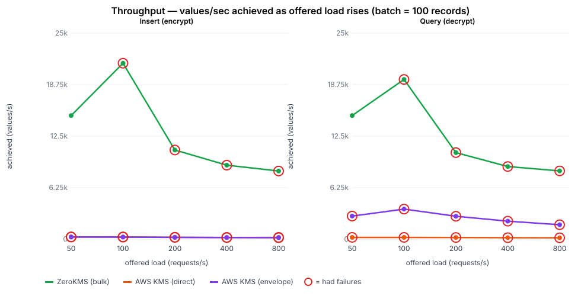

# ZeroKMS vs AWS KMS — bulk field encryption benchmark

How ZeroKMS compares to AWS KMS when an application encrypts and decrypts
**many values per request** — the normal case for field-level encryption (read
20 rows with 3 encrypted fields each → 60 decryptions in one request).

**Environment (headline run):** two AWS `c7i.2xlarge` instances in
`ap-southeast-2` (same region as KMS and ZeroKMS) — the app + Postgres on one,
the Artillery load generator on a **separate** instance hitting it over the
private network. Keeping the load generator off the system-under-test is what
makes the numbers trustworthy. (Earlier laptop and single-box runs are kept as
labeled baselines — see [Other runs](#other-runs).)

## Headline

- **ZeroKMS does a whole batch in one network round-trip** (`bulkEncryptModels`/
  `bulkDecryptModels`, up to 10,000 keys per call). **AWS KMS has no bulk API**,
  so a batch of N records × 3 fields is N×3 individual KMS calls.
- **Latency:** at a realistic 100-record batch, ZeroKMS is **~16× faster**
  (52 ms vs 854 ms p95). By 500 records AWS KMS **throttle-fails**; ZeroKMS
  stays clean.
- **Throughput:** ZeroKMS sustains **~21,000 values/s**; AWS KMS collapses to
  **~250 values/s** under load — a **~85× gap**.
- **Data-key reuse doesn't close the gap.** The usual AWS workaround (reuse one
  data key across many records) speeds writes but collapses to one KMS call per
  record on realistic *scattered* reads, while trading away per-record audit and
  revocation — see [**`REUSE.md`**](REUSE.md).

## Latency — median p95 by batch size

| records / req | values | ZeroKMS | AWS KMS (direct) | AWS KMS (envelope) | ZeroKMS faster |
|---:|---:|---:|---:|---:|---:|
| 20 | 60 | **18 ms** | 40 ms | 42 ms | 2.2× |
| 100 | 300 | **52 ms** | 854 ms | 1,002 ms | **~16×** |
| 500 | 1,500 | **821 ms** | 7,866 ms ⚠️ | 7,866 ms ⚠️ | ~10× |
| 1,000 | 3,000 | 6,440 ms ⚠️ | 7,557 ms ⚠️ | 6,838 ms ⚠️ | — |

(Insert/write path; the read/decrypt path is the same shape — full data in
[`results-ec2/sweep/data.csv`](results-ec2/sweep/data.csv).) `⚠️` = the cell had
throttling failures.

**The 1,000-record row is not a clean backend comparison** — at that size the
*application* work dominates (generating 1,000 records, serialising 3,000
ciphertexts, a 1,000-row INSERT), so both backends are bounded by the app
instance's CPU, not the key service. The clean signal is 20–500 records.

## Throughput — values/sec under rising load

Holding a 100-record batch and stepping the request rate up:

- **ZeroKMS** rises to **~21,000 values/s**, then degrades as the *app instance*
  saturates (one bulk round-trip per request keeps the key service out of the
  bottleneck).
- **AWS KMS** never exceeds **~250 values/s** (direct) and fails the large
  majority of requests from the start — per-value calls hit the KMS rate limit
  immediately. More offered load produces *fewer* successful values/s.
- That is a **~85× sustained-throughput gap.** Note ZeroKMS's ~21k ceiling here
  is the **app instance's 8 vCPU**, not ZeroKMS — it is a floor, not a limit.

Data: [`results-ec2/throughput/data.csv`](results-ec2/throughput/data.csv).

## Methodology

A thin Next.js CRUD app stores records with three encrypted fields, with a
pluggable encryption backend selected per server process.

- **Topology.** App + Postgres 16 on instance A; Artillery on a **separate**
  instance B, hitting A's private IP. For each cell B restarts A's server (a
  transient `systemd` unit) for per-cell isolation, then runs the load. Both
  `c7i.2xlarge` (8 vCPU) in `ap-southeast-2`. AWS via an EC2 instance role
  scoped to one KMS key; ZeroKMS via a headless access key.
- **Backends, under equal security constraints.** Every value is individually
  mediated (its own key, individually auditable/revocable). ZeroKMS uses its
  bulk API (one round-trip per batch); AWS makes one call per value, fanned out
  concurrently. Envelope runs at `ENVELOPE_DATA_KEY_MAX_USES=1` — data-key
  caching is a *weaker* security model, not a faster version of the same one,
  so it is excluded from the fair comparison. See the
  [README](README.md#fairness-compare-under-equal-security-constraints).
- **Procedure.** Latency: 3 interleaved rounds, batch 20/100/500/1,000.
  Throughput: fixed 100-record batch, request rate stepped 50→800/s.
  Median p95 across rounds; failures = Artillery `vusers.failed`.
- **Reproduce:** [`EC2.md`](EC2.md) (the two-host runbook). Driver:
  [`scripts/sweep-2host.sh`](scripts/sweep-2host.sh).

## Limitations

- **App-instance-bound at the extremes.** The 1,000-record latency and the
  throughput ceiling are limited by instance A's CPU, not the key service; a
  larger app box would push both further (and widen, not narrow, the gap).
- The AWS failure threshold depends on region/KMS quota/retry config.
- Single region. Numbers are comparative for *this* workload.

## Other runs

Kept for transparency; **not** the citable numbers:

- **Laptop (home Wi-Fi):** [`results/`](results/) — directional; the home
  network *overstates* the gap (per-value calls pay the network penalty N times).
- **Single c6i.xlarge (discarded):** co-locating the load generator with the app
  on 4 vCPU made the *instance* the bottleneck — which is exactly why the
  headline run uses a separate load generator.
