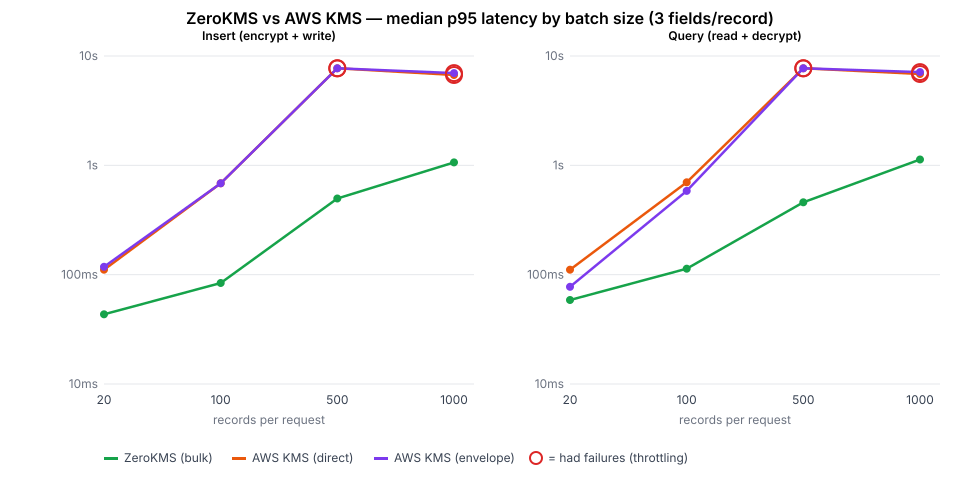
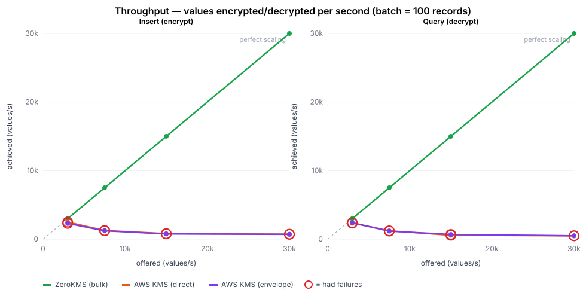

# ZeroKMS vs AWS KMS — bulk field encryption benchmark

How ZeroKMS compares to AWS KMS when an application encrypts and decrypts
**many values per request** — the normal case for field-level encryption (read
20 rows with 3 encrypted fields each → 60 decryptions in one request).

> ⚠️ **Environment: developer laptop on home Wi‑Fi.** These are *directional*
> numbers. A home network adds latency and jitter to every round‑trip, which
> **overstates the gap** — ZeroKMS pays that overhead once per batch, AWS KMS
> pays it per value. The conservative, publishable numbers come from an
> in‑region EC2 run (see [`EC2.md`](EC2.md)); this page is the dev baseline.



## Headline

- **ZeroKMS does a whole batch in one network round‑trip** (`bulkEncryptModels`/
  `bulkDecryptModels`, up to 10,000 keys per call). **AWS KMS has no bulk API**,
  so a batch of N records × 3 fields is N×3 individual KMS calls.
- **Latency:** the gap grows with batch size — **~8× at 100 records, ~15–17× at
  500** (median p95). AWS KMS throttle‑fails past a few hundred values per
  request; **ZeroKMS had zero failures at every size.**
- **Throughput:** ZeroKMS scaled linearly to **≥30,000 values/s with zero
  failures** (and never saturated — that's the laptop's ceiling, not ZeroKMS's).
  AWS KMS peaked at **~2,500 values/s and then *collapsed* under load** — pushing
  harder produced *fewer* successful values/s as throttling took over. A
  **≥12× throughput gap, and widening.**

## Latency — median p95 across 3 rounds

`⚠️` = AWS failed a majority of requests in that cell (KMS throttling).
ZeroKMS: **0 failures at every size.**

### Insert (encrypt + write)
| records / req | values | ZeroKMS | AWS KMS (direct) | AWS KMS (envelope) | ZeroKMS faster |
|---:|---:|---:|---:|---:|---:|
| 20 | 60 | **43 ms** | 111 ms | 118 ms | 2.6× |
| 100 | 300 | **84 ms** | 686 ms | 686 ms | 8× |
| 500 | 1,500 | **498 ms** | 7,710 ms ⚠️ | 7,710 ms ⚠️ | 15× |
| 1,000 | 3,000 | **1,064 ms** | 6,703 ms ⚠️ | 6,976 ms ⚠️ | 6× |

### Query (read + decrypt)
| records / req | values | ZeroKMS | AWS KMS (direct) | AWS KMS (envelope) | ZeroKMS faster |
|---:|---:|---:|---:|---:|---:|
| 20 | 60 | **59 ms** | 111 ms | 78 ms | 2× |
| 100 | 300 | **113 ms** | 699 ms | 584 ms | 6× |
| 500 | 1,500 | **460 ms** | 7,710 ms ⚠️ | 7,710 ms ⚠️ | 17× |
| 1,000 | 3,000 | **1,130 ms** | 6,838 ms ⚠️ | 7,117 ms ⚠️ | 6× |

The gap peaks around 500 records and compresses at 1,000 because ZeroKMS's own
batch latency grows while AWS plateaus at its failure ceiling (~7 s for the
requests that don't time out). Full per‑round data: [`results/sweep/data.csv`](results/sweep/data.csv).

## Throughput — sustained values/sec (batch = 100)

Holding a 100‑record batch (300 values/request) and stepping the request rate
up toward saturation:



| offered (values/s) | ZeroKMS | AWS KMS (direct) | AWS KMS (envelope) |
|---:|---:|---:|---:|
| 3,000 | **3,000** ✓ | 2,486 ⚠️ | 2,293 ⚠️ |
| 7,500 | **7,500** ✓ | 1,264 ⚠️ | 1,221 ⚠️ |
| 15,000 | **15,000** ✓ | 814 ⚠️ | 771 ⚠️ |
| 30,000 | **30,000** ✓ | 729 ⚠️ | 707 ⚠️ |

*(insert path; query is the same shape. ✓ = 0 failures; ⚠️ = throttle failures.)*

- **ZeroKMS tracks the offered load exactly, 0 failures, all the way to 30,000
  values/s** — it kept up with everything we could throw at it from a laptop and
  **never saturated**. Its real ceiling is higher; this is a *floor*.
- **AWS KMS doesn't just cap — it collapses.** It can't fully sustain even 3,000
  values/s, and as offered load rises, *achieved* throughput **falls** (to ~700
  values/s) while failures climb into the thousands. More load makes AWS slower,
  not faster — the signature of per‑value rate limiting.
- That's a **≥12× sustained‑throughput gap** here, and it widens with more load.
  Data: [`results/throughput/data.csv`](results/throughput/data.csv).

## Methodology

A thin Next.js CRUD app stores records with three encrypted fields, with a
pluggable encryption backend selected per server process. Artillery drives two
benchmarks — **insert** (write) and **query** (read of existing rows). The
**latency** sweep varies batch size (20/100/500/1,000) at a fixed arrival rate;
the **throughput** sweep fixes the batch (100 records) and steps the arrival
rate up (10/25/50/100 req/s) toward saturation, recording achieved values/sec.

- **Backends, under equal security constraints.** The comparison holds the
  security model constant: every value is individually mediated (its own key,
  individually auditable/revocable). ZeroKMS uses its bulk API (one round‑trip
  per batch); AWS KMS makes one call per value, fanned out concurrently
  (`Promise.all`, `AWS_MAX_ATTEMPTS=3`). Envelope is included at
  `ENVELOPE_DATA_KEY_MAX_USES=1` (one data key per value) — *data‑key caching is
  a weaker security model, not a faster version of the same one, so it is
  excluded from the fair comparison.* See the [README](README.md#fairness-compare-under-equal-security-constraints).
- **Environment.** Apple M4 / 24 GB / macOS 15.5, home Wi‑Fi. AWS KMS and
  ZeroKMS both in `ap-southeast-2`; Postgres 17 local on `:5400`; Artillery on
  the same machine. AWS via a least‑privilege static key (Encrypt/Decrypt/
  GenerateDataKey on one key); ZeroKMS via the local `stash` profile.
- **Procedure.** 3 interleaved rounds (backends rotated each round to share
  temporal variance). **Each cell runs against a fresh server process** so a
  large‑batch meltdown can't spill timeouts into the next cell. Warmup 3 s +
  steady 15 s per cell; arrival rate 10/5/2/1 for size 20/100/500/1,000.
- **Metrics.** Median p95 latency across the 3 rounds; sustained throughput =
  successful values / wall‑clock; failures = Artillery `vusers.failed`.
- **Throughput is a *floor*, not a ceiling.** ZeroKMS never saturated — the
  laptop's load generator and home network capped the offered load before
  ZeroKMS hit its limit. The AWS numbers, by contrast, are real saturation (AWS
  is the bottleneck). The in‑region EC2 run will find ZeroKMS's actual ceiling.

## What it means for the "≈14×" claim

The advantage is a function of batch size, because the architectures differ at
the root: one round‑trip vs N. It lands around **15–17× at 500‑record batches**
on this hardware, then AWS simply throttle‑fails. So "≈14×" is defensible *as a
bulk, mid‑batch figure* — quote it with the batch‑size condition, not as a
blanket multiple. (On a faster in‑region path the multiple will be smaller; the
EC2 run will give that conservative number.)

## Reproduce

```sh
cd kms-app && npm install && npm run db:setup
ROUNDS=3 DS=15 DW=3 bash scripts/sweep-repeat.sh   # ~30 min
node scripts/collect.mjs && node scripts/chart.mjs && node scripts/aggregate.mjs 3
```
Raw per‑round Artillery output is committed under [`results/sweep/`](results/sweep/).

## Limitations

- **Home network** (overstates the gap; in‑region EC2 run pending — `EC2.md`).
- Single region, 3 rounds, 15 s cells — modest. The AWS failure threshold
  depends on region/quota/retry config.
- ZeroKMS bulk latency also grows with batch size — it is one round‑trip, not
  free.
