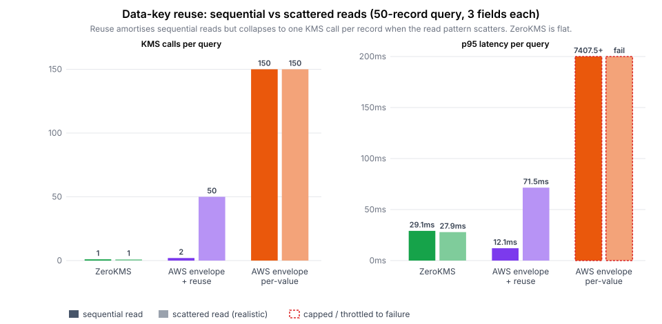

# Data-key reuse doesn't fix AWS KMS for database encryption

A follow-up to the [main benchmark](REPORT.md). The standard advice for AWS KMS
performance is **data-key reuse / caching**: instead of one KMS call per value,
generate one AES data key, encrypt many records locally with it, and only call
KMS once per *key* rather than once per *value*. This experiment measures whether
that actually fixes the database-encryption case.

**It does not.** Reuse amortises *writes* and *sequential* reads, but real query
patterns aren't sequential — and the moment a read scatters across the table,
reuse collapses back to **one KMS Decrypt per record**, the exact cost it was
meant to avoid. It buys a fragile, best-case speedup at the cost of per-record
auditability and revocation. ZeroKMS gets the same amortisation on *every*
pattern, with per-value mediation intact.

**Environment:** the same two-host in-region setup as the main report — app +
Postgres on one `c7i.2xlarge`, Artillery on a separate one, `ap-southeast-2`.

## The mechanism

Envelope encryption with reuse keeps a plaintext data key in memory and stamps it
onto the next *N* values (`ENVELOPE_DATA_KEY_MAX_USES`). On a read you must call
KMS `Decrypt` once for **each distinct data key** the result references:

- **Insert order ≈ key order.** Records inserted together share a data key.
- **Sequential read** (a contiguous id window) therefore touches ~1 key → ~1
  KMS call for the whole page. This is reuse's best case.
- **Scattered read** (records picked by id from across the table — what a real
  lookup by user, time range, or secondary index looks like) touches ~one
  *distinct* key per record → ~N KMS calls. Amortisation gone.

Retrieval patterns in practice look nothing like insert patterns, so the
scattered case is the realistic one.

## Result

**Ingest (100-record insert) — reuse helps writes, as advertised:**

| Backend | p95 | KMS calls / insert |
|---|---:|---:|
| ZeroKMS (bulk) | 67 ms | **1** |
| AWS envelope **+ reuse** (1 key / 100 recs) | **19 ms** | **1** |
| AWS envelope **per-value** | 889 ms | **300** |

**Query (50-record read, 3 fields each) — reuse does *not* help real reads:**

| Backend | Pattern | p95 | KMS calls / query |
|---|---|---:|---:|
| ZeroKMS (bulk) | sequential | 29 ms | **1** |
| ZeroKMS (bulk) | scattered | **28 ms** | **1** |
| AWS envelope + reuse | sequential | 12 ms | 2 |
| AWS envelope + reuse | **scattered** | **71 ms** | **50** |
| AWS envelope per-value | sequential | 7,407 ms ⚠️ | 150 |
| AWS envelope per-value | scattered | fail ⚠️ | 150 |

`⚠️` = throttled to failure (936/1000 and 1000/1000 requests failed).

Full data: [`results-ec2/reuse/data.csv`](results-ec2/reuse/data.csv).

## Reading the result

- **Reuse's sequential win is real but not representative.** 2 KMS calls for 50
  records, 12 ms. It only holds while reads track insert order.
- **Scattered reads collapse it.** The same backend jumps to **50 KMS calls** —
  one per record — and p95 rises **~6×** (12 → 71 ms). That is the per-value cost
  reuse was supposed to eliminate, now paid on every query.
- **ZeroKMS is flat across patterns.** One bulk round-trip whether the read is
  sequential or scattered: ~28 ms, 1 call. Pattern-independence is the whole
  point — it doesn't bet on locality it can't control.
- **Per-value AWS is the equal-security baseline,** and under query load it
  throttle-fails outright (150 Decrypts/query × 50 req/s ≫ KMS quota).

## The cost reuse hides

Speed isn't the only axis. Reusing one data key across 100 records means:

- **No per-record revocation.** Revoking access to one record's key revokes it
  for the other 99 that share it.
- **Coarse audit.** The KMS audit log shows one `Decrypt` of a key that unlocks
  100 records — not which record was actually read. Per-value mediation (ZeroKMS,
  or AWS at `MAX_USES=1`) logs every access.
- **Larger blast radius.** A leaked plaintext data key exposes every record it
  ever encrypted, not one.

So the reuse "fix" trades a real security property (per-record mediation) for a
speedup that only materialises on sequential reads — which production query
patterns rarely are. ZeroKMS gives the amortisation *and* keeps per-value
mediation, on every access pattern.

## Reproduce

Driver: [`scripts/reuse-test.sh`](scripts/reuse-test.sh) (runs on the load host,
drives the app host). Chart: `node scripts/reuse-chart.mjs`. The query endpoint
takes `?limit=N&scatter=true|false`; `ENVELOPE_DATA_KEY_MAX_USES` sets reuse
(counts values, so 300 ≈ 100 records/key). Seed one backend's rows at a time and
restart the server between seed and query so the id range is fresh.
