# Benchmark Report

This report summarizes the performance benchmarks for encrypted database operations.

## Table of Contents

1. [Ingest Throughput](#ingest-throughput)
   - [Int](#int)
   - [Json Large](#json-large)
   - [Json Small](#json-small)
   - [Ste Vec Large](#ste-vec-large)
   - [Ste Vec Small](#ste-vec-small)
   - [String](#string)
2. [Query Performance](#query-performance)
   - [EXACT Queries](#exact-queries)
   - [MATCH Queries](#match-queries)
   - [ORE Queries](#ore-queries)

---

## Ingest Throughput

This section measures the throughput of inserting encrypted records into the database.

### Comparison at 10,000 Records

Comparing all benchmark types at 10,000 records.

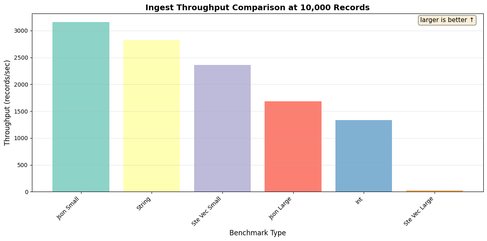

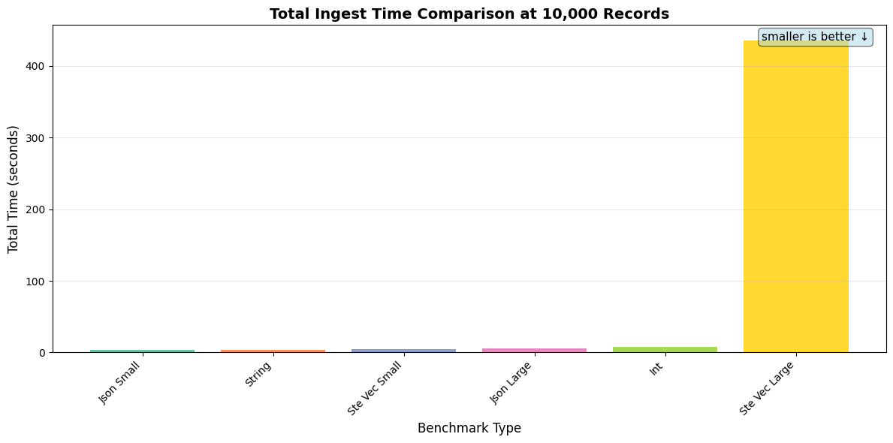


### Int

Tests insertion of encrypted integer values.

| Records | Throughput (records/sec) | Total Time | Avg Memory |
|---------|--------------------------|------------|------------|
| 500 | 544.83 | 0.92s | 15.25 MB |
| 1,000 | 1.11K | 0.90s | 17.83 MB |
| 10,000 | 1.34K | 7.48s | 20.34 MB |

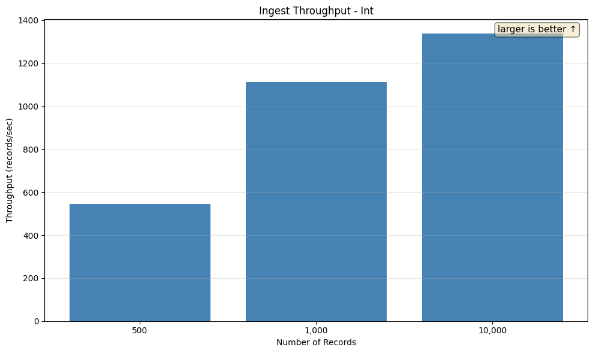

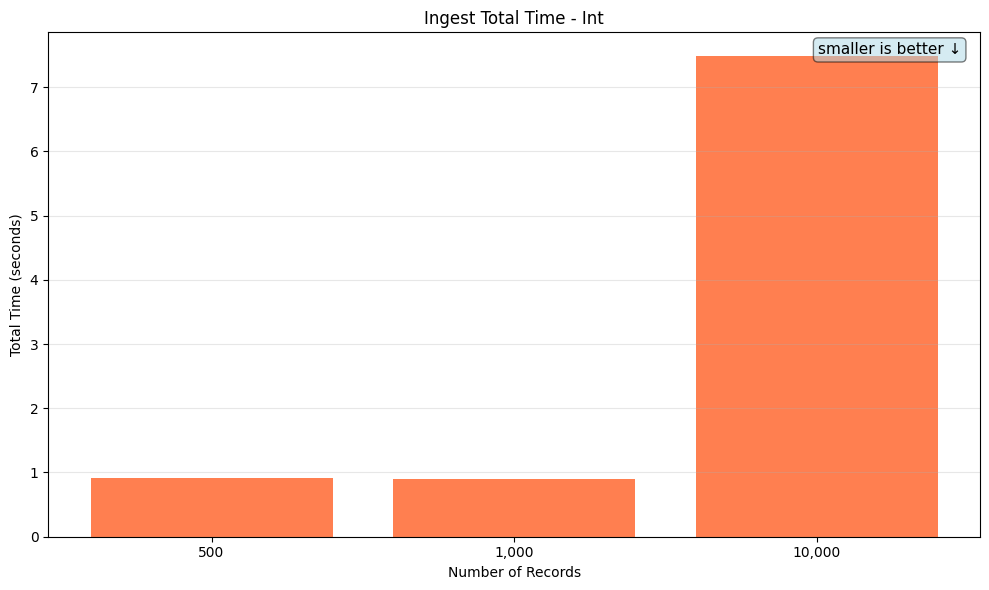

### Json Large

Tests insertion of large encrypted JSON objects with complex nested structures (user info, company, addresses, orders).

| Records | Throughput (records/sec) | Total Time | Avg Memory |
|---------|--------------------------|------------|------------|
| 500 | 606.09 | 0.82s | 53.41 MB |
| 1,000 | 1.29K | 0.78s | 93.53 MB |
| 10,000 | 1.69K | 5.93s | 658.81 MB |

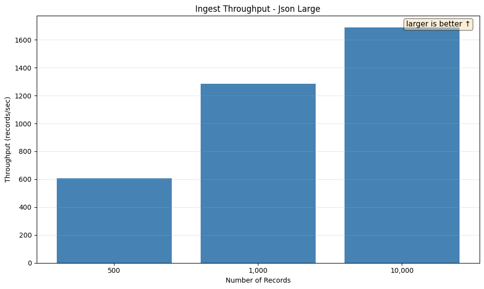

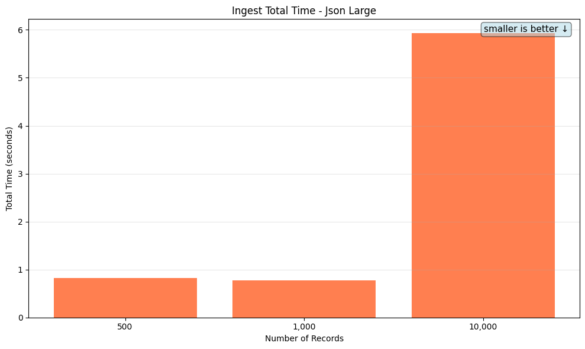

### Json Small

Tests insertion of small encrypted JSON objects (first_name, last_name, age, email).

| Records | Throughput (records/sec) | Total Time | Avg Memory |
|---------|--------------------------|------------|------------|
| 500 | 645.13 | 0.78s | 14.36 MB |
| 1,000 | 2.05K | 0.49s | 15.62 MB |
| 10,000 | 3.16K | 3.17s | 24.47 MB |

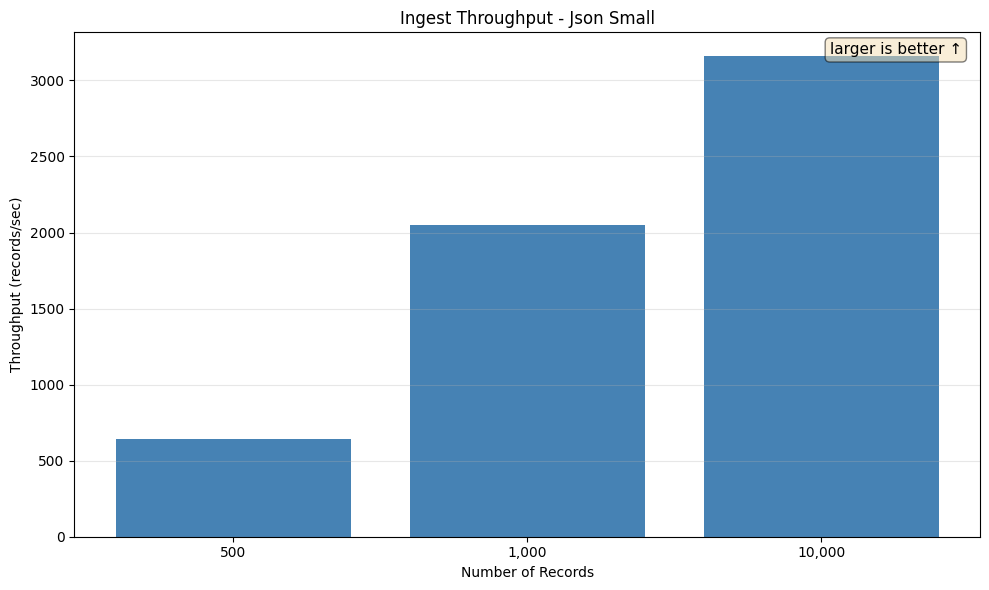

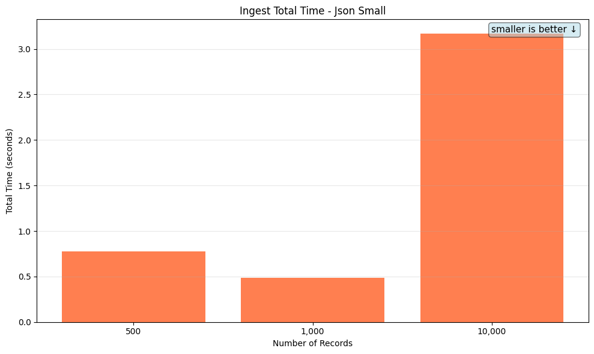

### Ste Vec Large

Tests insertion of large JSON objects with SteVec (searchable encrypted vector) indexing.

| Records | Throughput (records/sec) | Total Time | Avg Memory |
|---------|--------------------------|------------|------------|
| 500 | 22.28 | 22.44s | 1834.23 MB |
| 1,000 | 22.76 | 43.93s | 3623.81 MB |
| 10,000 | 22.98 | 435.23s | 10360.45 MB |

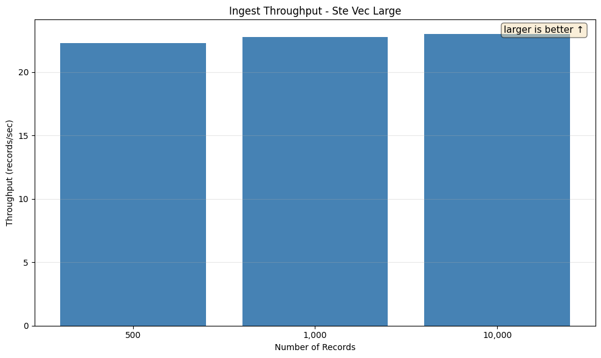

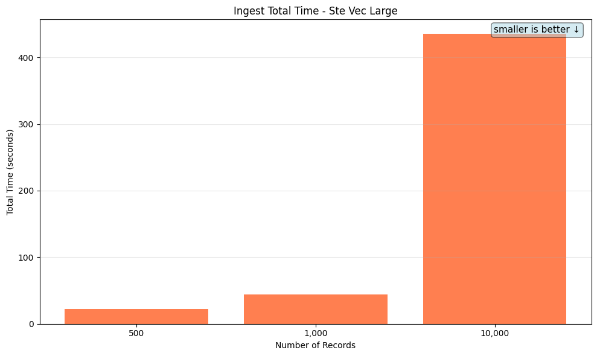

### Ste Vec Small

Tests insertion of small JSON objects with SteVec (searchable encrypted vector) indexing.

| Records | Throughput (records/sec) | Total Time | Avg Memory |
|---------|--------------------------|------------|------------|
| 500 | 603.60 | 0.83s | 18.66 MB |
| 1,000 | 1.63K | 0.61s | 26.12 MB |
| 10,000 | 2.36K | 4.23s | 46.22 MB |

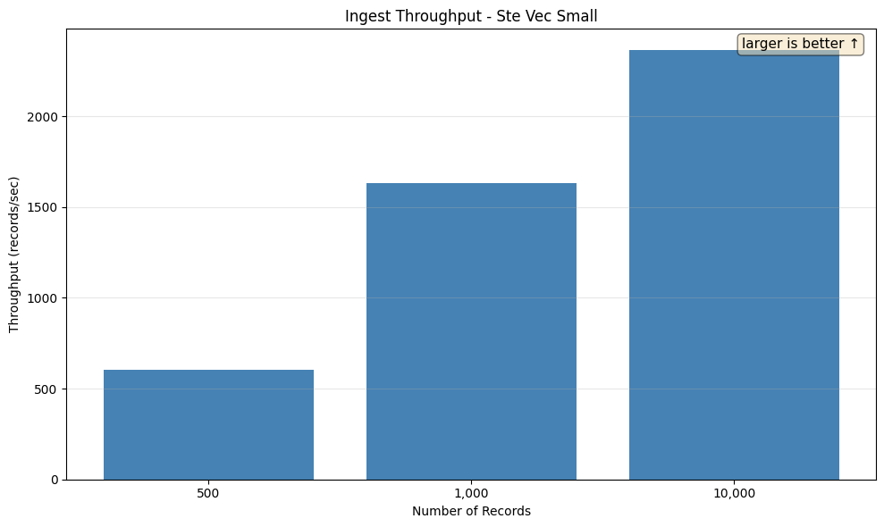

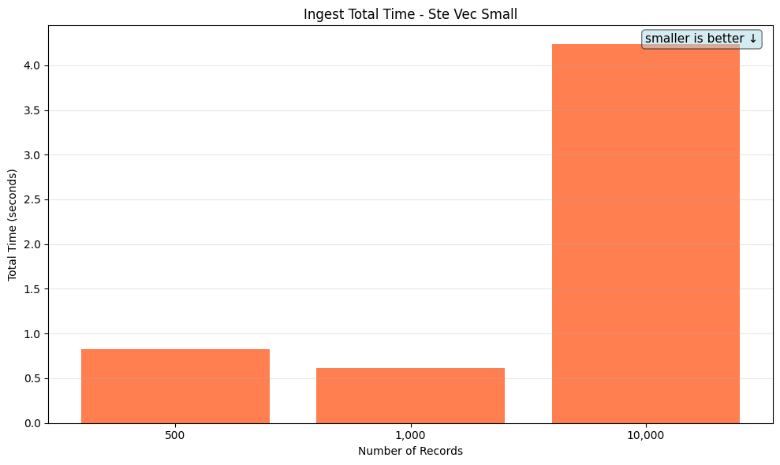

### String

Tests insertion of encrypted string values.

| Records | Throughput (records/sec) | Total Time | Avg Memory |
|---------|--------------------------|------------|------------|
| 500 | 559.65 | 0.89s | 14.12 MB |
| 1,000 | 1.86K | 0.54s | 16.19 MB |
| 10,000 | 2.83K | 3.54s | 18.23 MB |


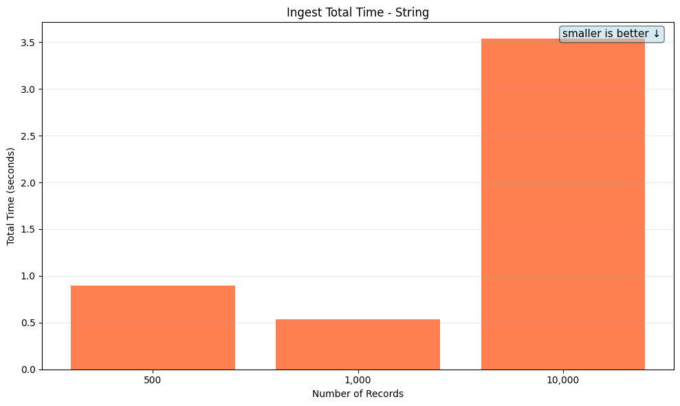

## Query Performance

This section measures query performance across different data set sizes. Each query is tested with and without decryption of results.

### EXACT Queries

#### eql_cast

**Description:** Exact match using EQL cast operator

**SQL Query:**
```sql
SELECT value FROM {TABLE} WHERE value = $1 LIMIT 1
```

**Parameter:** `Bob Johnson`

**Table: `string_encrypted_{rows}` with encrypted string values. Index: UNIQUE index on the encrypted value column.**

**Indexes:**
```sql
CREATE INDEX
string_encrypted_10000_hash_index
ON string_encrypted_10000 using hash (
    eql_v2.hmac_256(value)
);

CREATE INDEX
string_encrypted_10000_gin_index
ON string_encrypted_10000 USING GIN (
    eql_v2.bloom_filter(value)
);

CREATE INDEX
string_encrypted_10000_eql_index
ON string_encrypted_10000 (
    value eql_v2.encrypted_operator_class
);
```

*⚠️ = Query time exceeds 100ms*

| Data Set Size | Query Time (no decrypt) | Query Time (with decrypt) |
|---------------|-------------------------|---------------------------|
| 10,000 | ⚠️ 119.93ms | ⚠️ 122.15ms |
| 100,000 | ⚠️ 1.669s | ⚠️ 787.01ms |
| 1,000,000 | ⚠️ 7.827s | ⚠️ 7.836s |
| 10,000,000 | ⚠️ 79.899s | ⚠️ 93.837s |

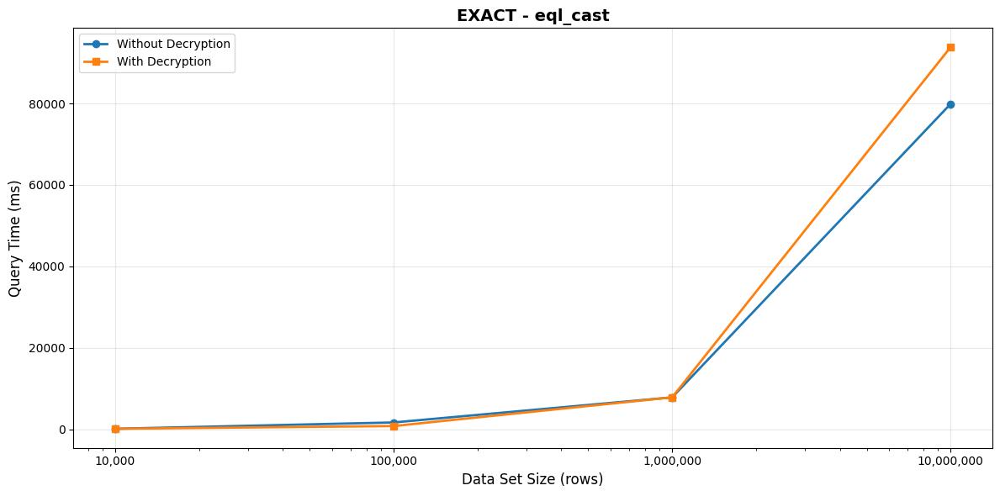

#### eql_hash

**Description:** Exact match using EQL HMAC-256 hash function

**SQL Query:**
```sql
SELECT value FROM {TABLE} WHERE eql_v2.hmac_256(value) = eql_v2.hmac_256($1::jsonb) LIMIT 1
```

**Parameter:** `Bob Johnson`

**Table: `string_encrypted_{rows}` with encrypted string values. Index: Hash-based unique index using `eql_v2.hmac_256`.**

**Indexes:**
```sql
CREATE INDEX
string_encrypted_10000_hash_index
ON string_encrypted_10000 using hash (
    eql_v2.hmac_256(value)
);

CREATE INDEX
string_encrypted_10000_gin_index
ON string_encrypted_10000 USING GIN (
    eql_v2.bloom_filter(value)
);

CREATE INDEX
string_encrypted_10000_eql_index
ON string_encrypted_10000 (
    value eql_v2.encrypted_operator_class
);
```

| Data Set Size | Query Time (no decrypt) | Query Time (with decrypt) |
|---------------|-------------------------|---------------------------|
| 10,000 | 410.44μs | 414.48μs |
| 100,000 | 395.17μs | 395.38μs |
| 1,000,000 | 399.96μs | 404.21μs |
| 10,000,000 | 398.98μs | 396.28μs |

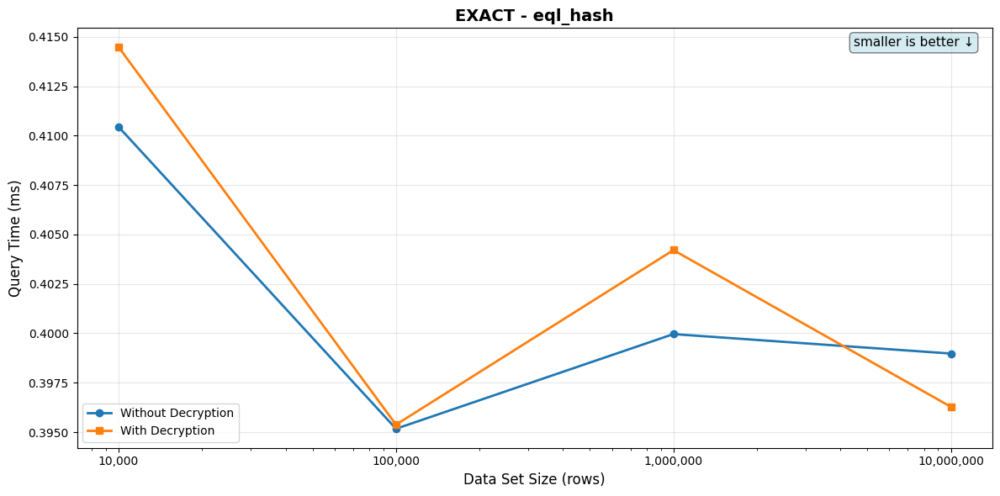

### MATCH Queries

#### eql_bloom

**Description:** Pattern matching using EQL bloom filter containment

**SQL Query:**
```sql
SELECT id,value::jsonb FROM {TABLE} WHERE eql_v2.bloom_filter(value) @> eql_v2.bloom_filter($1) LIMIT 10
```

**Parameter:** `Johnson`

**Table: `string_encrypted_{rows}` with encrypted string values. Index: Bloom filter index using `eql_v2.bloom_filter`. Query returns LIMIT 10 results.**

**Indexes:**
```sql
CREATE INDEX
string_encrypted_10000_hash_index
ON string_encrypted_10000 using hash (
    eql_v2.hmac_256(value)
);

CREATE INDEX
string_encrypted_10000_gin_index
ON string_encrypted_10000 USING GIN (
    eql_v2.bloom_filter(value)
);

CREATE INDEX
string_encrypted_10000_eql_index
ON string_encrypted_10000 (
    value eql_v2.encrypted_operator_class
);
```

*⚠️ = Query time exceeds 100ms*

| Data Set Size | Query Time (no decrypt) | Query Time (with decrypt) |
|---------------|-------------------------|---------------------------|
| 10,000 | 930.90μs | 63.38ms |
| 100,000 | 3.35ms | 68.21ms |
| 1,000,000 | 21.23ms | 83.97ms |
| 10,000,000 | ⚠️ 195.96ms | ⚠️ 262.86ms |

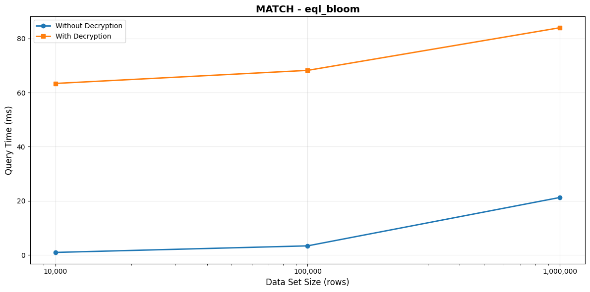

#### eql_cast_firstname

**Description:** Pattern matching on first name using EQL cast and LIKE

**SQL Query:**
```sql
SELECT id,value::jsonb FROM {TABLE} WHERE value LIKE $1 LIMIT 10
```

**Parameter:** `Bob`

**Table: `string_encrypted_{rows}` with encrypted string values. Index: MATCH index for substring searches. Query returns LIMIT 10 results.**

**Indexes:**
```sql
CREATE INDEX
string_encrypted_10000_hash_index
ON string_encrypted_10000 using hash (
    eql_v2.hmac_256(value)
);

CREATE INDEX
string_encrypted_10000_gin_index
ON string_encrypted_10000 USING GIN (
    eql_v2.bloom_filter(value)
);

CREATE INDEX
string_encrypted_10000_eql_index
ON string_encrypted_10000 (
    value eql_v2.encrypted_operator_class
);
```

*⚠️ = Query time exceeds 100ms*

| Data Set Size | Query Time (no decrypt) | Query Time (with decrypt) |
|---------------|-------------------------|---------------------------|
| 10,000 | ⚠️ 263.49ms | ⚠️ 321.93ms |
| 100,000 | ⚠️ 341.72ms | ⚠️ 401.96ms |
| 1,000,000 | ⚠️ 399.14ms | ⚠️ 450.21ms |
| 10,000,000 | ⚠️ 410.74ms | ⚠️ 487.84ms |

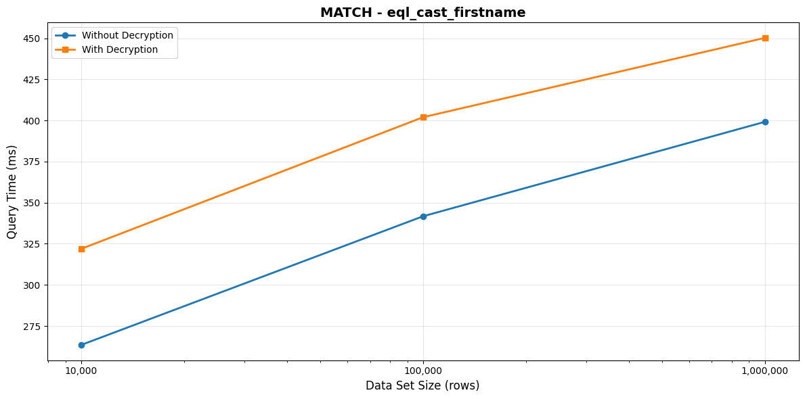

#### eql_cast_lastname

**Description:** Pattern matching on last name using EQL cast and LIKE

**SQL Query:**
```sql
SELECT id,value::jsonb FROM {TABLE} WHERE value LIKE $1 LIMIT 10
```

**Parameter:** `Johnson`

**Table: `string_encrypted_{rows}` with encrypted string values. Index: MATCH index for substring searches. Query returns LIMIT 10 results.**

**Indexes:**
```sql
CREATE INDEX
string_encrypted_10000_hash_index
ON string_encrypted_10000 using hash (
    eql_v2.hmac_256(value)
);

CREATE INDEX
string_encrypted_10000_gin_index
ON string_encrypted_10000 USING GIN (
    eql_v2.bloom_filter(value)
);

CREATE INDEX
string_encrypted_10000_eql_index
ON string_encrypted_10000 (
    value eql_v2.encrypted_operator_class
);
```

*⚠️ = Query time exceeds 100ms*

| Data Set Size | Query Time (no decrypt) | Query Time (with decrypt) |
|---------------|-------------------------|---------------------------|
| 10,000 | ⚠️ 146.33ms | ⚠️ 205.98ms |
| 100,000 | ⚠️ 119.51ms | ⚠️ 177.16ms |
| 1,000,000 | ⚠️ 127.20ms | ⚠️ 190.63ms |
| 10,000,000 | ⚠️ 142.95ms | ⚠️ 195.97ms |


### ORE Queries

#### exact

**Description:** Exact match query on encrypted integer

**SQL Query:**
```sql
SELECT value FROM {TABLE} WHERE value = $1 LIMIT 1
```

**Parameter:** `5000`

**Table: `integer_encrypted_{rows}` with ORE-encrypted integer values. Index: ORE index supporting equality and range queries. Query returns LIMIT 1 result.**

**Indexes:**
```sql
CREATE INDEX
integer_encrypted_10000_eql_index
ON integer_encrypted_10000 (
    value eql_v2.encrypted_operator_class
);
```

*⚠️ = Query time exceeds 100ms*

| Data Set Size | Query Time (no decrypt) | Query Time (with decrypt) |
|---------------|-------------------------|---------------------------|
| 10,000 | ⚠️ 276.65ms | ⚠️ 276.72ms |
| 100,000 | ⚠️ 1.858s | ⚠️ 1.868s |
| 1,000,000 | ⚠️ 18.466s | ⚠️ 18.618s |

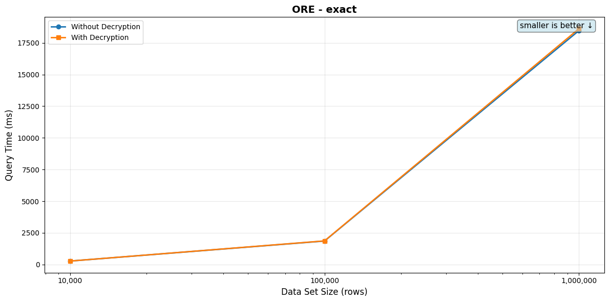

#### range_gt_10

**Description:** Range query (greater than) returning 10 results

**SQL Query:**
```sql
SELECT id,value::jsonb FROM {TABLE} WHERE value > $1 LIMIT 10
```

**Parameter:** `5000`

**Table: `integer_encrypted_{rows}` with ORE-encrypted integer values. Index: ORE index supporting equality and range queries. Query: WHERE value > 5000 LIMIT 10.**

**Indexes:**
```sql
CREATE INDEX
integer_encrypted_10000_eql_index
ON integer_encrypted_10000 (
    value eql_v2.encrypted_operator_class
);
```

| Data Set Size | Query Time (no decrypt) | Query Time (with decrypt) |
|---------------|-------------------------|---------------------------|
| 10,000 | 2.23ms | 60.19ms |
| 100,000 | 1.78ms | 63.88ms |
| 1,000,000 | 1.88ms | 66.87ms |

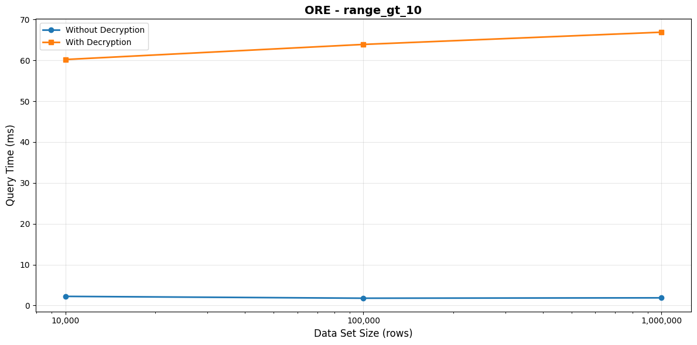

#### range_gt_100

**Description:** Range query (greater than) returning 100 results

**SQL Query:**
```sql
SELECT id,value::jsonb FROM {TABLE} WHERE value > $1 LIMIT 100
```

**Parameter:** `5000`

**Table: `integer_encrypted_{rows}` with ORE-encrypted integer values. Index: ORE index supporting equality and range queries. Query: WHERE value > 5000 LIMIT 100.**

**Indexes:**
```sql
CREATE INDEX
integer_encrypted_10000_eql_index
ON integer_encrypted_10000 (
    value eql_v2.encrypted_operator_class
);
```

*⚠️ = Query time exceeds 100ms*

| Data Set Size | Query Time (no decrypt) | Query Time (with decrypt) |
|---------------|-------------------------|---------------------------|
| 10,000 | 13.67ms | ⚠️ 115.66ms |
| 100,000 | 12.56ms | ⚠️ 124.67ms |
| 1,000,000 | 13.08ms | ⚠️ 110.90ms |

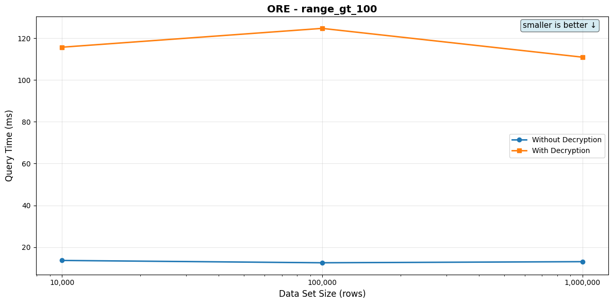

#### range_lt_10

**Description:** Range query (less than) returning 10 results

**SQL Query:**
```sql
SELECT id,value::jsonb FROM {TABLE} WHERE value < $1 LIMIT 10
```

**Parameter:** `5000`

**Table: `integer_encrypted_{rows}` with ORE-encrypted integer values. Index: ORE index supporting equality and range queries. Query: WHERE value < 5000 LIMIT 10.**

**Indexes:**
```sql
CREATE INDEX
integer_encrypted_10000_eql_index
ON integer_encrypted_10000 (
    value eql_v2.encrypted_operator_class
);
```

| Data Set Size | Query Time (no decrypt) | Query Time (with decrypt) |
|---------------|-------------------------|---------------------------|
| 10,000 | 1.92ms | 61.12ms |
| 100,000 | 1.93ms | 70.41ms |
| 1,000,000 | 2.56ms | 61.29ms |

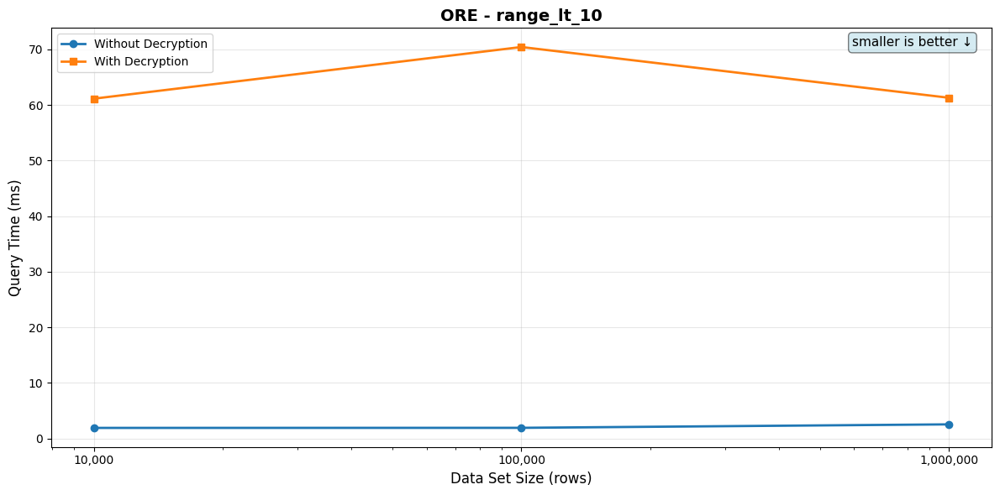

#### range_lt_100

**Description:** Range query (less than) returning 100 results

**SQL Query:**
```sql
SELECT id,value::jsonb FROM {TABLE} WHERE value < $1 LIMIT 100
```

**Parameter:** `5000`

**Table: `integer_encrypted_{rows}` with ORE-encrypted integer values. Index: ORE index supporting equality and range queries. Query: WHERE value < 5000 LIMIT 100.**

**Indexes:**
```sql
CREATE INDEX
integer_encrypted_10000_eql_index
ON integer_encrypted_10000 (
    value eql_v2.encrypted_operator_class
);
```

*⚠️ = Query time exceeds 100ms*

| Data Set Size | Query Time (no decrypt) | Query Time (with decrypt) |
|---------------|-------------------------|---------------------------|
| 10,000 | 10.82ms | ⚠️ 114.77ms |
| 100,000 | 12.85ms | ⚠️ 133.00ms |
| 1,000,000 | 12.27ms | ⚠️ 118.33ms |

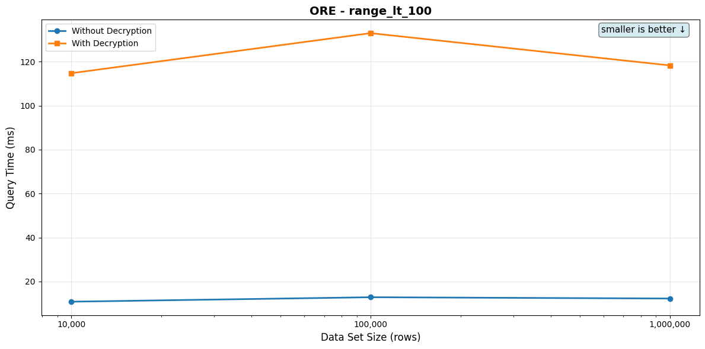

#### range_lt_ordered_10

**Description:** Ordered range query (less than) with ORDER BY

**SQL Query:**
```sql
SELECT id,value::jsonb FROM {TABLE} WHERE value < $1 ORDER BY value LIMIT 10
```

**Parameter:** `5000`

**Table: `integer_encrypted_{rows}` with ORE-encrypted integer values. Index: ORE index supporting equality and range queries. Query: WHERE value < 5000 ORDER BY value LIMIT 10.**

**Indexes:**
```sql
CREATE INDEX
integer_encrypted_10000_eql_index
ON integer_encrypted_10000 (
    value eql_v2.encrypted_operator_class
);
```

*⚠️ = Query time exceeds 100ms*

| Data Set Size | Query Time (no decrypt) | Query Time (with decrypt) |
|---------------|-------------------------|---------------------------|
| 10,000 | ⚠️ 542.65ms | ⚠️ 597.87ms |
| 100,000 | ⚠️ 5.422s | ⚠️ 5.483s |
| 1,000,000 | ⚠️ 62.364s | ⚠️ 66.031s |


---

*Report generated by `report_benchmarks.py`*
