# Benchmark Report

This report summarizes the performance benchmarks for encrypted database operations.

## Table of Contents

1. [Ingest Throughput](#ingest-throughput)
   - [Int](#int)
   - [Json Small](#json-small)
   - [Ste Vec Small](#ste-vec-small)
   - [String](#string)
2. [Query Performance](#query-performance)
   - [EXACT Queries](#exact-queries)
   - [GROUP_BY Queries](#group_by-queries)
   - [MATCH Queries](#match-queries)
   - [ORE Queries](#ore-queries)

---

## Ingest Throughput

This section measures the throughput of inserting encrypted records into the database.

### Comparison at 10,000 Records

Comparing all benchmark types at 10,000 records.

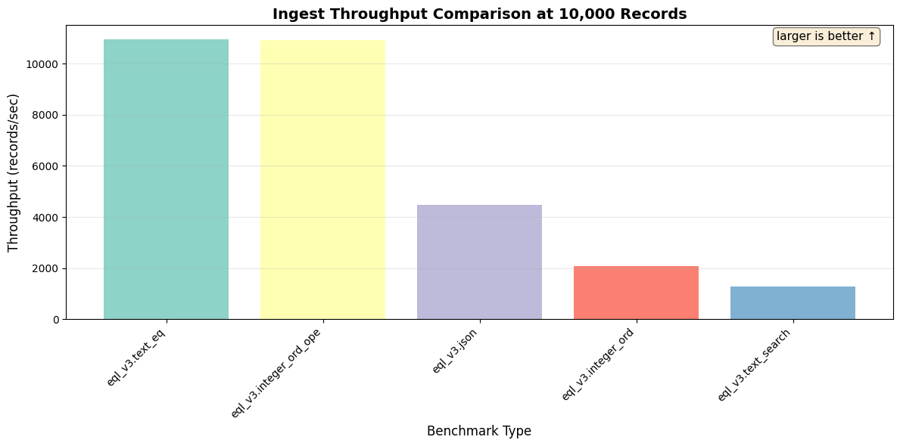

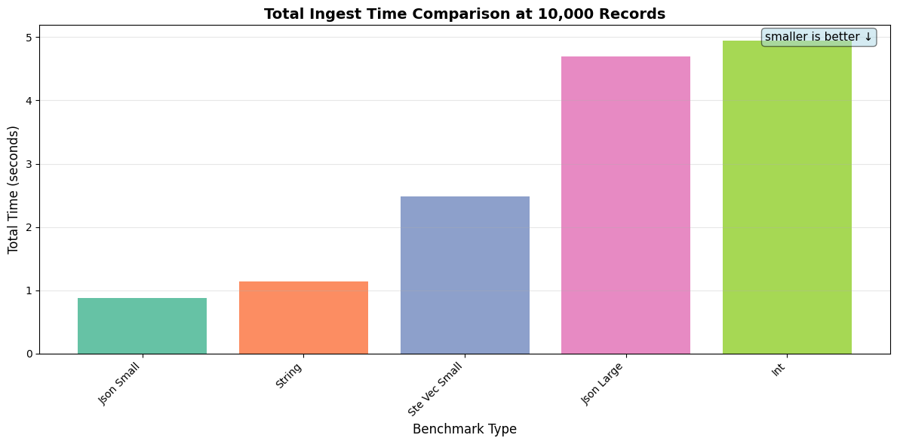

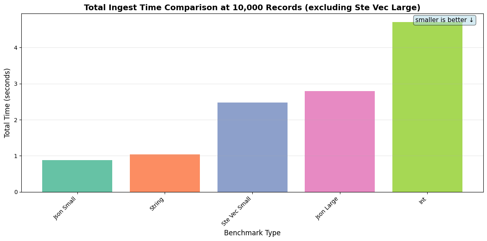

### Int

Tests insertion of encrypted integer values.

| Records | Throughput (records/sec) | Total Time | Avg Memory |
|---------|--------------------------|------------|------------|
| 500 | 544.83 | 0.92s | 15.25 MB |
| 1,000 | 1.11K | 0.90s | 17.83 MB |
| 10,000 | 1.34K | 7.48s | 20.34 MB |

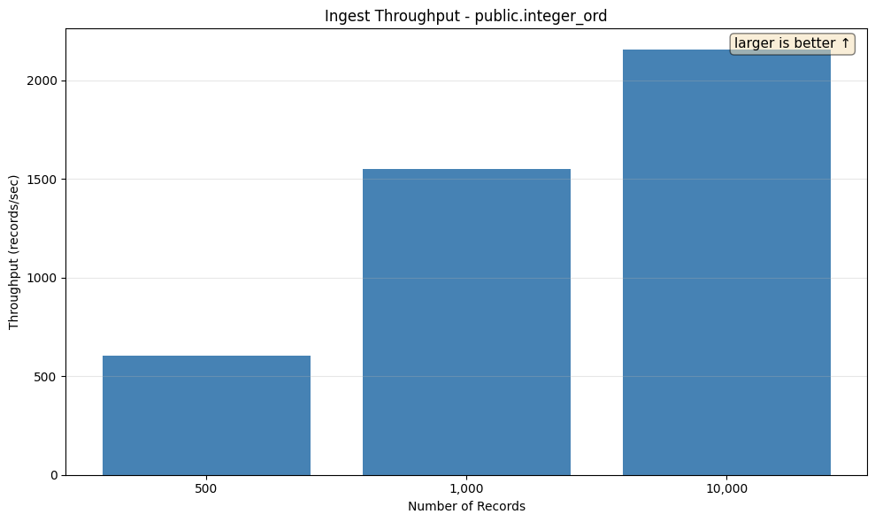

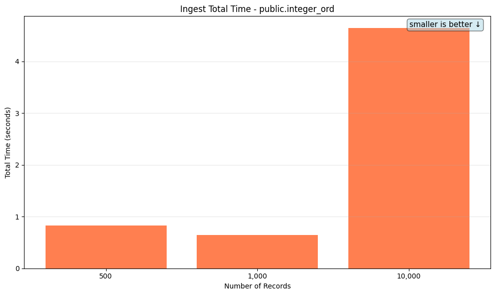

### Json Small

Tests insertion of small encrypted JSON objects (first_name, last_name, age, email).

| Records | Throughput (records/sec) | Total Time | Avg Memory |
|---------|--------------------------|------------|------------|
| 500 | 565.55 | 0.88s | 18.70 MB |
| 1,000 | 1.45K | 0.69s | 27.47 MB |
| 10,000 | 2.22K | 4.51s | 45.33 MB |

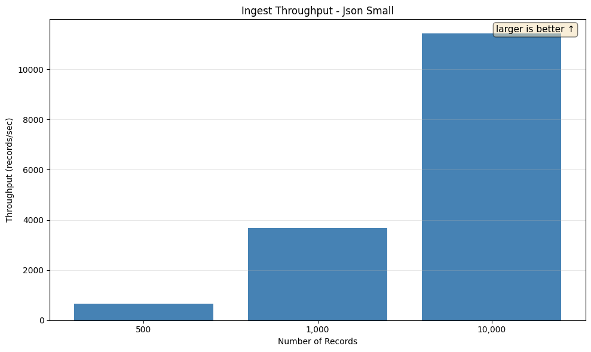

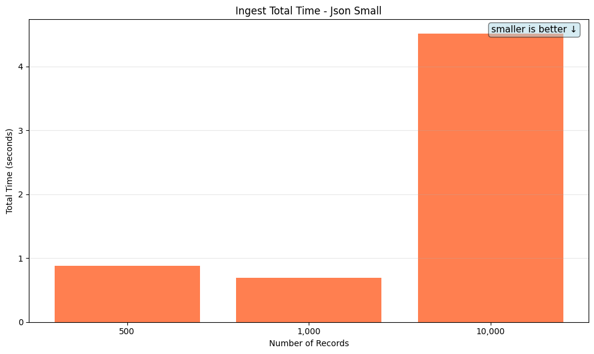

### Ste Vec Small

Tests insertion of small JSON objects with SteVec (searchable encrypted vector) indexing.

| Records | Throughput (records/sec) | Total Time | Avg Memory |
|---------|--------------------------|------------|------------|
| 10,000 | 4.03K | 2.48s | 31.90 MB |

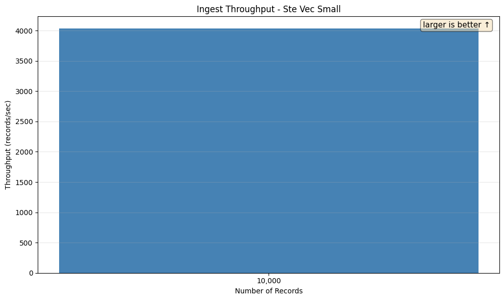


### String

Tests insertion of encrypted string values.

| Records | Throughput (records/sec) | Total Time | Avg Memory |
|---------|--------------------------|------------|------------|
| 500 | 559.65 | 0.89s | 14.12 MB |
| 1,000 | 1.86K | 0.54s | 16.19 MB |
| 10,000 | 2.83K | 3.54s | 18.23 MB |

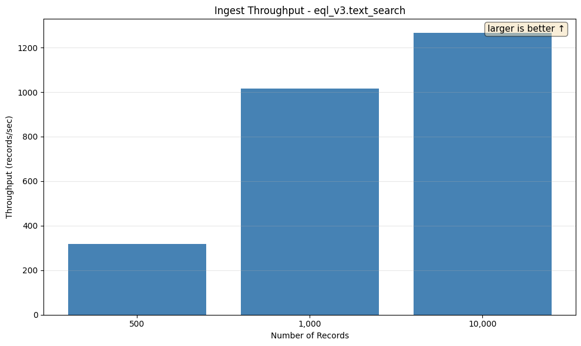

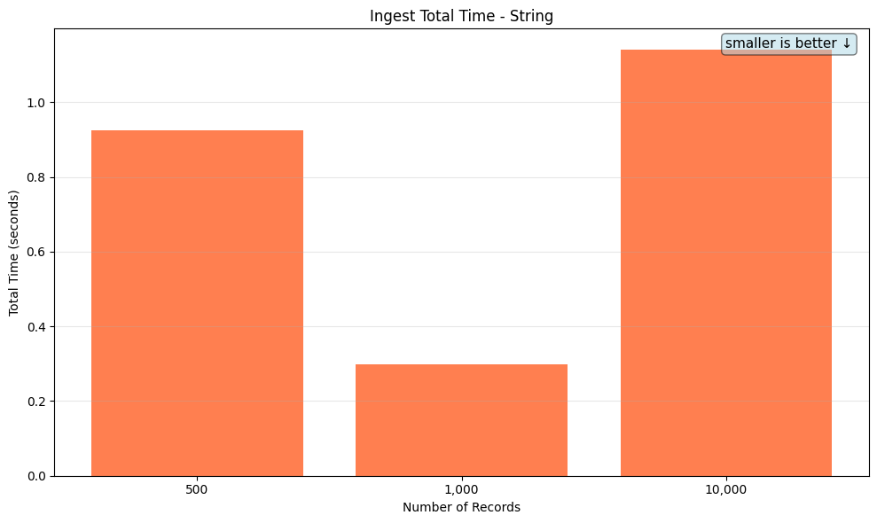

## Query Performance

This section measures query performance across different data set sizes. Each query is tested with and without decryption of results.

### EXACT Queries

#### eql_cast

**Description:** Exact match using EQL cast operator

**SQL Query:**
```sql
SELECT value FROM {TABLE} WHERE value = $1 LIMIT 1
```

**Parameter:** `Bob Johnson`

**Table: `string_encrypted_{rows}` with encrypted string values. Index: UNIQUE index on the encrypted value column.**

**Indexes available on the table:**
```sql
CREATE INDEX
string_encrypted_10000_hash_index
ON string_encrypted_10000 using hash (
    eql_v2.hmac_256(value)
);

CREATE INDEX
string_encrypted_10000_gin_index
ON string_encrypted_10000 USING GIN (
    eql_v2.bloom_filter(value)
);
```

**Indexes used by the planner (per data set size):**

- 10,000: `string_encrypted_10000_hash_index`
- 100,000: `string_encrypted_100000_hash_index`
- 1,000,000: `string_encrypted_1000000_hash_index`
- 10,000,000: `string_encrypted_10000000_hash_index`

| Data Set Size | Rows Returned | Query Time (no decrypt) | Query Time (with decrypt) |
|---------------|---------------|-------------------------|---------------------------|
| 10,000 | 0 | 417.91μs | 411.64μs |
| 100,000 | 0 | 398.18μs | 415.60μs |
| 1,000,000 | 0 | 518.60μs | 413.16μs |
| 10,000,000 | 0 | 429.34μs | 423.97μs |

_Rows Returned is the actual count from a one-shot pre-bench execution. For LIMIT-bounded queries it matches the LIMIT (or is lower when the table doesn't have enough matching rows); for aggregates wrapped in `count(*)` it's 1._

<details>
<summary>EXPLAIN plans (per data set size)</summary>

**10,000 rows**

```
Limit
  Index Scan using string_encrypted_10000_hash_index on string_encrypted_10000
```

Full `EXPLAIN (FORMAT JSON)`:

```json
[
  {
    "Plan": {
      "Async Capable": false,
      "Node Type": "Limit",
      "Parallel Aware": false,
      "Plan Rows": 1,
      "Plan Width": 1164,
      "Plans": [
        {
          "Alias": "string_encrypted_10000",
          "Async Capable": false,
          "Index Cond": "(((value).data ->> 'hm'::text) = '9b50b28ba1880a29710f2713a7afa5fb67d3f44d65357495b1f65bf5bdabb02e'::text)",
          "Index Name": "string_encrypted_10000_hash_index",
          "Node Type": "Index Scan",
          "Parallel Aware": false,
          "Parent Relationship": "Outer",
          "Plan Rows": 1,
          "Plan Width": 1164,
          "Relation Name": "string_encrypted_10000",
          "Scan Direction": "Forward",
          "Startup Cost": 0.0,
          "Total Cost": 8.02
        }
      ],
      "Startup Cost": 0.0,
      "Total Cost": 8.02
    }
  }
]
```

**100,000 rows**

```
Limit
  Index Scan using string_encrypted_100000_hash_index on string_encrypted_100000
```

Full `EXPLAIN (FORMAT JSON)`:

```json
[
  {
    "Plan": {
      "Async Capable": false,
      "Node Type": "Limit",
      "Parallel Aware": false,
      "Plan Rows": 1,
      "Plan Width": 1163,
      "Plans": [
        {
          "Alias": "string_encrypted_100000",
          "Async Capable": false,
          "Index Cond": "(((value).data ->> 'hm'::text) = '9b50b28ba1880a29710f2713a7afa5fb67d3f44d65357495b1f65bf5bdabb02e'::text)",
          "Index Name": "string_encrypted_100000_hash_index",
          "Node Type": "Index Scan",
          "Parallel Aware": false,
          "Parent Relationship": "Outer",
          "Plan Rows": 1,
          "Plan Width": 1163,
          "Relation Name": "string_encrypted_100000",
          "Scan Direction": "Forward",
          "Startup Cost": 0.0,
          "Total Cost": 8.02
        }
      ],
      "Startup Cost": 0.0,
      "Total Cost": 8.02
    }
  }
]
```

**1,000,000 rows**

```
Limit
  Index Scan using string_encrypted_1000000_hash_index on string_encrypted_1000000
```

Full `EXPLAIN (FORMAT JSON)`:

```json
[
  {
    "Plan": {
      "Async Capable": false,
      "Node Type": "Limit",
      "Parallel Aware": false,
      "Plan Rows": 1,
      "Plan Width": 1161,
      "Plans": [
        {
          "Alias": "string_encrypted_1000000",
          "Async Capable": false,
          "Index Cond": "(((value).data ->> 'hm'::text) = '9b50b28ba1880a29710f2713a7afa5fb67d3f44d65357495b1f65bf5bdabb02e'::text)",
          "Index Name": "string_encrypted_1000000_hash_index",
          "Node Type": "Index Scan",
          "Parallel Aware": false,
          "Parent Relationship": "Outer",
          "Plan Rows": 2,
          "Plan Width": 1161,
          "Relation Name": "string_encrypted_1000000",
          "Scan Direction": "Forward",
          "Startup Cost": 0.0,
          "Total Cost": 12.04
        }
      ],
      "Startup Cost": 0.0,
      "Total Cost": 6.02
    }
  }
]
```

**10,000,000 rows**

```
Limit
  Index Scan using string_encrypted_10000000_hash_index on string_encrypted_10000000
```

Full `EXPLAIN (FORMAT JSON)`:

```json
[
  {
    "Plan": {
      "Async Capable": false,
      "Node Type": "Limit",
      "Parallel Aware": false,
      "Plan Rows": 1,
      "Plan Width": 1163,
      "Plans": [
        {
          "Alias": "string_encrypted_10000000",
          "Async Capable": false,
          "Index Cond": "(((value).data ->> 'hm'::text) = '9b50b28ba1880a29710f2713a7afa5fb67d3f44d65357495b1f65bf5bdabb02e'::text)",
          "Index Name": "string_encrypted_10000000_hash_index",
          "Node Type": "Index Scan",
          "Parallel Aware": false,
          "Parent Relationship": "Outer",
          "Plan Rows": 50000,
          "Plan Width": 1163,
          "Relation Name": "string_encrypted_10000000",
          "Scan Direction": "Forward",
          "Startup Cost": 0.0,
          "Total Cost": 198371.0
        }
      ],
      "Startup Cost": 0.0,
      "Total Cost": 3.97
    }
  }
]
```

</details>


#### eql_hash

**Description:** Exact match using EQL HMAC-256 hash function

**SQL Query:**
```sql
SELECT value FROM {TABLE} WHERE eql_v2.hmac_256(value) = eql_v2.hmac_256($1::jsonb) LIMIT 1
```

**Parameter:** `Bob Johnson`

**Table: `string_encrypted_{rows}` with encrypted string values. Index: Hash-based unique index using `eql_v2.hmac_256`.**

**Indexes available on the table:**
```sql
CREATE INDEX
string_encrypted_10000_hash_index
ON string_encrypted_10000 using hash (
    eql_v2.hmac_256(value)
);

CREATE INDEX
string_encrypted_10000_gin_index
ON string_encrypted_10000 USING GIN (
    eql_v2.bloom_filter(value)
);
```

**Indexes used by the planner (per data set size):**

- 10,000: `string_encrypted_10000_hash_index`
- 100,000: `string_encrypted_100000_hash_index`
- 1,000,000: `string_encrypted_1000000_hash_index`
- 10,000,000: `string_encrypted_10000000_hash_index`

| Data Set Size | Rows Returned | Query Time (no decrypt) | Query Time (with decrypt) |
|---------------|---------------|-------------------------|---------------------------|
| 10,000 | 0 | 412.70μs | 395.84μs |
| 100,000 | 0 | 406.77μs | 400.13μs |
| 1,000,000 | 0 | 401.58μs | 397.75μs |
| 10,000,000 | 0 | 387.61μs | 399.45μs |

_Rows Returned is the actual count from a one-shot pre-bench execution. For LIMIT-bounded queries it matches the LIMIT (or is lower when the table doesn't have enough matching rows); for aggregates wrapped in `count(*)` it's 1._

<details>
<summary>EXPLAIN plans (per data set size)</summary>

**10,000 rows**

```
Limit
  Index Scan using string_encrypted_10000_hash_index on string_encrypted_10000
```

Full `EXPLAIN (FORMAT JSON)`:

```json
[
  {
    "Plan": {
      "Async Capable": false,
      "Node Type": "Limit",
      "Parallel Aware": false,
      "Plan Rows": 1,
      "Plan Width": 1164,
      "Plans": [
        {
          "Alias": "string_encrypted_10000",
          "Async Capable": false,
          "Index Cond": "(((value).data ->> 'hm'::text) = '9b50b28ba1880a29710f2713a7afa5fb67d3f44d65357495b1f65bf5bdabb02e'::text)",
          "Index Name": "string_encrypted_10000_hash_index",
          "Node Type": "Index Scan",
          "Parallel Aware": false,
          "Parent Relationship": "Outer",
          "Plan Rows": 1,
          "Plan Width": 1164,
          "Relation Name": "string_encrypted_10000",
          "Scan Direction": "Forward",
          "Startup Cost": 0.0,
          "Total Cost": 8.02
        }
      ],
      "Startup Cost": 0.0,
      "Total Cost": 8.02
    }
  }
]
```

**100,000 rows**

```
Limit
  Index Scan using string_encrypted_100000_hash_index on string_encrypted_100000
```

Full `EXPLAIN (FORMAT JSON)`:

```json
[
  {
    "Plan": {
      "Async Capable": false,
      "Node Type": "Limit",
      "Parallel Aware": false,
      "Plan Rows": 1,
      "Plan Width": 1163,
      "Plans": [
        {
          "Alias": "string_encrypted_100000",
          "Async Capable": false,
          "Index Cond": "(((value).data ->> 'hm'::text) = '9b50b28ba1880a29710f2713a7afa5fb67d3f44d65357495b1f65bf5bdabb02e'::text)",
          "Index Name": "string_encrypted_100000_hash_index",
          "Node Type": "Index Scan",
          "Parallel Aware": false,
          "Parent Relationship": "Outer",
          "Plan Rows": 1,
          "Plan Width": 1163,
          "Relation Name": "string_encrypted_100000",
          "Scan Direction": "Forward",
          "Startup Cost": 0.0,
          "Total Cost": 8.02
        }
      ],
      "Startup Cost": 0.0,
      "Total Cost": 8.02
    }
  }
]
```

**1,000,000 rows**

```
Limit
  Index Scan using string_encrypted_1000000_hash_index on string_encrypted_1000000
```

Full `EXPLAIN (FORMAT JSON)`:

```json
[
  {
    "Plan": {
      "Async Capable": false,
      "Node Type": "Limit",
      "Parallel Aware": false,
      "Plan Rows": 1,
      "Plan Width": 1161,
      "Plans": [
        {
          "Alias": "string_encrypted_1000000",
          "Async Capable": false,
          "Index Cond": "(((value).data ->> 'hm'::text) = '9b50b28ba1880a29710f2713a7afa5fb67d3f44d65357495b1f65bf5bdabb02e'::text)",
          "Index Name": "string_encrypted_1000000_hash_index",
          "Node Type": "Index Scan",
          "Parallel Aware": false,
          "Parent Relationship": "Outer",
          "Plan Rows": 2,
          "Plan Width": 1161,
          "Relation Name": "string_encrypted_1000000",
          "Scan Direction": "Forward",
          "Startup Cost": 0.0,
          "Total Cost": 12.04
        }
      ],
      "Startup Cost": 0.0,
      "Total Cost": 6.02
    }
  }
]
```

**10,000,000 rows**

```
Limit
  Index Scan using string_encrypted_10000000_hash_index on string_encrypted_10000000
```

Full `EXPLAIN (FORMAT JSON)`:

```json
[
  {
    "Plan": {
      "Async Capable": false,
      "Node Type": "Limit",
      "Parallel Aware": false,
      "Plan Rows": 1,
      "Plan Width": 1163,
      "Plans": [
        {
          "Alias": "string_encrypted_10000000",
          "Async Capable": false,
          "Index Cond": "(((value).data ->> 'hm'::text) = '9b50b28ba1880a29710f2713a7afa5fb67d3f44d65357495b1f65bf5bdabb02e'::text)",
          "Index Name": "string_encrypted_10000000_hash_index",
          "Node Type": "Index Scan",
          "Parallel Aware": false,
          "Parent Relationship": "Outer",
          "Plan Rows": 50000,
          "Plan Width": 1163,
          "Relation Name": "string_encrypted_10000000",
          "Scan Direction": "Forward",
          "Startup Cost": 0.0,
          "Total Cost": 198371.0
        }
      ],
      "Startup Cost": 0.0,
      "Total Cost": 3.97
    }
  }
]
```

</details>


### GROUP_BY Queries

#### count_groups_encrypted

**Description:** GROUP BY in extractor form on `eql_v2.hmac_256(value)`, wrapped in `count(*)` to isolate aggregation cost from emit cost

**SQL Query:**
```sql
SELECT count(*) FROM (SELECT 1 FROM {TABLE} GROUP BY eql_v2.hmac_256(value)) g
```

**Table: `string_encrypted_{rows}` with encrypted string values (carrying an `hm` HMAC term, configured via the `unique` search index). Index: no index drives `GROUP BY` directly — hash aggregation is in-memory. The extractor's 32-byte HMAC group key fits in default `work_mem`, so the planner picks `HashAggregate` reliably across deployments. **Why the subquery wrapper.** The bench data is `fake::name::Name<EN>` — effectively unique per row, so a bare `SELECT count(*) FROM tbl GROUP BY eql_v2.hmac_256(value)` emits ~one row per input row. Wall-clock time on that shape is dominated by result emission (server-side row construction, network round-trip, sqlx deserialisation, bench iter-and-sum), not by the aggregation work the recipe is actually about. Wrapping the GROUP BY in `count(*)` keeps the inner HashAggregate identical but emits a single row, so the bench measures aggregation cost. The companion `count_groups_plaintext` scenario runs the same query shape against an unencrypted column for comparison. Natural-form `GROUP BY value` against an encrypted column was removed from this bench in an earlier pass because the planner picks `GroupAggregate` + sort against the full ~1-2 KB ciphertext payload at scale — see §5 of the EQL query-performance guide.**

**Indexes available on the table:**
```sql
CREATE INDEX
string_encrypted_10000_hash_index
ON string_encrypted_10000 using hash (
    eql_v2.hmac_256(value)
);

CREATE INDEX
string_encrypted_10000_gin_index
ON string_encrypted_10000 USING GIN (
    eql_v2.bloom_filter(value)
);
```

**Indexes used by the planner (per data set size):**

- 10,000: _none — planner picked a sequential / hash-aggregate / sort plan_
- 100,000: _none — planner picked a sequential / hash-aggregate / sort plan_
- 1,000,000: _none — planner picked a sequential / hash-aggregate / sort plan_
- 10,000,000: _none — planner picked a sequential / hash-aggregate / sort plan_

*⚠️ = Query time exceeds 100ms*

| Data Set Size | Rows Returned | Query Time (no decrypt) | Query Time (with decrypt) |
|---------------|---------------|-------------------------|---------------------------|
| 10,000 | 1 | 5.26ms | N/A |
| 100,000 | 1 | 65.32ms | N/A |
| 1,000,000 | 1 | ⚠️ 805.12ms | N/A |
| 10,000,000 | 1 | ⚠️ 10.228s | N/A |

_Rows Returned is the actual count from a one-shot pre-bench execution. For LIMIT-bounded queries it matches the LIMIT (or is lower when the table doesn't have enough matching rows); for aggregates wrapped in `count(*)` it's 1._

<details>
<summary>EXPLAIN plans (per data set size)</summary>

**10,000 rows**

```
Aggregate
  Aggregate (Hashed)
    Seq Scan on string_encrypted_10000
```

Full `EXPLAIN (FORMAT JSON)`:

```json
[
  {
    "Plan": {
      "Async Capable": false,
      "Node Type": "Aggregate",
      "Parallel Aware": false,
      "Partial Mode": "Simple",
      "Plan Rows": 1,
      "Plan Width": 8,
      "Plans": [
        {
          "Async Capable": false,
          "Group Key": [
            "(((string_encrypted_10000.value).data ->> 'hm'::text))::eql_v2.hmac_256"
          ],
          "Node Type": "Aggregate",
          "Parallel Aware": false,
          "Parent Relationship": "Outer",
          "Partial Mode": "Simple",
          "Plan Rows": 9968,
          "Plan Width": 36,
          "Planned Partitions": 0,
          "Plans": [
            {
              "Alias": "string_encrypted_10000",
              "Async Capable": false,
              "Node Type": "Seq Scan",
              "Parallel Aware": false,
              "Parent Relationship": "Outer",
              "Plan Rows": 10000,
              "Plan Width": 32,
              "Relation Name": "string_encrypted_10000",
              "Startup Cost": 0.0,
              "Total Cost": 1678.0
            }
          ],
          "Startup Cost": 1703.0,
          "Strategy": "Hashed",
          "Total Cost": 1827.6
        }
      ],
      "Startup Cost": 1952.2,
      "Strategy": "Plain",
      "Total Cost": 1952.21
    }
  }
]
```

**100,000 rows**

```
Aggregate
  Aggregate (Hashed)
    Seq Scan on string_encrypted_100000
```

Full `EXPLAIN (FORMAT JSON)`:

```json
[
  {
    "Plan": {
      "Async Capable": false,
      "Node Type": "Aggregate",
      "Parallel Aware": false,
      "Partial Mode": "Simple",
      "Plan Rows": 1,
      "Plan Width": 8,
      "Plans": [
        {
          "Async Capable": false,
          "Group Key": [
            "(((string_encrypted_100000.value).data ->> 'hm'::text))::eql_v2.hmac_256"
          ],
          "Node Type": "Aggregate",
          "Parallel Aware": false,
          "Parent Relationship": "Outer",
          "Partial Mode": "Simple",
          "Plan Rows": 93989,
          "Plan Width": 36,
          "Planned Partitions": 0,
          "Plans": [
            {
              "Alias": "string_encrypted_100000",
              "Async Capable": false,
              "Node Type": "Seq Scan",
              "Parallel Aware": false,
              "Parent Relationship": "Outer",
              "Plan Rows": 100000,
              "Plan Width": 32,
              "Relation Name": "string_encrypted_100000",
              "Startup Cost": 0.0,
              "Total Cost": 16759.0
            }
          ],
          "Startup Cost": 17009.0,
          "Strategy": "Hashed",
          "Total Cost": 18183.86
        }
      ],
      "Startup Cost": 19358.72,
      "Strategy": "Plain",
      "Total Cost": 19358.73
    }
  }
]
```

**1,000,000 rows**

```
Aggregate
  Aggregate (Hashed)
    Seq Scan on string_encrypted_1000000
```

Full `EXPLAIN (FORMAT JSON)`:

```json
[
  {
    "JIT": {
      "Functions": 6,
      "Options": {
        "Deforming": true,
        "Expressions": true,
        "Inlining": false,
        "Optimization": false
      }
    },
    "Plan": {
      "Async Capable": false,
      "Node Type": "Aggregate",
      "Parallel Aware": false,
      "Partial Mode": "Simple",
      "Plan Rows": 1,
      "Plan Width": 8,
      "Plans": [
        {
          "Async Capable": false,
          "Group Key": [
            "(((string_encrypted_1000000.value).data ->> 'hm'::text))::eql_v2.hmac_256"
          ],
          "Node Type": "Aggregate",
          "Parallel Aware": false,
          "Parent Relationship": "Outer",
          "Partial Mode": "Simple",
          "Plan Rows": 618824,
          "Plan Width": 36,
          "Planned Partitions": 16,
          "Plans": [
            {
              "Alias": "string_encrypted_1000000",
              "Async Capable": false,
              "Node Type": "Seq Scan",
              "Parallel Aware": false,
              "Parent Relationship": "Outer",
              "Plan Rows": 999482,
              "Plan Width": 32,
              "Relation Name": "string_encrypted_1000000",
              "Startup Cost": 0.0,
              "Total Cost": 167309.52
            }
          ],
          "Startup Cost": 244457.04,
          "Strategy": "Hashed",
          "Total Cost": 265857.13
        }
      ],
      "Startup Cost": 273592.43,
      "Strategy": "Plain",
      "Total Cost": 273592.44
    }
  }
]
```

**10,000,000 rows**

```
Aggregate
  Aggregate (Hashed)
    Seq Scan on string_encrypted_10000000
```

Full `EXPLAIN (FORMAT JSON)`:

```json
[
  {
    "JIT": {
      "Functions": 6,
      "Options": {
        "Deforming": true,
        "Expressions": true,
        "Inlining": true,
        "Optimization": true
      }
    },
    "Plan": {
      "Async Capable": false,
      "Node Type": "Aggregate",
      "Parallel Aware": false,
      "Partial Mode": "Simple",
      "Plan Rows": 1,
      "Plan Width": 8,
      "Plans": [
        {
          "Async Capable": false,
          "Group Key": [
            "(((string_encrypted_10000000.value).data ->> 'hm'::text))::eql_v2.hmac_256"
          ],
          "Node Type": "Aggregate",
          "Parallel Aware": false,
          "Parent Relationship": "Outer",
          "Partial Mode": "Simple",
          "Plan Rows": 4273344,
          "Plan Width": 36,
          "Planned Partitions": 128,
          "Plans": [
            {
              "Alias": "string_encrypted_10000000",
              "Async Capable": false,
              "Node Type": "Seq Scan",
              "Parallel Aware": false,
              "Parent Relationship": "Outer",
              "Plan Rows": 10000000,
              "Plan Width": 32,
              "Relation Name": "string_encrypted_10000000",
              "Startup Cost": 0.0,
              "Total Cost": 1673105.0
            }
          ],
          "Startup Cost": 2444980.0,
          "Strategy": "Hashed",
          "Total Cost": 2635115.55
        }
      ],
      "Startup Cost": 2688532.35,
      "Strategy": "Plain",
      "Total Cost": 2688532.36
    }
  }
]
```

</details>

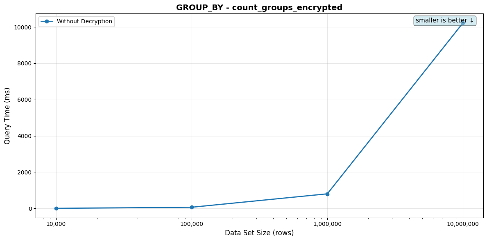

#### count_groups_plaintext

**Description:** Plaintext baseline: GROUP BY on a plain TEXT column, same query shape as the encrypted scenario

**SQL Query:**
```sql
SELECT count(*) FROM (SELECT 1 FROM {TABLE} GROUP BY value) g
```

**Table: `string_plaintext_{rows}` with unencrypted high-cardinality random strings (`md5(random()::text || ordinal)`). Populated via SQL by `mise run prepare:string_plaintext` — no encryption-client dependency. Index: none. Same `SELECT count(*) FROM (SELECT 1 ... GROUP BY value) g` shape as the encrypted scenario, so the wall-clock delta between this and `count_groups_encrypted` is the EQL recipe's overhead relative to a bare-PG aggregate on a TEXT column at the same row count and cardinality.**

**Indexes used by the planner (per data set size):**

- 10,000: _none — planner picked a sequential / hash-aggregate / sort plan_
- 100,000: _none — planner picked a sequential / hash-aggregate / sort plan_
- 1,000,000: _none — planner picked a sequential / hash-aggregate / sort plan_
- 10,000,000: _none — planner picked a sequential / hash-aggregate / sort plan_

*⚠️ = Query time exceeds 100ms*

| Data Set Size | Rows Returned | Query Time (no decrypt) | Query Time (with decrypt) |
|---------------|---------------|-------------------------|---------------------------|
| 10,000 | 1 | 2.75ms | N/A |
| 100,000 | 1 | 29.76ms | N/A |
| 1,000,000 | 1 | ⚠️ 411.12ms | N/A |
| 10,000,000 | 1 | ⚠️ 21.479s | N/A |

_Rows Returned is the actual count from a one-shot pre-bench execution. For LIMIT-bounded queries it matches the LIMIT (or is lower when the table doesn't have enough matching rows); for aggregates wrapped in `count(*)` it's 1._

<details>
<summary>EXPLAIN plans (per data set size)</summary>

**10,000 rows**

```
Aggregate
  Aggregate (Hashed)
    Seq Scan on string_plaintext_10000
```

Full `EXPLAIN (FORMAT JSON)`:

```json
[
  {
    "Plan": {
      "Async Capable": false,
      "Node Type": "Aggregate",
      "Parallel Aware": false,
      "Partial Mode": "Simple",
      "Plan Rows": 1,
      "Plan Width": 8,
      "Plans": [
        {
          "Async Capable": false,
          "Group Key": [
            "string_plaintext_10000.value"
          ],
          "Node Type": "Aggregate",
          "Parallel Aware": false,
          "Parent Relationship": "Outer",
          "Partial Mode": "Simple",
          "Plan Rows": 10000,
          "Plan Width": 37,
          "Planned Partitions": 0,
          "Plans": [
            {
              "Alias": "string_plaintext_10000",
              "Async Capable": false,
              "Node Type": "Seq Scan",
              "Parallel Aware": false,
              "Parent Relationship": "Outer",
              "Plan Rows": 10000,
              "Plan Width": 33,
              "Relation Name": "string_plaintext_10000",
              "Startup Cost": 0.0,
              "Total Cost": 184.0
            }
          ],
          "Startup Cost": 209.0,
          "Strategy": "Hashed",
          "Total Cost": 309.0
        }
      ],
      "Startup Cost": 434.0,
      "Strategy": "Plain",
      "Total Cost": 434.01
    }
  }
]
```

**100,000 rows**

```
Aggregate
  Aggregate (Hashed)
    Seq Scan on string_plaintext_100000
```

Full `EXPLAIN (FORMAT JSON)`:

```json
[
  {
    "Plan": {
      "Async Capable": false,
      "Node Type": "Aggregate",
      "Parallel Aware": false,
      "Partial Mode": "Simple",
      "Plan Rows": 1,
      "Plan Width": 8,
      "Plans": [
        {
          "Async Capable": false,
          "Group Key": [
            "string_plaintext_100000.value"
          ],
          "Node Type": "Aggregate",
          "Parallel Aware": false,
          "Parent Relationship": "Outer",
          "Partial Mode": "Simple",
          "Plan Rows": 100000,
          "Plan Width": 37,
          "Planned Partitions": 4,
          "Plans": [
            {
              "Alias": "string_plaintext_100000",
              "Async Capable": false,
              "Node Type": "Seq Scan",
              "Parallel Aware": false,
              "Parent Relationship": "Outer",
              "Plan Rows": 100000,
              "Plan Width": 33,
              "Relation Name": "string_plaintext_100000",
              "Startup Cost": 0.0,
              "Total Cost": 1834.0
            }
          ],
          "Startup Cost": 10334.0,
          "Strategy": "Hashed",
          "Total Cost": 12896.5
        }
      ],
      "Startup Cost": 14146.5,
      "Strategy": "Plain",
      "Total Cost": 14146.51
    }
  }
]
```

**1,000,000 rows**

```
Aggregate
  Aggregate (Hashed)
    Seq Scan on string_plaintext_1000000
```

Full `EXPLAIN (FORMAT JSON)`:

```json
[
  {
    "JIT": {
      "Functions": 5,
      "Options": {
        "Deforming": true,
        "Expressions": true,
        "Inlining": false,
        "Optimization": false
      }
    },
    "Plan": {
      "Async Capable": false,
      "Node Type": "Aggregate",
      "Parallel Aware": false,
      "Partial Mode": "Simple",
      "Plan Rows": 1,
      "Plan Width": 8,
      "Plans": [
        {
          "Async Capable": false,
          "Group Key": [
            "string_plaintext_1000000.value"
          ],
          "Node Type": "Aggregate",
          "Parallel Aware": false,
          "Parent Relationship": "Outer",
          "Partial Mode": "Simple",
          "Plan Rows": 1000000,
          "Plan Width": 37,
          "Planned Partitions": 16,
          "Plans": [
            {
              "Alias": "string_plaintext_1000000",
              "Async Capable": false,
              "Node Type": "Seq Scan",
              "Parallel Aware": false,
              "Parent Relationship": "Outer",
              "Plan Rows": 1000000,
              "Plan Width": 33,
              "Relation Name": "string_plaintext_1000000",
              "Startup Cost": 0.0,
              "Total Cost": 18334.0
            }
          ],
          "Startup Cost": 103334.0,
          "Strategy": "Hashed",
          "Total Cost": 128959.0
        }
      ],
      "Startup Cost": 141459.0,
      "Strategy": "Plain",
      "Total Cost": 141459.01
    }
  }
]
```

**10,000,000 rows**

```
Aggregate
  Group
    Gather Merge
      Group
        Sort
          Seq Scan on string_plaintext_10000000
```

Full `EXPLAIN (FORMAT JSON)`:

```json
[
  {
    "JIT": {
      "Functions": 9,
      "Options": {
        "Deforming": true,
        "Expressions": true,
        "Inlining": true,
        "Optimization": true
      }
    },
    "Plan": {
      "Async Capable": false,
      "Node Type": "Aggregate",
      "Parallel Aware": false,
      "Partial Mode": "Simple",
      "Plan Rows": 1,
      "Plan Width": 8,
      "Plans": [
        {
          "Async Capable": false,
          "Group Key": [
            "string_plaintext_10000000.value"
          ],
          "Node Type": "Group",
          "Parallel Aware": false,
          "Parent Relationship": "Outer",
          "Plan Rows": 20000040,
          "Plan Width": 37,
          "Plans": [
            {
              "Async Capable": false,
              "Node Type": "Gather Merge",
              "Parallel Aware": false,
              "Parent Relationship": "Outer",
              "Plan Rows": 16666700,
              "Plan Width": 33,
              "Plans": [
                {
                  "Async Capable": false,
                  "Group Key": [
                    "string_plaintext_10000000.value"
                  ],
                  "Node Type": "Group",
                  "Parallel Aware": false,
                  "Parent Relationship": "Outer",
                  "Plan Rows": 8333350,
                  "Plan Width": 33,
                  "Plans": [
                    {
                      "Async Capable": false,
                      "Node Type": "Sort",
                      "Parallel Aware": false,
                      "Parent Relationship": "Outer",
                      "Plan Rows": 8333350,
                      "Plan Width": 33,
                      "Plans": [
                        {
                          "Alias": "string_plaintext_10000000",
                          "Async Capable": false,
                          "Node Type": "Seq Scan",
                          "Parallel Aware": true,
                          "Parent Relationship": "Outer",
                          "Plan Rows": 8333350,
                          "Plan Width": 33,
                          "Relation Name": "string_plaintext_10000000",
                          "Startup Cost": 0.0,
                          "Total Cost": 250000.5
                        }
                      ],
                      "Sort Key": [
                        "string_plaintext_10000000.value"
                      ],
                      "Startup Cost": 1663673.46,
                      "Total Cost": 1684506.84
                    }
                  ],
                  "Startup Cost": 1663673.46,
                  "Total Cost": 1705340.21
                }
              ],
              "Startup Cost": 1664673.49,
              "Total Cost": 3630090.96,
              "Workers Planned": 2
            }
          ],
          "Startup Cost": 1664673.49,
          "Total Cost": 3671757.71
        }
      ],
      "Startup Cost": 3921758.21,
      "Strategy": "Plain",
      "Total Cost": 3921758.22
    }
  }
]
```

</details>

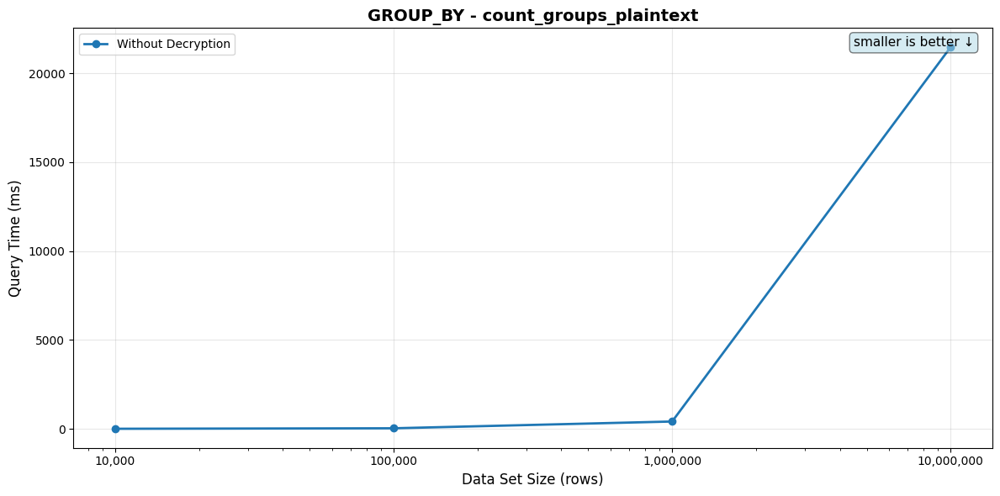

### MATCH Queries

#### eql_bloom

**Description:** Pattern matching using EQL bloom filter containment

**SQL Query:**
```sql
SELECT id,value::jsonb FROM {TABLE} WHERE eql_v2.bloom_filter(value) @> eql_v2.bloom_filter($1) LIMIT 10
```

**Parameter:** `Johnson`

**Table: `string_encrypted_{rows}` with encrypted string values. Index: Bloom filter index using `eql_v2.bloom_filter`. Query returns LIMIT 10 results.**

**Indexes available on the table:**
```sql
CREATE INDEX
string_encrypted_10000_hash_index
ON string_encrypted_10000 using hash (
    eql_v2.hmac_256(value)
);

CREATE INDEX
string_encrypted_10000_gin_index
ON string_encrypted_10000 USING GIN (
    eql_v2.bloom_filter(value)
);
```

**Indexes used by the planner (per data set size):**

- 10,000: `string_encrypted_10000_gin_index`
- 100,000: `string_encrypted_100000_gin_index`
- 1,000,000: `string_encrypted_1000000_gin_index`
- 10,000,000: `string_encrypted_10000000_gin_index`

*⚠️ = Query time exceeds 100ms*

| Data Set Size | Rows Returned | Query Time (no decrypt) | Query Time (with decrypt) |
|---------------|---------------|-------------------------|---------------------------|
| 10,000 | 10 | 930.87μs | 28.78ms |
| 100,000 | 10 | 2.66ms | 29.79ms |
| 1,000,000 | 10 | 17.40ms | 43.78ms |
| 10,000,000 | 10 | ⚠️ 164.61ms | ⚠️ 189.74ms |

_Rows Returned is the actual count from a one-shot pre-bench execution. For LIMIT-bounded queries it matches the LIMIT (or is lower when the table doesn't have enough matching rows); for aggregates wrapped in `count(*)` it's 1._

<details>
<summary>EXPLAIN plans (per data set size)</summary>

**10,000 rows**

```
Limit
  Bitmap Heap Scan on string_encrypted_10000
    Bitmap Index Scan using string_encrypted_10000_gin_index
```

Full `EXPLAIN (FORMAT JSON)`:

```json
[
  {
    "Plan": {
      "Async Capable": false,
      "Node Type": "Limit",
      "Parallel Aware": false,
      "Plan Rows": 1,
      "Plan Width": 36,
      "Plans": [
        {
          "Alias": "string_encrypted_10000",
          "Async Capable": false,
          "Node Type": "Bitmap Heap Scan",
          "Parallel Aware": false,
          "Parent Relationship": "Outer",
          "Plan Rows": 1,
          "Plan Width": 36,
          "Plans": [
            {
              "Async Capable": false,
              "Index Cond": "((eql_v2.bloom_filter(value))::smallint[] @> '{1031,682,1057,1760,1496,1183,1453,998,1143,1200,792,1109,1596,865,1845,710,1735,61,582,1574,587,1751,1637,830,2028,1068,895,421,1018,1500}'::smallint[])",
              "Index Name": "string_encrypted_10000_gin_index",
              "Node Type": "Bitmap Index Scan",
              "Parallel Aware": false,
              "Parent Relationship": "Outer",
              "Plan Rows": 1,
              "Plan Width": 0,
              "Startup Cost": 0.0,
              "Total Cost": 264.6
            }
          ],
          "Recheck Cond": "((eql_v2.bloom_filter(value))::smallint[] @> '{1031,682,1057,1760,1496,1183,1453,998,1143,1200,792,1109,1596,865,1845,710,1735,61,582,1574,587,1751,1637,830,2028,1068,895,421,1018,1500}'::smallint[])",
          "Relation Name": "string_encrypted_10000",
          "Startup Cost": 264.6,
          "Total Cost": 269.11
        }
      ],
      "Startup Cost": 264.6,
      "Total Cost": 269.11
    }
  }
]
```

**100,000 rows**

```
Limit
  Bitmap Heap Scan on string_encrypted_100000
    Bitmap Index Scan using string_encrypted_100000_gin_index
```

Full `EXPLAIN (FORMAT JSON)`:

```json
[
  {
    "Plan": {
      "Async Capable": false,
      "Node Type": "Limit",
      "Parallel Aware": false,
      "Plan Rows": 1,
      "Plan Width": 36,
      "Plans": [
        {
          "Alias": "string_encrypted_100000",
          "Async Capable": false,
          "Node Type": "Bitmap Heap Scan",
          "Parallel Aware": false,
          "Parent Relationship": "Outer",
          "Plan Rows": 1,
          "Plan Width": 36,
          "Plans": [
            {
              "Async Capable": false,
              "Index Cond": "((eql_v2.bloom_filter(value))::smallint[] @> '{1031,1183,792,865,1500,1057,1751,830,1596,710,587,61,1574,582,1143,1018,895,1200,421,1453,2028,682,1068,1735,1760,998,1845,1496,1637,1109}'::smallint[])",
              "Index Name": "string_encrypted_100000_gin_index",
              "Node Type": "Bitmap Index Scan",
              "Parallel Aware": false,
              "Parent Relationship": "Outer",
              "Plan Rows": 1,
              "Plan Width": 0,
              "Startup Cost": 0.0,
              "Total Cost": 454.35
            }
          ],
          "Recheck Cond": "((eql_v2.bloom_filter(value))::smallint[] @> '{1031,1183,792,865,1500,1057,1751,830,1596,710,587,61,1574,582,1143,1018,895,1200,421,1453,2028,682,1068,1735,1760,998,1845,1496,1637,1109}'::smallint[])",
          "Relation Name": "string_encrypted_100000",
          "Startup Cost": 454.35,
          "Total Cost": 458.86
        }
      ],
      "Startup Cost": 454.35,
      "Total Cost": 458.86
    }
  }
]
```

**1,000,000 rows**

```
Limit
  Bitmap Heap Scan on string_encrypted_1000000
    Bitmap Index Scan using string_encrypted_1000000_gin_index
```

Full `EXPLAIN (FORMAT JSON)`:

```json
[
  {
    "Plan": {
      "Async Capable": false,
      "Node Type": "Limit",
      "Parallel Aware": false,
      "Plan Rows": 1,
      "Plan Width": 36,
      "Plans": [
        {
          "Alias": "string_encrypted_1000000",
          "Async Capable": false,
          "Node Type": "Bitmap Heap Scan",
          "Parallel Aware": false,
          "Parent Relationship": "Outer",
          "Plan Rows": 1,
          "Plan Width": 36,
          "Plans": [
            {
              "Async Capable": false,
              "Index Cond": "((eql_v2.bloom_filter(value))::smallint[] @> '{1637,61,830,682,1109,1068,1031,1735,1596,1751,1845,1496,998,792,582,1183,1143,2028,865,1574,1018,587,1500,1760,895,421,1057,1200,1453,710}'::smallint[])",
              "Index Name": "string_encrypted_1000000_gin_index",
              "Node Type": "Bitmap Index Scan",
              "Parallel Aware": false,
              "Parent Relationship": "Outer",
              "Plan Rows": 1,
              "Plan Width": 0,
              "Startup Cost": 0.0,
              "Total Cost": 1530.98
            }
          ],
          "Recheck Cond": "((eql_v2.bloom_filter(value))::smallint[] @> '{1637,61,830,682,1109,1068,1031,1735,1596,1751,1845,1496,998,792,582,1183,1143,2028,865,1574,1018,587,1500,1760,895,421,1057,1200,1453,710}'::smallint[])",
          "Relation Name": "string_encrypted_1000000",
          "Startup Cost": 1530.98,
          "Total Cost": 1535.49
        }
      ],
      "Startup Cost": 1530.98,
      "Total Cost": 1535.49
    }
  }
]
```

**10,000,000 rows**

```
Limit
  Bitmap Heap Scan on string_encrypted_10000000
    Bitmap Index Scan using string_encrypted_10000000_gin_index
```

Full `EXPLAIN (FORMAT JSON)`:

```json
[
  {
    "Plan": {
      "Async Capable": false,
      "Node Type": "Limit",
      "Parallel Aware": false,
      "Plan Rows": 1,
      "Plan Width": 36,
      "Plans": [
        {
          "Alias": "string_encrypted_10000000",
          "Async Capable": false,
          "Node Type": "Bitmap Heap Scan",
          "Parallel Aware": false,
          "Parent Relationship": "Outer",
          "Plan Rows": 1,
          "Plan Width": 36,
          "Plans": [
            {
              "Async Capable": false,
              "Index Cond": "((eql_v2.bloom_filter(value))::smallint[] @> '{1735,2028,1845,830,710,1183,61,587,792,1596,895,1018,1751,421,865,1637,1031,998,1574,1143,1453,1496,1068,682,582,1760,1500,1109,1057,1200}'::smallint[])",
              "Index Name": "string_encrypted_10000000_gin_index",
              "Node Type": "Bitmap Index Scan",
              "Parallel Aware": false,
              "Parent Relationship": "Outer",
              "Plan Rows": 1,
              "Plan Width": 0,
              "Startup Cost": 0.0,
              "Total Cost": 11294.85
            }
          ],
          "Recheck Cond": "((eql_v2.bloom_filter(value))::smallint[] @> '{1735,2028,1845,830,710,1183,61,587,792,1596,895,1018,1751,421,865,1637,1031,998,1574,1143,1453,1496,1068,682,582,1760,1500,1109,1057,1200}'::smallint[])",
          "Relation Name": "string_encrypted_10000000",
          "Startup Cost": 11294.85,
          "Total Cost": 11299.36
        }
      ],
      "Startup Cost": 11294.85,
      "Total Cost": 11299.36
    }
  }
]
```

</details>


#### eql_cast_firstname

**Description:** Pattern matching on first name using EQL cast and LIKE

**SQL Query:**
```sql
SELECT id,value::jsonb FROM {TABLE} WHERE value LIKE $1 LIMIT 10
```

**Parameter:** `Bob`

**Table: `string_encrypted_{rows}` with encrypted string values. Index: MATCH index for substring searches. Query returns LIMIT 10 results.**

**Indexes available on the table:**
```sql
CREATE INDEX
string_encrypted_10000_hash_index
ON string_encrypted_10000 using hash (
    eql_v2.hmac_256(value)
);

CREATE INDEX
string_encrypted_10000_gin_index
ON string_encrypted_10000 USING GIN (
    eql_v2.bloom_filter(value)
);
```

**Indexes used by the planner (per data set size):**

- 10,000: `string_encrypted_10000_gin_index`
- 100,000: `string_encrypted_100000_gin_index`
- 1,000,000: `string_encrypted_1000000_gin_index`
- 10,000,000: `string_encrypted_10000000_gin_index`

| Data Set Size | Rows Returned | Query Time (no decrypt) | Query Time (with decrypt) |
|---------------|---------------|-------------------------|---------------------------|
| 10,000 | 4 | 620.15μs | 26.75ms |
| 100,000 | 10 | 1.24ms | 28.74ms |
| 1,000,000 | 10 | 4.97ms | 32.56ms |
| 10,000,000 | 10 | 40.05ms | 65.93ms |

_Rows Returned is the actual count from a one-shot pre-bench execution. For LIMIT-bounded queries it matches the LIMIT (or is lower when the table doesn't have enough matching rows); for aggregates wrapped in `count(*)` it's 1._

<details>
<summary>EXPLAIN plans (per data set size)</summary>

**10,000 rows**

```
Limit
  Bitmap Heap Scan on string_encrypted_10000
    Bitmap Index Scan using string_encrypted_10000_gin_index
```

Full `EXPLAIN (FORMAT JSON)`:

```json
[
  {
    "Plan": {
      "Async Capable": false,
      "Node Type": "Limit",
      "Parallel Aware": false,
      "Plan Rows": 1,
      "Plan Width": 36,
      "Plans": [
        {
          "Alias": "string_encrypted_10000",
          "Async Capable": false,
          "Node Type": "Bitmap Heap Scan",
          "Parallel Aware": false,
          "Parent Relationship": "Outer",
          "Plan Rows": 1,
          "Plan Width": 36,
          "Plans": [
            {
              "Async Capable": false,
              "Index Cond": "((eql_v2.bloom_filter(value))::smallint[] @> '{1033,91,461,453,1393,1554}'::smallint[])",
              "Index Name": "string_encrypted_10000_gin_index",
              "Node Type": "Bitmap Index Scan",
              "Parallel Aware": false,
              "Parent Relationship": "Outer",
              "Plan Rows": 1,
              "Plan Width": 0,
              "Startup Cost": 0.0,
              "Total Cost": 56.22
            }
          ],
          "Recheck Cond": "((eql_v2.bloom_filter(value))::smallint[] @> '{1033,91,461,453,1393,1554}'::smallint[])",
          "Relation Name": "string_encrypted_10000",
          "Startup Cost": 56.22,
          "Total Cost": 60.73
        }
      ],
      "Startup Cost": 56.22,
      "Total Cost": 60.73
    }
  }
]
```

**100,000 rows**

```
Limit
  Bitmap Heap Scan on string_encrypted_100000
    Bitmap Index Scan using string_encrypted_100000_gin_index
```

Full `EXPLAIN (FORMAT JSON)`:

```json
[
  {
    "Plan": {
      "Async Capable": false,
      "Node Type": "Limit",
      "Parallel Aware": false,
      "Plan Rows": 1,
      "Plan Width": 36,
      "Plans": [
        {
          "Alias": "string_encrypted_100000",
          "Async Capable": false,
          "Node Type": "Bitmap Heap Scan",
          "Parallel Aware": false,
          "Parent Relationship": "Outer",
          "Plan Rows": 1,
          "Plan Width": 36,
          "Plans": [
            {
              "Async Capable": false,
              "Index Cond": "((eql_v2.bloom_filter(value))::smallint[] @> '{1554,453,91,1033,1393,461}'::smallint[])",
              "Index Name": "string_encrypted_100000_gin_index",
              "Node Type": "Bitmap Index Scan",
              "Parallel Aware": false,
              "Parent Relationship": "Outer",
              "Plan Rows": 1,
              "Plan Width": 0,
              "Startup Cost": 0.0,
              "Total Cost": 93.35
            }
          ],
          "Recheck Cond": "((eql_v2.bloom_filter(value))::smallint[] @> '{1554,453,91,1033,1393,461}'::smallint[])",
          "Relation Name": "string_encrypted_100000",
          "Startup Cost": 93.35,
          "Total Cost": 97.86
        }
      ],
      "Startup Cost": 93.35,
      "Total Cost": 97.86
    }
  }
]
```

**1,000,000 rows**

```
Limit
  Bitmap Heap Scan on string_encrypted_1000000
    Bitmap Index Scan using string_encrypted_1000000_gin_index
```

Full `EXPLAIN (FORMAT JSON)`:

```json
[
  {
    "Plan": {
      "Async Capable": false,
      "Node Type": "Limit",
      "Parallel Aware": false,
      "Plan Rows": 1,
      "Plan Width": 36,
      "Plans": [
        {
          "Alias": "string_encrypted_1000000",
          "Async Capable": false,
          "Node Type": "Bitmap Heap Scan",
          "Parallel Aware": false,
          "Parent Relationship": "Outer",
          "Plan Rows": 1,
          "Plan Width": 36,
          "Plans": [
            {
              "Async Capable": false,
              "Index Cond": "((eql_v2.bloom_filter(value))::smallint[] @> '{1033,1554,461,91,453,1393}'::smallint[])",
              "Index Name": "string_encrypted_1000000_gin_index",
              "Node Type": "Bitmap Index Scan",
              "Parallel Aware": false,
              "Parent Relationship": "Outer",
              "Plan Rows": 1,
              "Plan Width": 0,
              "Startup Cost": 0.0,
              "Total Cost": 307.85
            }
          ],
          "Recheck Cond": "((eql_v2.bloom_filter(value))::smallint[] @> '{1033,1554,461,91,453,1393}'::smallint[])",
          "Relation Name": "string_encrypted_1000000",
          "Startup Cost": 307.85,
          "Total Cost": 312.36
        }
      ],
      "Startup Cost": 307.85,
      "Total Cost": 312.36
    }
  }
]
```

**10,000,000 rows**

```
Limit
  Bitmap Heap Scan on string_encrypted_10000000
    Bitmap Index Scan using string_encrypted_10000000_gin_index
```

Full `EXPLAIN (FORMAT JSON)`:

```json
[
  {
    "Plan": {
      "Async Capable": false,
      "Node Type": "Limit",
      "Parallel Aware": false,
      "Plan Rows": 1,
      "Plan Width": 36,
      "Plans": [
        {
          "Alias": "string_encrypted_10000000",
          "Async Capable": false,
          "Node Type": "Bitmap Heap Scan",
          "Parallel Aware": false,
          "Parent Relationship": "Outer",
          "Plan Rows": 1,
          "Plan Width": 36,
          "Plans": [
            {
              "Async Capable": false,
              "Index Cond": "((eql_v2.bloom_filter(value))::smallint[] @> '{91,1393,453,1554,1033,461}'::smallint[])",
              "Index Name": "string_encrypted_10000000_gin_index",
              "Node Type": "Bitmap Index Scan",
              "Parallel Aware": false,
              "Parent Relationship": "Outer",
              "Plan Rows": 1,
              "Plan Width": 0,
              "Startup Cost": 0.0,
              "Total Cost": 2258.97
            }
          ],
          "Recheck Cond": "((eql_v2.bloom_filter(value))::smallint[] @> '{91,1393,453,1554,1033,461}'::smallint[])",
          "Relation Name": "string_encrypted_10000000",
          "Startup Cost": 2258.97,
          "Total Cost": 2263.48
        }
      ],
      "Startup Cost": 2258.97,
      "Total Cost": 2263.48
    }
  }
]
```

</details>


#### eql_cast_lastname

**Description:** Pattern matching on last name using EQL cast and LIKE

**SQL Query:**
```sql
SELECT id,value::jsonb FROM {TABLE} WHERE value LIKE $1 LIMIT 10
```

**Parameter:** `Johnson`

**Table: `string_encrypted_{rows}` with encrypted string values. Index: MATCH index for substring searches. Query returns LIMIT 10 results.**

**Indexes available on the table:**
```sql
CREATE INDEX
string_encrypted_10000_hash_index
ON string_encrypted_10000 using hash (
    eql_v2.hmac_256(value)
);

CREATE INDEX
string_encrypted_10000_gin_index
ON string_encrypted_10000 USING GIN (
    eql_v2.bloom_filter(value)
);
```

**Indexes used by the planner (per data set size):**

- 10,000: `string_encrypted_10000_gin_index`
- 100,000: `string_encrypted_100000_gin_index`
- 1,000,000: `string_encrypted_1000000_gin_index`
- 10,000,000: `string_encrypted_10000000_gin_index`

*⚠️ = Query time exceeds 100ms*

| Data Set Size | Rows Returned | Query Time (no decrypt) | Query Time (with decrypt) |
|---------------|---------------|-------------------------|---------------------------|
| 10,000 | 10 | 959.00μs | 28.34ms |
| 100,000 | 10 | 2.71ms | 30.04ms |
| 1,000,000 | 10 | 17.18ms | 43.77ms |
| 10,000,000 | 10 | ⚠️ 164.52ms | ⚠️ 188.25ms |

_Rows Returned is the actual count from a one-shot pre-bench execution. For LIMIT-bounded queries it matches the LIMIT (or is lower when the table doesn't have enough matching rows); for aggregates wrapped in `count(*)` it's 1._

<details>
<summary>EXPLAIN plans (per data set size)</summary>

**10,000 rows**

```
Limit
  Bitmap Heap Scan on string_encrypted_10000
    Bitmap Index Scan using string_encrypted_10000_gin_index
```

Full `EXPLAIN (FORMAT JSON)`:

```json
[
  {
    "Plan": {
      "Async Capable": false,
      "Node Type": "Limit",
      "Parallel Aware": false,
      "Plan Rows": 1,
      "Plan Width": 36,
      "Plans": [
        {
          "Alias": "string_encrypted_10000",
          "Async Capable": false,
          "Node Type": "Bitmap Heap Scan",
          "Parallel Aware": false,
          "Parent Relationship": "Outer",
          "Plan Rows": 1,
          "Plan Width": 36,
          "Plans": [
            {
              "Async Capable": false,
              "Index Cond": "((eql_v2.bloom_filter(value))::smallint[] @> '{1109,1596,895,61,1143,1845,1057,865,710,830,1496,582,1068,792,1751,1574,1500,682,2028,1031,1200,587,421,1637,1735,1760,1183,1453,998,1018}'::smallint[])",
              "Index Name": "string_encrypted_10000_gin_index",
              "Node Type": "Bitmap Index Scan",
              "Parallel Aware": false,
              "Parent Relationship": "Outer",
              "Plan Rows": 1,
              "Plan Width": 0,
              "Startup Cost": 0.0,
              "Total Cost": 264.6
            }
          ],
          "Recheck Cond": "((eql_v2.bloom_filter(value))::smallint[] @> '{1109,1596,895,61,1143,1845,1057,865,710,830,1496,582,1068,792,1751,1574,1500,682,2028,1031,1200,587,421,1637,1735,1760,1183,1453,998,1018}'::smallint[])",
          "Relation Name": "string_encrypted_10000",
          "Startup Cost": 264.6,
          "Total Cost": 269.11
        }
      ],
      "Startup Cost": 264.6,
      "Total Cost": 269.11
    }
  }
]
```

**100,000 rows**

```
Limit
  Bitmap Heap Scan on string_encrypted_100000
    Bitmap Index Scan using string_encrypted_100000_gin_index
```

Full `EXPLAIN (FORMAT JSON)`:

```json
[
  {
    "Plan": {
      "Async Capable": false,
      "Node Type": "Limit",
      "Parallel Aware": false,
      "Plan Rows": 1,
      "Plan Width": 36,
      "Plans": [
        {
          "Alias": "string_encrypted_100000",
          "Async Capable": false,
          "Node Type": "Bitmap Heap Scan",
          "Parallel Aware": false,
          "Parent Relationship": "Outer",
          "Plan Rows": 1,
          "Plan Width": 36,
          "Plans": [
            {
              "Async Capable": false,
              "Index Cond": "((eql_v2.bloom_filter(value))::smallint[] @> '{1496,1500,1735,1183,895,1143,1845,1109,421,830,1751,682,1574,792,1637,1760,1068,61,865,2028,582,1018,587,1453,998,1200,1031,710,1596,1057}'::smallint[])",
              "Index Name": "string_encrypted_100000_gin_index",
              "Node Type": "Bitmap Index Scan",
              "Parallel Aware": false,
              "Parent Relationship": "Outer",
              "Plan Rows": 1,
              "Plan Width": 0,
              "Startup Cost": 0.0,
              "Total Cost": 454.35
            }
          ],
          "Recheck Cond": "((eql_v2.bloom_filter(value))::smallint[] @> '{1496,1500,1735,1183,895,1143,1845,1109,421,830,1751,682,1574,792,1637,1760,1068,61,865,2028,582,1018,587,1453,998,1200,1031,710,1596,1057}'::smallint[])",
          "Relation Name": "string_encrypted_100000",
          "Startup Cost": 454.35,
          "Total Cost": 458.86
        }
      ],
      "Startup Cost": 454.35,
      "Total Cost": 458.86
    }
  }
]
```

**1,000,000 rows**

```
Limit
  Bitmap Heap Scan on string_encrypted_1000000
    Bitmap Index Scan using string_encrypted_1000000_gin_index
```

Full `EXPLAIN (FORMAT JSON)`:

```json
[
  {
    "Plan": {
      "Async Capable": false,
      "Node Type": "Limit",
      "Parallel Aware": false,
      "Plan Rows": 1,
      "Plan Width": 36,
      "Plans": [
        {
          "Alias": "string_encrypted_1000000",
          "Async Capable": false,
          "Node Type": "Bitmap Heap Scan",
          "Parallel Aware": false,
          "Parent Relationship": "Outer",
          "Plan Rows": 1,
          "Plan Width": 36,
          "Plans": [
            {
              "Async Capable": false,
              "Index Cond": "((eql_v2.bloom_filter(value))::smallint[] @> '{830,421,1735,1574,1751,1200,1143,710,895,1031,792,1068,2028,1018,61,1845,1596,682,1109,1637,1496,865,1500,582,587,1183,1760,1453,1057,998}'::smallint[])",
              "Index Name": "string_encrypted_1000000_gin_index",
              "Node Type": "Bitmap Index Scan",
              "Parallel Aware": false,
              "Parent Relationship": "Outer",
              "Plan Rows": 1,
              "Plan Width": 0,
              "Startup Cost": 0.0,
              "Total Cost": 1530.98
            }
          ],
          "Recheck Cond": "((eql_v2.bloom_filter(value))::smallint[] @> '{830,421,1735,1574,1751,1200,1143,710,895,1031,792,1068,2028,1018,61,1845,1596,682,1109,1637,1496,865,1500,582,587,1183,1760,1453,1057,998}'::smallint[])",
          "Relation Name": "string_encrypted_1000000",
          "Startup Cost": 1530.98,
          "Total Cost": 1535.49
        }
      ],
      "Startup Cost": 1530.98,
      "Total Cost": 1535.49
    }
  }
]
```

**10,000,000 rows**

```
Limit
  Bitmap Heap Scan on string_encrypted_10000000
    Bitmap Index Scan using string_encrypted_10000000_gin_index
```

Full `EXPLAIN (FORMAT JSON)`:

```json
[
  {
    "Plan": {
      "Async Capable": false,
      "Node Type": "Limit",
      "Parallel Aware": false,
      "Plan Rows": 1,
      "Plan Width": 36,
      "Plans": [
        {
          "Alias": "string_encrypted_10000000",
          "Async Capable": false,
          "Node Type": "Bitmap Heap Scan",
          "Parallel Aware": false,
          "Parent Relationship": "Outer",
          "Plan Rows": 1,
          "Plan Width": 36,
          "Plans": [
            {
              "Async Capable": false,
              "Index Cond": "((eql_v2.bloom_filter(value))::smallint[] @> '{792,1760,710,1109,1200,421,1637,587,61,1143,2028,865,1574,998,682,582,1751,1845,1453,1183,1057,1031,1500,1596,1068,1496,1018,830,895,1735}'::smallint[])",
              "Index Name": "string_encrypted_10000000_gin_index",
              "Node Type": "Bitmap Index Scan",
              "Parallel Aware": false,
              "Parent Relationship": "Outer",
              "Plan Rows": 1,
              "Plan Width": 0,
              "Startup Cost": 0.0,
              "Total Cost": 11294.85
            }
          ],
          "Recheck Cond": "((eql_v2.bloom_filter(value))::smallint[] @> '{792,1760,710,1109,1200,421,1637,587,61,1143,2028,865,1574,998,682,582,1751,1845,1453,1183,1057,1031,1500,1596,1068,1496,1018,830,895,1735}'::smallint[])",
          "Relation Name": "string_encrypted_10000000",
          "Startup Cost": 11294.85,
          "Total Cost": 11299.36
        }
      ],
      "Startup Cost": 11294.85,
      "Total Cost": 11299.36
    }
  }
]
```

</details>


### ORE Queries

#### range_gt_10

**Description:** Range query (greater than) returning 10 results

**SQL Query:**
```sql
SELECT id,value::jsonb FROM {TABLE} WHERE value > $1 LIMIT 10
```

**Parameter:** `5000`

**Table: `integer_encrypted_{rows}` with Block-ORE-encrypted integer values. Index: functional btree on `eql_v2.ore_block_u64_8_256(value)`. The bare-form `<` / `>` operators inline to `eql_v2.ore_block_u64_8_256(a) op eql_v2.ore_block_u64_8_256(b)` post-2.3, so the index engages without query rewriting. Query: WHERE value > 5000 LIMIT 10.**

**Indexes available on the table:**
```sql
CREATE INDEX
integer_encrypted_10000_ore_index
ON integer_encrypted_10000 (
    eql_v2.ore_block_u64_8_256(value)
);
```

**Indexes used by the planner (per data set size):**

- 10,000: _none — planner picked a sequential / hash-aggregate / sort plan_
- 100,000: _none — planner picked a sequential / hash-aggregate / sort plan_
- 1,000,000: _none — planner picked a sequential / hash-aggregate / sort plan_
- 10,000,000: _none — planner picked a sequential / hash-aggregate / sort plan_

| Data Set Size | Rows Returned | Query Time (no decrypt) | Query Time (with decrypt) |
|---------------|---------------|-------------------------|---------------------------|
| 10,000 | 10 | 1.38ms | 27.89ms |
| 100,000 | 10 | 959.89μs | 27.28ms |
| 1,000,000 | 10 | 1.14ms | 29.31ms |
| 10,000,000 | 10 | 1.56ms | 30.66ms |

_Rows Returned is the actual count from a one-shot pre-bench execution. For LIMIT-bounded queries it matches the LIMIT (or is lower when the table doesn't have enough matching rows); for aggregates wrapped in `count(*)` it's 1._

<details>
<summary>EXPLAIN plans (per data set size)</summary>

**10,000 rows**

```
Limit
  Seq Scan on integer_encrypted_10000
```

Full `EXPLAIN (FORMAT JSON)`:

```json
[
  {
    "Plan": {
      "Async Capable": false,
      "Node Type": "Limit",
      "Parallel Aware": false,
      "Plan Rows": 10,
      "Plan Width": 36,
      "Plans": [
        {
          "Alias": "integer_encrypted_10000",
          "Async Capable": false,
          "Filter": "(eql_v2.ore_block_u64_8_256(value) > '(\"{\"\"(\\\\\"\"\\\\\\\\\\\\\\\\x4a4a4a4a7b75d35a800cfa2ff43dcd1b62771a15e33d22e69fda6d34f8e7f8be158e580893b02f753ecf7644fb8c1aba4adf0b01dd621fb107b51a023311e9484b76a975afea7fd7f7d3e6c4a96effd0ce52df7af438bca65a7cbad28e493fef601c3bf913156337fff25712e92fcecde5fdf2c4c33b0dcf6407e8b578be07e00aad33c3a870cb2866753ccc8560ed378bd1ea2688055b68219930c9c62efe6a5585561cbd40c8184791898ed8a61b0200c21fdc26fc3eec04c9e43e1f177a29a11417528933534e6181b33321564659f34a5ab47323a8e267a75afe52b8383c705950e4e7cf0ccbe92bf4b85412ce624167d57355339e891bc20473831361267090f2b30d968747a0894c186cb570e9dd6ca1ddfbffa8ab1c80867b250e6e95ab40f226cedc47c708692bea93cbf90e5483e1da65e36c9a6d65b19f54aca925996022d325664ed50f793db1b8f02a2749b9691cac6785708ce6d639493d402f258ffd876403512333bcfd7d3dc7e23b2fe7e8732d90732b3eeeb2b23e94f772777168610d0a87e57587851d361eedee8b0864ceb83d6afb\\\\\"\")\"\"}\")'::eql_v2.ore_block_u64_8_256)",
          "Node Type": "Seq Scan",
          "Parallel Aware": false,
          "Parent Relationship": "Outer",
          "Plan Rows": 5050,
          "Plan Width": 36,
          "Relation Name": "integer_encrypted_10000",
          "Startup Cost": 0.0,
          "Total Cost": 7791.5
        }
      ],
      "Startup Cost": 0.0,
      "Total Cost": 15.43
    }
  }
]
```

**100,000 rows**

```
Limit
  Seq Scan on integer_encrypted_100000
```

Full `EXPLAIN (FORMAT JSON)`:

```json
[
  {
    "Plan": {
      "Async Capable": false,
      "Node Type": "Limit",
      "Parallel Aware": false,
      "Plan Rows": 10,
      "Plan Width": 36,
      "Plans": [
        {
          "Alias": "integer_encrypted_100000",
          "Async Capable": false,
          "Filter": "(eql_v2.ore_block_u64_8_256(value) > '(\"{\"\"(\\\\\"\"\\\\\\\\\\\\\\\\x4a4a4a4a7b75d35a800cfa2ff43dcd1b62771a15e33d22e69fda6d34f8e7f8be158e580893b02f753ecf7644fb8c1aba4adf0b01dd621fb107b51a023311e9484b76a975afea7fd7f7d3e6c4a96effd0ce52df7af438bca65a7cbad28e493fef601c3bf913156337fff25712e92fcecde5fdf2c4c33b0dcf6407e8b578be07e00aad33c3a870cb28d00b4211483444a28607a5bb934773618d331665f575ce0476d41ea94f67d2fefc6bc53bcf427e70f19f00f4365a3736993d4ce1aba8c558c26113c7efff5e914754a40615e408043bc791899668848321621f722a1bf621c092351f7f29afdd9940fe1795fc81645d684c86e3c0197cc11130a43d335962754e594ab96647c2354281c0185044dc3ed9db19bd8d352965809ceb90fd23caea82b377b0a1b58351fd3830c67a4597c6ac542b15479972422922e08db7c8f7a0e9b80c83f7c4dbb51e4deabb318b6164ed0e37b360294bffce8b4c39dccec64293ddc5eae77cb130c1a78d2d944f92149d615c9cf0d0b251cfcdf45eded3faab0f118afb3d1e9c7e37cdc4ae44b69ae18fc945ceb4c058\\\\\"\")\"\"}\")'::eql_v2.ore_block_u64_8_256)",
          "Node Type": "Seq Scan",
          "Parallel Aware": false,
          "Parent Relationship": "Outer",
          "Plan Rows": 33333,
          "Plan Width": 36,
          "Relation Name": "integer_encrypted_100000",
          "Startup Cost": 0.0,
          "Total Cost": 73619.25
        }
      ],
      "Startup Cost": 0.0,
      "Total Cost": 22.09
    }
  }
]
```

**1,000,000 rows**

```
Limit
  Seq Scan on integer_encrypted_1000000
```

Full `EXPLAIN (FORMAT JSON)`:

```json
[
  {
    "Plan": {
      "Async Capable": false,
      "Node Type": "Limit",
      "Parallel Aware": false,
      "Plan Rows": 10,
      "Plan Width": 36,
      "Plans": [
        {
          "Alias": "integer_encrypted_1000000",
          "Async Capable": false,
          "Filter": "(eql_v2.ore_block_u64_8_256(value) > '(\"{\"\"(\\\\\"\"\\\\\\\\\\\\\\\\x4a4a4a4a7b75d35a800cfa2ff43dcd1b62771a15e33d22e69fda6d34f8e7f8be158e580893b02f753ecf7644fb8c1aba4adf0b01dd621fb107b51a023311e9484b76a975afea7fd7f7d3e6c4a96effd0ce52df7af438bca65a7cbad28e493fef601c3bf913156337fff25712e92fcecde5fdf2c4c33b0dcf6407e8b578be07e00aad33c3a870cb28cf5cc89b82640ab18c8d144a0505f4aac3a1b44eb0d446b6583aa58e3396788c4356256e7664ceb5d3a6ceea00d70031d209d1bcb718535b1d7b4e4fabc474cafffa8127017c7f8ceff14073f726621131c03fa28458716cf97a8f153236ff3cc98f8af000ee28bd357d3c1e4d1bb4b5e364330ab582e26ad1ed38e6ef4859026497b4a468a01743c448e50f555ac3b6296c5edcded0a88559b5b2a46068f6de824051670a6a4b51272eaecd42744d221efecb0c336f5bfdc9262bd589daa99197c2f363bfdc7ca1a95fea481a01efc47df38764be95198024f64e3423bc025801f7d5c14b80ab9ec17f2f61ce51d12e3b008650fabe4f2f1ce417edcde29971cdc959849f8d6fd2cce59bf3f9153669\\\\\"\")\"\"}\")'::eql_v2.ore_block_u64_8_256)",
          "Node Type": "Seq Scan",
          "Parallel Aware": false,
          "Parent Relationship": "Outer",
          "Plan Rows": 333333,
          "Plan Width": 36,
          "Relation Name": "integer_encrypted_1000000",
          "Startup Cost": 0.0,
          "Total Cost": 736191.25
        }
      ],
      "Startup Cost": 0.0,
      "Total Cost": 22.09
    }
  }
]
```

**10,000,000 rows**

```
Limit
  Seq Scan on integer_encrypted_10000000
```

Full `EXPLAIN (FORMAT JSON)`:

```json
[
  {
    "Plan": {
      "Async Capable": false,
      "Node Type": "Limit",
      "Parallel Aware": false,
      "Plan Rows": 10,
      "Plan Width": 36,
      "Plans": [
        {
          "Alias": "integer_encrypted_10000000",
          "Async Capable": false,
          "Filter": "(eql_v2.ore_block_u64_8_256(value) > '(\"{\"\"(\\\\\"\"\\\\\\\\\\\\\\\\x4a4a4a4a7b75d35a800cfa2ff43dcd1b62771a15e33d22e69fda6d34f8e7f8be158e580893b02f753ecf7644fb8c1aba4adf0b01dd621fb107b51a023311e9484b76a975afea7fd7f7d3e6c4a96effd0ce52df7af438bca65a7cbad28e493fef601c3bf913156337fff25712e92fcecde5fdf2c4c33b0dcf6407e8b578be07e00aad33c3a870cb283605730cb2c4133689844265909d50beb6dad11754437265b47924ab44e0642a2e9869a812cf24d33ef2d20ad82e89239bdb64512670f4b016397c3333ac1c7368ff15b878966f9b6b429fbeba128da9aeff54f249f3dab72b129fae5ed7b2bd4a71048349b84920269854c2716da3cae689ffade3f88eb7ebd0abaf86c8bffea342ea06ed4d10a4247e24ca878d1c83da0823a30b644447926256ec415a043f6e1bff8c35f7f1f645a48dcc42934787ff9bf432402e411b5f327f506e39c384b3363bbe596a08e4444985270fba26552f3b54c48fa25c8351946b003534712a9ca12f64891e2d0efaa608a734f372c16481d6d36bd6e75e2ef374d80751c1d8ea715346d1e2beff102c0907bdb03543\\\\\"\")\"\"}\")'::eql_v2.ore_block_u64_8_256)",
          "Node Type": "Seq Scan",
          "Parallel Aware": false,
          "Parent Relationship": "Outer",
          "Plan Rows": 3333333,
          "Plan Width": 36,
          "Relation Name": "integer_encrypted_10000000",
          "Startup Cost": 0.0,
          "Total Cost": 7361905.25
        }
      ],
      "Startup Cost": 0.0,
      "Total Cost": 22.09
    }
  }
]
```

</details>


#### range_gt_100

**Description:** Range query (greater than) returning 100 results

**SQL Query:**
```sql
SELECT id,value::jsonb FROM {TABLE} WHERE value > $1 LIMIT 100
```

**Parameter:** `5000`

**Table: `integer_encrypted_{rows}` with Block-ORE-encrypted integer values. Index: functional btree on `eql_v2.ore_block_u64_8_256(value)`. Query: WHERE value > 5000 LIMIT 100.**

**Indexes available on the table:**
```sql
CREATE INDEX
integer_encrypted_10000_ore_index
ON integer_encrypted_10000 (
    eql_v2.ore_block_u64_8_256(value)
);
```

**Indexes used by the planner (per data set size):**

- 10,000: _none — planner picked a sequential / hash-aggregate / sort plan_
- 100,000: _none — planner picked a sequential / hash-aggregate / sort plan_
- 1,000,000: _none — planner picked a sequential / hash-aggregate / sort plan_
- 10,000,000: _none — planner picked a sequential / hash-aggregate / sort plan_

| Data Set Size | Rows Returned | Query Time (no decrypt) | Query Time (with decrypt) |
|---------------|---------------|-------------------------|---------------------------|
| 10,000 | 100 | 6.46ms | 45.43ms |
| 100,000 | 100 | 6.49ms | 46.66ms |
| 1,000,000 | 100 | 7.28ms | 47.45ms |
| 10,000,000 | 100 | 6.80ms | 44.63ms |

_Rows Returned is the actual count from a one-shot pre-bench execution. For LIMIT-bounded queries it matches the LIMIT (or is lower when the table doesn't have enough matching rows); for aggregates wrapped in `count(*)` it's 1._

<details>
<summary>EXPLAIN plans (per data set size)</summary>

**10,000 rows**

```
Limit
  Seq Scan on integer_encrypted_10000
```

Full `EXPLAIN (FORMAT JSON)`:

```json
[
  {
    "Plan": {
      "Async Capable": false,
      "Node Type": "Limit",
      "Parallel Aware": false,
      "Plan Rows": 100,
      "Plan Width": 36,
      "Plans": [
        {
          "Alias": "integer_encrypted_10000",
          "Async Capable": false,
          "Filter": "(eql_v2.ore_block_u64_8_256(value) > '(\"{\"\"(\\\\\"\"\\\\\\\\\\\\\\\\x4a4a4a4a7b75d35a800cfa2ff43dcd1b62771a15e33d22e69fda6d34f8e7f8be158e580893b02f753ecf7644fb8c1aba4adf0b01dd621fb107b51a023311e9484b76a975afea7fd7f7d3e6c4a96effd0ce52df7af438bca65a7cbad28e493fef601c3bf913156337fff25712e92fcecde5fdf2c4c33b0dcf6407e8b578be07e00aad33c3a870cb2821366b822d32f8a20f54272076a7dd206f920630769511696e06743f63acecb52068e2172f22db6d0906d81ff152fdbae91ce150d03bd942e8e27e3ea56ac0da6069168fd6e9c2793d20dd8946332e5cc487cec97cc7a1fb74c3596661e673f062b01618bb50be72c855eb3e41a8f4585085639a42942b677d35ebf4b71bcdef75730335885664b617a5347a9a47eb3e0628e7a4bdabc9d64d36e37f6f68a923a6c8904e1ce7fbad38cf1f82796658de1a18f0bcbc31e20d1aaee6d7f93c72e430734d43e46c1c7417de915324bd259cc8f874fe348c87d170317e0adbee823d1ad35278bd8629dfbc81e29ccf4db1d9b2b8936dddb00dbf449c5d011e4e5a52fc18ff4a2c1b5792b1047b06397d0eba\\\\\"\")\"\"}\")'::eql_v2.ore_block_u64_8_256)",
          "Node Type": "Seq Scan",
          "Parallel Aware": false,
          "Parent Relationship": "Outer",
          "Plan Rows": 5050,
          "Plan Width": 36,
          "Relation Name": "integer_encrypted_10000",
          "Startup Cost": 0.0,
          "Total Cost": 7791.5
        }
      ],
      "Startup Cost": 0.0,
      "Total Cost": 154.29
    }
  }
]
```

**100,000 rows**

```
Limit
  Seq Scan on integer_encrypted_100000
```

Full `EXPLAIN (FORMAT JSON)`:

```json
[
  {
    "Plan": {
      "Async Capable": false,
      "Node Type": "Limit",
      "Parallel Aware": false,
      "Plan Rows": 100,
      "Plan Width": 36,
      "Plans": [
        {
          "Alias": "integer_encrypted_100000",
          "Async Capable": false,
          "Filter": "(eql_v2.ore_block_u64_8_256(value) > '(\"{\"\"(\\\\\"\"\\\\\\\\\\\\\\\\x4a4a4a4a7b75d35a800cfa2ff43dcd1b62771a15e33d22e69fda6d34f8e7f8be158e580893b02f753ecf7644fb8c1aba4adf0b01dd621fb107b51a023311e9484b76a975afea7fd7f7d3e6c4a96effd0ce52df7af438bca65a7cbad28e493fef601c3bf913156337fff25712e92fcecde5fdf2c4c33b0dcf6407e8b578be07e00aad33c3a870cb288e58e5089db6ea54ef0825214cd5699afefd9b328e8994790781267949aa9f8d6bb80e181f5357989def2f5a04e2acc6f5f6bd66f305fd869e70be94fb8e9c78b5e5d6dc4dfe882b621518a017866be7130be8ce17434e02d6e374f5b07a17ab4b40bf13c67cd8f041033d2588d5bafe682c1856081656c82b324a7fee52e6c212be290dfb80d97e321e6c25b91a2b9c640d1a26b43990a507016868414281792eeb6e8342170dc74e84015c8e67b69965b694937f58cd2975032b3b76fd21cb3761f94a932388b668e5b1869af04d64e19f83d07c2b01ae32136b28fb7d400ec58c6c39709df47d63509ec3099e58c8e1c1305754d94bf493825a9c15f3c80c0d21e6ccbf1f74ec43cd6a606fd0da97\\\\\"\")\"\"}\")'::eql_v2.ore_block_u64_8_256)",
          "Node Type": "Seq Scan",
          "Parallel Aware": false,
          "Parent Relationship": "Outer",
          "Plan Rows": 33333,
          "Plan Width": 36,
          "Relation Name": "integer_encrypted_100000",
          "Startup Cost": 0.0,
          "Total Cost": 73619.25
        }
      ],
      "Startup Cost": 0.0,
      "Total Cost": 220.86
    }
  }
]
```

**1,000,000 rows**

```
Limit
  Seq Scan on integer_encrypted_1000000
```

Full `EXPLAIN (FORMAT JSON)`:

```json
[
  {
    "Plan": {
      "Async Capable": false,
      "Node Type": "Limit",
      "Parallel Aware": false,
      "Plan Rows": 100,
      "Plan Width": 36,
      "Plans": [
        {
          "Alias": "integer_encrypted_1000000",
          "Async Capable": false,
          "Filter": "(eql_v2.ore_block_u64_8_256(value) > '(\"{\"\"(\\\\\"\"\\\\\\\\\\\\\\\\x4a4a4a4a7b75d35a800cfa2ff43dcd1b62771a15e33d22e69fda6d34f8e7f8be158e580893b02f753ecf7644fb8c1aba4adf0b01dd621fb107b51a023311e9484b76a975afea7fd7f7d3e6c4a96effd0ce52df7af438bca65a7cbad28e493fef601c3bf913156337fff25712e92fcecde5fdf2c4c33b0dcf6407e8b578be07e00aad33c3a870cb2829721df213f24f5a49d72133263260e440f42d347acb5234497377af104689569a2abededff4a40e2b84bcae090690f80534ee697d22aeec41c1fe5a80f439e405a7b816553c26bedeb08ca907535d9e2f14a0f48fa9c853a8a532ca1cdbb2a7ad41b10326b596e7a5e4d7f6089a62f4bed7b34f5285e28411fa2897a82d9f70a845a41d9d666f7dc2c3e229caa9737623bf96c498572ebd601a21f97375fe35fc66e25668905f5efcbfee0223ba5d75ae2ec020e5986dfa8cd986651093ed8340d3136d02635e25af2c6d82c3def0e777f74a4a2c4cae73a16d05913de579cde92ed2bc2b2b3c326690a94b467cd311ebd6ca77bc5f0a0e0cb31548c57ba62a4933cbd9cfc4cb815da83dfbd4fe3d26\\\\\"\")\"\"}\")'::eql_v2.ore_block_u64_8_256)",
          "Node Type": "Seq Scan",
          "Parallel Aware": false,
          "Parent Relationship": "Outer",
          "Plan Rows": 333333,
          "Plan Width": 36,
          "Relation Name": "integer_encrypted_1000000",
          "Startup Cost": 0.0,
          "Total Cost": 736191.25
        }
      ],
      "Startup Cost": 0.0,
      "Total Cost": 220.86
    }
  }
]
```

**10,000,000 rows**

```
Limit
  Seq Scan on integer_encrypted_10000000
```

Full `EXPLAIN (FORMAT JSON)`:

```json
[
  {
    "Plan": {
      "Async Capable": false,
      "Node Type": "Limit",
      "Parallel Aware": false,
      "Plan Rows": 100,
      "Plan Width": 36,
      "Plans": [
        {
          "Alias": "integer_encrypted_10000000",
          "Async Capable": false,
          "Filter": "(eql_v2.ore_block_u64_8_256(value) > '(\"{\"\"(\\\\\"\"\\\\\\\\\\\\\\\\x4a4a4a4a7b75d35a800cfa2ff43dcd1b62771a15e33d22e69fda6d34f8e7f8be158e580893b02f753ecf7644fb8c1aba4adf0b01dd621fb107b51a023311e9484b76a975afea7fd7f7d3e6c4a96effd0ce52df7af438bca65a7cbad28e493fef601c3bf913156337fff25712e92fcecde5fdf2c4c33b0dcf6407e8b578be07e00aad33c3a870cb286048e82b076e777e50b8ff912b52bb690956d258fcd42d7fd52322f44102e5ef9d08e1810c14e6a731f3108c4f6748d7fc9b7dc6a9367dcde70d4265ca498018e1332e4e54c8e499335dddb31b62c6c94e734e1815b897eeb53fd030a0c5300877e2cc07e74a01d132a9259f864ef9d24bb6949306819ff6ba9c97c47d486870a98574b5fe987183a71b12ebd600fad72b061342adea94905f3b3ab6c38e8e68130d00c6e9ea2498afb7bed57486a322a53544aa8bbde8a2d4f9dcbaee22804181b24ac93fe2d549ef7ca366370be32cb97b958b0e86e4d203b1d9619c6e5d6e3168f849283f9a00d022486ac3813834f9cf510bfe2f973573abf6c58522b47a3eb9750b6ad7e852a013da39ff9d31f0\\\\\"\")\"\"}\")'::eql_v2.ore_block_u64_8_256)",
          "Node Type": "Seq Scan",
          "Parallel Aware": false,
          "Parent Relationship": "Outer",
          "Plan Rows": 3333333,
          "Plan Width": 36,
          "Relation Name": "integer_encrypted_10000000",
          "Startup Cost": 0.0,
          "Total Cost": 7361905.25
        }
      ],
      "Startup Cost": 0.0,
      "Total Cost": 220.86
    }
  }
]
```

</details>


#### range_lt_10

**Description:** Range query (less than) returning 10 results

**SQL Query:**
```sql
SELECT id,value::jsonb FROM {TABLE} WHERE value < $1 LIMIT 10
```

**Parameter:** `5000`

**Table: `integer_encrypted_{rows}` with Block-ORE-encrypted integer values. Index: functional btree on `eql_v2.ore_block_u64_8_256(value)`. Query: WHERE value < 5000 LIMIT 10.**

**Indexes available on the table:**
```sql
CREATE INDEX
integer_encrypted_10000_ore_index
ON integer_encrypted_10000 (
    eql_v2.ore_block_u64_8_256(value)
);
```

**Indexes used by the planner (per data set size):**

- 10,000: _none — planner picked a sequential / hash-aggregate / sort plan_
- 100,000: _none — planner picked a sequential / hash-aggregate / sort plan_
- 1,000,000: _none — planner picked a sequential / hash-aggregate / sort plan_
- 10,000,000: _none — planner picked a sequential / hash-aggregate / sort plan_

| Data Set Size | Rows Returned | Query Time (no decrypt) | Query Time (with decrypt) |
|---------------|---------------|-------------------------|---------------------------|
| 10,000 | 10 | 1.35ms | 28.71ms |
| 100,000 | 10 | 902.88μs | 27.53ms |
| 1,000,000 | 10 | 1.02ms | 28.40ms |
| 10,000,000 | 10 | 1.53ms | 28.93ms |

_Rows Returned is the actual count from a one-shot pre-bench execution. For LIMIT-bounded queries it matches the LIMIT (or is lower when the table doesn't have enough matching rows); for aggregates wrapped in `count(*)` it's 1._

<details>
<summary>EXPLAIN plans (per data set size)</summary>

**10,000 rows**

```
Limit
  Seq Scan on integer_encrypted_10000
```

Full `EXPLAIN (FORMAT JSON)`:

```json
[
  {
    "Plan": {
      "Async Capable": false,
      "Node Type": "Limit",
      "Parallel Aware": false,
      "Plan Rows": 10,
      "Plan Width": 36,
      "Plans": [
        {
          "Alias": "integer_encrypted_10000",
          "Async Capable": false,
          "Filter": "(eql_v2.ore_block_u64_8_256(value) < '(\"{\"\"(\\\\\"\"\\\\\\\\\\\\\\\\x4a4a4a4a7b75d35a800cfa2ff43dcd1b62771a15e33d22e69fda6d34f8e7f8be158e580893b02f753ecf7644fb8c1aba4adf0b01dd621fb107b51a023311e9484b76a975afea7fd7f7d3e6c4a96effd0ce52df7af438bca65a7cbad28e493fef601c3bf913156337fff25712e92fcecde5fdf2c4c33b0dcf6407e8b578be07e00aad33c3a870cb28477c857070b9399a0a5377458eabdd5584b5a120936f7eefdd135c4fd3358580807f9f5cd8b1eb4ea8f1a5d97f94cd874f293c663490fefdda6b83cb4cdab2087820aafbf2774f66662f9f3f9bf1c2d3feefd292f893a689806161035383698949aa9862812ea7695a017989bd192bc0e5f1ac4358eb330546fa628eb8a4e3530b9e0297d912dcc80b12b78dbe027474a7733adc1e63c1e6864293e8fc6910d1604d3d8d5971be79ba17eca9a8829c357dca82081d4e9a1e325a191426b1aae558837da29ae1243503027408c32ebe32a5ef5d796f0d4c54bbbbba3c65e8c01262f28aa78b7cda939737094d84d71a207cdef6ec421d9fe5aed7b761feb965eb47f27574ebfc47c7754045816505cd6f\\\\\"\")\"\"}\")'::eql_v2.ore_block_u64_8_256)",
          "Node Type": "Seq Scan",
          "Parallel Aware": false,
          "Parent Relationship": "Outer",
          "Plan Rows": 4949,
          "Plan Width": 36,
          "Relation Name": "integer_encrypted_10000",
          "Startup Cost": 0.0,
          "Total Cost": 7766.25
        }
      ],
      "Startup Cost": 0.0,
      "Total Cost": 15.69
    }
  }
]
```

**100,000 rows**

```
Limit
  Seq Scan on integer_encrypted_100000
```

Full `EXPLAIN (FORMAT JSON)`:

```json
[
  {
    "Plan": {
      "Async Capable": false,
      "Node Type": "Limit",
      "Parallel Aware": false,
      "Plan Rows": 10,
      "Plan Width": 36,
      "Plans": [
        {
          "Alias": "integer_encrypted_100000",
          "Async Capable": false,
          "Filter": "(eql_v2.ore_block_u64_8_256(value) < '(\"{\"\"(\\\\\"\"\\\\\\\\\\\\\\\\x4a4a4a4a7b75d35a800cfa2ff43dcd1b62771a15e33d22e69fda6d34f8e7f8be158e580893b02f753ecf7644fb8c1aba4adf0b01dd621fb107b51a023311e9484b76a975afea7fd7f7d3e6c4a96effd0ce52df7af438bca65a7cbad28e493fef601c3bf913156337fff25712e92fcecde5fdf2c4c33b0dcf6407e8b578be07e00aad33c3a870cb2874d04c959852b019a0e4dd672cdb85ad0e0e01320c7b9f4fd5bbecd68a3bc0712d6644994b6459441cc699c1e4988622419949a1a92a82ed4b0b1391597552d082a123efc22e625b9ac5f380127dbc793c296bde791ccd927ecd79242081e0b5a17d23b6082ab04071d90338a1239a679fbafec5cbf246fce547a201c81cc52c12ea7da34daa7ac8ee7bba3c95e90d907be26557c2fb341f7e4c7f07e8911aa4a412dcffda035d0ea20108f94eeb6fc5c641e5fbeaed7c51091ea67837e6de9215defd292c4e401e5c69c600196c19ba8bdc9f397ab1b6ced97baa0e116720fda5706eaf4a1e6903bbc85354cf8bb6f70dd8c190ef210cbf2513aa29463f1c23194c209133a778d6b3757b70f375087d\\\\\"\")\"\"}\")'::eql_v2.ore_block_u64_8_256)",
          "Node Type": "Seq Scan",
          "Parallel Aware": false,
          "Parent Relationship": "Outer",
          "Plan Rows": 33333,
          "Plan Width": 36,
          "Relation Name": "integer_encrypted_100000",
          "Startup Cost": 0.0,
          "Total Cost": 73619.25
        }
      ],
      "Startup Cost": 0.0,
      "Total Cost": 22.09
    }
  }
]
```

**1,000,000 rows**

```
Limit
  Seq Scan on integer_encrypted_1000000
```

Full `EXPLAIN (FORMAT JSON)`:

```json
[
  {
    "Plan": {
      "Async Capable": false,
      "Node Type": "Limit",
      "Parallel Aware": false,
      "Plan Rows": 10,
      "Plan Width": 36,
      "Plans": [
        {
          "Alias": "integer_encrypted_1000000",
          "Async Capable": false,
          "Filter": "(eql_v2.ore_block_u64_8_256(value) < '(\"{\"\"(\\\\\"\"\\\\\\\\\\\\\\\\x4a4a4a4a7b75d35a800cfa2ff43dcd1b62771a15e33d22e69fda6d34f8e7f8be158e580893b02f753ecf7644fb8c1aba4adf0b01dd621fb107b51a023311e9484b76a975afea7fd7f7d3e6c4a96effd0ce52df7af438bca65a7cbad28e493fef601c3bf913156337fff25712e92fcecde5fdf2c4c33b0dcf6407e8b578be07e00aad33c3a870cb288a3d7d6cedb08cef232d94fdd36b136c500834ed262d47d8fd23d66ebd95a2ce1b1e55617da1bf5fcccc4bde63cdb98bd4d8185f26eb435715877626f04204132748b79865f9f4cfac7c6985af2df82c64fcb462a96a93cc4afba7c7b98e84d7a106efd4ca5cabfc6242c71da6c3ca3b2493e6a9f14f9066a4fb23c7c42b76296e4170af6ca8a380147dcbb4bc4f7877f1a4e525e45296cf98bdf539cfd8d2a547aa80c0c412282a2b710db584e2f6902c46baa25887f7f21feeea68591f42c121190c867341028027e40bb155709874082c2abcb9bb5a65914293f3e9fa1102b5dd6168f48098b68e244b3343f21a754478d694f5cc5a47688e803a8bb32d8fed23d80f5bdf0bf66686b83fa7bd09e0\\\\\"\")\"\"}\")'::eql_v2.ore_block_u64_8_256)",
          "Node Type": "Seq Scan",
          "Parallel Aware": false,
          "Parent Relationship": "Outer",
          "Plan Rows": 333333,
          "Plan Width": 36,
          "Relation Name": "integer_encrypted_1000000",
          "Startup Cost": 0.0,
          "Total Cost": 736191.25
        }
      ],
      "Startup Cost": 0.0,
      "Total Cost": 22.09
    }
  }
]
```

**10,000,000 rows**

```
Limit
  Seq Scan on integer_encrypted_10000000
```

Full `EXPLAIN (FORMAT JSON)`:

```json
[
  {
    "Plan": {
      "Async Capable": false,
      "Node Type": "Limit",
      "Parallel Aware": false,
      "Plan Rows": 10,
      "Plan Width": 36,
      "Plans": [
        {
          "Alias": "integer_encrypted_10000000",
          "Async Capable": false,
          "Filter": "(eql_v2.ore_block_u64_8_256(value) < '(\"{\"\"(\\\\\"\"\\\\\\\\\\\\\\\\x4a4a4a4a7b75d35a800cfa2ff43dcd1b62771a15e33d22e69fda6d34f8e7f8be158e580893b02f753ecf7644fb8c1aba4adf0b01dd621fb107b51a023311e9484b76a975afea7fd7f7d3e6c4a96effd0ce52df7af438bca65a7cbad28e493fef601c3bf913156337fff25712e92fcecde5fdf2c4c33b0dcf6407e8b578be07e00aad33c3a870cb284d810cde25a7670e7b685dfdcdb9af84f015e9883a86e5b642398c22f72ba8908a2dcd921f29c2c9ee3d84e6d984b9c6395af88f7141a21a4633abeedd0eac9b09f72a339f32954bf8e968e0e9b3bb41392bc5733876fd8e6d8547eccace2176dd61f86b442c26fca3da52c1032f70874ee3d2118a950f256aeaf423ec7fd0c6df45f51cad5537aa4c3ea67840644a4b743d3e0a038087377c5da739145d1867361e71f4688ce7126c8358c914d1ea0156262887c55d6173bec6d6f4c0f1e1a3392712284df4757492ed1b7e53a025ebe271c1e5be28aeb053d8ac86378e1813adc29fdba6531c7323703d3af8e649cdd8facb00bd36a66778200e680bc7b4e07e9902a7d9c97c0cb1b06a9c87302cf7\\\\\"\")\"\"}\")'::eql_v2.ore_block_u64_8_256)",
          "Node Type": "Seq Scan",
          "Parallel Aware": false,
          "Parent Relationship": "Outer",
          "Plan Rows": 3333333,
          "Plan Width": 36,
          "Relation Name": "integer_encrypted_10000000",
          "Startup Cost": 0.0,
          "Total Cost": 7361905.25
        }
      ],
      "Startup Cost": 0.0,
      "Total Cost": 22.09
    }
  }
]
```

</details>


#### range_lt_100

**Description:** Range query (less than) returning 100 results

**SQL Query:**
```sql
SELECT id,value::jsonb FROM {TABLE} WHERE value < $1 LIMIT 100
```

**Parameter:** `5000`

**Table: `integer_encrypted_{rows}` with Block-ORE-encrypted integer values. Index: functional btree on `eql_v2.ore_block_u64_8_256(value)`. Query: WHERE value < 5000 LIMIT 100.**

**Indexes available on the table:**
```sql
CREATE INDEX
integer_encrypted_10000_ore_index
ON integer_encrypted_10000 (
    eql_v2.ore_block_u64_8_256(value)
);
```

**Indexes used by the planner (per data set size):**

- 10,000: _none — planner picked a sequential / hash-aggregate / sort plan_
- 100,000: _none — planner picked a sequential / hash-aggregate / sort plan_
- 1,000,000: _none — planner picked a sequential / hash-aggregate / sort plan_
- 10,000,000: _none — planner picked a sequential / hash-aggregate / sort plan_

| Data Set Size | Rows Returned | Query Time (no decrypt) | Query Time (with decrypt) |
|---------------|---------------|-------------------------|---------------------------|
| 10,000 | 100 | 6.63ms | 45.24ms |
| 100,000 | 100 | 6.37ms | 44.34ms |
| 1,000,000 | 100 | 7.03ms | 47.43ms |
| 10,000,000 | 100 | 7.13ms | 51.37ms |

_Rows Returned is the actual count from a one-shot pre-bench execution. For LIMIT-bounded queries it matches the LIMIT (or is lower when the table doesn't have enough matching rows); for aggregates wrapped in `count(*)` it's 1._

<details>
<summary>EXPLAIN plans (per data set size)</summary>

**10,000 rows**

```
Limit
  Seq Scan on integer_encrypted_10000
```

Full `EXPLAIN (FORMAT JSON)`:

```json
[
  {
    "Plan": {
      "Async Capable": false,
      "Node Type": "Limit",
      "Parallel Aware": false,
      "Plan Rows": 100,
      "Plan Width": 36,
      "Plans": [
        {
          "Alias": "integer_encrypted_10000",
          "Async Capable": false,
          "Filter": "(eql_v2.ore_block_u64_8_256(value) < '(\"{\"\"(\\\\\"\"\\\\\\\\\\\\\\\\x4a4a4a4a7b75d35a800cfa2ff43dcd1b62771a15e33d22e69fda6d34f8e7f8be158e580893b02f753ecf7644fb8c1aba4adf0b01dd621fb107b51a023311e9484b76a975afea7fd7f7d3e6c4a96effd0ce52df7af438bca65a7cbad28e493fef601c3bf913156337fff25712e92fcecde5fdf2c4c33b0dcf6407e8b578be07e00aad33c3a870cb28171e61eec64bdb92961722f3582b257924b876c33a1473c2f2956c5ae39a589f5ccda06e767c62b711690c3321f66b658f75817ebb94c8e8bba344e071fc6c89aa49b5b2d769c578ae913f547863787f37a20d0f1adcc939e903f0538b5c49089af5b4920e7cfa16cbc9cc70bd16418f7e3f4b6ea530f82b35e645cfa0694296aa97bf61e187e631dd85b17ecd98b9ec350904a994341cb251184047a6634573bbb89dba7db085b95d16dedbea7872786d751cc7908ba2be24c00a5198f77ddeb5d27da50565dce2f232a58aec2489e568b87d6760b8024c3bd81916cc907991ad760d219b9989e24402b8ccbf63f2bf462c64ec5135a4fb4d6d15d6968642f7116a426a0ebc6f2ade4e126b07b84556\\\\\"\")\"\"}\")'::eql_v2.ore_block_u64_8_256)",
          "Node Type": "Seq Scan",
          "Parallel Aware": false,
          "Parent Relationship": "Outer",
          "Plan Rows": 4949,
          "Plan Width": 36,
          "Relation Name": "integer_encrypted_10000",
          "Startup Cost": 0.0,
          "Total Cost": 7766.25
        }
      ],
      "Startup Cost": 0.0,
      "Total Cost": 156.93
    }
  }
]
```

**100,000 rows**

```
Limit
  Seq Scan on integer_encrypted_100000
```

Full `EXPLAIN (FORMAT JSON)`:

```json
[
  {
    "Plan": {
      "Async Capable": false,
      "Node Type": "Limit",
      "Parallel Aware": false,
      "Plan Rows": 100,
      "Plan Width": 36,
      "Plans": [
        {
          "Alias": "integer_encrypted_100000",
          "Async Capable": false,
          "Filter": "(eql_v2.ore_block_u64_8_256(value) < '(\"{\"\"(\\\\\"\"\\\\\\\\\\\\\\\\x4a4a4a4a7b75d35a800cfa2ff43dcd1b62771a15e33d22e69fda6d34f8e7f8be158e580893b02f753ecf7644fb8c1aba4adf0b01dd621fb107b51a023311e9484b76a975afea7fd7f7d3e6c4a96effd0ce52df7af438bca65a7cbad28e493fef601c3bf913156337fff25712e92fcecde5fdf2c4c33b0dcf6407e8b578be07e00aad33c3a870cb281aef769518e698df7c8adcb76b629160bf2f1a9305598b13ef214f364f64d77e1e8713c9b32f165428ffd0e19ba8448578fcbf4362d9381e37c8cad8779ca075701899a783c179aafa474886a729ca2563d6912f4533cc7e2a385037fdfd20124915428710afd87d4c3035ca6b65dd0c3c272f3b9f6993ae0726da4e2ae8756f1032e18b16f5c8108a1d15ffa96b26053303ad99973ce4e07f37551e70fea502ff41296391338bf0ab5a5e085d1a18c16ddaecd8f05eda92b9083b13f4dbf298add3264d717b9f01a7ed6d05dcc3d0f35446128cec3901b34a2e8dd6525a0282b0b95cbd3e222ef75e511e7a7bfa6cb76e6f5cd8a0b5e40679968ef04a83cfdf63bcd077a090b336c8a0416a10ab3ea2\\\\\"\")\"\"}\")'::eql_v2.ore_block_u64_8_256)",
          "Node Type": "Seq Scan",
          "Parallel Aware": false,
          "Parent Relationship": "Outer",
          "Plan Rows": 33333,
          "Plan Width": 36,
          "Relation Name": "integer_encrypted_100000",
          "Startup Cost": 0.0,
          "Total Cost": 73619.25
        }
      ],
      "Startup Cost": 0.0,
      "Total Cost": 220.86
    }
  }
]
```

**1,000,000 rows**

```
Limit
  Seq Scan on integer_encrypted_1000000
```

Full `EXPLAIN (FORMAT JSON)`:

```json
[
  {
    "Plan": {
      "Async Capable": false,
      "Node Type": "Limit",
      "Parallel Aware": false,
      "Plan Rows": 100,
      "Plan Width": 36,
      "Plans": [
        {
          "Alias": "integer_encrypted_1000000",
          "Async Capable": false,
          "Filter": "(eql_v2.ore_block_u64_8_256(value) < '(\"{\"\"(\\\\\"\"\\\\\\\\\\\\\\\\x4a4a4a4a7b75d35a800cfa2ff43dcd1b62771a15e33d22e69fda6d34f8e7f8be158e580893b02f753ecf7644fb8c1aba4adf0b01dd621fb107b51a023311e9484b76a975afea7fd7f7d3e6c4a96effd0ce52df7af438bca65a7cbad28e493fef601c3bf913156337fff25712e92fcecde5fdf2c4c33b0dcf6407e8b578be07e00aad33c3a870cb28b4dbe701b41c719741e2eff5a0e2f548fb9de16f5a002836bbfca43c6dbc0f7123afd76d309428860f33374a22d69a08d23f2acd180e0956448b69c5bcfc7d99de9c47441574f9aaeb0c32c64114418fef7466e1b8f195b64ba3ce0e346d999c41d2e60f97a9f9a852c3c37bae9722e0e8b94d1195b9c9e8e9eb64b0bd1ca3a488fbc74e60162dcf39bf0ce5126171af14b7b5c306eb8836527957a0b47809828d43c79d3f1b80328c96bbc4123b5c6368bf7c5437cc1cc867e818d362f0dc4a9d6b9498e3a9a02ce3131b95aab7876356451be74c3a2ffe6f1e73b3367de432ba5357ffe0a935c12fb9cb169a0e7754a02e49f3e7ab6bac88e1442934328a618114e7eeec8717b49c25fff29fcf9e39\\\\\"\")\"\"}\")'::eql_v2.ore_block_u64_8_256)",
          "Node Type": "Seq Scan",
          "Parallel Aware": false,
          "Parent Relationship": "Outer",
          "Plan Rows": 333333,
          "Plan Width": 36,
          "Relation Name": "integer_encrypted_1000000",
          "Startup Cost": 0.0,
          "Total Cost": 736191.25
        }
      ],
      "Startup Cost": 0.0,
      "Total Cost": 220.86
    }
  }
]
```

**10,000,000 rows**

```
Limit
  Seq Scan on integer_encrypted_10000000
```

Full `EXPLAIN (FORMAT JSON)`:

```json
[
  {
    "Plan": {
      "Async Capable": false,
      "Node Type": "Limit",
      "Parallel Aware": false,
      "Plan Rows": 100,
      "Plan Width": 36,
      "Plans": [
        {
          "Alias": "integer_encrypted_10000000",
          "Async Capable": false,
          "Filter": "(eql_v2.ore_block_u64_8_256(value) < '(\"{\"\"(\\\\\"\"\\\\\\\\\\\\\\\\x4a4a4a4a7b75d35a800cfa2ff43dcd1b62771a15e33d22e69fda6d34f8e7f8be158e580893b02f753ecf7644fb8c1aba4adf0b01dd621fb107b51a023311e9484b76a975afea7fd7f7d3e6c4a96effd0ce52df7af438bca65a7cbad28e493fef601c3bf913156337fff25712e92fcecde5fdf2c4c33b0dcf6407e8b578be07e00aad33c3a870cb28f82ab8190bc3260864a052a8d00cd0ae8c3296e163f811a932c7482430a36e9035b0663d7fe5d440ace8afb73becb2e536afcf2689ff61b53f05655d06239186d9fa37a7da2308b8e12ab9ba94d77db95038889670c9fddd9b68cd490ea7f96f3bbb716fb650c078a6ff2e9e3660e94712edce5c4c70210536142462a9812ca22b78c4380c56b3aaefb73ab0999b2a18cfee2e26f67efe93ef9aab52822e3a3291d8263cd72dc1745fb1a9f0695241887dc1cd4477eec3a2eaa6eec0aad5ca91157a20d1e5c71d32bd11d05192bd5beeb175c0dbf2ae391950a3730a5f347004a04d90662e9e5f60b187809af9bf6bc9edb9fa0f6ccc6f1c7b275e377fc28283c940d7873a67dd1c0b5a33dd4a546028\\\\\"\")\"\"}\")'::eql_v2.ore_block_u64_8_256)",
          "Node Type": "Seq Scan",
          "Parallel Aware": false,
          "Parent Relationship": "Outer",
          "Plan Rows": 3333333,
          "Plan Width": 36,
          "Relation Name": "integer_encrypted_10000000",
          "Startup Cost": 0.0,
          "Total Cost": 7361905.25
        }
      ],
      "Startup Cost": 0.0,
      "Total Cost": 220.86
    }
  }
]
```

</details>


#### range_lt_hybrid_ordered_10

**Description:** Ordered range query (hybrid form: natural WHERE, extractor ORDER BY)

**SQL Query:**
```sql
SELECT id,value::jsonb FROM {TABLE} WHERE value < $1 ORDER BY eql_v2.ore_block_u64_8_256(value) LIMIT 10
```

**Parameter:** `5000`

**Table: `integer_encrypted_{rows}` with Block-ORE-encrypted integer values. Index: functional btree on `eql_v2.ore_block_u64_8_256(value)`. Query: WHERE value < 5000 ORDER BY eql_v2.ore_block_u64_8_256(value) LIMIT 10. The sort key matches the index expression syntactically, so rows stream out of the index already ordered — no Sort node. See §4 of the EQL query-performance guide for the natural-form sort-key trap that this shape avoids.**

**Indexes available on the table:**
```sql
CREATE INDEX
integer_encrypted_10000_ore_index
ON integer_encrypted_10000 (
    eql_v2.ore_block_u64_8_256(value)
);
```

**Indexes used by the planner (per data set size):**

- 10,000: `integer_encrypted_10000_ore_index`
- 100,000: `integer_encrypted_100000_ore_index`
- 1,000,000: `integer_encrypted_1000000_ore_index`
- 10,000,000: `integer_encrypted_10000000_ore_index`

| Data Set Size | Rows Returned | Query Time (no decrypt) | Query Time (with decrypt) |
|---------------|---------------|-------------------------|---------------------------|
| 10,000 | 10 | 1.17ms | 28.40ms |
| 100,000 | 10 | 1.08ms | 28.47ms |
| 1,000,000 | 10 | 1.21ms | 34.50ms |
| 10,000,000 | 10 | 1.18ms | 29.04ms |

_Rows Returned is the actual count from a one-shot pre-bench execution. For LIMIT-bounded queries it matches the LIMIT (or is lower when the table doesn't have enough matching rows); for aggregates wrapped in `count(*)` it's 1._

<details>
<summary>EXPLAIN plans (per data set size)</summary>

**10,000 rows**

```
Limit
  Index Scan using integer_encrypted_10000_ore_index on integer_encrypted_10000
```

Full `EXPLAIN (FORMAT JSON)`:

```json
[
  {
    "Plan": {
      "Async Capable": false,
      "Node Type": "Limit",
      "Parallel Aware": false,
      "Plan Rows": 10,
      "Plan Width": 68,
      "Plans": [
        {
          "Alias": "integer_encrypted_10000",
          "Async Capable": false,
          "Index Cond": "(eql_v2.ore_block_u64_8_256(value) < '(\"{\"\"(\\\\\"\"\\\\\\\\\\\\\\\\x4a4a4a4a7b75d35a800cfa2ff43dcd1b62771a15e33d22e69fda6d34f8e7f8be158e580893b02f753ecf7644fb8c1aba4adf0b01dd621fb107b51a023311e9484b76a975afea7fd7f7d3e6c4a96effd0ce52df7af438bca65a7cbad28e493fef601c3bf913156337fff25712e92fcecde5fdf2c4c33b0dcf6407e8b578be07e00aad33c3a870cb288c7fc4fbe45d08147e2a77a725807a26658454abbe8ef3b42e2c541fef1e5031f7f9acf75f12909d7c4d748eca10cbabac5226f324b1754cd88040d6ffd6b7fafd1db7d8858c64b12aaf659551bec51d7de9d04261fd71846b8b8c1e1df968ac45a432f558676b13bf1928474a82da050f3c7eb204c9eada77399754faf09f6c519787389dcaa5e5b581e683165ac606c80031564ba6d5822bfcb7b3a0023b5d12bf268b532ca01218da92e9f319ce4f6f20b1669c8c9f6eea6d490707aacc38eabc4b9461c094345e6a2bfe27448f6c543b23d5b18409a560d7c0b850bd972d90dbb9e8f98139a502fcb57360df32991df27a483a3387c50d9f7de7a5a993fcd8b83c545a797e335310b415bac5b99a\\\\\"\")\"\"}\")'::eql_v2.ore_block_u64_8_256)",
          "Index Name": "integer_encrypted_10000_ore_index",
          "Node Type": "Index Scan",
          "Parallel Aware": false,
          "Parent Relationship": "Outer",
          "Plan Rows": 4949,
          "Plan Width": 68,
          "Relation Name": "integer_encrypted_10000",
          "Scan Direction": "Forward",
          "Startup Cost": 0.54,
          "Total Cost": 9829.55
        }
      ],
      "Startup Cost": 0.54,
      "Total Cost": 20.4
    }
  }
]
```

**100,000 rows**

```
Limit
  Index Scan using integer_encrypted_100000_ore_index on integer_encrypted_100000
```

Full `EXPLAIN (FORMAT JSON)`:

```json
[
  {
    "Plan": {
      "Async Capable": false,
      "Node Type": "Limit",
      "Parallel Aware": false,
      "Plan Rows": 10,
      "Plan Width": 68,
      "Plans": [
        {
          "Alias": "integer_encrypted_100000",
          "Async Capable": false,
          "Index Cond": "(eql_v2.ore_block_u64_8_256(value) < '(\"{\"\"(\\\\\"\"\\\\\\\\\\\\\\\\x4a4a4a4a7b75d35a800cfa2ff43dcd1b62771a15e33d22e69fda6d34f8e7f8be158e580893b02f753ecf7644fb8c1aba4adf0b01dd621fb107b51a023311e9484b76a975afea7fd7f7d3e6c4a96effd0ce52df7af438bca65a7cbad28e493fef601c3bf913156337fff25712e92fcecde5fdf2c4c33b0dcf6407e8b578be07e00aad33c3a870cb28438afc98bf36fef6e83c178b3ab0c64d59caa952da0255aff98a301c6f4ca13dd511de88efd661b0cb48d77b4747886b6e86352a46be56496e130dabf9dec5e7396ff2a0947bb93250b7335dc553e8e8d22d9f7c38ade7f0c319bd0d8f6c1dba8178f0702bf8909f73126afb3ff5de63e219246e172754781fa2957aaff37a1a85a8c890e610943387252cca785941efedd90270dbc44234010b9fd46b80bfe79be2c40441d25756965646f0ca9de7245acdac17fcbf4cec3069516e8251208e0ea4dbffd37eb25b3dbd49bb219f416158db8ae4fdd28ccb34ecf03de2955283cb00095c9699004807b9b4c90fd4f679313aa6fec7afb545b8f32682105be0482079485e7ee47f5308c017c2922346f7\\\\\"\")\"\"}\")'::eql_v2.ore_block_u64_8_256)",
          "Index Name": "integer_encrypted_100000_ore_index",
          "Node Type": "Index Scan",
          "Parallel Aware": false,
          "Parent Relationship": "Outer",
          "Plan Rows": 33333,
          "Plan Width": 68,
          "Relation Name": "integer_encrypted_100000",
          "Scan Direction": "Forward",
          "Startup Cost": 0.67,
          "Total Cost": 84790.49
        }
      ],
      "Startup Cost": 0.67,
      "Total Cost": 26.1
    }
  }
]
```

**1,000,000 rows**

```
Limit
  Index Scan using integer_encrypted_1000000_ore_index on integer_encrypted_1000000
```

Full `EXPLAIN (FORMAT JSON)`:

```json
[
  {
    "Plan": {
      "Async Capable": false,
      "Node Type": "Limit",
      "Parallel Aware": false,
      "Plan Rows": 10,
      "Plan Width": 68,
      "Plans": [
        {
          "Alias": "integer_encrypted_1000000",
          "Async Capable": false,
          "Index Cond": "(eql_v2.ore_block_u64_8_256(value) < '(\"{\"\"(\\\\\"\"\\\\\\\\\\\\\\\\x4a4a4a4a7b75d35a800cfa2ff43dcd1b62771a15e33d22e69fda6d34f8e7f8be158e580893b02f753ecf7644fb8c1aba4adf0b01dd621fb107b51a023311e9484b76a975afea7fd7f7d3e6c4a96effd0ce52df7af438bca65a7cbad28e493fef601c3bf913156337fff25712e92fcecde5fdf2c4c33b0dcf6407e8b578be07e00aad33c3a870cb28c0f6362f3cad82bc6b39f6288ea86857f68a29b00b9033f3e630aa22afe465dbe174f8994479de4533cc97b3408bc77c3f9cd6bf5eb6fb299405269d6bd30295a0c8b2c7f9a5f548c639d3ca11f04adedcfffd6cf449a76996d818d8e526e6699ec77409c59da6ba6e7befd591c7bdb35971e386cd0eea33b938a77428515e93919de5e3d7bd74ae6f72b238a2687d4a89aee2b572deaf79d66b4a445f438f41190670efed806f2d4785e46707b31f5b026dbb6fac40e3e8f99136780cfb9adc69715ea7979e553fd6b5437391819fbba3c2738297368a031fd8583bbe8eaa9e1796f35d6b45581b935d0ed3e8f156abbfe59c71be9ad181b68014f2fde16723c481ab5827a2184e6cca7387c4fe44cc\\\\\"\")\"\"}\")'::eql_v2.ore_block_u64_8_256)",
          "Index Name": "integer_encrypted_1000000_ore_index",
          "Node Type": "Index Scan",
          "Parallel Aware": false,
          "Parent Relationship": "Outer",
          "Plan Rows": 333333,
          "Plan Width": 68,
          "Relation Name": "integer_encrypted_1000000",
          "Scan Direction": "Forward",
          "Startup Cost": 0.8,
          "Total Cost": 847836.63
        }
      ],
      "Startup Cost": 0.8,
      "Total Cost": 26.24
    }
  }
]
```

**10,000,000 rows**

```
Limit
  Index Scan using integer_encrypted_10000000_ore_index on integer_encrypted_10000000
```

Full `EXPLAIN (FORMAT JSON)`:

```json
[
  {
    "Plan": {
      "Async Capable": false,
      "Node Type": "Limit",
      "Parallel Aware": false,
      "Plan Rows": 10,
      "Plan Width": 68,
      "Plans": [
        {
          "Alias": "integer_encrypted_10000000",
          "Async Capable": false,
          "Index Cond": "(eql_v2.ore_block_u64_8_256(value) < '(\"{\"\"(\\\\\"\"\\\\\\\\\\\\\\\\x4a4a4a4a7b75d35a800cfa2ff43dcd1b62771a15e33d22e69fda6d34f8e7f8be158e580893b02f753ecf7644fb8c1aba4adf0b01dd621fb107b51a023311e9484b76a975afea7fd7f7d3e6c4a96effd0ce52df7af438bca65a7cbad28e493fef601c3bf913156337fff25712e92fcecde5fdf2c4c33b0dcf6407e8b578be07e00aad33c3a870cb280fb6813c30e165c1b663cd926c07aac3ab1f56ef8768d7d7af43fd86b9d03c01f144844e102ef05c7caea1fc7dacca5069f230db61e989ec75af089851257f810a776030960c6cbe933cc2b06152132f5a01991ffdf372d25aefff82b7e43dc845f08971a5b48a2b5dd8808fab3e78fdaf19b36d4c276cfd1bbb95889d9b3e46aa1cc50ac1d6a86f626b298be0660058dc76cb8ff2d8449009c97e11108818d304effa5bab02ddd43b60afaff8e54322b5f9eca31412ad8fe0bab8a84887c26b2f48df0d85b99a978eb4c6b9db879933011f75b53124ace001788b21a6946ccc24040f68ba6292950806d7f340b1b1d5be6afd14e6f293c36448f48c4a64cd3b7dbf080b57a983e3bbc64b60ee291072\\\\\"\")\"\"}\")'::eql_v2.ore_block_u64_8_256)",
          "Index Name": "integer_encrypted_10000000_ore_index",
          "Node Type": "Index Scan",
          "Parallel Aware": false,
          "Parent Relationship": "Outer",
          "Plan Rows": 3333333,
          "Plan Width": 68,
          "Relation Name": "integer_encrypted_10000000",
          "Scan Direction": "Forward",
          "Startup Cost": 0.94,
          "Total Cost": 13113848.76
        }
      ],
      "Startup Cost": 0.94,
      "Total Cost": 40.28
    }
  }
]
```

</details>


---

*Report generated by `report_benchmarks.py`*
