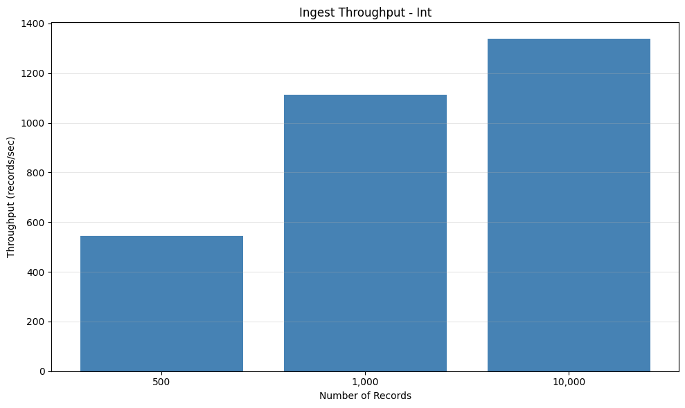
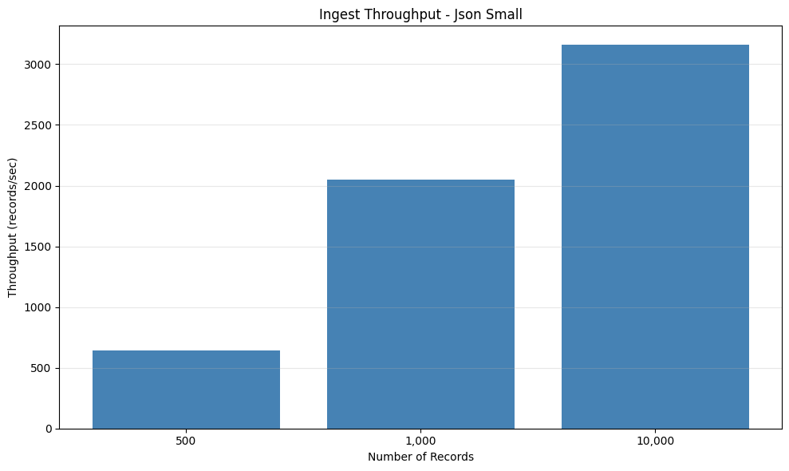
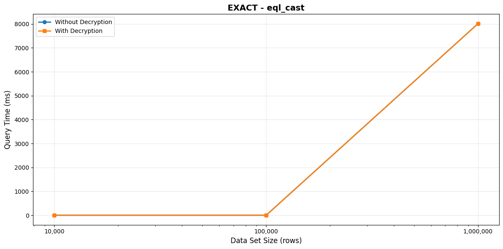
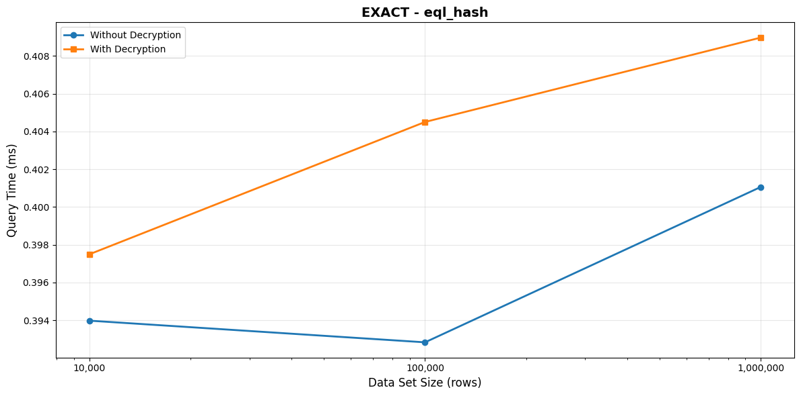
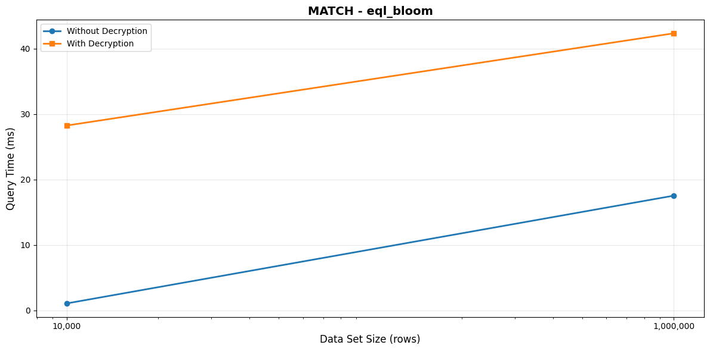
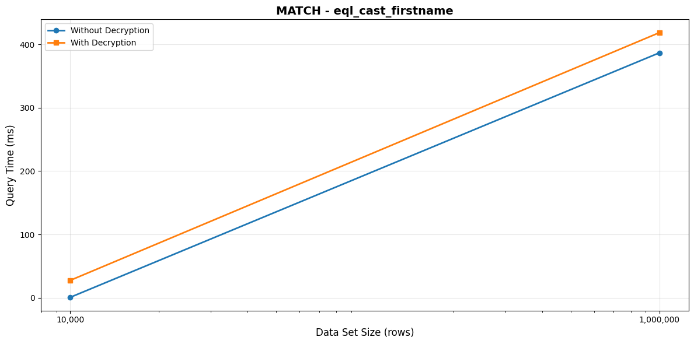
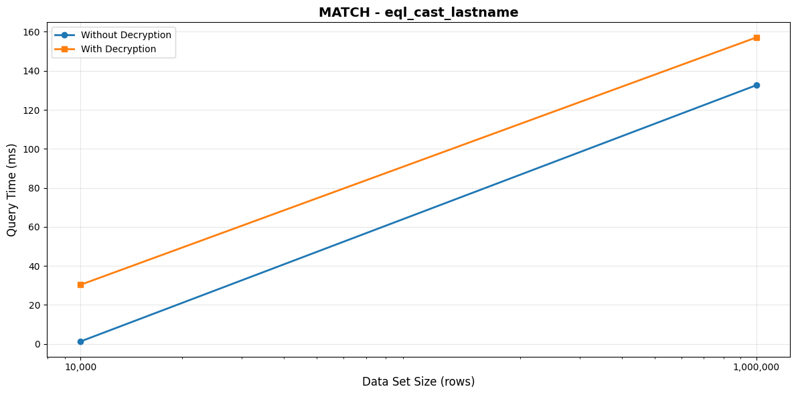
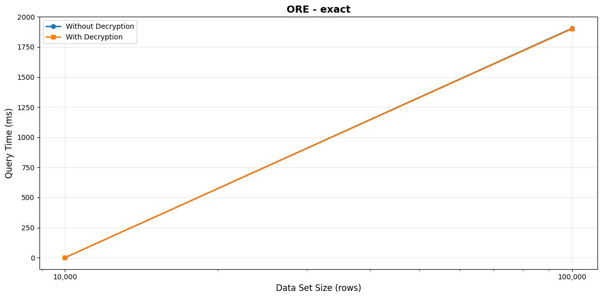
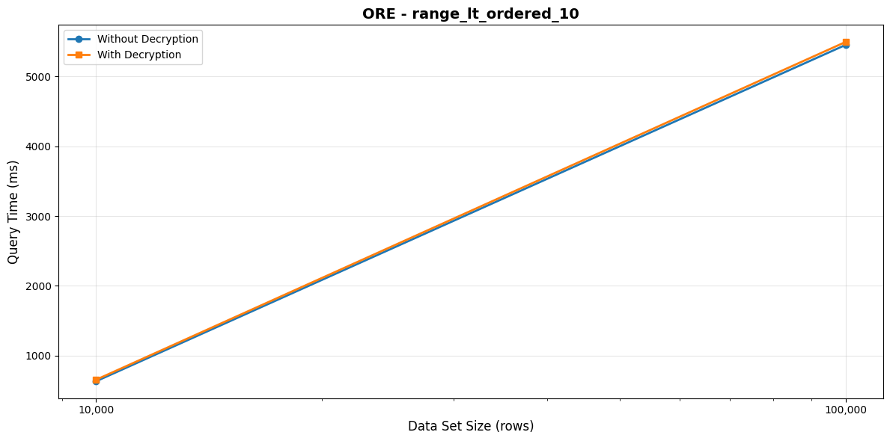

# Benchmark Report

This report summarizes the performance benchmarks for encrypted database operations.

## Table of Contents

1. [Ingest Throughput](#ingest-throughput)
2. [Query Performance](#query-performance)
   - [EXACT Queries](#exact-queries)
   - [MATCH Queries](#match-queries)
   - [ORE Queries](#ore-queries)

---

## Ingest Throughput

This section measures the throughput of inserting encrypted records into the database.

### Int

Tests insertion of encrypted integer values.

| Records | Throughput (records/sec) | Total Time | Avg Memory |
|---------|--------------------------|------------|------------|
| 500 | 544.83 | 0.92s | 15.25 MB |
| 1,000 | 1.11K | 0.90s | 17.83 MB |
| 10,000 | 1.34K | 7.48s | 20.34 MB |



### Json Small

Tests insertion of small encrypted JSON objects.

| Records | Throughput (records/sec) | Total Time | Avg Memory |
|---------|--------------------------|------------|------------|
| 500 | 565.55 | 0.88s | 18.70 MB |
| 1,000 | 1.45K | 0.69s | 27.47 MB |
| 10,000 | 2.22K | 4.51s | 45.33 MB |



### String

Tests insertion of encrypted string values.

| Records | Throughput (records/sec) | Total Time | Avg Memory |
|---------|--------------------------|------------|------------|
| 500 | 559.65 | 0.89s | 14.12 MB |
| 1,000 | 1.86K | 0.54s | 16.19 MB |
| 10,000 | 2.83K | 3.54s | 18.23 MB |


## Query Performance

This section measures query performance across different data set sizes. Each query is tested with and without decryption of results.

### EXACT Queries

#### eql_cast

**Description:** Exact match using EQL cast operator

**SQL Query:**
```sql
SELECT value FROM {TABLE} WHERE value = $1 LIMIT 1
```

**Parameter:** `Bob Johnson`

**Table: `string_encrypted_{rows}` with encrypted string values. Index: UNIQUE index on the encrypted value column.**

**Indexes:**
```sql
CREATE INDEX
string_encrypted_10000_hash_index
ON string_encrypted_10000 using hash (
    eql_v2.hmac_256(value)
);

CREATE INDEX
string_encrypted_10000_gin_index
ON string_encrypted_10000 USING GIN (
    eql_v2.bloom_filter(value)
);

CREATE INDEX
string_encrypted_10000_eql_index
ON string_encrypted_10000 (
    value eql_v2.encrypted_operator_class
);
```

*⚠️ = Query time exceeds 100ms*

| Data Set Size | Query Time (no decrypt) | Query Time (with decrypt) |
|---------------|-------------------------|---------------------------|
| 10,000 | 422.00μs | 415.23μs |
| 100,000 | 400.64μs | 427.65μs |
| 1,000,000 | ⚠️ 8.012s | ⚠️ 8.012s |



#### eql_hash

**Description:** Exact match using EQL HMAC-256 hash function

**SQL Query:**
```sql
SELECT value FROM {TABLE} WHERE eql_v2.hmac_256(value) = eql_v2.hmac_256($1::jsonb) LIMIT 1
```

**Parameter:** `Bob Johnson`

**Table: `string_encrypted_{rows}` with encrypted string values. Index: Hash-based unique index using `eql_v2.hmac_256`.**

**Indexes:**
```sql
CREATE INDEX
string_encrypted_10000_hash_index
ON string_encrypted_10000 using hash (
    eql_v2.hmac_256(value)
);

CREATE INDEX
string_encrypted_10000_gin_index
ON string_encrypted_10000 USING GIN (
    eql_v2.bloom_filter(value)
);

CREATE INDEX
string_encrypted_10000_eql_index
ON string_encrypted_10000 (
    value eql_v2.encrypted_operator_class
);
```

| Data Set Size | Query Time (no decrypt) | Query Time (with decrypt) |
|---------------|-------------------------|---------------------------|
| 10,000 | 393.98μs | 397.50μs |
| 100,000 | 392.83μs | 404.50μs |
| 1,000,000 | 401.06μs | 408.97μs |



### MATCH Queries

#### eql_bloom

**Description:** Pattern matching using EQL bloom filter containment

**SQL Query:**
```sql
SELECT id,value::jsonb FROM {TABLE} WHERE eql_v2.bloom_filter(value) @> eql_v2.bloom_filter($1) LIMIT 10
```

**Parameter:** `Johnson`

**Table: `string_encrypted_{rows}` with encrypted string values. Index: Bloom filter index using `eql_v2.bloom_filter`. Query returns LIMIT 10 results.**

**Indexes:**
```sql
CREATE INDEX
string_encrypted_10000_hash_index
ON string_encrypted_10000 using hash (
    eql_v2.hmac_256(value)
);

CREATE INDEX
string_encrypted_10000_gin_index
ON string_encrypted_10000 USING GIN (
    eql_v2.bloom_filter(value)
);

CREATE INDEX
string_encrypted_10000_eql_index
ON string_encrypted_10000 (
    value eql_v2.encrypted_operator_class
);
```

| Data Set Size | Query Time (no decrypt) | Query Time (with decrypt) |
|---------------|-------------------------|---------------------------|
| 10,000 | 1.07ms | 28.26ms |
| 1,000,000 | 17.53ms | 42.35ms |



#### eql_cast_firstname

**Description:** Pattern matching on first name using EQL cast and LIKE

**SQL Query:**
```sql
SELECT id,value::jsonb FROM {TABLE} WHERE value LIKE $1 LIMIT 10
```

**Parameter:** `Bob`

**Table: `string_encrypted_{rows}` with encrypted string values. Index: MATCH index for substring searches. Query returns LIMIT 10 results.**

**Indexes:**
```sql
CREATE INDEX
string_encrypted_10000_hash_index
ON string_encrypted_10000 using hash (
    eql_v2.hmac_256(value)
);

CREATE INDEX
string_encrypted_10000_gin_index
ON string_encrypted_10000 USING GIN (
    eql_v2.bloom_filter(value)
);

CREATE INDEX
string_encrypted_10000_eql_index
ON string_encrypted_10000 (
    value eql_v2.encrypted_operator_class
);
```

*⚠️ = Query time exceeds 100ms*

| Data Set Size | Query Time (no decrypt) | Query Time (with decrypt) |
|---------------|-------------------------|---------------------------|
| 10,000 | 751.37μs | 27.53ms |
| 1,000,000 | ⚠️ 386.64ms | ⚠️ 418.49ms |



#### eql_cast_lastname

**Description:** Pattern matching on last name using EQL cast and LIKE

**SQL Query:**
```sql
SELECT id,value::jsonb FROM {TABLE} WHERE value LIKE $1 LIMIT 10
```

**Parameter:** `Johnson`

**Table: `string_encrypted_{rows}` with encrypted string values. Index: MATCH index for substring searches. Query returns LIMIT 10 results.**

**Indexes:**
```sql
CREATE INDEX
string_encrypted_10000_hash_index
ON string_encrypted_10000 using hash (
    eql_v2.hmac_256(value)
);

CREATE INDEX
string_encrypted_10000_gin_index
ON string_encrypted_10000 USING GIN (
    eql_v2.bloom_filter(value)
);

CREATE INDEX
string_encrypted_10000_eql_index
ON string_encrypted_10000 (
    value eql_v2.encrypted_operator_class
);
```

*⚠️ = Query time exceeds 100ms*

| Data Set Size | Query Time (no decrypt) | Query Time (with decrypt) |
|---------------|-------------------------|---------------------------|
| 10,000 | 1.25ms | 30.30ms |
| 1,000,000 | ⚠️ 132.59ms | ⚠️ 157.06ms |



### ORE Queries

#### exact

**Description:** Exact match query on encrypted integer

**SQL Query:**
```sql
SELECT value FROM {TABLE} WHERE value = $1 LIMIT 1
```

**Parameter:** `5000`

**Table: `integer_encrypted_{rows}` with ORE-encrypted integer values. Index: ORE index supporting equality and range queries. Query returns LIMIT 1 result.**

**Indexes:**
```sql
CREATE INDEX
integer_encrypted_10000_eql_index
ON integer_encrypted_10000 (
    value eql_v2.encrypted_operator_class
);
```

*⚠️ = Query time exceeds 100ms*

| Data Set Size | Query Time (no decrypt) | Query Time (with decrypt) |
|---------------|-------------------------|---------------------------|
| 10,000 | 464.23μs | 495.74μs |
| 100,000 | ⚠️ 1.905s | ⚠️ 1.901s |



#### range_gt_10

**Description:** Range query (greater than) returning 10 results

**SQL Query:**
```sql
SELECT id,value::jsonb FROM {TABLE} WHERE value > $1 LIMIT 10
```

**Parameter:** `5000`

**Table: `integer_encrypted_{rows}` with ORE-encrypted integer values. Index: ORE index supporting equality and range queries. Query: WHERE value > 5000 LIMIT 10.**

**Indexes:**
```sql
CREATE INDEX
integer_encrypted_10000_eql_index
ON integer_encrypted_10000 (
    value eql_v2.encrypted_operator_class
);
```

| Data Set Size | Query Time (no decrypt) | Query Time (with decrypt) |
|---------------|-------------------------|---------------------------|
| 10,000 | 2.39ms | 29.57ms |
| 100,000 | 1.53ms | 27.97ms |


#### range_gt_100

**Description:** Range query (greater than) returning 100 results

**SQL Query:**
```sql
SELECT id,value::jsonb FROM {TABLE} WHERE value > $1 LIMIT 100
```

**Parameter:** `5000`

**Table: `integer_encrypted_{rows}` with ORE-encrypted integer values. Index: ORE index supporting equality and range queries. Query: WHERE value > 5000 LIMIT 100.**

**Indexes:**
```sql
CREATE INDEX
integer_encrypted_10000_eql_index
ON integer_encrypted_10000 (
    value eql_v2.encrypted_operator_class
);
```

| Data Set Size | Query Time (no decrypt) | Query Time (with decrypt) |
|---------------|-------------------------|---------------------------|
| 10,000 | 14.33ms | 51.92ms |
| 100,000 | 12.35ms | 52.45ms |


#### range_lt_10

**Description:** Range query (less than) returning 10 results

**SQL Query:**
```sql
SELECT id,value::jsonb FROM {TABLE} WHERE value < $1 LIMIT 10
```

**Parameter:** `5000`

**Table: `integer_encrypted_{rows}` with ORE-encrypted integer values. Index: ORE index supporting equality and range queries. Query: WHERE value < 5000 LIMIT 10.**

**Indexes:**
```sql
CREATE INDEX
integer_encrypted_10000_eql_index
ON integer_encrypted_10000 (
    value eql_v2.encrypted_operator_class
);
```

| Data Set Size | Query Time (no decrypt) | Query Time (with decrypt) |
|---------------|-------------------------|---------------------------|
| 10,000 | 2.71ms | 27.30ms |
| 100,000 | 1.66ms | 28.69ms |


#### range_lt_100

**Description:** Range query (less than) returning 100 results

**SQL Query:**
```sql
SELECT id,value::jsonb FROM {TABLE} WHERE value < $1 LIMIT 100
```

**Parameter:** `5000`

**Table: `integer_encrypted_{rows}` with ORE-encrypted integer values. Index: ORE index supporting equality and range queries. Query: WHERE value < 5000 LIMIT 100.**

**Indexes:**
```sql
CREATE INDEX
integer_encrypted_10000_eql_index
ON integer_encrypted_10000 (
    value eql_v2.encrypted_operator_class
);
```

| Data Set Size | Query Time (no decrypt) | Query Time (with decrypt) |
|---------------|-------------------------|---------------------------|
| 10,000 | 14.85ms | 53.07ms |
| 100,000 | 12.49ms | 52.96ms |


#### range_lt_ordered_10

**Description:** Ordered range query (less than) with ORDER BY

**SQL Query:**
```sql
SELECT id,value::jsonb FROM {TABLE} WHERE value < $1 ORDER BY value LIMIT 10
```

**Parameter:** `5000`

**Table: `integer_encrypted_{rows}` with ORE-encrypted integer values. Index: ORE index supporting equality and range queries. Query: WHERE value < 5000 ORDER BY value LIMIT 10.**

**Indexes:**
```sql
CREATE INDEX
integer_encrypted_10000_eql_index
ON integer_encrypted_10000 (
    value eql_v2.encrypted_operator_class
);
```

*⚠️ = Query time exceeds 100ms*

| Data Set Size | Query Time (no decrypt) | Query Time (with decrypt) |
|---------------|-------------------------|---------------------------|
| 10,000 | ⚠️ 633.49ms | ⚠️ 655.54ms |
| 100,000 | ⚠️ 5.453s | ⚠️ 5.495s |




---

*Report generated by `report_benchmarks.py`*
