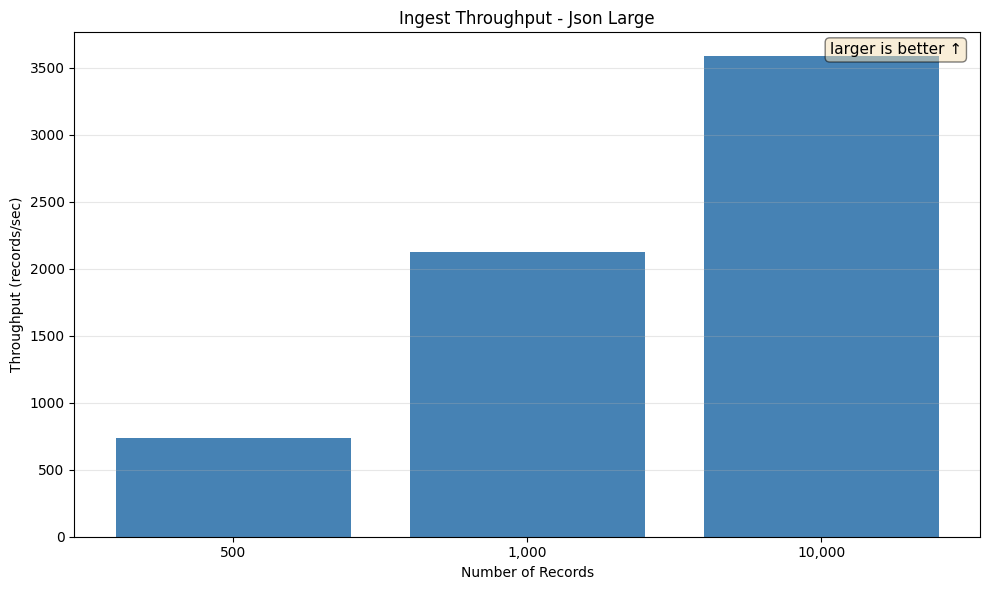
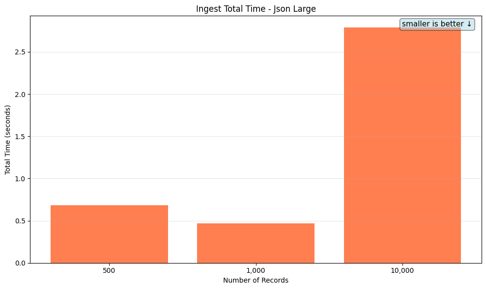

# Benchmark Report

This report summarises the performance benchmarks for encrypted database operations. Per-query-type detail lives on its own page — click through from the Query Performance section below.

## Table of Contents

1. [Ingest Throughput](#ingest-throughput)
   - [Int](#int)
   - [Json Large](#json-large)
   - [Json Small](#json-small)
   - [Ste Vec Small](#ste-vec-small)
   - [String](#string)
2. [Query Performance](#query-performance)
   - [COMBO Queries](combo.md)
   - [EXACT Queries](exact.md)
   - [GROUP_BY Queries](group_by.md)
   - [JSON Queries](json.md)
   - [MATCH Queries](match.md)
   - [ORE Queries](ore.md)

---

## Ingest Throughput

This section measures the throughput of inserting encrypted records into the database.

### Comparison at 10,000 Records

Comparing all benchmark types at 10,000 records.

### Int

Tests insertion of encrypted integer values.

| Records | Throughput (records/sec) | Total Time | Avg Memory |
|---------|--------------------------|------------|------------|
| 500 | 698.69 | 0.72s | 17.22 MB |
| 1,000 | 1.59K | 0.63s | 20.39 MB |
| 10,000 | 2.13K | 4.70s | 22.25 MB |

### Json Large

Tests insertion of large encrypted JSON objects with complex nested structures (user info, company, addresses, orders).

| Records | Throughput (records/sec) | Total Time | Avg Memory |
|---------|--------------------------|------------|------------|
| 500 | 734.25 | 0.68s | 55.98 MB |
| 1,000 | 2.13K | 0.47s | 95.58 MB |
| 10,000 | 3.59K | 2.79s | 162.06 MB |

### Json Small

Tests insertion of small encrypted JSON objects (first_name, last_name, age, email).

| Records | Throughput (records/sec) | Total Time | Avg Memory |
|---------|--------------------------|------------|------------|
| 500 | 665.29 | 0.75s | 16.22 MB |
| 1,000 | 3.68K | 0.27s | 18.05 MB |
| 10,000 | 11.42K | 0.88s | 20.22 MB |

### Ste Vec Small

Tests insertion of small JSON objects with SteVec (searchable encrypted vector) indexing.

| Records | Throughput (records/sec) | Total Time | Avg Memory |
|---------|--------------------------|------------|------------|
| 10,000 | 4.03K | 2.48s | 31.90 MB |

### String

Tests insertion of encrypted string values.

| Records | Throughput (records/sec) | Total Time | Avg Memory |
|---------|--------------------------|------------|------------|
| 500 | 966.23 | 0.52s | 16.48 MB |
| 1,000 | 3.99K | 0.25s | 18.66 MB |
| 10,000 | 9.65K | 1.04s | 21.23 MB |

## Query Performance

Per-query-type detail is broken out into separate pages — click into a scenario family for the SQL, per-tier timings, the indexes the planner picked, and the EXPLAIN plan tree.

| Query Type | Scenarios | Tiers | Largest-tier median (no decrypt) | Detail |
|-|-|-|-|-|
| COMBO | `bloom_ore_order_limit`, `filtered_group_by`, `top_n_filtered_group_by` | 10,000, 100,000, 1,000,000, 10,000,000 | 86.89ms | [open](combo.md) |
| EXACT | `eql_cast`, `eql_hash` | 10,000, 100,000, 1,000,000, 10,000,000 | 108.58μs | [open](exact.md) |
| GROUP_BY | `low_cardinality_groups_encrypted`, `low_cardinality_groups_plaintext`, `top_n_groups_encrypted`, `top_n_groups_plaintext` | 10,000, 100,000, 1,000,000, 10,000,000 | 568.48ms | [open](group_by.md) |
| JSON | `contains/functional`, `field_eq/bare`, `field_eq/extractor`, `field_eq/functional`, `field_order/functional` | 10,000, 100,000, 1,000,000, 10,000,000 | 370.33μs | [open](json.md) |
| MATCH | `eql_bloom`, `eql_cast_firstname`, `eql_cast_lastname` | 10,000, 100,000, 1,000,000, 10,000,000 | 107.51ms | [open](match.md) |
| ORE | `range_gt_10`, `range_gt_100`, `range_lt_10`, `range_lt_100`, `range_lt_ordered_10` | 10,000, 100,000, 1,000,000, 10,000,000 | 2.01ms | [open](ore.md) |

---

*Report generated by `report_benchmarks.py`*
