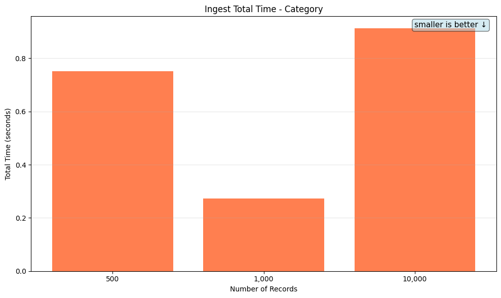
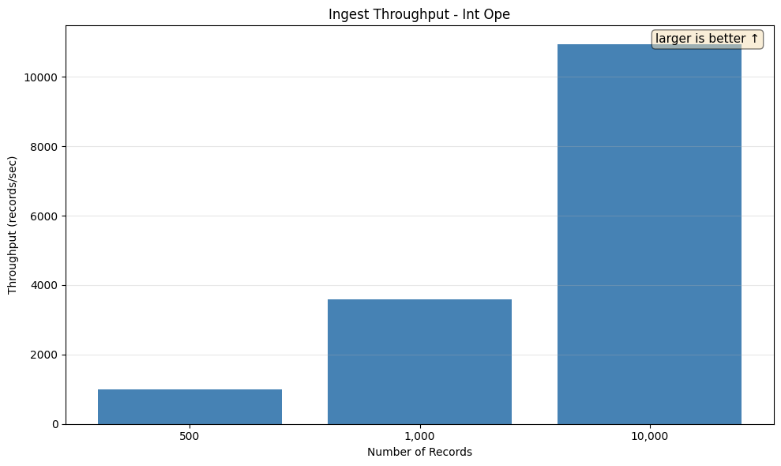
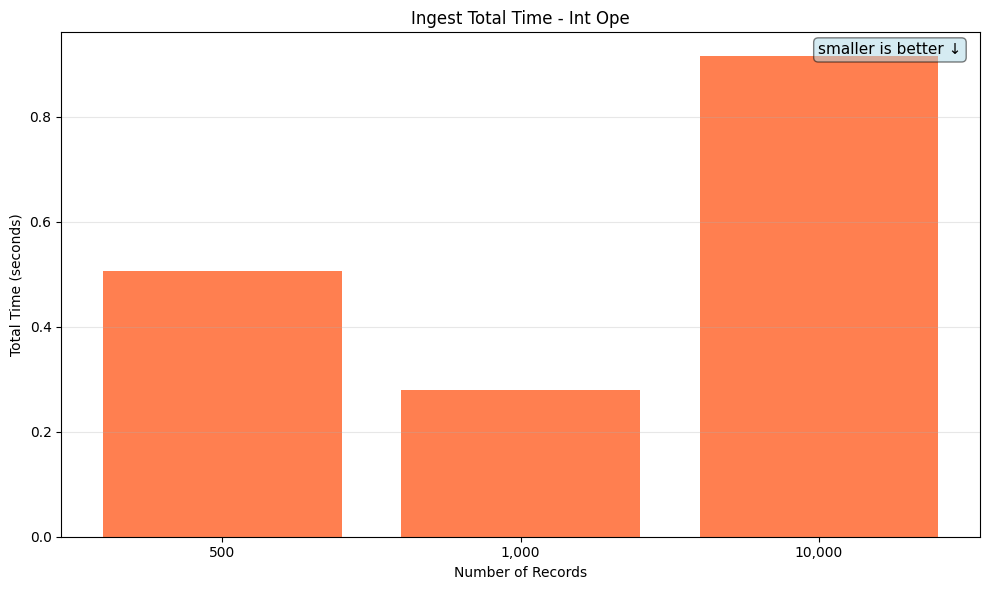
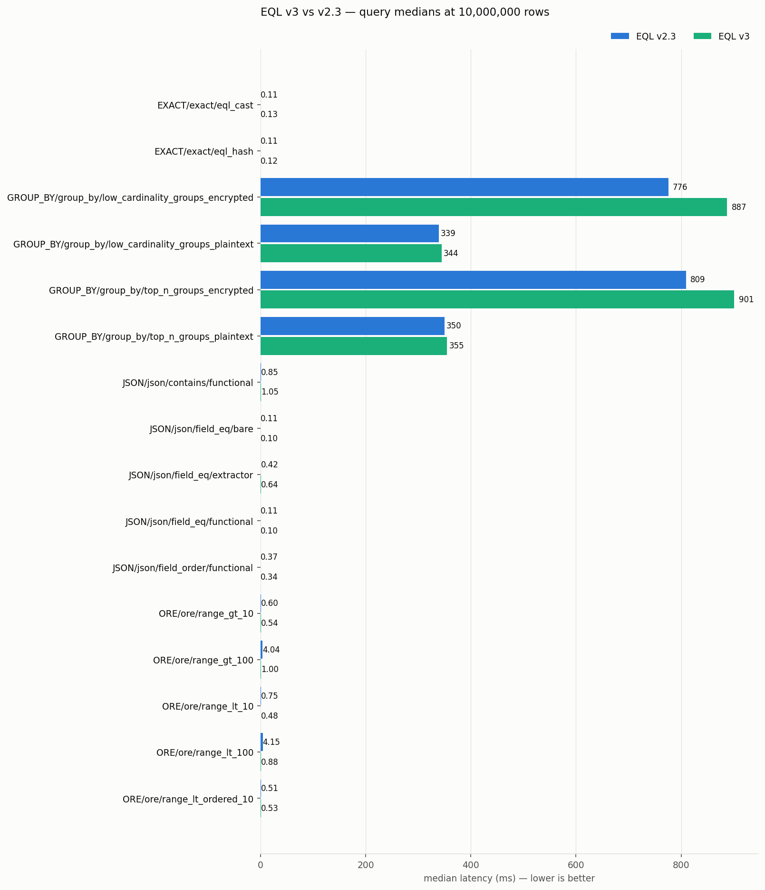
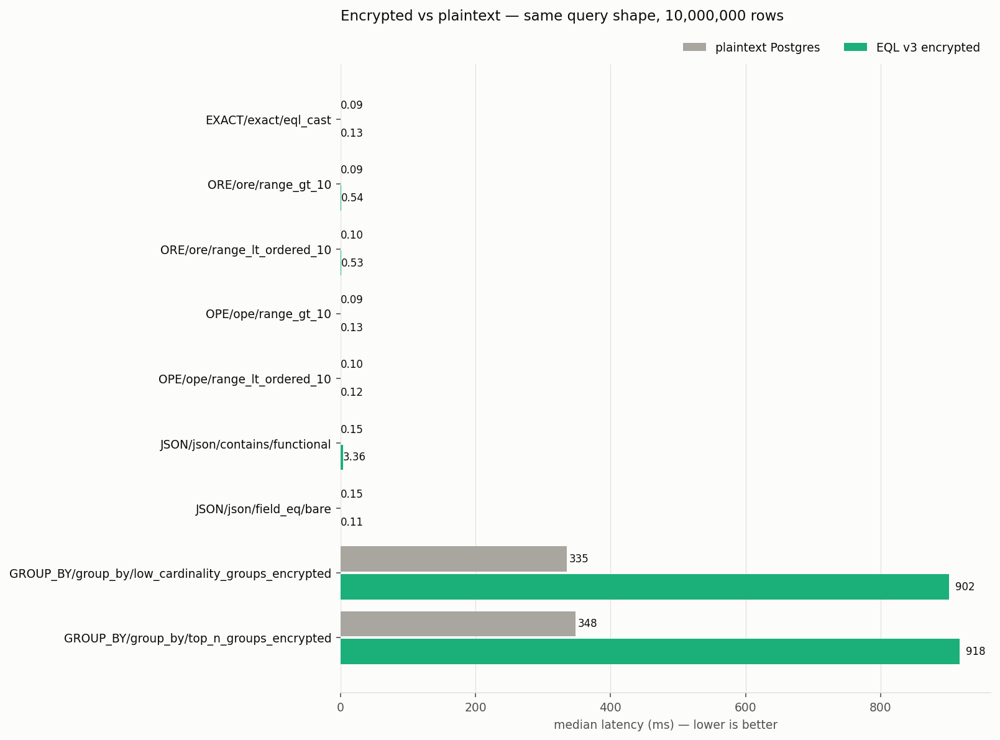

# Benchmark Report (EQL v3)

This report summarises the performance benchmarks for encrypted database operations. Per-query-type detail lives on its own page — click through from the Query Performance section below.

## Table of Contents

1. [Ingest Throughput](#ingest-throughput)
   - [Category](#category)
   - [Int](#int)
   - [Int Ope](#int-ope)
   - [Ste Vec Small](#ste-vec-small)
   - [String](#string)
2. [Query Performance](#query-performance)
   - [COMBO Queries](combo.md)
   - [EXACT Queries](exact.md)
   - [GROUP_BY Queries](group_by.md)
   - [JSON Queries](json.md)
   - [MATCH Queries](match.md)
   - [OPE Queries](ope.md)
   - [ORE Queries](ore.md)
   - [PLAINTEXT Queries](plaintext.md)
   - [SCALAR_SMOKE Queries](scalar_smoke.md)
3. [Comparison vs EQL 2.3](#comparison-vs-eql-23)
4. [Comparison vs plaintext PostgreSQL](#comparison-vs-plaintext-postgresql)

---

## Ingest Throughput

This section measures the throughput of inserting encrypted records into the database.

### Comparison at 10,000 Records

Comparing all benchmark types at 10,000 records.

### Category

| Records | Throughput (records/sec) | Total Time | Avg Memory |
|---------|--------------------------|------------|------------|
| 500 | 665.19 | 0.75s | 18.72 MB |
| 1,000 | 3.67K | 0.27s | 20.22 MB |
| 10,000 | 10.97K | 0.91s | 22.28 MB |

### Int

Tests insertion of encrypted integer values.

| Records | Throughput (records/sec) | Total Time | Avg Memory |
|---------|--------------------------|------------|------------|
| 500 | 418.51 | 1.19s | 19.06 MB |
| 1,000 | 1.48K | 0.68s | 23.80 MB |
| 10,000 | 2.08K | 4.82s | 26.45 MB |

### Int Ope

| Records | Throughput (records/sec) | Total Time | Avg Memory |
|---------|--------------------------|------------|------------|
| 500 | 987.73 | 0.51s | 18.73 MB |
| 1,000 | 3.58K | 0.28s | 20.00 MB |
| 10,000 | 10.93K | 0.91s | 21.81 MB |

### Ste Vec Small

Tests insertion of small JSON objects with SteVec (searchable encrypted vector) indexing.

| Records | Throughput (records/sec) | Total Time | Avg Memory |
|---------|--------------------------|------------|------------|
| 500 | 317.82 | 1.57s | 23.88 MB |
| 1,000 | 2.38K | 0.42s | 35.89 MB |
| 10,000 | 4.47K | 2.23s | 37.78 MB |

### String

Tests insertion of encrypted string values.

| Records | Throughput (records/sec) | Total Time | Avg Memory |
|---------|--------------------------|------------|------------|
| 500 | 318.12 | 1.57s | 23.48 MB |
| 1,000 | 1.02K | 0.98s | 32.64 MB |
| 10,000 | 1.27K | 7.90s | 36.31 MB |

## Query Performance

Per-query-type detail is broken out into separate pages — click into a scenario family for the SQL, per-tier timings, the indexes the planner picked, and the EXPLAIN plan tree.

| Query Type | Scenarios | Tiers | Largest-tier median (no decrypt) | Detail |
|-|-|-|-|-|
| COMBO | `bloom_ore_order_limit`, `filtered_group_by`, `top_n_filtered_group_by` | 10,000, 100,000, 1,000,000 | 8.20ms | [open](combo.md) |
| EXACT | `eql_cast`, `eql_hash` | 10,000, 100,000, 1,000,000, 10,000,000 | 135.64μs | [open](exact.md) |
| GROUP_BY | `low_cardinality_groups_encrypted`, `low_cardinality_groups_plaintext`, `top_n_groups_encrypted`, `top_n_groups_plaintext` | 10,000, 100,000, 1,000,000 | 61.10ms | [open](group_by.md) |
| JSON | `contains/functional`, `field_eq/bare`, `field_eq/extractor`, `field_eq/functional`, `field_order/functional` | 10,000, 100,000, 1,000,000, 10,000,000 | 886.45μs | [open](json.md) |
| MATCH | `eql_bloom`, `eql_bloom_noindex`, `eql_cast_firstname`, `eql_cast_firstname_noindex`, `eql_cast_lastname`, `eql_cast_lastname_noindex` | 10,000, 100,000, 1,000,000 | 11.57ms | [open](match.md) |
| OPE | `range_gt_10`, `range_gt_100`, `range_lt_10`, `range_lt_100`, `range_lt_ordered_10` | 10,000, 100,000, 1,000,000, 10,000,000 | 215.61μs | [open](ope.md) |
| ORE | `range_gt_10`, `range_gt_100`, `range_lt_10`, `range_lt_100`, `range_lt_ordered_10` | 10,000, 100,000, 1,000,000, 10,000,000 | 685.33μs | [open](ore.md) |
| PLAINTEXT | `exact_eq`, `json_contains`, `json_field_eq`, `range_gt_10`, `range_lt_ordered_10` | 10,000, 100,000, 1,000,000, 10,000,000 | 114.62μs | [open](plaintext.md) |
| SCALAR_SMOKE | `bigint_ord/range_gt_10`, `bigint_ord/range_gt_ordered_10`, `boolean/select_back`, `date_ord/range_gt_10`, `date_ord/range_gt_ordered_10`, `double_ord/range_gt_10`, `double_ord/range_gt_ordered_10`, `numeric_ord/range_gt_10`, `numeric_ord/range_gt_ordered_10`, `timestamp_ord/range_gt_10`, `timestamp_ord/range_gt_ordered_10` | 10,000 | 838.93μs | [open](scalar_smoke.md) |

## Comparison vs EQL 2.3

115 comparable scenario/tier pairs against the committed EQL 2.3 baseline: **4 regressions**, **18 improvements** (beyond ±10%), 37 pairs whose SQL semantics changed between versions (annotated, not flagged). Full table, methodology, and index-engagement audit: [V3_COMPARISON.md](V3_COMPARISON.md).

| Scenario | Tier | v2 median | v3 median | Δ | |
|-|-|-|-|-|-|
| EXACT/exact/eql_cast | 10000000 | 110.3 µs | 138.7 µs | +25.8% | 🔴 |
| MATCH/match/eql_bloom | 10000 | 405.4 µs | 477.0 µs | +17.6% | 🔴 |
| ORE/ore/range_lt_ordered_10 | 10000 | 480.9 µs | 551.4 µs | +14.6% | 🔴 |
| EXACT/exact/eql_cast | 100000 | 113.5 µs | 127.0 µs | +11.8% | 🔴 |
| GROUP_BY/group_by/low_cardinality_groups_encrypted | 1000000 | 92.57 ms | 83.05 ms | -10.3% | 🟢 |
| ORE/ore/range_lt_10 | 1000000 | 577.0 µs | 494.6 µs | -14.3% | 🟢 |
| JSON/json/field_order/functional | 10000 | 317.9 µs | 269.0 µs | -15.4% | 🟢 |
| ORE/ore/range_gt_10 | 10000 | 624.6 µs | 506.7 µs | -18.9% | 🟢 |
| ORE/ore/range_lt_10 | 10000 | 595.5 µs | 476.5 µs | -20.0% | 🟢 |
| ORE/ore/range_gt_10 | 1000000 | 694.1 µs | 542.8 µs | -21.8% | 🟢 |
| ORE/ore/range_lt_10 | 100000 | 655.1 µs | 496.4 µs | -24.2% | 🟢 |
| JSON/json/field_order/functional | 1000000 | 356.7 µs | 255.5 µs | -28.4% | 🟢 |
| JSON/json/field_order/functional | 10000000 | 367.6 µs | 250.2 µs | -31.9% | 🟢 |
| ORE/ore/range_lt_10 | 10000000 | 748.8 µs | 477.9 µs | -36.2% | 🟢 |
| ORE/ore/range_gt_100 | 10000000 | 4.04 ms | 996.5 µs | -75.3% | 🟢 |
| ORE/ore/range_lt_100 | 100000 | 3.87 ms | 932.2 µs | -75.9% | 🟢 |
| ORE/ore/range_gt_100 | 100000 | 4.16 ms | 972.5 µs | -76.6% | 🟢 |
| ORE/ore/range_lt_100 | 10000 | 3.93 ms | 917.5 µs | -76.7% | 🟢 |
| ORE/ore/range_gt_100 | 1000000 | 4.10 ms | 926.7 µs | -77.4% | 🟢 |
| ORE/ore/range_gt_100 | 10000 | 4.04 ms | 907.7 µs | -77.5% | 🟢 |
| ORE/ore/range_lt_100 | 1000000 | 4.06 ms | 889.4 µs | -78.1% | 🟢 |
| ORE/ore/range_lt_100 | 10000000 | 4.15 ms | 880.5 µs | -78.8% | 🟢 |

## Comparison vs plaintext PostgreSQL

The same query shapes against plaintext tables with equivalent indexes (see `benches/plaintext_v3.rs`). Ratios are encrypted ÷ plaintext median; the JSON plaintext baseline is an unindexed `->` filter, hence ratios below 1.

| Scenario | 10,000 rows | 100,000 rows | 1,000,000 rows | 10,000,000 rows |
|-|-|-|-|-|
| EXACT/exact/eql_cast | 128.5 µs (1.4×) | 127.0 µs (1.4×) | 124.1 µs (1.3×) | 138.7 µs (1.5×) |
| ORE/ore/range_gt_10 | 506.7 µs (5.3×) | 525.8 µs (6.1×) | 542.8 µs (5.9×) | 539.8 µs (6.1×) |
| ORE/ore/range_lt_ordered_10 | 551.4 µs (5.5×) | 543.5 µs (5.4×) | 518.5 µs (5.2×) | 532.0 µs (5.5×) |
| OPE/ope/range_gt_10 | 122.5 µs (1.3×) | 123.5 µs (1.4×) | 117.6 µs (1.3×) | 126.4 µs (1.4×) |
| OPE/ope/range_lt_ordered_10 | 116.9 µs (1.2×) | 120.3 µs (1.2×) | 118.4 µs (1.2×) | 115.2 µs (1.2×) |
| JSON/json/contains/functional | 271.9 µs (2.5×) | 352.9 µs (1.5×) | 395.9 µs (1.4×) | 3.36 ms (22.8×) |
| JSON/json/field_eq/bare | 114.3 µs (0.5×) | 113.5 µs (0.5×) | 116.8 µs (0.4×) | 109.5 µs (0.7×) |
| GROUP_BY/group_by/low_cardinality_groups_encrypted | 2.11 ms (1.8×) | 19.16 ms (2.0×) | 83.05 ms (2.2×) | — |
| GROUP_BY/group_by/top_n_groups_encrypted | 2.07 ms (1.7×) | 19.90 ms (2.0×) | 85.63 ms (2.2×) | — |

---

*Report generated by `report_benchmarks.py`*
