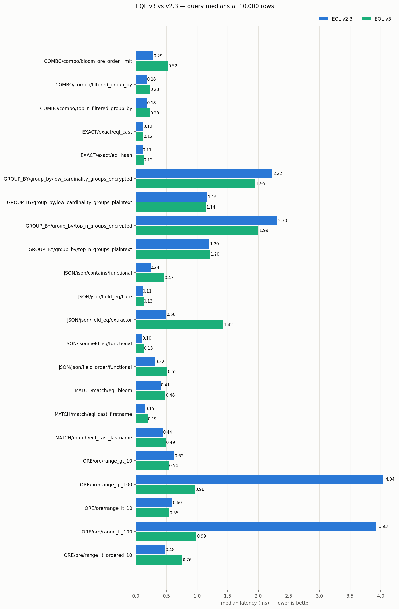
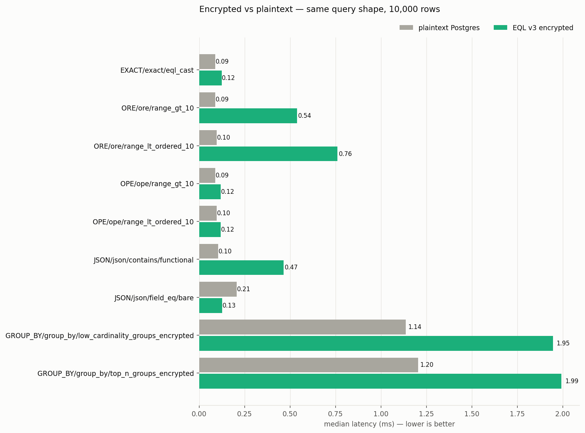
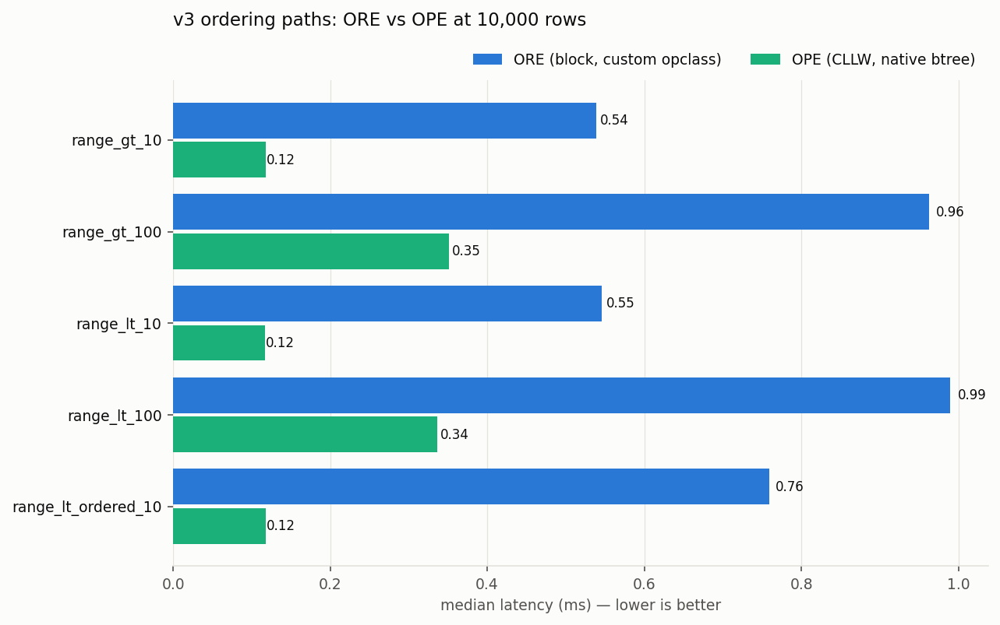
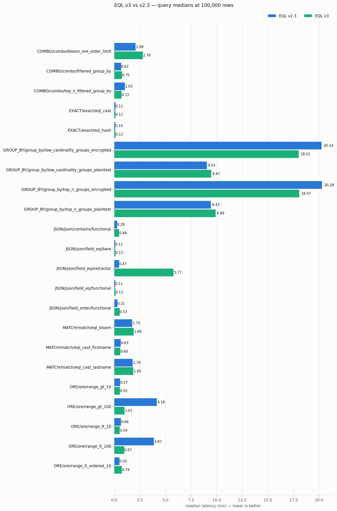
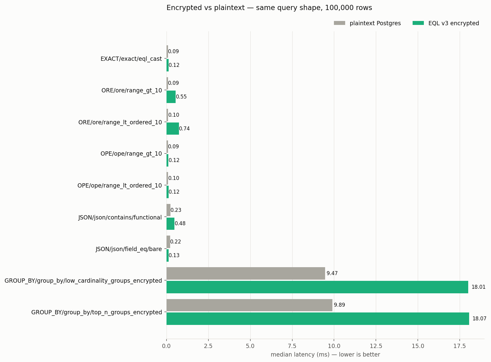
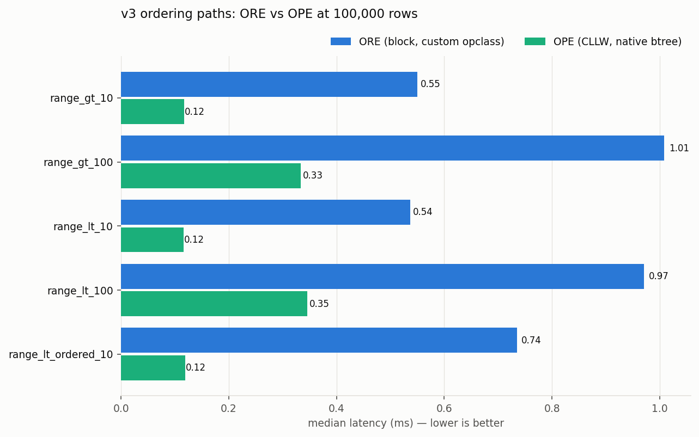
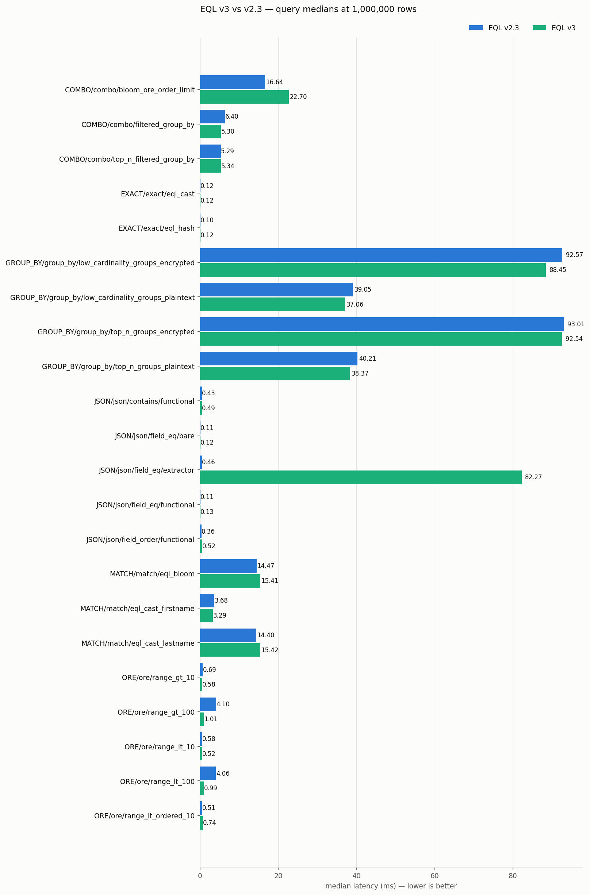
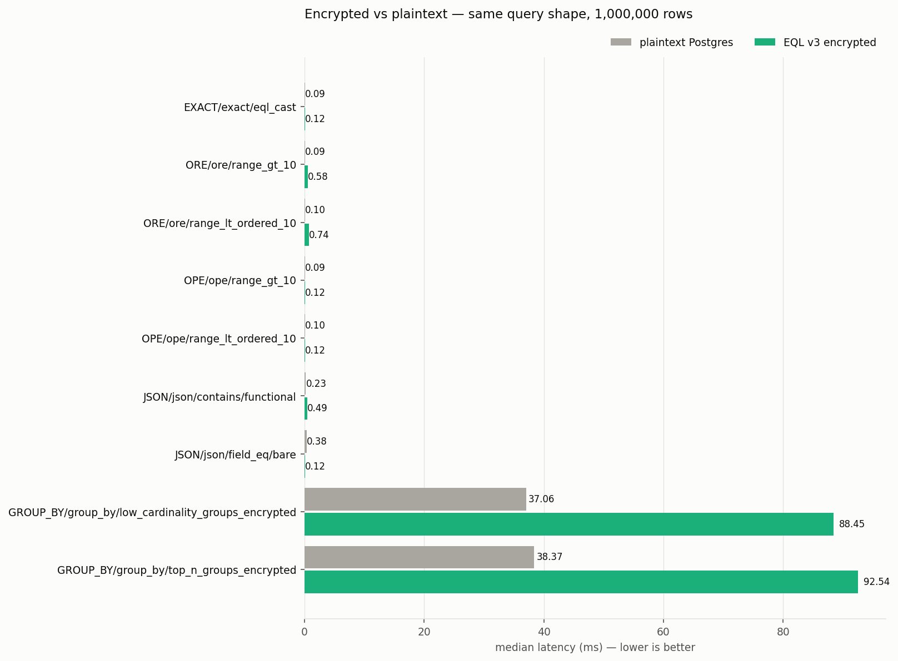
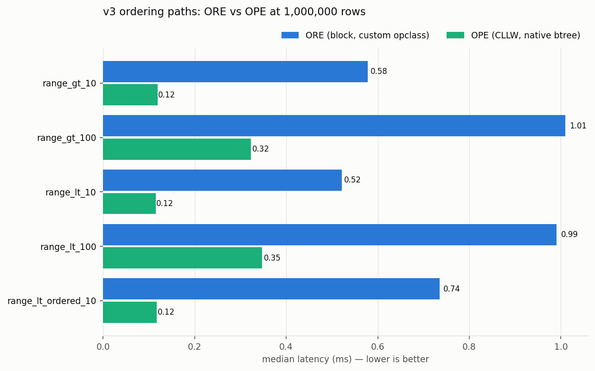

# EQL v3 vs v2.3 — Benchmark Comparison

Auto-generated by `report_v3_compare.py` (`mise run report:v3-compare`).

Regression threshold: v3 slower by more than **10%** on a semantics-equivalent scenario.

Methodology notes:

- v3 payloads are produced by `eql-bindings::from_v2` over the pinned cipherstash-client's v2.3 output (the supported migration path); conversion cost is inside the measured ingest path.
- v3 query parameters are stored-shape payloads (no v3 scalar query wire shape exists); server-side timings are unaffected.
- The v3 string column (`text_search`) carries an ORE term v2's unique+match config did not — v3 string rows are wider.
- OPE ciphertexts are synthetic (fixed-width order-preserving hex) until a client emits real CLLW-OPE terms; plan shapes and comparison counts are faithful, ciphertext size is approximate.
- v2 numbers are the committed baseline results (`results/query/`, `results/ingest/`); v3 numbers come from `results/query/v3/`, `results/ingest/v3/`.

## Query scenarios: v3 vs v2

96 comparable scenario/tier pairs — **14 regressions**, 21 improvements beyond ±10%.

| Scenario | Tier | v2 median | v3 median | Δ | Flag | Note |
|---|---|---|---|---|---|---|
| JSON/json/field_eq/extractor | 1000000 | 463.3 µs | 82.27 ms | +17658.4% | ⚠️ semantics changed | generic-plan GIN + every-row needle artifact (see report notes) |
| JSON/json/field_eq/extractor | 100000 | 466.7 µs | 5.77 ms | +1137.3% | ⚠️ semantics changed | generic-plan GIN + every-row needle artifact (see report notes) |
| JSON/json/field_eq/extractor | 10000 | 496.8 µs | 1.42 ms | +185.9% | ⚠️ semantics changed | generic-plan GIN + every-row needle artifact (see report notes) |
| JSON/json/contains/functional | 10000 | 237.4 µs | 465.1 µs | +95.9% | ⚠️ semantics changed | v2 jsonb_array recipe → v3 to_ste_vec_query GIN recipe |
| COMBO/combo/bloom_ore_order_limit | 10000 | 286.9 µs | 524.6 µs | +82.8% | ⚠️ semantics changed | v2 LIKE → v3 @> |
| JSON/json/field_order/functional | 100000 | 306.2 µs | 525.6 µs | +71.6% | 🔴 REGRESSION |  |
| JSON/json/contains/functional | 100000 | 279.9 µs | 477.0 µs | +70.4% | ⚠️ semantics changed | v2 jsonb_array recipe → v3 to_ste_vec_query GIN recipe |
| JSON/json/field_order/functional | 10000 | 317.9 µs | 515.3 µs | +62.1% | 🔴 REGRESSION |  |
| ORE/ore/range_lt_ordered_10 | 10000 | 480.9 µs | 759.6 µs | +57.9% | 🔴 REGRESSION |  |
| ORE/ore/range_lt_ordered_10 | 100000 | 502.4 µs | 735.3 µs | +46.3% | 🔴 REGRESSION |  |
| JSON/json/field_order/functional | 1000000 | 356.7 µs | 515.2 µs | +44.4% | 🔴 REGRESSION |  |
| ORE/ore/range_lt_ordered_10 | 1000000 | 513.2 µs | 735.5 µs | +43.3% | 🔴 REGRESSION |  |
| COMBO/combo/bloom_ore_order_limit | 1000000 | 16.64 ms | 22.70 ms | +36.4% | ⚠️ semantics changed | v2 LIKE → v3 @> |
| COMBO/combo/bloom_ore_order_limit | 100000 | 2.08 ms | 2.78 ms | +33.5% | ⚠️ semantics changed | v2 LIKE → v3 @> |
| COMBO/combo/top_n_filtered_group_by | 10000 | 178.4 µs | 230.9 µs | +29.4% | ⚠️ semantics changed | v2 LIKE → v3 @> |
| COMBO/combo/filtered_group_by | 10000 | 178.5 µs | 230.5 µs | +29.1% | ⚠️ semantics changed | v2 LIKE → v3 @> |
| MATCH/match/eql_cast_firstname | 10000 | 152.3 µs | 194.2 µs | +27.5% | ⚠️ semantics changed | v2 LIKE → v3 @> (no LIKE operator in v3; same bloom semantics) |
| JSON/json/field_eq/functional | 10000 | 104.8 µs | 126.4 µs | +20.6% | 🔴 REGRESSION | same btree plan as v2 (needle matches every row in both versions) |
| EXACT/exact/eql_hash | 100000 | 102.9 µs | 123.6 µs | +20.1% | ⚠️ semantics changed | index type changed: v2 hash → v3 btree on eq_term |
| JSON/json/field_eq/functional | 1000000 | 105.8 µs | 126.4 µs | +19.5% | 🔴 REGRESSION | same btree plan as v2 (needle matches every row in both versions) |
| MATCH/match/eql_bloom | 10000 | 405.4 µs | 483.4 µs | +19.2% | 🔴 REGRESSION | v3 GIN uses native array_ops on the bloom term (no shipped opclass) |
| JSON/json/field_eq/functional | 100000 | 107.4 µs | 127.6 µs | +18.9% | 🔴 REGRESSION | same btree plan as v2 (needle matches every row in both versions) |
| JSON/json/field_eq/bare | 100000 | 106.8 µs | 125.5 µs | +17.5% | 🔴 REGRESSION | same btree plan as v2 (needle matches every row in both versions) |
| JSON/json/field_eq/bare | 10000 | 109.3 µs | 125.7 µs | +15.0% | 🔴 REGRESSION | same btree plan as v2 (needle matches every row in both versions) |
| EXACT/exact/eql_hash | 10000 | 108.7 µs | 124.2 µs | +14.2% | ⚠️ semantics changed | index type changed: v2 hash → v3 btree on eq_term |
| JSON/json/field_eq/bare | 1000000 | 109.0 µs | 124.2 µs | +14.0% | 🔴 REGRESSION | same btree plan as v2 (needle matches every row in both versions) |
| COMBO/combo/filtered_group_by | 100000 | 665.2 µs | 749.5 µs | +12.7% | ⚠️ semantics changed | v2 LIKE → v3 @> |
| JSON/json/contains/functional | 1000000 | 431.5 µs | 485.3 µs | +12.5% | ⚠️ semantics changed | v2 jsonb_array recipe → v3 to_ste_vec_query GIN recipe |
| MATCH/match/eql_cast_lastname | 10000 | 439.7 µs | 488.4 µs | +11.1% | ⚠️ semantics changed | v2 LIKE → v3 @> (no LIKE operator in v3; same bloom semantics) |
| EXACT/exact/eql_hash | 1000000 | 104.6 µs | 116.1 µs | +11.0% | ⚠️ semantics changed | index type changed: v2 hash → v3 btree on eq_term |
| MATCH/match_decrypt/eql_bloom | 100000 | 25.70 ms | 28.38 ms | +10.4% | 🔴 REGRESSION |  |
| MATCH/match/eql_bloom | 100000 | 1.75 ms | 1.89 ms | +7.7% |  | v3 GIN uses native array_ops on the bloom term (no shipped opclass) |
| MATCH/match/eql_cast_lastname | 1000000 | 14.40 ms | 15.42 ms | +7.0% | ⚠️ semantics changed | v2 LIKE → v3 @> (no LIKE operator in v3; same bloom semantics) |
| EXACT/exact/eql_cast | 100000 | 113.5 µs | 121.0 µs | +6.6% |  | v3 string rows are wider (text_search adds an ORE term v2 didn't carry) |
| MATCH/match/eql_bloom | 1000000 | 14.47 ms | 15.41 ms | +6.5% |  | v3 GIN uses native array_ops on the bloom term (no shipped opclass) |
| EXACT/exact_decrypt/eql_hash | 100000 | 23.94 ms | 25.19 ms | +5.2% | ⚠️ semantics changed | index type changed: v2 hash → v3 btree on eq_term |
| GROUP_BY/group_by/low_cardinality_groups_plaintext | 100000 | 9.03 ms | 9.47 ms | +4.9% |  |  |
| GROUP_BY/group_by/top_n_groups_plaintext | 100000 | 9.43 ms | 9.89 ms | +4.9% |  |  |
| EXACT/exact_decrypt/eql_hash | 1000000 | 23.64 ms | 24.78 ms | +4.8% | ⚠️ semantics changed | index type changed: v2 hash → v3 btree on eq_term |
| EXACT/exact_decrypt/eql_cast | 1000000 | 23.88 ms | 24.82 ms | +3.9% |  |  |
| EXACT/exact/eql_cast | 10000 | 119.3 µs | 123.4 µs | +3.4% |  | v3 string rows are wider (text_search adds an ORE term v2 didn't carry) |
| MATCH/match/eql_cast_lastname | 100000 | 1.79 ms | 1.85 ms | +3.3% | ⚠️ semantics changed | v2 LIKE → v3 @> (no LIKE operator in v3; same bloom semantics) |
| EXACT/exact_decrypt/eql_cast | 100000 | 24.08 ms | 24.72 ms | +2.6% |  |  |
| MATCH/match_decrypt/eql_cast_firstname | 10000 | 24.26 ms | 24.87 ms | +2.5% | ⚠️ semantics changed | v2 LIKE → v3 @> |
| MATCH/match_decrypt/eql_cast_firstname | 1000000 | 30.42 ms | 31.08 ms | +2.2% | ⚠️ semantics changed | v2 LIKE → v3 @> |
| EXACT/exact_decrypt/eql_hash | 10000 | 23.96 ms | 24.32 ms | +1.5% | ⚠️ semantics changed | index type changed: v2 hash → v3 btree on eq_term |
| EXACT/exact_decrypt/eql_cast | 10000 | 24.06 ms | 24.32 ms | +1.1% |  |  |
| MATCH/match_decrypt/eql_cast_lastname | 100000 | 27.84 ms | 28.14 ms | +1.1% | ⚠️ semantics changed | v2 LIKE → v3 @> |
| COMBO/combo/top_n_filtered_group_by | 1000000 | 5.29 ms | 5.34 ms | +1.0% | ⚠️ semantics changed | v2 LIKE → v3 @> |
| ORE/ore_decrypt/range_gt_10 | 100000 | 25.72 ms | 25.90 ms | +0.7% |  |  |
| GROUP_BY/group_by/top_n_groups_plaintext | 10000 | 1.20 ms | 1.20 ms | +0.5% |  |  |
| MATCH/match_decrypt/eql_cast_lastname | 10000 | 26.13 ms | 26.22 ms | +0.4% | ⚠️ semantics changed | v2 LIKE → v3 @> |
| EXACT/exact/eql_cast | 1000000 | 115.1 µs | 115.2 µs | +0.1% |  | v3 string rows are wider (text_search adds an ORE term v2 didn't carry) |
| GROUP_BY/group_by/top_n_groups_encrypted | 1000000 | 93.01 ms | 92.54 ms | -0.5% |  |  |
| GROUP_BY/group_by/low_cardinality_groups_plaintext | 10000 | 1.16 ms | 1.14 ms | -1.9% |  |  |
| MATCH/match_decrypt/eql_bloom | 10000 | 26.41 ms | 25.89 ms | -1.9% |  |  |
| MATCH/match_decrypt/eql_cast_firstname | 100000 | 26.41 ms | 25.86 ms | -2.1% | ⚠️ semantics changed | v2 LIKE → v3 @> |
| MATCH/match_decrypt/eql_cast_lastname | 1000000 | 39.48 ms | 38.34 ms | -2.9% | ⚠️ semantics changed | v2 LIKE → v3 @> |
| MATCH/match_decrypt/eql_bloom | 1000000 | 39.93 ms | 38.76 ms | -2.9% |  |  |
| ORE/ore_decrypt/range_lt_ordered_10 | 1000000 | 26.86 ms | 25.88 ms | -3.7% |  |  |
| ORE/ore/range_gt_10 | 100000 | 573.5 µs | 550.2 µs | -4.1% |  |  |
| GROUP_BY/group_by/low_cardinality_groups_encrypted | 1000000 | 92.57 ms | 88.45 ms | -4.5% |  |  |
| GROUP_BY/group_by/top_n_groups_plaintext | 1000000 | 40.21 ms | 38.37 ms | -4.6% |  |  |
| ORE/ore_decrypt/range_gt_10 | 1000000 | 27.04 ms | 25.69 ms | -5.0% |  |  |
| GROUP_BY/group_by/low_cardinality_groups_plaintext | 1000000 | 39.05 ms | 37.06 ms | -5.1% |  |  |
| ORE/ore_decrypt/range_lt_10 | 1000000 | 26.97 ms | 25.56 ms | -5.2% |  |  |
| MATCH/match/eql_cast_firstname | 100000 | 633.3 µs | 596.5 µs | -5.8% | ⚠️ semantics changed | v2 LIKE → v3 @> (no LIKE operator in v3; same bloom semantics) |
| ORE/ore_decrypt/range_lt_ordered_10 | 10000 | 28.42 ms | 26.21 ms | -7.8% |  |  |
| ORE/ore/range_lt_10 | 10000 | 595.5 µs | 546.0 µs | -8.3% |  |  |
| ORE/ore_decrypt/range_lt_10 | 10000 | 28.88 ms | 26.34 ms | -8.8% |  |  |
| ORE/ore/range_lt_10 | 1000000 | 577.0 µs | 521.6 µs | -9.6% |  |  |
| ORE/ore_decrypt/range_gt_10 | 10000 | 29.35 ms | 26.42 ms | -10.0% |  |  |
| MATCH/match/eql_cast_firstname | 1000000 | 3.68 ms | 3.29 ms | -10.6% | ⚠️ semantics changed | v2 LIKE → v3 @> (no LIKE operator in v3; same bloom semantics) |
| GROUP_BY/group_by/top_n_groups_encrypted | 100000 | 20.28 ms | 18.07 ms | -10.9% | 🟢 improvement |  |
| GROUP_BY/group_by/low_cardinality_groups_encrypted | 100000 | 20.24 ms | 18.01 ms | -11.0% | 🟢 improvement |  |
| ORE/ore_decrypt/range_lt_ordered_10 | 100000 | 29.32 ms | 25.93 ms | -11.6% | 🟢 improvement |  |
| ORE/ore_decrypt/range_lt_10 | 100000 | 29.44 ms | 25.98 ms | -11.8% | 🟢 improvement |  |
| GROUP_BY/group_by/low_cardinality_groups_encrypted | 10000 | 2.22 ms | 1.95 ms | -12.4% | 🟢 improvement |  |
| ORE/ore_decrypt/range_gt_100 | 100000 | 42.13 ms | 36.67 ms | -12.9% | 🟢 improvement |  |
| GROUP_BY/group_by/top_n_groups_encrypted | 10000 | 2.30 ms | 1.99 ms | -13.4% | 🟢 improvement |  |
| ORE/ore/range_gt_10 | 10000 | 624.6 µs | 538.8 µs | -13.7% | 🟢 improvement |  |
| ORE/ore/range_gt_10 | 1000000 | 694.1 µs | 578.6 µs | -16.6% | 🟢 improvement |  |
| COMBO/combo/filtered_group_by | 1000000 | 6.40 ms | 5.30 ms | -17.1% | ⚠️ semantics changed | v2 LIKE → v3 @> |
| ORE/ore/range_lt_10 | 100000 | 655.1 µs | 536.8 µs | -18.1% | 🟢 improvement |  |
| ORE/ore_decrypt/range_lt_100 | 1000000 | 45.47 ms | 37.13 ms | -18.4% | 🟢 improvement |  |
| ORE/ore_decrypt/range_lt_100 | 100000 | 46.19 ms | 37.02 ms | -19.9% | 🟢 improvement |  |
| ORE/ore_decrypt/range_lt_100 | 10000 | 46.05 ms | 36.26 ms | -21.2% | 🟢 improvement |  |
| ORE/ore_decrypt/range_gt_100 | 10000 | 46.26 ms | 35.99 ms | -22.2% | 🟢 improvement |  |
| ORE/ore_decrypt/range_gt_100 | 1000000 | 47.06 ms | 35.00 ms | -25.6% | 🟢 improvement |  |
| COMBO/combo/top_n_filtered_group_by | 100000 | 1.03 ms | 718.8 µs | -30.5% | ⚠️ semantics changed | v2 LIKE → v3 @> |
| ORE/ore/range_lt_100 | 10000 | 3.93 ms | 988.9 µs | -74.8% | 🟢 improvement |  |
| ORE/ore/range_lt_100 | 100000 | 3.87 ms | 970.2 µs | -74.9% | 🟢 improvement |  |
| ORE/ore/range_gt_100 | 1000000 | 4.10 ms | 1.01 ms | -75.4% | 🟢 improvement |  |
| ORE/ore/range_lt_100 | 1000000 | 4.06 ms | 990.4 µs | -75.6% | 🟢 improvement |  |
| ORE/ore/range_gt_100 | 100000 | 4.16 ms | 1.01 ms | -75.8% | 🟢 improvement |  |
| ORE/ore/range_gt_100 | 10000 | 4.04 ms | 962.2 µs | -76.2% | 🟢 improvement |  |

## v3-only scenarios (no v2 counterpart)

| Scenario | Median |
|---|---|
| MATCH/match/eql_bloom_noindex/10000 | 55.14 ms |
| MATCH/match/eql_cast_firstname_noindex/10000 | 186.96 ms |
| MATCH/match/eql_cast_lastname_noindex/10000 | 55.28 ms |
| OPE/ope/range_gt_10/10000 | 118.1 µs |
| OPE/ope/range_gt_10/100000 | 116.9 µs |
| OPE/ope/range_gt_10/1000000 | 119.3 µs |
| OPE/ope/range_gt_100/10000 | 351.7 µs |
| OPE/ope/range_gt_100/100000 | 334.0 µs |
| OPE/ope/range_gt_100/1000000 | 323.1 µs |
| OPE/ope/range_lt_10/10000 | 116.8 µs |
| OPE/ope/range_lt_10/100000 | 116.2 µs |
| OPE/ope/range_lt_10/1000000 | 115.2 µs |
| OPE/ope/range_lt_100/10000 | 336.4 µs |
| OPE/ope/range_lt_100/100000 | 346.0 µs |
| OPE/ope/range_lt_100/1000000 | 347.6 µs |
| OPE/ope/range_lt_ordered_10/10000 | 118.2 µs |
| OPE/ope/range_lt_ordered_10/100000 | 118.9 µs |
| OPE/ope/range_lt_ordered_10/1000000 | 117.8 µs |
| OPE/ope_decrypt/range_gt_10/10000 | 26.26 ms |
| OPE/ope_decrypt/range_gt_10/100000 | 25.84 ms |
| OPE/ope_decrypt/range_gt_10/1000000 | 25.80 ms |
| OPE/ope_decrypt/range_gt_100/10000 | 35.05 ms |
| OPE/ope_decrypt/range_gt_100/100000 | 36.32 ms |
| OPE/ope_decrypt/range_gt_100/1000000 | 36.39 ms |
| OPE/ope_decrypt/range_lt_10/10000 | 25.76 ms |
| OPE/ope_decrypt/range_lt_10/100000 | 25.67 ms |
| OPE/ope_decrypt/range_lt_10/1000000 | 25.85 ms |
| OPE/ope_decrypt/range_lt_100/10000 | 35.31 ms |
| OPE/ope_decrypt/range_lt_100/100000 | 36.80 ms |
| OPE/ope_decrypt/range_lt_100/1000000 | 36.79 ms |
| OPE/ope_decrypt/range_lt_ordered_10/10000 | 26.50 ms |
| OPE/ope_decrypt/range_lt_ordered_10/100000 | 25.70 ms |
| OPE/ope_decrypt/range_lt_ordered_10/1000000 | 25.69 ms |
| PLAINTEXT/plaintext/exact_eq/10000 | 88.3 µs |
| PLAINTEXT/plaintext/exact_eq/100000 | 90.9 µs |
| PLAINTEXT/plaintext/exact_eq/1000000 | 91.4 µs |
| PLAINTEXT/plaintext/json_contains/10000 | 104.2 µs |
| PLAINTEXT/plaintext/json_contains/100000 | 228.4 µs |
| PLAINTEXT/plaintext/json_contains/1000000 | 230.4 µs |
| PLAINTEXT/plaintext/json_field_eq/10000 | 205.3 µs |
| PLAINTEXT/plaintext/json_field_eq/100000 | 218.6 µs |
| PLAINTEXT/plaintext/json_field_eq/1000000 | 378.0 µs |
| PLAINTEXT/plaintext/range_gt_10/10000 | 89.0 µs |
| PLAINTEXT/plaintext/range_gt_10/100000 | 87.3 µs |
| PLAINTEXT/plaintext/range_gt_10/1000000 | 88.0 µs |
| PLAINTEXT/plaintext/range_lt_ordered_10/10000 | 96.9 µs |
| PLAINTEXT/plaintext/range_lt_ordered_10/100000 | 98.0 µs |
| PLAINTEXT/plaintext/range_lt_ordered_10/1000000 | 98.8 µs |
| SMOKE_V3/smoke/bigint_ord/range_gt_10/10000 | 1.23 ms |
| SMOKE_V3/smoke/bigint_ord/range_gt_ordered_10/10000 | 712.3 µs |
| SMOKE_V3/smoke/boolean/select_back/10000 | 103.2 µs |
| SMOKE_V3/smoke/date_ord/range_gt_10/10000 | 1.83 ms |
| SMOKE_V3/smoke/date_ord/range_gt_ordered_10/10000 | 1.54 ms |
| SMOKE_V3/smoke/double_ord/range_gt_10/10000 | 1.88 ms |
| SMOKE_V3/smoke/double_ord/range_gt_ordered_10/10000 | 787.8 µs |
| SMOKE_V3/smoke/numeric_ord/range_gt_10/10000 | 1.61 ms |
| SMOKE_V3/smoke/numeric_ord/range_gt_ordered_10/10000 | 880.1 µs |
| SMOKE_V3/smoke/timestamp_ord/range_gt_10/10000 | 1.52 ms |
| SMOKE_V3/smoke/timestamp_ord/range_gt_ordered_10/10000 | 846.8 µs |

## Index engagement audit (v3 plans)

Scenarios matching an expected-index rule must show a non-empty `indexes_used` in their EXPLAIN capture.

| Scenario | Indexes used | Rows | Status |
|---|---|---|---|
| COMBO/combo/bloom_ore_order_limit/10000 | combo_encrypted_v3_10000_name_match_gin_index | 4 |  |
| COMBO/combo/bloom_ore_order_limit/100000 | combo_encrypted_v3_100000_name_match_gin_index | 10 |  |
| COMBO/combo/bloom_ore_order_limit/1000000 | combo_encrypted_v3_1000000_name_match_gin_index | 10 |  |
| COMBO/combo/filtered_group_by/10000 | combo_encrypted_v3_10000_name_match_gin_index | 4 |  |
| COMBO/combo/filtered_group_by/100000 | combo_encrypted_v3_100000_name_match_gin_index | 51 |  |
| COMBO/combo/filtered_group_by/1000000 | combo_encrypted_v3_1000000_name_match_gin_index | 237 |  |
| COMBO/combo/top_n_filtered_group_by/10000 | combo_encrypted_v3_10000_name_match_gin_index | 4 |  |
| COMBO/combo/top_n_filtered_group_by/100000 | combo_encrypted_v3_100000_name_match_gin_index | 10 |  |
| COMBO/combo/top_n_filtered_group_by/1000000 | combo_encrypted_v3_1000000_name_match_gin_index | 10 |  |
| EXACT/exact/eql_cast/10000 | string_encrypted_v3_10000_eq_btree_index | 1 | ✅ |
| EXACT/exact/eql_cast/100000 | string_encrypted_v3_100000_eq_btree_index | 1 | ✅ |
| EXACT/exact/eql_cast/1000000 | string_encrypted_v3_1000000_eq_btree_index | 1 | ✅ |
| EXACT/exact/eql_hash/10000 | string_encrypted_v3_10000_eq_btree_index | 1 | ✅ |
| EXACT/exact/eql_hash/100000 | string_encrypted_v3_100000_eq_btree_index | 1 | ✅ |
| EXACT/exact/eql_hash/1000000 | string_encrypted_v3_1000000_eq_btree_index | 1 | ✅ |
| GROUP_BY/group_by/low_cardinality_groups_encrypted/10000 | — | 1 |  |
| GROUP_BY/group_by/low_cardinality_groups_encrypted/100000 | — | 1 |  |
| GROUP_BY/group_by/low_cardinality_groups_encrypted/1000000 | — | 1 |  |
| GROUP_BY/group_by/low_cardinality_groups_plaintext/10000 | — | 1 |  |
| GROUP_BY/group_by/low_cardinality_groups_plaintext/100000 | — | 1 |  |
| GROUP_BY/group_by/low_cardinality_groups_plaintext/1000000 | — | 1 |  |
| GROUP_BY/group_by/top_n_groups_encrypted/10000 | — | 10 |  |
| GROUP_BY/group_by/top_n_groups_encrypted/100000 | — | 10 |  |
| GROUP_BY/group_by/top_n_groups_encrypted/1000000 | — | 10 |  |
| GROUP_BY/group_by/top_n_groups_plaintext/10000 | — | 10 |  |
| GROUP_BY/group_by/top_n_groups_plaintext/100000 | — | 10 |  |
| GROUP_BY/group_by/top_n_groups_plaintext/1000000 | — | 10 |  |
| JSON/json/contains/functional/10000 | json_ste_vec_small_encrypted_v3_10000_stevec_query_index | 1 | ✅ |
| JSON/json/contains/functional/100000 | json_ste_vec_small_encrypted_v3_100000_stevec_query_index | 1 | ✅ |
| JSON/json/contains/functional/1000000 | json_ste_vec_small_encrypted_v3_1000000_stevec_query_index | 1 | ✅ |
| JSON/json/field_eq/bare/10000 | json_ste_vec_small_encrypted_v3_10000_field_eq_idx | 10 | ✅ |
| JSON/json/field_eq/bare/100000 | json_ste_vec_small_encrypted_v3_100000_field_eq_idx | 10 | ✅ |
| JSON/json/field_eq/bare/1000000 | json_ste_vec_small_encrypted_v3_1000000_field_eq_idx | 10 | ✅ |
| JSON/json/field_eq/extractor/10000 | — | 10 |  |
| JSON/json/field_eq/extractor/100000 | — | 10 |  |
| JSON/json/field_eq/extractor/1000000 | — | 10 |  |
| JSON/json/field_eq/functional/10000 | json_ste_vec_small_encrypted_v3_10000_field_eq_idx | 10 | ✅ |
| JSON/json/field_eq/functional/100000 | json_ste_vec_small_encrypted_v3_100000_field_eq_idx | 10 | ✅ |
| JSON/json/field_eq/functional/1000000 | json_ste_vec_small_encrypted_v3_1000000_field_eq_idx | 10 | ✅ |
| JSON/json/field_order/functional/10000 | json_ste_vec_small_encrypted_v3_10000_field_order_idx | 10 | ✅ |
| JSON/json/field_order/functional/100000 | json_ste_vec_small_encrypted_v3_100000_field_order_idx | 10 | ✅ |
| JSON/json/field_order/functional/1000000 | json_ste_vec_small_encrypted_v3_1000000_field_order_idx | 10 | ✅ |
| MATCH/match/eql_bloom/10000 | string_encrypted_v3_10000_match_gin_index | 10 | ✅ |
| MATCH/match/eql_bloom/100000 | string_encrypted_v3_100000_match_gin_index | 10 | ✅ |
| MATCH/match/eql_bloom/1000000 | string_encrypted_v3_1000000_match_gin_index | 10 | ✅ |
| MATCH/match/eql_bloom_noindex/10000 | — | 10 |  |
| MATCH/match/eql_cast_firstname/10000 | string_encrypted_v3_10000_match_gin_index | 4 | ✅ |
| MATCH/match/eql_cast_firstname/100000 | string_encrypted_v3_100000_match_gin_index | 10 | ✅ |
| MATCH/match/eql_cast_firstname/1000000 | string_encrypted_v3_1000000_match_gin_index | 10 | ✅ |
| MATCH/match/eql_cast_firstname_noindex/10000 | — | 4 |  |
| MATCH/match/eql_cast_lastname/10000 | string_encrypted_v3_10000_match_gin_index | 10 | ✅ |
| MATCH/match/eql_cast_lastname/100000 | string_encrypted_v3_100000_match_gin_index | 10 | ✅ |
| MATCH/match/eql_cast_lastname/1000000 | string_encrypted_v3_1000000_match_gin_index | 10 | ✅ |
| MATCH/match/eql_cast_lastname_noindex/10000 | — | 10 |  |
| OPE/ope/range_gt_10/10000 | — | 10 |  |
| OPE/ope/range_gt_10/100000 | — | 10 |  |
| OPE/ope/range_gt_10/1000000 | — | 10 |  |
| OPE/ope/range_gt_100/10000 | — | 100 |  |
| OPE/ope/range_gt_100/100000 | — | 100 |  |
| OPE/ope/range_gt_100/1000000 | — | 100 |  |
| OPE/ope/range_lt_10/10000 | — | 10 |  |
| OPE/ope/range_lt_10/100000 | — | 10 |  |
| OPE/ope/range_lt_10/1000000 | — | 10 |  |
| OPE/ope/range_lt_100/10000 | — | 100 |  |
| OPE/ope/range_lt_100/100000 | — | 100 |  |
| OPE/ope/range_lt_100/1000000 | — | 100 |  |
| OPE/ope/range_lt_ordered_10/10000 | integer_encrypted_ope_v3_10000_ope_index | 10 | ✅ |
| OPE/ope/range_lt_ordered_10/100000 | integer_encrypted_ope_v3_100000_ope_index | 10 | ✅ |
| OPE/ope/range_lt_ordered_10/1000000 | integer_encrypted_ope_v3_1000000_ope_index | 10 | ✅ |
| ORE/ore/range_gt_10/10000 | integer_encrypted_v3_10000_ord_index | 10 |  |
| ORE/ore/range_gt_10/100000 | integer_encrypted_v3_100000_ord_index | 10 |  |
| ORE/ore/range_gt_10/1000000 | integer_encrypted_v3_1000000_ord_index | 10 |  |
| ORE/ore/range_gt_100/10000 | integer_encrypted_v3_10000_ord_index | 100 |  |
| ORE/ore/range_gt_100/100000 | integer_encrypted_v3_100000_ord_index | 100 |  |
| ORE/ore/range_gt_100/1000000 | integer_encrypted_v3_1000000_ord_index | 100 |  |
| ORE/ore/range_lt_10/10000 | integer_encrypted_v3_10000_ord_index | 10 |  |
| ORE/ore/range_lt_10/100000 | integer_encrypted_v3_100000_ord_index | 10 |  |
| ORE/ore/range_lt_10/1000000 | integer_encrypted_v3_1000000_ord_index | 10 |  |
| ORE/ore/range_lt_100/10000 | integer_encrypted_v3_10000_ord_index | 100 |  |
| ORE/ore/range_lt_100/100000 | integer_encrypted_v3_100000_ord_index | 100 |  |
| ORE/ore/range_lt_100/1000000 | integer_encrypted_v3_1000000_ord_index | 100 |  |
| ORE/ore/range_lt_ordered_10/10000 | integer_encrypted_v3_10000_ord_index | 10 | ✅ |
| ORE/ore/range_lt_ordered_10/100000 | integer_encrypted_v3_100000_ord_index | 10 | ✅ |
| ORE/ore/range_lt_ordered_10/1000000 | integer_encrypted_v3_1000000_ord_index | 10 | ✅ |
| PLAINTEXT/plaintext/exact_eq/10000 | string_plaintext_10000_value_idx | 1 |  |
| PLAINTEXT/plaintext/exact_eq/100000 | string_plaintext_100000_value_idx | 1 |  |
| PLAINTEXT/plaintext/exact_eq/1000000 | string_plaintext_1000000_value_idx | 1 |  |
| PLAINTEXT/plaintext/json_contains/10000 | json_small_plaintext_10000_gin_idx | 10 |  |
| PLAINTEXT/plaintext/json_contains/100000 | — | 10 |  |
| PLAINTEXT/plaintext/json_contains/1000000 | — | 10 |  |
| PLAINTEXT/plaintext/json_field_eq/10000 | — | 10 |  |
| PLAINTEXT/plaintext/json_field_eq/100000 | — | 10 |  |
| PLAINTEXT/plaintext/json_field_eq/1000000 | — | 10 |  |
| PLAINTEXT/plaintext/range_gt_10/10000 | — | 10 |  |
| PLAINTEXT/plaintext/range_gt_10/100000 | — | 10 |  |
| PLAINTEXT/plaintext/range_gt_10/1000000 | — | 10 |  |
| PLAINTEXT/plaintext/range_lt_ordered_10/10000 | integer_plaintext_10000_value_idx | 10 |  |
| PLAINTEXT/plaintext/range_lt_ordered_10/100000 | integer_plaintext_100000_value_idx | 10 |  |
| PLAINTEXT/plaintext/range_lt_ordered_10/1000000 | integer_plaintext_1000000_value_idx | 10 |  |
| SMOKE_V3/smoke/bigint_ord/range_gt_10/10000 | — | 10 |  |
| SMOKE_V3/smoke/bigint_ord/range_gt_ordered_10/10000 | scalar_smoke_v3_bigint_val_ord_idx | 10 | ✅ |
| SMOKE_V3/smoke/date_ord/range_gt_10/10000 | — | 10 |  |
| SMOKE_V3/smoke/date_ord/range_gt_ordered_10/10000 | scalar_smoke_v3_date_val_ord_idx | 10 | ✅ |
| SMOKE_V3/smoke/double_ord/range_gt_10/10000 | — | 10 |  |
| SMOKE_V3/smoke/double_ord/range_gt_ordered_10/10000 | scalar_smoke_v3_double_val_ord_idx | 10 | ✅ |
| SMOKE_V3/smoke/numeric_ord/range_gt_10/10000 | — | 10 |  |
| SMOKE_V3/smoke/numeric_ord/range_gt_ordered_10/10000 | scalar_smoke_v3_numeric_val_ord_idx | 10 | ✅ |
| SMOKE_V3/smoke/timestamp_ord/range_gt_10/10000 | — | 10 |  |
| SMOKE_V3/smoke/timestamp_ord/range_gt_ordered_10/10000 | scalar_smoke_v3_timestamp_val_ord_idx | 10 | ✅ |

## Ingest throughput: v3 vs v2

| Bench | Records | v2 rec/s | v3 rec/s | Δ | Note |
|---|---|---|---|---|---|
| encrypt_category_v3 | 500 | — | 1,155 | |  |
| encrypt_category_v3 | 1,000 | — | 3,834 | |  |
| encrypt_category_v3 | 10,000 | — | 12,738 | |  |
| encrypt_int_ope_v3 | 500 | — | 1,227 | | synthetic op term; client-side cost excludes real CLLW-OPE generation (no client emits it yet) |
| encrypt_int_ope_v3 | 1,000 | — | 4,000 | |  |
| encrypt_int_ope_v3 | 10,000 | — | 12,550 | |  |
| encrypt_int_v3 | 500 | 699 | 708 | +1.3% |  |
| encrypt_int_v3 | 1,000 | 1,587 | 1,551 | -2.2% |  |
| encrypt_int_v3 | 10,000 | 2,127 | 2,129 | +0.1% |  |
| encrypt_ste_vec_small_v3 | 500 | — | 267 | |  |
| encrypt_ste_vec_small_v3 | 1,000 | — | 2,704 | |  |
| encrypt_ste_vec_small_v3 | 10,000 | 4,032 | 4,604 | +14.2% |  |
| encrypt_string_v3 | 500 | 966 | 656 | -32.2% | NOT a conversion regression: v3's only eq+match text domain (text_search) also REQUIRES the ORE term, so the config adds Index::new_ore() that v2's unique+match didn't carry — string ingest is capped at ORE-generation speed. A v3 hm+bf-only domain would restore v2 throughput. |
| encrypt_string_v3 | 1,000 | 3,989 | 1,033 | -74.1% |  |
| encrypt_string_v3 | 10,000 | 9,649 | 1,278 | -86.8% |  |

## Index build times

| Table | Build seconds | Recorded |
|---|---|---|
| string_encrypted_v3_10000 | 1 | 2026-07-03T13:10:14Z |
| integer_encrypted_v3_10000 | 1 | 2026-07-03T13:10:22Z |
| integer_encrypted_ope_v3_10000 | 0 | 2026-07-03T13:10:25Z |
| category_encrypted_v3_10000 | 0 | 2026-07-03T13:10:27Z |
| combo_encrypted_v3_10000 | 1 | 2026-07-03T13:10:42Z |
| json_ste_vec_small_encrypted_v3_10000 | 1 | 2026-07-03T13:10:47Z |
| string_encrypted_v3_100000 | 8 | 2026-07-03T13:36:20Z |
| integer_encrypted_v3_100000 | 4 | 2026-07-03T13:38:54Z |
| integer_encrypted_ope_v3_100000 | 0 | 2026-07-03T13:40:47Z |
| category_encrypted_v3_100000 | 1 | 2026-07-03T13:42:37Z |
| combo_encrypted_v3_100000 | 7 | 2026-07-03T13:45:31Z |
| json_ste_vec_small_encrypted_v3_100000 | 6 | 2026-07-03T13:46:31Z |
| string_encrypted_v3_1000000 | 78 | 2026-07-03T14:05:03Z |
| integer_encrypted_v3_1000000 | 44 | 2026-07-03T14:15:06Z |
| integer_encrypted_ope_v3_1000000 | 1 | 2026-07-03T14:16:48Z |
| category_encrypted_v3_1000000 | 1 | 2026-07-03T14:19:32Z |
| combo_encrypted_v3_1000000 | 67 | 2026-07-03T14:42:01Z |
| json_ste_vec_small_encrypted_v3_1000000 | 55 | 2026-07-03T14:46:55Z |

## Charts

