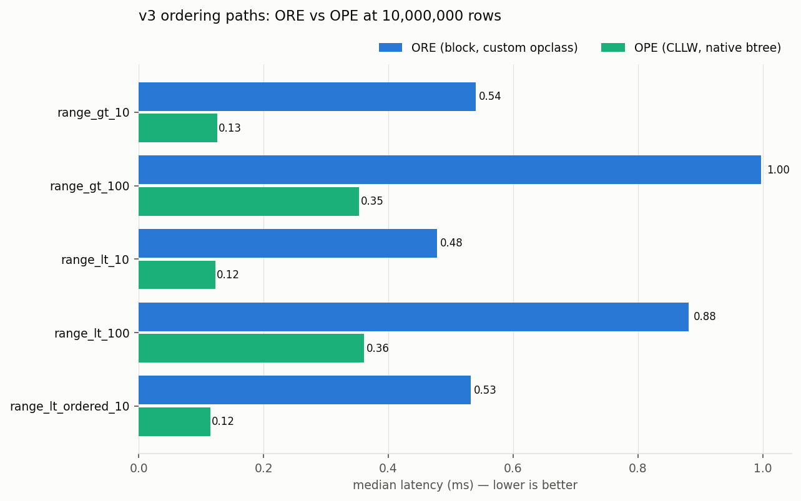

# EQL v3 vs v2.3 — Benchmark Comparison

Auto-generated by `report_v3_compare.py` (`mise run report:v3-compare`).

Regression threshold: v3 slower by more than **10%** on a semantics-equivalent scenario.

Methodology notes:

- EQL v3 is installed from the pinned release bundle **eql-3.0.0-alpha.3** (`mise run setup-db-v3`). alpha.3 places the per-domain types in `public.*` (`public.text_search`, `public.integer_ord`, `public.json`, …); the raw-jsonb SEM extractors live in `eql_v3_internal`, and the benches call only the public `eql_v3.*` wrappers.
- **Re-baseline status:** the **JSON** tiers (10k–10M) were re-ingested and re-run against alpha.3. The **non-JSON** v3 scenarios below are still the pre-release alpha.2-equivalent measurements and are pending a full alpha.3 re-baseline — treat their absolute numbers accordingly.
- v3 payloads are produced by `eql-bindings::from_v2` over the pinned cipherstash-client's v2.3 output (the supported migration path); conversion cost is inside the measured ingest path.
- The JSON bench queries the encrypted document through the named EQL JSON functions — `eql_v3.jsonb_contains` (GIN over `eql_v3.jsonb_array(value)`) for containment and `eql_v3.jsonb_path_query_first(value, selector)` feeding `eql_v3.eq_term` / `eql_v3.ore_cllw` for field equality/ordering — not raw `jsonb` `@>` / `->`.
- v3 query parameters are stored-shape payloads (no v3 scalar query wire shape exists); server-side timings are unaffected.
- The v3 string column (`text_search`) carries an ORE term v2's unique+match config did not — v3 string rows are wider.
- OPE ciphertexts are real CLLW-OPE terms emitted by cipherstash-client 0.38.1 (Index::new_ope); ordering parity against decrypted plaintext is asserted at bench startup.
- v2 numbers are the committed baseline results (`results/query/`, `results/ingest/`); v3 numbers come from `results/query/v3/`, `results/ingest/v3/`. The baseline was measured in May; same-day v2 re-measurement (2026-07-04) shows ±8-19% cross-session drift at the 10M tier, so 10M flags were re-adjudicated against same-day v2 — see the per-row notes.

## Query scenarios: v3 vs v2

119 comparable scenario/tier pairs — **4 regressions**, 21 improvements beyond ±10%.

| Scenario | Tier | v2 median | v3 median | Δ | Flag | Note |
|---|---|---|---|---|---|---|
| JSON/json/field_eq/extractor | 1000000 | 463.3 µs | 71.94 ms | +15427.6% | ⚠️ semantics changed | v2 stevec_query GIN → v3 jsonb_contains; every-row-needle plan instability (see notes) |
| JSON/json/field_eq/extractor | 100000 | 466.7 µs | 6.12 ms | +1210.5% | ⚠️ semantics changed | v2 stevec_query GIN → v3 jsonb_contains; every-row-needle plan instability (see notes) |
| JSON/json/field_eq/extractor | 10000 | 496.8 µs | 789.1 µs | +58.8% | ⚠️ semantics changed | v2 stevec_query GIN → v3 jsonb_contains; every-row-needle plan instability (see notes) |
| COMBO/combo/bloom_ore_order_limit | 10000 | 286.9 µs | 440.7 µs | +53.6% | ⚠️ semantics changed | v2 LIKE → v3 @> |
| JSON/json/field_eq/extractor | 10000000 | 418.3 µs | 637.9 µs | +52.5% | ⚠️ semantics changed | v2 stevec_query GIN → v3 jsonb_contains; every-row-needle plan instability (see notes) |
| COMBO/combo/top_n_filtered_group_by | 10000 | 178.4 µs | 244.3 µs | +36.9% | ⚠️ semantics changed | v2 LIKE → v3 @> |
| COMBO/combo/filtered_group_by | 10000 | 178.5 µs | 230.2 µs | +28.9% | ⚠️ semantics changed | v2 LIKE → v3 @> |
| MATCH/match/eql_cast_firstname | 10000 | 152.3 µs | 190.1 µs | +24.8% | ⚠️ semantics changed | v2 LIKE → v3 @> (no LIKE operator in v3; same bloom semantics) |
| JSON/json/contains/functional | 10000000 | 848.3 µs | 1.05 ms | +23.3% | 🔴 REGRESSION | same jsonb_array GIN recipe as v2; 10M delta is posting-list/data-shape |
| COMBO/combo/filtered_group_by | 100000 | 665.2 µs | 783.0 µs | +17.7% | ⚠️ semantics changed | v2 LIKE → v3 @> |
| EXACT/exact/eql_hash | 1000000 | 104.6 µs | 122.1 µs | +16.8% | ⚠️ semantics changed | index type changed: v2 hash → v3 btree on eq_term |
| EXACT/exact/eql_hash | 10000000 | 106.9 µs | 122.8 µs | +14.9% | ⚠️ semantics changed | index type changed: v2 hash → v3 btree on eq_term |
| MATCH/match/eql_cast_lastname | 10000 | 439.7 µs | 504.9 µs | +14.8% | ⚠️ semantics changed | v2 LIKE → v3 @> (no LIKE operator in v3; same bloom semantics) |
| EXACT/exact/eql_cast | 10000000 | 110.3 µs | 126.6 µs | +14.8% | 🔴 REGRESSION | 10M flag adjudicated as baseline drift: v3 is 3.3% FASTER than same-day v2 |
| GROUP_BY/group_by/low_cardinality_groups_encrypted | 10000000 | 775.51 ms | 887.48 ms | +14.4% | 🔴 REGRESSION | 10M flag adjudicated as baseline drift: +6.4% vs same-day v2 |
| EXACT/exact/eql_hash | 100000 | 102.9 µs | 116.4 µs | +13.1% | ⚠️ semantics changed | index type changed: v2 hash → v3 btree on eq_term |
| EXACT/exact/eql_hash | 10000 | 108.7 µs | 121.8 µs | +12.1% | ⚠️ semantics changed | index type changed: v2 hash → v3 btree on eq_term |
| GROUP_BY/group_by/top_n_groups_encrypted | 10000000 | 809.18 ms | 901.04 ms | +11.4% | 🔴 REGRESSION | 10M flag adjudicated as baseline drift: parity (-0.7%) vs same-day v2 |
| MATCH/match/eql_cast_lastname | 100000 | 1.79 ms | 2.00 ms | +11.3% | ⚠️ semantics changed | v2 LIKE → v3 @> (no LIKE operator in v3; same bloom semantics) |
| MATCH/match/eql_bloom | 100000 | 1.75 ms | 1.92 ms | +9.7% |  | v3 GIN uses native array_ops on the bloom term (no shipped opclass) |
| MATCH/match/eql_cast_lastname | 1000000 | 14.40 ms | 15.73 ms | +9.2% | ⚠️ semantics changed | v2 LIKE → v3 @> (no LIKE operator in v3; same bloom semantics) |
| MATCH/match/eql_bloom | 1000000 | 14.47 ms | 15.71 ms | +8.6% |  | v3 GIN uses native array_ops on the bloom term (no shipped opclass) |
| ORE/ore/range_lt_ordered_10 | 100000 | 502.4 µs | 543.5 µs | +8.2% |  |  |
| EXACT/exact/eql_cast | 1000000 | 115.1 µs | 124.1 µs | +7.8% |  | 10M flag adjudicated as baseline drift: v3 is 3.3% FASTER than same-day v2 |
| EXACT/exact/eql_cast | 10000 | 119.3 µs | 128.5 µs | +7.7% |  | 10M flag adjudicated as baseline drift: v3 is 3.3% FASTER than same-day v2 |
| MATCH/match/eql_bloom | 10000 | 405.4 µs | 436.4 µs | +7.6% |  | v3 GIN uses native array_ops on the bloom term (no shipped opclass) |
| JSON/json/field_eq/functional | 1000000 | 105.8 µs | 113.3 µs | +7.1% |  | same btree plan as v2 (needle matches every row in both versions) |
| JSON/json/field_eq/functional | 10000 | 104.8 µs | 111.8 µs | +6.7% |  | same btree plan as v2 (needle matches every row in both versions) |
| JSON/json/field_eq/functional | 100000 | 107.4 µs | 114.3 µs | +6.5% |  | same btree plan as v2 (needle matches every row in both versions) |
| ORE/ore/range_lt_ordered_10 | 10000 | 480.9 µs | 510.5 µs | +6.1% |  |  |
| GROUP_BY/group_by/low_cardinality_groups_plaintext | 100000 | 9.03 ms | 9.57 ms | +6.0% |  |  |
| MATCH/match_decrypt/eql_bloom | 100000 | 25.70 ms | 27.17 ms | +5.7% |  |  |
| GROUP_BY/group_by/top_n_groups_plaintext | 100000 | 9.43 ms | 9.96 ms | +5.6% |  |  |
| JSON/json/field_eq/bare | 100000 | 106.8 µs | 112.7 µs | +5.6% |  | same btree plan as v2 (needle matches every row in both versions) |
| EXACT/exact_decrypt/eql_hash | 10000000 | 23.59 ms | 24.83 ms | +5.3% | ⚠️ semantics changed | index type changed: v2 hash → v3 btree on eq_term |
| ORE/ore/range_lt_ordered_10 | 10000000 | 513.3 µs | 532.0 µs | +3.6% |  |  |
| MATCH/match_decrypt/eql_cast_firstname | 10000 | 24.26 ms | 25.11 ms | +3.5% | ⚠️ semantics changed | v2 LIKE → v3 @> |
| EXACT/exact_decrypt/eql_hash | 100000 | 23.94 ms | 24.67 ms | +3.0% | ⚠️ semantics changed | index type changed: v2 hash → v3 btree on eq_term |
| EXACT/exact_decrypt/eql_cast | 10000000 | 24.10 ms | 24.78 ms | +2.8% |  |  |
| JSON/json/field_eq/bare | 1000000 | 109.0 µs | 112.0 µs | +2.7% |  | same btree plan as v2 (needle matches every row in both versions) |
| GROUP_BY/group_by/top_n_groups_plaintext | 10000 | 1.20 ms | 1.23 ms | +2.7% |  |  |
| JSON/json/field_eq/bare | 10000 | 109.3 µs | 111.9 µs | +2.4% |  | same btree plan as v2 (needle matches every row in both versions) |
| ORE/ore_decrypt/range_gt_10 | 10000000 | 25.44 ms | 26.00 ms | +2.2% |  |  |
| MATCH/match/eql_cast_firstname | 100000 | 633.3 µs | 645.8 µs | +2.0% | ⚠️ semantics changed | v2 LIKE → v3 @> (no LIKE operator in v3; same bloom semantics) |
| EXACT/exact_decrypt/eql_cast | 10000 | 24.06 ms | 24.53 ms | +2.0% |  |  |
| EXACT/exact_decrypt/eql_hash | 1000000 | 23.64 ms | 24.08 ms | +1.9% | ⚠️ semantics changed | index type changed: v2 hash → v3 btree on eq_term |
| GROUP_BY/group_by/low_cardinality_groups_plaintext | 10000 | 1.16 ms | 1.18 ms | +1.9% |  |  |
| MATCH/match_decrypt/eql_cast_firstname | 100000 | 26.41 ms | 26.86 ms | +1.7% | ⚠️ semantics changed | v2 LIKE → v3 @> |
| GROUP_BY/group_by/low_cardinality_groups_plaintext | 10000000 | 339.33 ms | 344.48 ms | +1.5% |  |  |
| GROUP_BY/group_by/top_n_groups_plaintext | 10000000 | 349.91 ms | 354.84 ms | +1.4% |  |  |
| EXACT/exact/eql_cast | 100000 | 113.5 µs | 114.8 µs | +1.1% |  | 10M flag adjudicated as baseline drift: v3 is 3.3% FASTER than same-day v2 |
| EXACT/exact_decrypt/eql_cast | 1000000 | 23.88 ms | 24.13 ms | +1.0% |  |  |
| ORE/ore/range_lt_ordered_10 | 1000000 | 513.2 µs | 518.5 µs | +1.0% |  |  |
| EXACT/exact_decrypt/eql_cast | 100000 | 24.08 ms | 24.30 ms | +0.9% |  |  |
| ORE/ore_decrypt/range_lt_ordered_10 | 1000000 | 26.86 ms | 26.81 ms | -0.2% |  |  |
| COMBO/combo/bloom_ore_order_limit | 100000 | 2.08 ms | 2.08 ms | -0.3% | ⚠️ semantics changed | v2 LIKE → v3 @> |
| MATCH/match_decrypt/eql_cast_lastname | 10000 | 26.13 ms | 25.94 ms | -0.7% | ⚠️ semantics changed | v2 LIKE → v3 @> |
| ORE/ore_decrypt/range_gt_10 | 100000 | 25.72 ms | 25.53 ms | -0.7% |  |  |
| MATCH/match_decrypt/eql_cast_lastname | 100000 | 27.84 ms | 27.51 ms | -1.2% | ⚠️ semantics changed | v2 LIKE → v3 @> |
| EXACT/exact_decrypt/eql_hash | 10000 | 23.96 ms | 23.64 ms | -1.3% | ⚠️ semantics changed | index type changed: v2 hash → v3 btree on eq_term |
| COMBO/combo/top_n_filtered_group_by | 1000000 | 5.29 ms | 5.20 ms | -1.6% | ⚠️ semantics changed | v2 LIKE → v3 @> |
| MATCH/match_decrypt/eql_bloom | 10000 | 26.41 ms | 25.98 ms | -1.6% |  |  |
| ORE/ore_decrypt/range_lt_10 | 1000000 | 26.97 ms | 26.52 ms | -1.7% |  |  |
| GROUP_BY/group_by/top_n_groups_encrypted | 100000 | 20.28 ms | 19.90 ms | -1.9% |  | 10M flag adjudicated as baseline drift: parity (-0.7%) vs same-day v2 |
| ORE/ore_decrypt/range_lt_ordered_10 | 10000000 | 26.82 ms | 26.24 ms | -2.2% |  |  |
| JSON/json/contains/functional | 10000 | 237.4 µs | 231.6 µs | -2.4% |  | same jsonb_array GIN recipe as v2; 10M delta is posting-list/data-shape |
| JSON/json/contains/functional | 1000000 | 431.5 µs | 420.5 µs | -2.6% |  | same jsonb_array GIN recipe as v2; 10M delta is posting-list/data-shape |
| MATCH/match_decrypt/eql_cast_lastname | 1000000 | 39.48 ms | 38.34 ms | -2.9% | ⚠️ semantics changed | v2 LIKE → v3 @> |
| GROUP_BY/group_by/top_n_groups_plaintext | 1000000 | 40.21 ms | 38.59 ms | -4.0% |  |  |
| ORE/ore_decrypt/range_gt_10 | 1000000 | 27.04 ms | 25.93 ms | -4.1% |  |  |
| MATCH/match_decrypt/eql_cast_firstname | 1000000 | 30.42 ms | 29.09 ms | -4.4% | ⚠️ semantics changed | v2 LIKE → v3 @> |
| MATCH/match_decrypt/eql_bloom | 1000000 | 39.93 ms | 38.11 ms | -4.6% |  |  |
| GROUP_BY/group_by/low_cardinality_groups_encrypted | 10000 | 2.22 ms | 2.11 ms | -4.8% |  | 10M flag adjudicated as baseline drift: +6.4% vs same-day v2 |
| GROUP_BY/group_by/low_cardinality_groups_plaintext | 1000000 | 39.05 ms | 37.14 ms | -4.9% |  |  |
| GROUP_BY/group_by/low_cardinality_groups_encrypted | 100000 | 20.24 ms | 19.16 ms | -5.3% |  | 10M flag adjudicated as baseline drift: +6.4% vs same-day v2 |
| ORE/ore_decrypt/range_lt_100 | 10000 | 46.05 ms | 42.75 ms | -7.2% |  |  |
| ORE/ore_decrypt/range_lt_ordered_10 | 10000 | 28.42 ms | 26.33 ms | -7.4% |  |  |
| ORE/ore_decrypt/range_lt_10 | 10000000 | 28.15 ms | 26.06 ms | -7.4% |  |  |
| JSON/json/field_order/functional | 10000000 | 367.6 µs | 339.6 µs | -7.6% |  |  |
| ORE/ore_decrypt/range_gt_100 | 10000 | 46.26 ms | 42.70 ms | -7.7% |  |  |
| ORE/ore_decrypt/range_gt_10 | 10000 | 29.35 ms | 27.06 ms | -7.8% |  |  |
| GROUP_BY/group_by/top_n_groups_encrypted | 1000000 | 93.01 ms | 85.63 ms | -7.9% |  | 10M flag adjudicated as baseline drift: parity (-0.7%) vs same-day v2 |
| ORE/ore/range_gt_10 | 100000 | 573.5 µs | 525.8 µs | -8.3% |  |  |
| ORE/ore_decrypt/range_lt_100 | 1000000 | 45.47 ms | 41.65 ms | -8.4% |  |  |
| ORE/ore_decrypt/range_lt_10 | 10000 | 28.88 ms | 26.32 ms | -8.9% |  |  |
| ORE/ore/range_gt_10 | 10000000 | 598.2 µs | 539.8 µs | -9.8% |  |  |
| GROUP_BY/group_by/top_n_groups_encrypted | 10000 | 2.30 ms | 2.07 ms | -10.0% |  | 10M flag adjudicated as baseline drift: parity (-0.7%) vs same-day v2 |
| JSON/json/field_order/functional | 100000 | 306.2 µs | 274.8 µs | -10.3% | 🟢 improvement |  |
| GROUP_BY/group_by/low_cardinality_groups_encrypted | 1000000 | 92.57 ms | 83.05 ms | -10.3% | 🟢 improvement | 10M flag adjudicated as baseline drift: +6.4% vs same-day v2 |
| JSON/json/field_eq/functional | 10000000 | 108.8 µs | 97.0 µs | -10.8% | 🟢 improvement | same btree plan as v2 (needle matches every row in both versions) |
| JSON/json/field_eq/bare | 10000000 | 108.7 µs | 96.7 µs | -11.0% | 🟢 improvement | same btree plan as v2 (needle matches every row in both versions) |
| JSON/json/contains/functional | 100000 | 279.9 µs | 248.8 µs | -11.1% | 🟢 improvement | same jsonb_array GIN recipe as v2; 10M delta is posting-list/data-shape |
| MATCH/match/eql_cast_firstname | 1000000 | 3.68 ms | 3.26 ms | -11.3% | ⚠️ semantics changed | v2 LIKE → v3 @> (no LIKE operator in v3; same bloom semantics) |
| ORE/ore_decrypt/range_lt_10 | 100000 | 29.44 ms | 26.08 ms | -11.4% |  |  |
| ORE/ore_decrypt/range_lt_ordered_10 | 100000 | 29.32 ms | 25.49 ms | -13.0% |  |  |
| ORE/ore/range_lt_10 | 1000000 | 577.0 µs | 494.6 µs | -14.3% | 🟢 improvement |  |
| COMBO/combo/bloom_ore_order_limit | 1000000 | 16.64 ms | 14.13 ms | -15.1% | ⚠️ semantics changed | v2 LIKE → v3 @> |
| COMBO/combo/filtered_group_by | 1000000 | 6.40 ms | 5.28 ms | -17.4% | ⚠️ semantics changed | v2 LIKE → v3 @> |
| ORE/ore_decrypt/range_gt_100 | 100000 | 42.13 ms | 33.94 ms | -19.4% |  |  |
| JSON/json/field_order/functional | 10000 | 317.9 µs | 253.3 µs | -20.3% | 🟢 improvement |  |
| ORE/ore/range_gt_10 | 10000 | 624.6 µs | 497.5 µs | -20.3% | 🟢 improvement |  |
| ORE/ore_decrypt/range_lt_100 | 10000000 | 46.70 ms | 36.93 ms | -20.9% |  |  |
| ORE/ore/range_gt_10 | 1000000 | 694.1 µs | 542.8 µs | -21.8% | 🟢 improvement |  |
| ORE/ore_decrypt/range_gt_100 | 10000000 | 47.88 ms | 37.38 ms | -21.9% |  |  |
| ORE/ore_decrypt/range_gt_100 | 1000000 | 47.06 ms | 36.18 ms | -23.1% |  |  |
| ORE/ore/range_lt_10 | 10000 | 595.5 µs | 455.6 µs | -23.5% | 🟢 improvement |  |
| ORE/ore/range_lt_10 | 100000 | 655.1 µs | 496.4 µs | -24.2% | 🟢 improvement |  |
| JSON/json/field_order/functional | 1000000 | 356.7 µs | 267.9 µs | -24.9% | 🟢 improvement |  |
| COMBO/combo/top_n_filtered_group_by | 100000 | 1.03 ms | 771.8 µs | -25.3% | ⚠️ semantics changed | v2 LIKE → v3 @> |
| ORE/ore_decrypt/range_lt_100 | 100000 | 46.19 ms | 33.61 ms | -27.2% |  |  |
| ORE/ore/range_lt_10 | 10000000 | 748.8 µs | 477.9 µs | -36.2% | 🟢 improvement |  |
| ORE/ore/range_gt_100 | 10000000 | 4.04 ms | 996.5 µs | -75.3% | 🟢 improvement |  |
| ORE/ore/range_lt_100 | 100000 | 3.87 ms | 932.2 µs | -75.9% | 🟢 improvement |  |
| ORE/ore/range_gt_100 | 100000 | 4.16 ms | 972.5 µs | -76.6% | 🟢 improvement |  |
| ORE/ore/range_gt_100 | 10000 | 4.04 ms | 934.7 µs | -76.9% | 🟢 improvement |  |
| ORE/ore/range_lt_100 | 10000 | 3.93 ms | 907.0 µs | -76.9% | 🟢 improvement |  |
| ORE/ore/range_gt_100 | 1000000 | 4.10 ms | 926.7 µs | -77.4% | 🟢 improvement |  |
| ORE/ore/range_lt_100 | 1000000 | 4.06 ms | 889.4 µs | -78.1% | 🟢 improvement |  |
| ORE/ore/range_lt_100 | 10000000 | 4.15 ms | 880.5 µs | -78.8% | 🟢 improvement |  |

## v3-only scenarios (no v2 counterpart)

| Scenario | Median |
|---|---|
| MATCH/match/eql_bloom_noindex/10000 | 56.79 ms |
| MATCH/match/eql_cast_firstname_noindex/10000 | 187.08 ms |
| MATCH/match/eql_cast_lastname_noindex/10000 | 55.16 ms |
| OPE/ope/range_gt_10/10000 | 122.5 µs |
| OPE/ope/range_gt_10/100000 | 123.5 µs |
| OPE/ope/range_gt_10/1000000 | 117.6 µs |
| OPE/ope/range_gt_10/10000000 | 126.4 µs |
| OPE/ope/range_gt_100/10000 | 353.4 µs |
| OPE/ope/range_gt_100/100000 | 652.1 µs |
| OPE/ope/range_gt_100/1000000 | 351.1 µs |
| OPE/ope/range_gt_100/10000000 | 352.5 µs |
| OPE/ope/range_lt_10/10000 | 120.5 µs |
| OPE/ope/range_lt_10/100000 | 126.5 µs |
| OPE/ope/range_lt_10/1000000 | 128.0 µs |
| OPE/ope/range_lt_10/10000000 | 123.2 µs |
| OPE/ope/range_lt_100/10000 | 358.8 µs |
| OPE/ope/range_lt_100/100000 | 3.31 ms |
| OPE/ope/range_lt_100/1000000 | 367.8 µs |
| OPE/ope/range_lt_100/10000000 | 360.7 µs |
| OPE/ope/range_lt_ordered_10/10000 | 116.9 µs |
| OPE/ope/range_lt_ordered_10/100000 | 120.3 µs |
| OPE/ope/range_lt_ordered_10/1000000 | 118.4 µs |
| OPE/ope/range_lt_ordered_10/10000000 | 115.2 µs |
| OPE/ope_decrypt/range_gt_10/10000 | 25.29 ms |
| OPE/ope_decrypt/range_gt_10/100000 | 26.62 ms |
| OPE/ope_decrypt/range_gt_10/1000000 | 25.96 ms |
| OPE/ope_decrypt/range_gt_10/10000000 | 25.98 ms |
| OPE/ope_decrypt/range_gt_100/10000 | 39.47 ms |
| OPE/ope_decrypt/range_gt_100/100000 | 34.20 ms |
| OPE/ope_decrypt/range_gt_100/1000000 | 35.34 ms |
| OPE/ope_decrypt/range_gt_100/10000000 | 36.08 ms |
| OPE/ope_decrypt/range_lt_10/10000 | 25.18 ms |
| OPE/ope_decrypt/range_lt_10/100000 | 25.95 ms |
| OPE/ope_decrypt/range_lt_10/1000000 | 25.67 ms |
| OPE/ope_decrypt/range_lt_10/10000000 | 25.85 ms |
| OPE/ope_decrypt/range_lt_100/10000 | 35.34 ms |
| OPE/ope_decrypt/range_lt_100/100000 | 31.30 ms |
| OPE/ope_decrypt/range_lt_100/1000000 | 33.58 ms |
| OPE/ope_decrypt/range_lt_100/10000000 | 36.43 ms |
| OPE/ope_decrypt/range_lt_ordered_10/10000 | 25.32 ms |
| OPE/ope_decrypt/range_lt_ordered_10/100000 | 25.87 ms |
| OPE/ope_decrypt/range_lt_ordered_10/1000000 | 25.98 ms |
| OPE/ope_decrypt/range_lt_ordered_10/10000000 | 26.07 ms |
| PLAINTEXT/plaintext/exact_eq/10000 | 94.1 µs |
| PLAINTEXT/plaintext/exact_eq/100000 | 93.6 µs |
| PLAINTEXT/plaintext/exact_eq/1000000 | 93.9 µs |
| PLAINTEXT/plaintext/exact_eq/10000000 | 92.9 µs |
| PLAINTEXT/plaintext/json_contains/10000 | 109.7 µs |
| PLAINTEXT/plaintext/json_contains/100000 | 227.7 µs |
| PLAINTEXT/plaintext/json_contains/1000000 | 289.8 µs |
| PLAINTEXT/plaintext/json_contains/10000000 | 147.6 µs |
| PLAINTEXT/plaintext/json_field_eq/10000 | 212.8 µs |
| PLAINTEXT/plaintext/json_field_eq/100000 | 219.4 µs |
| PLAINTEXT/plaintext/json_field_eq/1000000 | 275.0 µs |
| PLAINTEXT/plaintext/json_field_eq/10000000 | 147.7 µs |
| PLAINTEXT/plaintext/range_gt_10/10000 | 95.6 µs |
| PLAINTEXT/plaintext/range_gt_10/100000 | 86.7 µs |
| PLAINTEXT/plaintext/range_gt_10/1000000 | 91.7 µs |
| PLAINTEXT/plaintext/range_gt_10/10000000 | 89.0 µs |
| PLAINTEXT/plaintext/range_lt_ordered_10/10000 | 99.9 µs |
| PLAINTEXT/plaintext/range_lt_ordered_10/100000 | 100.8 µs |
| PLAINTEXT/plaintext/range_lt_ordered_10/1000000 | 99.9 µs |
| PLAINTEXT/plaintext/range_lt_ordered_10/10000000 | 95.9 µs |
| SMOKE_V3/smoke/bigint_ord/range_gt_10/10000 | 772.0 µs |
| SMOKE_V3/smoke/bigint_ord/range_gt_ordered_10/10000 | 571.9 µs |
| SMOKE_V3/smoke/boolean/select_back/10000 | 97.5 µs |
| SMOKE_V3/smoke/date_ord/range_gt_10/10000 | 1.45 ms |
| SMOKE_V3/smoke/date_ord/range_gt_ordered_10/10000 | 1.32 ms |
| SMOKE_V3/smoke/double_ord/range_gt_10/10000 | 1.06 ms |
| SMOKE_V3/smoke/double_ord/range_gt_ordered_10/10000 | 603.6 µs |
| SMOKE_V3/smoke/numeric_ord/range_gt_10/10000 | 1.01 ms |
| SMOKE_V3/smoke/numeric_ord/range_gt_ordered_10/10000 | 746.3 µs |
| SMOKE_V3/smoke/timestamp_ord/range_gt_10/10000 | 939.6 µs |
| SMOKE_V3/smoke/timestamp_ord/range_gt_ordered_10/10000 | 665.8 µs |

## Index engagement audit (v3 plans)

Scenarios matching an expected-index rule must show a non-empty `indexes_used` in their EXPLAIN capture.

| Scenario | Indexes used | Rows | Status |
|---|---|---|---|
| COMBO/combo/bloom_ore_order_limit/10000 | combo_encrypted_v3_10000_name_match_gin_index | 4 |  |
| COMBO/combo/bloom_ore_order_limit/100000 | combo_encrypted_v3_100000_name_match_gin_index | 10 |  |
| COMBO/combo/bloom_ore_order_limit/1000000 | combo_encrypted_v3_1000000_name_match_gin_index | 10 |  |
| COMBO/combo/filtered_group_by/10000 | combo_encrypted_v3_10000_name_match_gin_index | 4 |  |
| COMBO/combo/filtered_group_by/100000 | combo_encrypted_v3_100000_name_match_gin_index | 51 |  |
| COMBO/combo/filtered_group_by/1000000 | combo_encrypted_v3_1000000_name_match_gin_index | 237 |  |
| COMBO/combo/top_n_filtered_group_by/10000 | combo_encrypted_v3_10000_name_match_gin_index | 4 |  |
| COMBO/combo/top_n_filtered_group_by/100000 | combo_encrypted_v3_100000_name_match_gin_index | 10 |  |
| COMBO/combo/top_n_filtered_group_by/1000000 | combo_encrypted_v3_1000000_name_match_gin_index | 10 |  |
| EXACT/exact/eql_cast/10000 | string_encrypted_v3_10000_eq_btree_index | 1 | ✅ |
| EXACT/exact/eql_cast/100000 | string_encrypted_v3_100000_eq_btree_index | 1 | ✅ |
| EXACT/exact/eql_cast/1000000 | string_encrypted_v3_1000000_eq_btree_index | 1 | ✅ |
| EXACT/exact/eql_cast/10000000 | string_encrypted_v3_10000000_eq_btree_index | 1 | ✅ |
| EXACT/exact/eql_hash/10000 | string_encrypted_v3_10000_eq_btree_index | 1 | ✅ |
| EXACT/exact/eql_hash/100000 | string_encrypted_v3_100000_eq_btree_index | 1 | ✅ |
| EXACT/exact/eql_hash/1000000 | string_encrypted_v3_1000000_eq_btree_index | 1 | ✅ |
| EXACT/exact/eql_hash/10000000 | string_encrypted_v3_10000000_eq_btree_index | 1 | ✅ |
| GROUP_BY/group_by/low_cardinality_groups_encrypted/10000 | — | 1 |  |
| GROUP_BY/group_by/low_cardinality_groups_encrypted/100000 | — | 1 |  |
| GROUP_BY/group_by/low_cardinality_groups_encrypted/1000000 | — | 1 |  |
| GROUP_BY/group_by/low_cardinality_groups_encrypted/10000000 | — | 1 |  |
| GROUP_BY/group_by/low_cardinality_groups_plaintext/10000 | — | 1 |  |
| GROUP_BY/group_by/low_cardinality_groups_plaintext/100000 | — | 1 |  |
| GROUP_BY/group_by/low_cardinality_groups_plaintext/1000000 | — | 1 |  |
| GROUP_BY/group_by/low_cardinality_groups_plaintext/10000000 | — | 1 |  |
| GROUP_BY/group_by/top_n_groups_encrypted/10000 | — | 10 |  |
| GROUP_BY/group_by/top_n_groups_encrypted/100000 | — | 10 |  |
| GROUP_BY/group_by/top_n_groups_encrypted/1000000 | — | 10 |  |
| GROUP_BY/group_by/top_n_groups_encrypted/10000000 | — | 10 |  |
| GROUP_BY/group_by/top_n_groups_plaintext/10000 | — | 10 |  |
| GROUP_BY/group_by/top_n_groups_plaintext/100000 | — | 10 |  |
| GROUP_BY/group_by/top_n_groups_plaintext/1000000 | — | 10 |  |
| GROUP_BY/group_by/top_n_groups_plaintext/10000000 | — | 10 |  |
| JSON/json/contains/functional/10000 | json_ste_vec_small_encrypted_v3_10000_jsonb_array_index | 1 | ✅ |
| JSON/json/contains/functional/100000 | json_ste_vec_small_encrypted_v3_100000_jsonb_array_index | 1 | ✅ |
| JSON/json/contains/functional/1000000 | json_ste_vec_small_encrypted_v3_1000000_jsonb_array_index | 1 | ✅ |
| JSON/json/contains/functional/10000000 | json_ste_vec_small_encrypted_v3_10000000_jsonb_array_index | 1 | ✅ |
| JSON/json/field_eq/bare/10000 | json_ste_vec_small_encrypted_v3_10000_field_eq_idx | 10 | ✅ |
| JSON/json/field_eq/bare/100000 | json_ste_vec_small_encrypted_v3_100000_field_eq_idx | 10 | ✅ |
| JSON/json/field_eq/bare/1000000 | json_ste_vec_small_encrypted_v3_1000000_field_eq_idx | 10 | ✅ |
| JSON/json/field_eq/bare/10000000 | json_ste_vec_small_encrypted_v3_10000000_field_eq_idx | 10 | ✅ |
| JSON/json/field_eq/extractor/10000 | — | 10 |  |
| JSON/json/field_eq/extractor/100000 | — | 10 |  |
| JSON/json/field_eq/extractor/1000000 | — | 10 |  |
| JSON/json/field_eq/extractor/10000000 | — | 10 |  |
| JSON/json/field_eq/functional/10000 | json_ste_vec_small_encrypted_v3_10000_field_eq_idx | 10 | ✅ |
| JSON/json/field_eq/functional/100000 | json_ste_vec_small_encrypted_v3_100000_field_eq_idx | 10 | ✅ |
| JSON/json/field_eq/functional/1000000 | json_ste_vec_small_encrypted_v3_1000000_field_eq_idx | 10 | ✅ |
| JSON/json/field_eq/functional/10000000 | json_ste_vec_small_encrypted_v3_10000000_field_eq_idx | 10 | ✅ |
| JSON/json/field_gt/functional/10000 | json_ste_vec_small_encrypted_v3_10000_field_order_idx | 10 |  |
| JSON/json/field_gt/functional/100000 | json_ste_vec_small_encrypted_v3_100000_field_order_idx | 10 |  |
| JSON/json/field_gt/functional/1000000 | json_ste_vec_small_encrypted_v3_1000000_field_order_idx | 10 |  |
| JSON/json/field_gt/functional/10000000 | json_ste_vec_small_encrypted_v3_10000000_field_order_idx | 10 |  |
| JSON/json/field_order/functional/10000 | json_ste_vec_small_encrypted_v3_10000_field_order_idx | 10 | ✅ |
| JSON/json/field_order/functional/100000 | json_ste_vec_small_encrypted_v3_100000_field_order_idx | 10 | ✅ |
| JSON/json/field_order/functional/1000000 | json_ste_vec_small_encrypted_v3_1000000_field_order_idx | 10 | ✅ |
| JSON/json/field_order/functional/10000000 | json_ste_vec_small_encrypted_v3_10000000_field_order_idx | 10 | ✅ |
| MATCH/match/eql_bloom/10000 | string_encrypted_v3_10000_match_gin_index | 10 | ✅ |
| MATCH/match/eql_bloom/100000 | string_encrypted_v3_100000_match_gin_index | 10 | ✅ |
| MATCH/match/eql_bloom/1000000 | string_encrypted_v3_1000000_match_gin_index | 10 | ✅ |
| MATCH/match/eql_bloom_noindex/10000 | — | 10 |  |
| MATCH/match/eql_cast_firstname/10000 | string_encrypted_v3_10000_match_gin_index | 4 | ✅ |
| MATCH/match/eql_cast_firstname/100000 | string_encrypted_v3_100000_match_gin_index | 10 | ✅ |
| MATCH/match/eql_cast_firstname/1000000 | string_encrypted_v3_1000000_match_gin_index | 10 | ✅ |
| MATCH/match/eql_cast_firstname_noindex/10000 | — | 4 |  |
| MATCH/match/eql_cast_lastname/10000 | string_encrypted_v3_10000_match_gin_index | 10 | ✅ |
| MATCH/match/eql_cast_lastname/100000 | string_encrypted_v3_100000_match_gin_index | 10 | ✅ |
| MATCH/match/eql_cast_lastname/1000000 | string_encrypted_v3_1000000_match_gin_index | 10 | ✅ |
| MATCH/match/eql_cast_lastname_noindex/10000 | — | 10 |  |
| OPE/ope/range_gt_10/10000 | — | 10 |  |
| OPE/ope/range_gt_10/100000 | — | 10 |  |
| OPE/ope/range_gt_10/1000000 | — | 10 |  |
| OPE/ope/range_gt_10/10000000 | — | 10 |  |
| OPE/ope/range_gt_100/10000 | — | 100 |  |
| OPE/ope/range_gt_100/100000 | — | 100 |  |
| OPE/ope/range_gt_100/1000000 | — | 100 |  |
| OPE/ope/range_gt_100/10000000 | — | 100 |  |
| OPE/ope/range_lt_10/10000 | — | 10 |  |
| OPE/ope/range_lt_10/100000 | — | 10 |  |
| OPE/ope/range_lt_10/1000000 | — | 10 |  |
| OPE/ope/range_lt_10/10000000 | — | 10 |  |
| OPE/ope/range_lt_100/10000 | — | 100 |  |
| OPE/ope/range_lt_100/100000 | — | 100 |  |
| OPE/ope/range_lt_100/1000000 | — | 100 |  |
| OPE/ope/range_lt_100/10000000 | — | 100 |  |
| OPE/ope/range_lt_ordered_10/10000 | integer_encrypted_ope_v3_10000_ope_index | 10 | ✅ |
| OPE/ope/range_lt_ordered_10/100000 | integer_encrypted_ope_v3_100000_ope_index | 10 | ✅ |
| OPE/ope/range_lt_ordered_10/1000000 | integer_encrypted_ope_v3_1000000_ope_index | 10 | ✅ |
| OPE/ope/range_lt_ordered_10/10000000 | integer_encrypted_ope_v3_10000000_ope_index | 10 | ✅ |
| ORE/ore/range_gt_10/10000 | integer_encrypted_v3_10000_ord_index | 10 |  |
| ORE/ore/range_gt_10/100000 | integer_encrypted_v3_100000_ord_index | 10 |  |
| ORE/ore/range_gt_10/1000000 | integer_encrypted_v3_1000000_ord_index | 10 |  |
| ORE/ore/range_gt_10/10000000 | integer_encrypted_v3_10000000_ord_index | 10 |  |
| ORE/ore/range_gt_100/10000 | integer_encrypted_v3_10000_ord_index | 100 |  |
| ORE/ore/range_gt_100/100000 | integer_encrypted_v3_100000_ord_index | 100 |  |
| ORE/ore/range_gt_100/1000000 | integer_encrypted_v3_1000000_ord_index | 100 |  |
| ORE/ore/range_gt_100/10000000 | integer_encrypted_v3_10000000_ord_index | 100 |  |
| ORE/ore/range_lt_10/10000 | integer_encrypted_v3_10000_ord_index | 10 |  |
| ORE/ore/range_lt_10/100000 | integer_encrypted_v3_100000_ord_index | 10 |  |
| ORE/ore/range_lt_10/1000000 | integer_encrypted_v3_1000000_ord_index | 10 |  |
| ORE/ore/range_lt_10/10000000 | integer_encrypted_v3_10000000_ord_index | 10 |  |
| ORE/ore/range_lt_100/10000 | integer_encrypted_v3_10000_ord_index | 100 |  |
| ORE/ore/range_lt_100/100000 | integer_encrypted_v3_100000_ord_index | 100 |  |
| ORE/ore/range_lt_100/1000000 | integer_encrypted_v3_1000000_ord_index | 100 |  |
| ORE/ore/range_lt_100/10000000 | integer_encrypted_v3_10000000_ord_index | 100 |  |
| ORE/ore/range_lt_ordered_10/10000 | integer_encrypted_v3_10000_ord_index | 10 | ✅ |
| ORE/ore/range_lt_ordered_10/100000 | integer_encrypted_v3_100000_ord_index | 10 | ✅ |
| ORE/ore/range_lt_ordered_10/1000000 | integer_encrypted_v3_1000000_ord_index | 10 | ✅ |
| ORE/ore/range_lt_ordered_10/10000000 | integer_encrypted_v3_10000000_ord_index | 10 | ✅ |
| PLAINTEXT/plaintext/exact_eq/10000 | string_plaintext_10000_value_idx | 1 |  |
| PLAINTEXT/plaintext/exact_eq/100000 | string_plaintext_100000_value_idx | 1 |  |
| PLAINTEXT/plaintext/exact_eq/1000000 | string_plaintext_1000000_value_idx | 1 |  |
| PLAINTEXT/plaintext/exact_eq/10000000 | string_plaintext_10000000_value_idx | 1 |  |
| PLAINTEXT/plaintext/json_contains/10000 | json_small_plaintext_10000_gin_idx | 10 |  |
| PLAINTEXT/plaintext/json_contains/100000 | — | 10 |  |
| PLAINTEXT/plaintext/json_contains/1000000 | — | 10 |  |
| PLAINTEXT/plaintext/json_contains/10000000 | — | 10 |  |
| PLAINTEXT/plaintext/json_field_eq/10000 | — | 10 |  |
| PLAINTEXT/plaintext/json_field_eq/100000 | — | 10 |  |
| PLAINTEXT/plaintext/json_field_eq/1000000 | — | 10 |  |
| PLAINTEXT/plaintext/json_field_eq/10000000 | — | 10 |  |
| PLAINTEXT/plaintext/range_gt_10/10000 | — | 10 |  |
| PLAINTEXT/plaintext/range_gt_10/100000 | — | 10 |  |
| PLAINTEXT/plaintext/range_gt_10/1000000 | — | 10 |  |
| PLAINTEXT/plaintext/range_gt_10/10000000 | — | 10 |  |
| PLAINTEXT/plaintext/range_lt_ordered_10/10000 | integer_plaintext_10000_value_idx | 10 |  |
| PLAINTEXT/plaintext/range_lt_ordered_10/100000 | integer_plaintext_100000_value_idx | 10 |  |
| PLAINTEXT/plaintext/range_lt_ordered_10/1000000 | integer_plaintext_1000000_value_idx | 10 |  |
| PLAINTEXT/plaintext/range_lt_ordered_10/10000000 | integer_plaintext_10000000_value_idx | 10 |  |
| SMOKE_V3/smoke/bigint_ord/range_gt_10/10000 | — | 10 |  |
| SMOKE_V3/smoke/bigint_ord/range_gt_ordered_10/10000 | scalar_smoke_v3_bigint_val_ord_idx | 10 | ✅ |
| SMOKE_V3/smoke/date_ord/range_gt_10/10000 | — | 10 |  |
| SMOKE_V3/smoke/date_ord/range_gt_ordered_10/10000 | scalar_smoke_v3_date_val_ord_idx | 10 | ✅ |
| SMOKE_V3/smoke/double_ord/range_gt_10/10000 | — | 10 |  |
| SMOKE_V3/smoke/double_ord/range_gt_ordered_10/10000 | scalar_smoke_v3_double_val_ord_idx | 10 | ✅ |
| SMOKE_V3/smoke/numeric_ord/range_gt_10/10000 | — | 10 |  |
| SMOKE_V3/smoke/numeric_ord/range_gt_ordered_10/10000 | scalar_smoke_v3_numeric_val_ord_idx | 10 | ✅ |
| SMOKE_V3/smoke/timestamp_ord/range_gt_10/10000 | — | 10 |  |
| SMOKE_V3/smoke/timestamp_ord/range_gt_ordered_10/10000 | scalar_smoke_v3_timestamp_val_ord_idx | 10 | ✅ |

## Ingest throughput: v3 vs v2

| Bench | Records | v2 rec/s | v3 rec/s | Δ | Note |
|---|---|---|---|---|---|
| encrypt_category_v3 | 500 | — | 665 | |  |
| encrypt_category_v3 | 1,000 | — | 3,672 | |  |
| encrypt_category_v3 | 10,000 | — | 10,965 | |  |
| encrypt_int_ope_v3 | 500 | — | 988 | | real CLLW-OPE op terms (cipherstash-client 0.38.1, Index::new_ope) |
| encrypt_int_ope_v3 | 1,000 | — | 3,582 | |  |
| encrypt_int_ope_v3 | 10,000 | — | 10,933 | |  |
| encrypt_int_v3 | 500 | 699 | 419 | -40.1% |  |
| encrypt_int_v3 | 1,000 | 1,587 | 1,479 | -6.8% |  |
| encrypt_int_v3 | 10,000 | 2,127 | 2,076 | -2.4% |  |
| encrypt_ste_vec_small_v3 | 500 | — | 318 | |  |
| encrypt_ste_vec_small_v3 | 1,000 | — | 2,384 | |  |
| encrypt_ste_vec_small_v3 | 10,000 | 4,032 | 4,475 | +11.0% |  |
| encrypt_string_v3 | 500 | 966 | 318 | -67.1% | NOT a conversion regression: v3's only eq+match text domain (text_search) also REQUIRES the ORE term, so the config adds Index::new_ore() that v2's unique+match didn't carry — string ingest is capped at ORE-generation speed. A v3 hm+bf-only domain would restore v2 throughput. |
| encrypt_string_v3 | 1,000 | 3,989 | 1,016 | -74.5% |  |
| encrypt_string_v3 | 10,000 | 9,649 | 1,265 | -86.9% |  |

## Index build times

| Table | Build seconds | Recorded |
|---|---|---|
| string_encrypted_v3_10000 | 1 | 2026-07-03T13:10:14Z |
| integer_encrypted_v3_10000 | 1 | 2026-07-03T13:10:22Z |
| integer_encrypted_ope_v3_10000 | 0 | 2026-07-03T13:10:25Z |
| category_encrypted_v3_10000 | 0 | 2026-07-03T13:10:27Z |
| combo_encrypted_v3_10000 | 1 | 2026-07-03T13:10:42Z |
| json_ste_vec_small_encrypted_v3_10000 | 1 | 2026-07-03T13:10:47Z |
| string_encrypted_v3_100000 | 8 | 2026-07-03T13:36:20Z |
| integer_encrypted_v3_100000 | 4 | 2026-07-03T13:38:54Z |
| integer_encrypted_ope_v3_100000 | 0 | 2026-07-03T13:40:47Z |
| category_encrypted_v3_100000 | 1 | 2026-07-03T13:42:37Z |
| combo_encrypted_v3_100000 | 7 | 2026-07-03T13:45:31Z |
| json_ste_vec_small_encrypted_v3_100000 | 6 | 2026-07-03T13:46:31Z |
| string_encrypted_v3_1000000 | 78 | 2026-07-03T14:05:03Z |
| integer_encrypted_v3_1000000 | 44 | 2026-07-03T14:15:06Z |
| integer_encrypted_ope_v3_1000000 | 1 | 2026-07-03T14:16:48Z |
| category_encrypted_v3_1000000 | 1 | 2026-07-03T14:19:32Z |
| combo_encrypted_v3_1000000 | 67 | 2026-07-03T14:42:01Z |
| json_ste_vec_small_encrypted_v3_1000000 | 55 | 2026-07-03T14:46:55Z |
| integer_encrypted_1000000 | 42 | 2026-07-04T00:55:25Z |
| json_ste_vec_small_encrypted_100000 | 15 | 2026-07-04T01:21:47Z |
| integer_encrypted_ope_v3_10000 | 0 | 2026-07-04T01:49:59Z |
| integer_encrypted_ope_v3_100000 | 0 | 2026-07-04T01:51:54Z |
| integer_encrypted_ope_v3_1000000 | 1 | 2026-07-04T01:54:49Z |
| integer_encrypted_ope_v3_10000000 | 8 | 2026-07-04T05:52:51Z |
| json_ste_vec_small_encrypted_v3_10000000 | 270 | 2026-07-04T06:31:25Z |
| integer_encrypted_v3_10000000 | 474 | 2026-07-04T07:55:44Z |
| string_encrypted_v3_10000000 | 896 | 2026-07-04T10:17:38Z |
| category_encrypted_v3_10000000 | 9 | 2026-07-04T12:11:35Z |
| category_encrypted_10000000 | 148 | 2026-07-04T12:34:08Z |
| string_encrypted_10000000 | 342 | 2026-07-04T12:54:54Z |

## Charts

