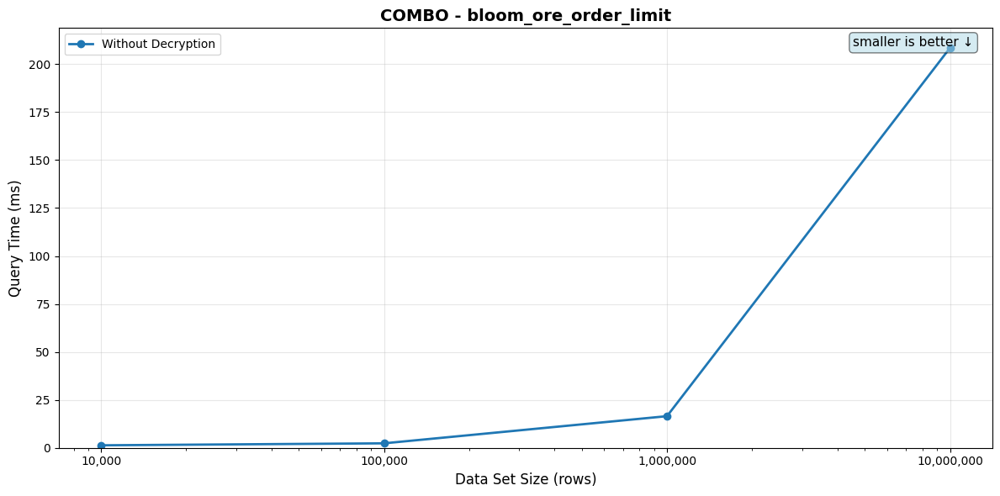
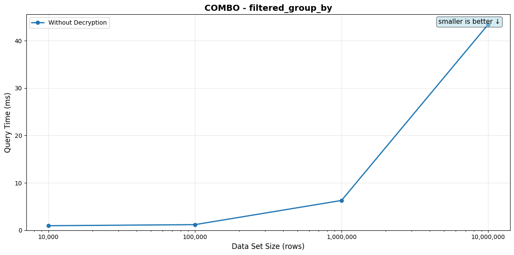
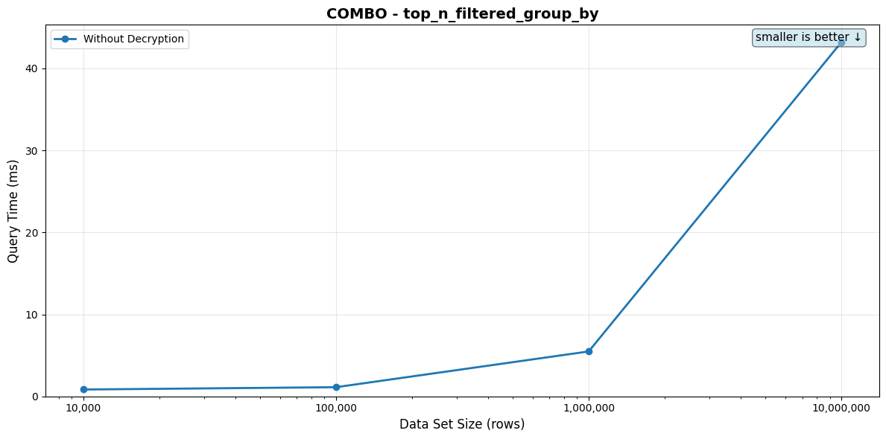

# COMBO Queries

[← Back to overview](./BENCHMARK_REPORT.md)

Per-tier query performance. Each scenario lists its SQL, the indexes available on the target table, the indexes the planner actually picked per tier, the timing table, and the full EXPLAIN plan in a collapsed block.

## bloom_ore_order_limit

**Description:** Composite predicate: filter by name pattern (bloom), order by age (ORE), limit 10

**SQL Query:**
```sql
SELECT id FROM {TABLE} WHERE name LIKE $1 ORDER BY eql_v2.ore_block_u64_8_256(age) LIMIT 10
```

**Parameter:** `Bob`

**Table: `combo_encrypted_{rows}` with three encrypted columns — `name` (match + hmac), `age` (ORE), `category` (hmac). Indexes: functional GIN on `eql_v2.bloom_filter(name)`, functional btree on `eql_v2.ore_block_u64_8_256(age)`, functional hash on `eql_v2.hmac_256(category)`. **The bloom GIN index engages for the LIKE predicate**, narrowing the input to ~0.01–0.1% of rows; the planner then sorts the small filtered set by `eql_v2.ore_block_u64_8_256(age)` and returns the top 10. The ORE btree doesn't engage here — PostgreSQL can't merge two unrelated indexes on different columns (bloom on `name`, btree on `age`), so the ORDER BY is satisfied by a Sort node above the Bitmap Heap Scan. With the bloom narrowing so aggressively, that Sort is cheap; the cost is dominated by the bloom + heap fetch.**

**Indexes available on the table:**
```sql
CREATE INDEX
combo_encrypted_10000_name_gin_index
ON combo_encrypted_10000 USING GIN (
    eql_v2.bloom_filter(name)
);

CREATE INDEX
combo_encrypted_10000_age_ore_index
ON combo_encrypted_10000 (
    eql_v2.ore_block_u64_8_256(age)
);

CREATE INDEX
combo_encrypted_10000_category_hash_index
ON combo_encrypted_10000 USING hash (
    eql_v2.hmac_256(category)
);
```

**Indexes used by the planner (per data set size):**

- 10,000: `combo_encrypted_10000_name_gin_index`
- 100,000: `combo_encrypted_100000_name_gin_index`
- 1,000,000: `combo_encrypted_1000000_name_gin_index`
- 10,000,000: `combo_encrypted_10000000_name_gin_index`

*⚠️ = Query time exceeds 100ms*

| Data Set Size | Rows Returned | Query Time (no decrypt) | Query Time (with decrypt) |
|---------------|---------------|-------------------------|---------------------------|
| 10,000 | 9 | 1.33ms | N/A |
| 100,000 | 10 | 2.36ms | N/A |
| 1,000,000 | 10 | 16.51ms | N/A |
| 10,000,000 | 10 | ⚠️ 208.49ms | N/A |

_Rows Returned is the actual count from a one-shot pre-bench execution. For LIMIT-bounded queries it matches the LIMIT (or is lower when the table doesn't have enough matching rows); for aggregates wrapped in `count(*)` it's 1._

<details>
<summary>EXPLAIN plans (per data set size)</summary>

**10,000 rows**

```
Limit
  Sort
    Bitmap Heap Scan on combo_encrypted_10000
      Bitmap Index Scan using combo_encrypted_10000_name_gin_index
```

Full `EXPLAIN (FORMAT JSON)`:

```json
[
  {
    "Plan": {
      "Async Capable": false,
      "Node Type": "Limit",
      "Parallel Aware": false,
      "Plan Rows": 1,
      "Plan Width": 36,
      "Plans": [
        {
          "Async Capable": false,
          "Node Type": "Sort",
          "Parallel Aware": false,
          "Parent Relationship": "Outer",
          "Plan Rows": 1,
          "Plan Width": 36,
          "Plans": [
            {
              "Alias": "combo_encrypted_10000",
              "Async Capable": false,
              "Node Type": "Bitmap Heap Scan",
              "Parallel Aware": false,
              "Parent Relationship": "Outer",
              "Plan Rows": 1,
              "Plan Width": 36,
              "Plans": [
                {
                  "Async Capable": false,
                  "Index Cond": "((eql_v2.bloom_filter(name))::smallint[] @> '{36,1603,1789,1164,10,1555}'::smallint[])",
                  "Index Name": "combo_encrypted_10000_name_gin_index",
                  "Node Type": "Bitmap Index Scan",
                  "Parallel Aware": false,
                  "Parent Relationship": "Outer",
                  "Plan Rows": 1,
                  "Plan Width": 0,
                  "Startup Cost": 0.0,
                  "Total Cost": 56.22
                }
              ],
              "Recheck Cond": "((eql_v2.bloom_filter(name))::smallint[] @> '{36,1603,1789,1164,10,1555}'::smallint[])",
              "Relation Name": "combo_encrypted_10000",
              "Startup Cost": 56.22,
              "Total Cost": 60.73
            }
          ],
          "Sort Key": [
            "(eql_v2.ore_block_u64_8_256(age))"
          ],
          "Startup Cost": 60.74,
          "Total Cost": 60.75
        }
      ],
      "Startup Cost": 60.74,
      "Total Cost": 60.75
    }
  }
]
```

**100,000 rows**

```
Limit
  Sort
    Bitmap Heap Scan on combo_encrypted_100000
      Bitmap Index Scan using combo_encrypted_100000_name_gin_index
```

Full `EXPLAIN (FORMAT JSON)`:

```json
[
  {
    "Plan": {
      "Async Capable": false,
      "Node Type": "Limit",
      "Parallel Aware": false,
      "Plan Rows": 1,
      "Plan Width": 36,
      "Plans": [
        {
          "Async Capable": false,
          "Node Type": "Sort",
          "Parallel Aware": false,
          "Parent Relationship": "Outer",
          "Plan Rows": 1,
          "Plan Width": 36,
          "Plans": [
            {
              "Alias": "combo_encrypted_100000",
              "Async Capable": false,
              "Node Type": "Bitmap Heap Scan",
              "Parallel Aware": false,
              "Parent Relationship": "Outer",
              "Plan Rows": 1,
              "Plan Width": 36,
              "Plans": [
                {
                  "Async Capable": false,
                  "Index Cond": "((eql_v2.bloom_filter(name))::smallint[] @> '{1554,453,1393,1033,91,461}'::smallint[])",
                  "Index Name": "combo_encrypted_100000_name_gin_index",
                  "Node Type": "Bitmap Index Scan",
                  "Parallel Aware": false,
                  "Parent Relationship": "Outer",
                  "Plan Rows": 1,
                  "Plan Width": 0,
                  "Startup Cost": 0.0,
                  "Total Cost": 93.35
                }
              ],
              "Recheck Cond": "((eql_v2.bloom_filter(name))::smallint[] @> '{1554,453,1393,1033,91,461}'::smallint[])",
              "Relation Name": "combo_encrypted_100000",
              "Startup Cost": 93.35,
              "Total Cost": 97.86
            }
          ],
          "Sort Key": [
            "(eql_v2.ore_block_u64_8_256(age))"
          ],
          "Startup Cost": 97.87,
          "Total Cost": 97.87
        }
      ],
      "Startup Cost": 97.87,
      "Total Cost": 97.87
    }
  }
]
```

**1,000,000 rows**

```
Limit
  Sort
    Bitmap Heap Scan on combo_encrypted_1000000
      Bitmap Index Scan using combo_encrypted_1000000_name_gin_index
```

Full `EXPLAIN (FORMAT JSON)`:

```json
[
  {
    "Plan": {
      "Async Capable": false,
      "Node Type": "Limit",
      "Parallel Aware": false,
      "Plan Rows": 1,
      "Plan Width": 36,
      "Plans": [
        {
          "Async Capable": false,
          "Node Type": "Sort",
          "Parallel Aware": false,
          "Parent Relationship": "Outer",
          "Plan Rows": 1,
          "Plan Width": 36,
          "Plans": [
            {
              "Alias": "combo_encrypted_1000000",
              "Async Capable": false,
              "Node Type": "Bitmap Heap Scan",
              "Parallel Aware": false,
              "Parent Relationship": "Outer",
              "Plan Rows": 1,
              "Plan Width": 36,
              "Plans": [
                {
                  "Async Capable": false,
                  "Index Cond": "((eql_v2.bloom_filter(name))::smallint[] @> '{453,91,1033,1393,461,1554}'::smallint[])",
                  "Index Name": "combo_encrypted_1000000_name_gin_index",
                  "Node Type": "Bitmap Index Scan",
                  "Parallel Aware": false,
                  "Parent Relationship": "Outer",
                  "Plan Rows": 1,
                  "Plan Width": 0,
                  "Startup Cost": 0.0,
                  "Total Cost": 311.97
                }
              ],
              "Recheck Cond": "((eql_v2.bloom_filter(name))::smallint[] @> '{453,91,1033,1393,461,1554}'::smallint[])",
              "Relation Name": "combo_encrypted_1000000",
              "Startup Cost": 311.97,
              "Total Cost": 316.48
            }
          ],
          "Sort Key": [
            "(eql_v2.ore_block_u64_8_256(age))"
          ],
          "Startup Cost": 316.49,
          "Total Cost": 316.5
        }
      ],
      "Startup Cost": 316.49,
      "Total Cost": 316.5
    }
  }
]
```

**10,000,000 rows**

```
Limit
  Sort
    Bitmap Heap Scan on combo_encrypted_10000000
      Bitmap Index Scan using combo_encrypted_10000000_name_gin_index
```

Full `EXPLAIN (FORMAT JSON)`:

```json
[
  {
    "Plan": {
      "Async Capable": false,
      "Node Type": "Limit",
      "Parallel Aware": false,
      "Plan Rows": 1,
      "Plan Width": 36,
      "Plans": [
        {
          "Async Capable": false,
          "Node Type": "Sort",
          "Parallel Aware": false,
          "Parent Relationship": "Outer",
          "Plan Rows": 1,
          "Plan Width": 36,
          "Plans": [
            {
              "Alias": "combo_encrypted_10000000",
              "Async Capable": false,
              "Node Type": "Bitmap Heap Scan",
              "Parallel Aware": false,
              "Parent Relationship": "Outer",
              "Plan Rows": 1,
              "Plan Width": 36,
              "Plans": [
                {
                  "Async Capable": false,
                  "Index Cond": "((eql_v2.bloom_filter(name))::smallint[] @> '{1164,1789,10,1603,1555,36}'::smallint[])",
                  "Index Name": "combo_encrypted_10000000_name_gin_index",
                  "Node Type": "Bitmap Index Scan",
                  "Parallel Aware": false,
                  "Parent Relationship": "Outer",
                  "Plan Rows": 1,
                  "Plan Width": 0,
                  "Startup Cost": 0.0,
                  "Total Cost": 2296.1
                }
              ],
              "Recheck Cond": "((eql_v2.bloom_filter(name))::smallint[] @> '{1164,1789,10,1603,1555,36}'::smallint[])",
              "Relation Name": "combo_encrypted_10000000",
              "Startup Cost": 2296.1,
              "Total Cost": 2300.61
            }
          ],
          "Sort Key": [
            "(eql_v2.ore_block_u64_8_256(age))"
          ],
          "Startup Cost": 2300.62,
          "Total Cost": 2300.62
        }
      ],
      "Startup Cost": 2300.62,
      "Total Cost": 2300.62
    }
  }
]
```

</details>



## filtered_group_by

**Description:** Composite predicate: filter by name pattern, GROUP BY category

**SQL Query:**
```sql
SELECT eql_v2.hmac_256(category), count(*) FROM {TABLE} WHERE name LIKE $1 GROUP BY 1
```

**Parameter:** `Bob`

**Table: `combo_encrypted_{rows}`. Query: `SELECT eql_v2.hmac_256(category), count(*) FROM tbl WHERE name LIKE $1 GROUP BY 1`. Bloom filter on `name` filters the input set; HashAggregate then groups the small post-filter set by the 32-byte category HMAC. With ~0.01-0.1% of names matching a typical bloom pattern and 250 category buckets, the aggregate stage is essentially free — the cost is bloom filter scan plus per-matching-row HMAC.**

**Indexes available on the table:**
```sql
CREATE INDEX
combo_encrypted_10000_name_gin_index
ON combo_encrypted_10000 USING GIN (
    eql_v2.bloom_filter(name)
);

CREATE INDEX
combo_encrypted_10000_age_ore_index
ON combo_encrypted_10000 (
    eql_v2.ore_block_u64_8_256(age)
);

CREATE INDEX
combo_encrypted_10000_category_hash_index
ON combo_encrypted_10000 USING hash (
    eql_v2.hmac_256(category)
);
```

**Indexes used by the planner (per data set size):**

- 10,000: `combo_encrypted_10000_name_gin_index`
- 100,000: `combo_encrypted_100000_name_gin_index`
- 1,000,000: `combo_encrypted_1000000_name_gin_index`
- 10,000,000: `combo_encrypted_10000000_name_gin_index`

| Data Set Size | Rows Returned | Query Time (no decrypt) | Query Time (with decrypt) |
|---------------|---------------|-------------------------|---------------------------|
| 10,000 | 9 | 954.55μs | N/A |
| 100,000 | 63 | 1.18ms | N/A |
| 1,000,000 | 227 | 6.29ms | N/A |
| 10,000,000 | 250 | 43.43ms | N/A |

_Rows Returned is the actual count from a one-shot pre-bench execution. For LIMIT-bounded queries it matches the LIMIT (or is lower when the table doesn't have enough matching rows); for aggregates wrapped in `count(*)` it's 1._

<details>
<summary>EXPLAIN plans (per data set size)</summary>

**10,000 rows**

```
Aggregate (Sorted)
  Sort
    Bitmap Heap Scan on combo_encrypted_10000
      Bitmap Index Scan using combo_encrypted_10000_name_gin_index
```

Full `EXPLAIN (FORMAT JSON)`:

```json
[
  {
    "Plan": {
      "Async Capable": false,
      "Group Key": [
        "((((category).data ->> 'hm'::text))::eql_v2.hmac_256)"
      ],
      "Node Type": "Aggregate",
      "Parallel Aware": false,
      "Partial Mode": "Simple",
      "Plan Rows": 1,
      "Plan Width": 40,
      "Plans": [
        {
          "Async Capable": false,
          "Node Type": "Sort",
          "Parallel Aware": false,
          "Parent Relationship": "Outer",
          "Plan Rows": 1,
          "Plan Width": 32,
          "Plans": [
            {
              "Alias": "combo_encrypted_10000",
              "Async Capable": false,
              "Node Type": "Bitmap Heap Scan",
              "Parallel Aware": false,
              "Parent Relationship": "Outer",
              "Plan Rows": 1,
              "Plan Width": 32,
              "Plans": [
                {
                  "Async Capable": false,
                  "Index Cond": "((eql_v2.bloom_filter(name))::smallint[] @> '{1164,10,1555,1789,1603,36}'::smallint[])",
                  "Index Name": "combo_encrypted_10000_name_gin_index",
                  "Node Type": "Bitmap Index Scan",
                  "Parallel Aware": false,
                  "Parent Relationship": "Outer",
                  "Plan Rows": 1,
                  "Plan Width": 0,
                  "Startup Cost": 0.0,
                  "Total Cost": 56.22
                }
              ],
              "Recheck Cond": "((eql_v2.bloom_filter(name))::smallint[] @> '{1164,10,1555,1789,1603,36}'::smallint[])",
              "Relation Name": "combo_encrypted_10000",
              "Startup Cost": 56.22,
              "Total Cost": 60.49
            }
          ],
          "Sort Key": [
            "((((category).data ->> 'hm'::text))::eql_v2.hmac_256)"
          ],
          "Startup Cost": 60.5,
          "Total Cost": 60.5
        }
      ],
      "Startup Cost": 60.5,
      "Strategy": "Sorted",
      "Total Cost": 60.52
    }
  }
]
```

**100,000 rows**

```
Aggregate (Sorted)
  Sort
    Bitmap Heap Scan on combo_encrypted_100000
      Bitmap Index Scan using combo_encrypted_100000_name_gin_index
```

Full `EXPLAIN (FORMAT JSON)`:

```json
[
  {
    "Plan": {
      "Async Capable": false,
      "Group Key": [
        "((((category).data ->> 'hm'::text))::eql_v2.hmac_256)"
      ],
      "Node Type": "Aggregate",
      "Parallel Aware": false,
      "Partial Mode": "Simple",
      "Plan Rows": 1,
      "Plan Width": 40,
      "Plans": [
        {
          "Async Capable": false,
          "Node Type": "Sort",
          "Parallel Aware": false,
          "Parent Relationship": "Outer",
          "Plan Rows": 1,
          "Plan Width": 32,
          "Plans": [
            {
              "Alias": "combo_encrypted_100000",
              "Async Capable": false,
              "Node Type": "Bitmap Heap Scan",
              "Parallel Aware": false,
              "Parent Relationship": "Outer",
              "Plan Rows": 1,
              "Plan Width": 32,
              "Plans": [
                {
                  "Async Capable": false,
                  "Index Cond": "((eql_v2.bloom_filter(name))::smallint[] @> '{1554,1033,453,461,91,1393}'::smallint[])",
                  "Index Name": "combo_encrypted_100000_name_gin_index",
                  "Node Type": "Bitmap Index Scan",
                  "Parallel Aware": false,
                  "Parent Relationship": "Outer",
                  "Plan Rows": 1,
                  "Plan Width": 0,
                  "Startup Cost": 0.0,
                  "Total Cost": 93.35
                }
              ],
              "Recheck Cond": "((eql_v2.bloom_filter(name))::smallint[] @> '{1554,1033,453,461,91,1393}'::smallint[])",
              "Relation Name": "combo_encrypted_100000",
              "Startup Cost": 93.35,
              "Total Cost": 97.61
            }
          ],
          "Sort Key": [
            "((((category).data ->> 'hm'::text))::eql_v2.hmac_256)"
          ],
          "Startup Cost": 97.62,
          "Total Cost": 97.63
        }
      ],
      "Startup Cost": 97.62,
      "Strategy": "Sorted",
      "Total Cost": 97.64
    }
  }
]
```

**1,000,000 rows**

```
Aggregate (Sorted)
  Sort
    Bitmap Heap Scan on combo_encrypted_1000000
      Bitmap Index Scan using combo_encrypted_1000000_name_gin_index
```

Full `EXPLAIN (FORMAT JSON)`:

```json
[
  {
    "Plan": {
      "Async Capable": false,
      "Group Key": [
        "((((category).data ->> 'hm'::text))::eql_v2.hmac_256)"
      ],
      "Node Type": "Aggregate",
      "Parallel Aware": false,
      "Partial Mode": "Simple",
      "Plan Rows": 1,
      "Plan Width": 40,
      "Plans": [
        {
          "Async Capable": false,
          "Node Type": "Sort",
          "Parallel Aware": false,
          "Parent Relationship": "Outer",
          "Plan Rows": 1,
          "Plan Width": 32,
          "Plans": [
            {
              "Alias": "combo_encrypted_1000000",
              "Async Capable": false,
              "Node Type": "Bitmap Heap Scan",
              "Parallel Aware": false,
              "Parent Relationship": "Outer",
              "Plan Rows": 1,
              "Plan Width": 32,
              "Plans": [
                {
                  "Async Capable": false,
                  "Index Cond": "((eql_v2.bloom_filter(name))::smallint[] @> '{461,1554,1393,91,453,1033}'::smallint[])",
                  "Index Name": "combo_encrypted_1000000_name_gin_index",
                  "Node Type": "Bitmap Index Scan",
                  "Parallel Aware": false,
                  "Parent Relationship": "Outer",
                  "Plan Rows": 1,
                  "Plan Width": 0,
                  "Startup Cost": 0.0,
                  "Total Cost": 311.97
                }
              ],
              "Recheck Cond": "((eql_v2.bloom_filter(name))::smallint[] @> '{461,1554,1393,91,453,1033}'::smallint[])",
              "Relation Name": "combo_encrypted_1000000",
              "Startup Cost": 311.97,
              "Total Cost": 316.24
            }
          ],
          "Sort Key": [
            "((((category).data ->> 'hm'::text))::eql_v2.hmac_256)"
          ],
          "Startup Cost": 316.25,
          "Total Cost": 316.25
        }
      ],
      "Startup Cost": 316.25,
      "Strategy": "Sorted",
      "Total Cost": 316.27
    }
  }
]
```

**10,000,000 rows**

```
Aggregate (Sorted)
  Sort
    Bitmap Heap Scan on combo_encrypted_10000000
      Bitmap Index Scan using combo_encrypted_10000000_name_gin_index
```

Full `EXPLAIN (FORMAT JSON)`:

```json
[
  {
    "Plan": {
      "Async Capable": false,
      "Group Key": [
        "((((category).data ->> 'hm'::text))::eql_v2.hmac_256)"
      ],
      "Node Type": "Aggregate",
      "Parallel Aware": false,
      "Partial Mode": "Simple",
      "Plan Rows": 1,
      "Plan Width": 40,
      "Plans": [
        {
          "Async Capable": false,
          "Node Type": "Sort",
          "Parallel Aware": false,
          "Parent Relationship": "Outer",
          "Plan Rows": 1,
          "Plan Width": 32,
          "Plans": [
            {
              "Alias": "combo_encrypted_10000000",
              "Async Capable": false,
              "Node Type": "Bitmap Heap Scan",
              "Parallel Aware": false,
              "Parent Relationship": "Outer",
              "Plan Rows": 1,
              "Plan Width": 32,
              "Plans": [
                {
                  "Async Capable": false,
                  "Index Cond": "((eql_v2.bloom_filter(name))::smallint[] @> '{1164,1789,1555,10,36,1603}'::smallint[])",
                  "Index Name": "combo_encrypted_10000000_name_gin_index",
                  "Node Type": "Bitmap Index Scan",
                  "Parallel Aware": false,
                  "Parent Relationship": "Outer",
                  "Plan Rows": 1,
                  "Plan Width": 0,
                  "Startup Cost": 0.0,
                  "Total Cost": 2296.1
                }
              ],
              "Recheck Cond": "((eql_v2.bloom_filter(name))::smallint[] @> '{1164,1789,1555,10,36,1603}'::smallint[])",
              "Relation Name": "combo_encrypted_10000000",
              "Startup Cost": 2296.1,
              "Total Cost": 2300.36
            }
          ],
          "Sort Key": [
            "((((category).data ->> 'hm'::text))::eql_v2.hmac_256)"
          ],
          "Startup Cost": 2300.37,
          "Total Cost": 2300.38
        }
      ],
      "Startup Cost": 2300.37,
      "Strategy": "Sorted",
      "Total Cost": 2300.39
    }
  }
]
```

</details>



## top_n_filtered_group_by

**Description:** Dashboard analytic: top 10 categories for customers matching a name pattern

**SQL Query:**
```sql
SELECT eql_v2.hmac_256(category), count(*) FROM {TABLE} WHERE name LIKE $1 GROUP BY 1 ORDER BY count(*) DESC LIMIT 10
```

**Parameter:** `Bob`

**Table: `combo_encrypted_{rows}`. Query: `SELECT eql_v2.hmac_256(category), count(*) FROM tbl WHERE name LIKE $1 GROUP BY 1 ORDER BY count(*) DESC LIMIT 10`. Same shape as `filtered_group_by` with an outer Top-N sort + LIMIT 10. Realistic analytics shape for surfacing the categories that contain the most customers matching a filter, without revealing the underlying names or category labels.**

**Indexes available on the table:**
```sql
CREATE INDEX
combo_encrypted_10000_name_gin_index
ON combo_encrypted_10000 USING GIN (
    eql_v2.bloom_filter(name)
);

CREATE INDEX
combo_encrypted_10000_age_ore_index
ON combo_encrypted_10000 (
    eql_v2.ore_block_u64_8_256(age)
);

CREATE INDEX
combo_encrypted_10000_category_hash_index
ON combo_encrypted_10000 USING hash (
    eql_v2.hmac_256(category)
);
```

**Indexes used by the planner (per data set size):**

- 10,000: `combo_encrypted_10000_name_gin_index`
- 100,000: `combo_encrypted_100000_name_gin_index`
- 1,000,000: `combo_encrypted_1000000_name_gin_index`
- 10,000,000: `combo_encrypted_10000000_name_gin_index`

| Data Set Size | Rows Returned | Query Time (no decrypt) | Query Time (with decrypt) |
|---------------|---------------|-------------------------|---------------------------|
| 10,000 | 9 | 837.68μs | N/A |
| 100,000 | 10 | 1.12ms | N/A |
| 1,000,000 | 10 | 5.48ms | N/A |
| 10,000,000 | 10 | 43.19ms | N/A |

_Rows Returned is the actual count from a one-shot pre-bench execution. For LIMIT-bounded queries it matches the LIMIT (or is lower when the table doesn't have enough matching rows); for aggregates wrapped in `count(*)` it's 1._

<details>
<summary>EXPLAIN plans (per data set size)</summary>

**10,000 rows**

```
Limit
  Sort
    Aggregate (Sorted)
      Sort
        Bitmap Heap Scan on combo_encrypted_10000
          Bitmap Index Scan using combo_encrypted_10000_name_gin_index
```

Full `EXPLAIN (FORMAT JSON)`:

```json
[
  {
    "Plan": {
      "Async Capable": false,
      "Node Type": "Limit",
      "Parallel Aware": false,
      "Plan Rows": 1,
      "Plan Width": 40,
      "Plans": [
        {
          "Async Capable": false,
          "Node Type": "Sort",
          "Parallel Aware": false,
          "Parent Relationship": "Outer",
          "Plan Rows": 1,
          "Plan Width": 40,
          "Plans": [
            {
              "Async Capable": false,
              "Group Key": [
                "((((category).data ->> 'hm'::text))::eql_v2.hmac_256)"
              ],
              "Node Type": "Aggregate",
              "Parallel Aware": false,
              "Parent Relationship": "Outer",
              "Partial Mode": "Simple",
              "Plan Rows": 1,
              "Plan Width": 40,
              "Plans": [
                {
                  "Async Capable": false,
                  "Node Type": "Sort",
                  "Parallel Aware": false,
                  "Parent Relationship": "Outer",
                  "Plan Rows": 1,
                  "Plan Width": 32,
                  "Plans": [
                    {
                      "Alias": "combo_encrypted_10000",
                      "Async Capable": false,
                      "Node Type": "Bitmap Heap Scan",
                      "Parallel Aware": false,
                      "Parent Relationship": "Outer",
                      "Plan Rows": 1,
                      "Plan Width": 32,
                      "Plans": [
                        {
                          "Async Capable": false,
                          "Index Cond": "((eql_v2.bloom_filter(name))::smallint[] @> '{36,1789,1603,1164,10,1555}'::smallint[])",
                          "Index Name": "combo_encrypted_10000_name_gin_index",
                          "Node Type": "Bitmap Index Scan",
                          "Parallel Aware": false,
                          "Parent Relationship": "Outer",
                          "Plan Rows": 1,
                          "Plan Width": 0,
                          "Startup Cost": 0.0,
                          "Total Cost": 56.22
                        }
                      ],
                      "Recheck Cond": "((eql_v2.bloom_filter(name))::smallint[] @> '{36,1789,1603,1164,10,1555}'::smallint[])",
                      "Relation Name": "combo_encrypted_10000",
                      "Startup Cost": 56.22,
                      "Total Cost": 60.49
                    }
                  ],
                  "Sort Key": [
                    "((((category).data ->> 'hm'::text))::eql_v2.hmac_256)"
                  ],
                  "Startup Cost": 60.5,
                  "Total Cost": 60.5
                }
              ],
              "Startup Cost": 60.5,
              "Strategy": "Sorted",
              "Total Cost": 60.52
            }
          ],
          "Sort Key": [
            "(count(*)) DESC"
          ],
          "Startup Cost": 60.53,
          "Total Cost": 60.53
        }
      ],
      "Startup Cost": 60.53,
      "Total Cost": 60.53
    }
  }
]
```

**100,000 rows**

```
Limit
  Sort
    Aggregate (Sorted)
      Sort
        Bitmap Heap Scan on combo_encrypted_100000
          Bitmap Index Scan using combo_encrypted_100000_name_gin_index
```

Full `EXPLAIN (FORMAT JSON)`:

```json
[
  {
    "Plan": {
      "Async Capable": false,
      "Node Type": "Limit",
      "Parallel Aware": false,
      "Plan Rows": 1,
      "Plan Width": 40,
      "Plans": [
        {
          "Async Capable": false,
          "Node Type": "Sort",
          "Parallel Aware": false,
          "Parent Relationship": "Outer",
          "Plan Rows": 1,
          "Plan Width": 40,
          "Plans": [
            {
              "Async Capable": false,
              "Group Key": [
                "((((category).data ->> 'hm'::text))::eql_v2.hmac_256)"
              ],
              "Node Type": "Aggregate",
              "Parallel Aware": false,
              "Parent Relationship": "Outer",
              "Partial Mode": "Simple",
              "Plan Rows": 1,
              "Plan Width": 40,
              "Plans": [
                {
                  "Async Capable": false,
                  "Node Type": "Sort",
                  "Parallel Aware": false,
                  "Parent Relationship": "Outer",
                  "Plan Rows": 1,
                  "Plan Width": 32,
                  "Plans": [
                    {
                      "Alias": "combo_encrypted_100000",
                      "Async Capable": false,
                      "Node Type": "Bitmap Heap Scan",
                      "Parallel Aware": false,
                      "Parent Relationship": "Outer",
                      "Plan Rows": 1,
                      "Plan Width": 32,
                      "Plans": [
                        {
                          "Async Capable": false,
                          "Index Cond": "((eql_v2.bloom_filter(name))::smallint[] @> '{91,453,1033,461,1393,1554}'::smallint[])",
                          "Index Name": "combo_encrypted_100000_name_gin_index",
                          "Node Type": "Bitmap Index Scan",
                          "Parallel Aware": false,
                          "Parent Relationship": "Outer",
                          "Plan Rows": 1,
                          "Plan Width": 0,
                          "Startup Cost": 0.0,
                          "Total Cost": 93.35
                        }
                      ],
                      "Recheck Cond": "((eql_v2.bloom_filter(name))::smallint[] @> '{91,453,1033,461,1393,1554}'::smallint[])",
                      "Relation Name": "combo_encrypted_100000",
                      "Startup Cost": 93.35,
                      "Total Cost": 97.61
                    }
                  ],
                  "Sort Key": [
                    "((((category).data ->> 'hm'::text))::eql_v2.hmac_256)"
                  ],
                  "Startup Cost": 97.62,
                  "Total Cost": 97.63
                }
              ],
              "Startup Cost": 97.62,
              "Strategy": "Sorted",
              "Total Cost": 97.64
            }
          ],
          "Sort Key": [
            "(count(*)) DESC"
          ],
          "Startup Cost": 97.65,
          "Total Cost": 97.66
        }
      ],
      "Startup Cost": 97.65,
      "Total Cost": 97.66
    }
  }
]
```

**1,000,000 rows**

```
Limit
  Sort
    Aggregate (Sorted)
      Sort
        Bitmap Heap Scan on combo_encrypted_1000000
          Bitmap Index Scan using combo_encrypted_1000000_name_gin_index
```

Full `EXPLAIN (FORMAT JSON)`:

```json
[
  {
    "Plan": {
      "Async Capable": false,
      "Node Type": "Limit",
      "Parallel Aware": false,
      "Plan Rows": 1,
      "Plan Width": 40,
      "Plans": [
        {
          "Async Capable": false,
          "Node Type": "Sort",
          "Parallel Aware": false,
          "Parent Relationship": "Outer",
          "Plan Rows": 1,
          "Plan Width": 40,
          "Plans": [
            {
              "Async Capable": false,
              "Group Key": [
                "((((category).data ->> 'hm'::text))::eql_v2.hmac_256)"
              ],
              "Node Type": "Aggregate",
              "Parallel Aware": false,
              "Parent Relationship": "Outer",
              "Partial Mode": "Simple",
              "Plan Rows": 1,
              "Plan Width": 40,
              "Plans": [
                {
                  "Async Capable": false,
                  "Node Type": "Sort",
                  "Parallel Aware": false,
                  "Parent Relationship": "Outer",
                  "Plan Rows": 1,
                  "Plan Width": 32,
                  "Plans": [
                    {
                      "Alias": "combo_encrypted_1000000",
                      "Async Capable": false,
                      "Node Type": "Bitmap Heap Scan",
                      "Parallel Aware": false,
                      "Parent Relationship": "Outer",
                      "Plan Rows": 1,
                      "Plan Width": 32,
                      "Plans": [
                        {
                          "Async Capable": false,
                          "Index Cond": "((eql_v2.bloom_filter(name))::smallint[] @> '{1033,453,91,1554,461,1393}'::smallint[])",
                          "Index Name": "combo_encrypted_1000000_name_gin_index",
                          "Node Type": "Bitmap Index Scan",
                          "Parallel Aware": false,
                          "Parent Relationship": "Outer",
                          "Plan Rows": 1,
                          "Plan Width": 0,
                          "Startup Cost": 0.0,
                          "Total Cost": 311.97
                        }
                      ],
                      "Recheck Cond": "((eql_v2.bloom_filter(name))::smallint[] @> '{1033,453,91,1554,461,1393}'::smallint[])",
                      "Relation Name": "combo_encrypted_1000000",
                      "Startup Cost": 311.97,
                      "Total Cost": 316.24
                    }
                  ],
                  "Sort Key": [
                    "((((category).data ->> 'hm'::text))::eql_v2.hmac_256)"
                  ],
                  "Startup Cost": 316.25,
                  "Total Cost": 316.25
                }
              ],
              "Startup Cost": 316.25,
              "Strategy": "Sorted",
              "Total Cost": 316.27
            }
          ],
          "Sort Key": [
            "(count(*)) DESC"
          ],
          "Startup Cost": 316.28,
          "Total Cost": 316.28
        }
      ],
      "Startup Cost": 316.28,
      "Total Cost": 316.28
    }
  }
]
```

**10,000,000 rows**

```
Limit
  Sort
    Aggregate (Sorted)
      Sort
        Bitmap Heap Scan on combo_encrypted_10000000
          Bitmap Index Scan using combo_encrypted_10000000_name_gin_index
```

Full `EXPLAIN (FORMAT JSON)`:

```json
[
  {
    "Plan": {
      "Async Capable": false,
      "Node Type": "Limit",
      "Parallel Aware": false,
      "Plan Rows": 1,
      "Plan Width": 40,
      "Plans": [
        {
          "Async Capable": false,
          "Node Type": "Sort",
          "Parallel Aware": false,
          "Parent Relationship": "Outer",
          "Plan Rows": 1,
          "Plan Width": 40,
          "Plans": [
            {
              "Async Capable": false,
              "Group Key": [
                "((((category).data ->> 'hm'::text))::eql_v2.hmac_256)"
              ],
              "Node Type": "Aggregate",
              "Parallel Aware": false,
              "Parent Relationship": "Outer",
              "Partial Mode": "Simple",
              "Plan Rows": 1,
              "Plan Width": 40,
              "Plans": [
                {
                  "Async Capable": false,
                  "Node Type": "Sort",
                  "Parallel Aware": false,
                  "Parent Relationship": "Outer",
                  "Plan Rows": 1,
                  "Plan Width": 32,
                  "Plans": [
                    {
                      "Alias": "combo_encrypted_10000000",
                      "Async Capable": false,
                      "Node Type": "Bitmap Heap Scan",
                      "Parallel Aware": false,
                      "Parent Relationship": "Outer",
                      "Plan Rows": 1,
                      "Plan Width": 32,
                      "Plans": [
                        {
                          "Async Capable": false,
                          "Index Cond": "((eql_v2.bloom_filter(name))::smallint[] @> '{1603,1555,10,1164,1789,36}'::smallint[])",
                          "Index Name": "combo_encrypted_10000000_name_gin_index",
                          "Node Type": "Bitmap Index Scan",
                          "Parallel Aware": false,
                          "Parent Relationship": "Outer",
                          "Plan Rows": 1,
                          "Plan Width": 0,
                          "Startup Cost": 0.0,
                          "Total Cost": 2296.1
                        }
                      ],
                      "Recheck Cond": "((eql_v2.bloom_filter(name))::smallint[] @> '{1603,1555,10,1164,1789,36}'::smallint[])",
                      "Relation Name": "combo_encrypted_10000000",
                      "Startup Cost": 2296.1,
                      "Total Cost": 2300.36
                    }
                  ],
                  "Sort Key": [
                    "((((category).data ->> 'hm'::text))::eql_v2.hmac_256)"
                  ],
                  "Startup Cost": 2300.37,
                  "Total Cost": 2300.38
                }
              ],
              "Startup Cost": 2300.37,
              "Strategy": "Sorted",
              "Total Cost": 2300.39
            }
          ],
          "Sort Key": [
            "(count(*)) DESC"
          ],
          "Startup Cost": 2300.4,
          "Total Cost": 2300.41
        }
      ],
      "Startup Cost": 2300.4,
      "Total Cost": 2300.41
    }
  }
]
```

</details>



