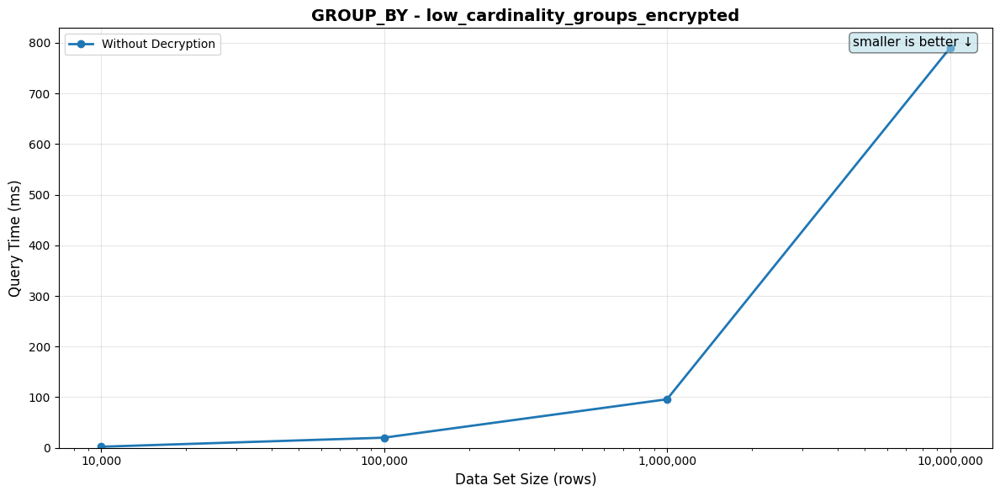
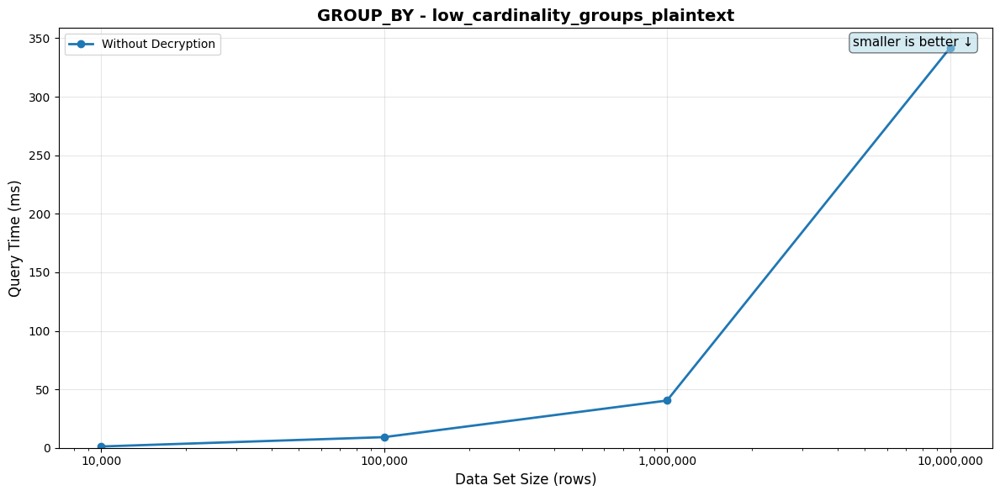
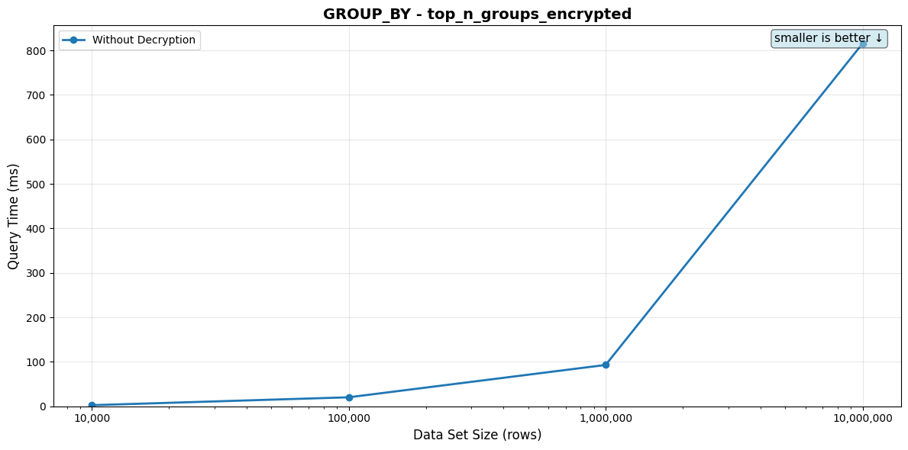
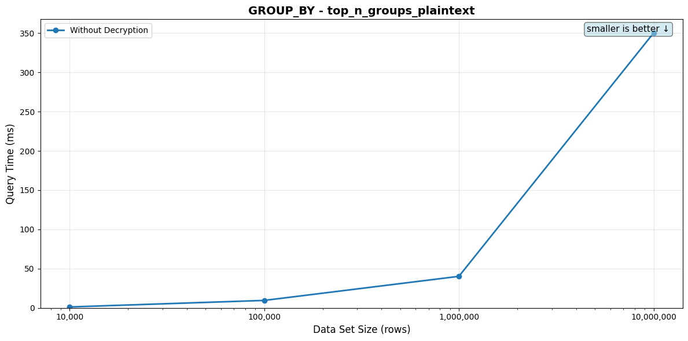

# GROUP_BY Queries

[← Back to overview](./BENCHMARK_REPORT.md)

Per-tier query performance. Each scenario lists its SQL, the indexes available on the target table, the indexes the planner actually picked per tier, the timing table, and the full EXPLAIN plan in a collapsed block.

## low_cardinality_groups_encrypted

**Description:** Low-cardinality GROUP BY (~250 buckets) on `eql_v2.hmac_256(value)`, wrapped in `count(*)` to isolate aggregation cost from emit cost

**SQL Query:**
```sql
SELECT count(*) FROM (SELECT 1 FROM {TABLE} GROUP BY eql_v2.hmac_256(value)) g
```

**Table: `category_encrypted_{rows}` with encrypted categorical values (`CAT_001`..`CAT_250`, uniform random — ~250 distinct buckets). The encrypted value carries an `hm` HMAC term via the `unique` search index. **Index: hash index on `eql_v2.hmac_256(value)`, but `GROUP BY` doesn't engage it directly** — the planner picks `HashAggregate`, building an in-memory hash table keyed on the 32-byte HMAC. With only 250 distinct keys the hash table fits comfortably in default `work_mem`. The outer `count(*)` keeps the result-set emission at exactly one row, so wall-clock time tracks aggregation cost. The companion `low_cardinality_groups_plaintext` scenario runs the same query shape against an unindexed TEXT column for a baseline.**

**Indexes available on the table:**
```sql
CREATE INDEX
category_encrypted_10000_hash_index
ON category_encrypted_10000 using hash (
    eql_v2.hmac_256(value)
);
```

**Indexes used by the planner (per data set size):**

- 10,000: _none — planner picked a sequential / hash-aggregate / sort plan_
- 100,000: _none — planner picked a sequential / hash-aggregate / sort plan_
- 1,000,000: _none — planner picked a sequential / hash-aggregate / sort plan_
- 10,000,000: _none — planner picked a sequential / hash-aggregate / sort plan_

*⚠️ = Query time exceeds 100ms*

| Data Set Size | Rows Returned | Query Time (no decrypt) | Query Time (with decrypt) |
|---------------|---------------|-------------------------|---------------------------|
| 10,000 | 1 | 2.21ms | N/A |
| 100,000 | 1 | 20.10ms | N/A |
| 1,000,000 | 1 | 95.95ms | N/A |
| 10,000,000 | 1 | ⚠️ 789.77ms | N/A |

_Rows Returned is the actual count from a one-shot pre-bench execution. For LIMIT-bounded queries it matches the LIMIT (or is lower when the table doesn't have enough matching rows); for aggregates wrapped in `count(*)` it's 1._

<details>
<summary>EXPLAIN plans (per data set size)</summary>

**10,000 rows**

```
Aggregate
  Aggregate (Hashed)
    Seq Scan on category_encrypted_10000
```

Full `EXPLAIN (FORMAT JSON)`:

```json
[
  {
    "Plan": {
      "Async Capable": false,
      "Node Type": "Aggregate",
      "Parallel Aware": false,
      "Partial Mode": "Simple",
      "Plan Rows": 1,
      "Plan Width": 8,
      "Plans": [
        {
          "Async Capable": false,
          "Group Key": [
            "(((category_encrypted_10000.value).data ->> 'hm'::text))::eql_v2.hmac_256"
          ],
          "Node Type": "Aggregate",
          "Parallel Aware": false,
          "Parent Relationship": "Outer",
          "Partial Mode": "Simple",
          "Plan Rows": 250,
          "Plan Width": 36,
          "Planned Partitions": 0,
          "Plans": [
            {
              "Alias": "category_encrypted_10000",
              "Async Capable": false,
              "Node Type": "Seq Scan",
              "Parallel Aware": false,
              "Parent Relationship": "Outer",
              "Plan Rows": 10000,
              "Plan Width": 32,
              "Relation Name": "category_encrypted_10000",
              "Startup Cost": 0.0,
              "Total Cost": 602.0
            }
          ],
          "Startup Cost": 627.0,
          "Strategy": "Hashed",
          "Total Cost": 630.12
        }
      ],
      "Startup Cost": 633.25,
      "Strategy": "Plain",
      "Total Cost": 633.26
    }
  }
]
```

**100,000 rows**

```
Aggregate
  Aggregate (Hashed)
    Seq Scan on category_encrypted_100000
```

Full `EXPLAIN (FORMAT JSON)`:

```json
[
  {
    "Plan": {
      "Async Capable": false,
      "Node Type": "Aggregate",
      "Parallel Aware": false,
      "Partial Mode": "Simple",
      "Plan Rows": 1,
      "Plan Width": 8,
      "Plans": [
        {
          "Async Capable": false,
          "Group Key": [
            "(((category_encrypted_100000.value).data ->> 'hm'::text))::eql_v2.hmac_256"
          ],
          "Node Type": "Aggregate",
          "Parallel Aware": false,
          "Parent Relationship": "Outer",
          "Partial Mode": "Simple",
          "Plan Rows": 250,
          "Plan Width": 36,
          "Planned Partitions": 0,
          "Plans": [
            {
              "Alias": "category_encrypted_100000",
              "Async Capable": false,
              "Node Type": "Seq Scan",
              "Parallel Aware": false,
              "Parent Relationship": "Outer",
              "Plan Rows": 100000,
              "Plan Width": 32,
              "Relation Name": "category_encrypted_100000",
              "Startup Cost": 0.0,
              "Total Cost": 6066.0
            }
          ],
          "Startup Cost": 6316.0,
          "Strategy": "Hashed",
          "Total Cost": 6319.12
        }
      ],
      "Startup Cost": 6322.25,
      "Strategy": "Plain",
      "Total Cost": 6322.26
    }
  }
]
```

**1,000,000 rows**

```
Aggregate
  Group
    Gather Merge
      Sort
        Aggregate (Hashed)
          Seq Scan on category_encrypted_1000000
```

Full `EXPLAIN (FORMAT JSON)`:

```json
[
  {
    "Plan": {
      "Async Capable": false,
      "Node Type": "Aggregate",
      "Parallel Aware": false,
      "Partial Mode": "Simple",
      "Plan Rows": 1,
      "Plan Width": 8,
      "Plans": [
        {
          "Async Capable": false,
          "Group Key": [
            "((((category_encrypted_1000000.value).data ->> 'hm'::text))::eql_v2.hmac_256)"
          ],
          "Node Type": "Group",
          "Parallel Aware": false,
          "Parent Relationship": "Outer",
          "Plan Rows": 250,
          "Plan Width": 36,
          "Plans": [
            {
              "Async Capable": false,
              "Node Type": "Gather Merge",
              "Parallel Aware": false,
              "Parent Relationship": "Outer",
              "Plan Rows": 500,
              "Plan Width": 32,
              "Plans": [
                {
                  "Async Capable": false,
                  "Node Type": "Sort",
                  "Parallel Aware": false,
                  "Parent Relationship": "Outer",
                  "Plan Rows": 250,
                  "Plan Width": 32,
                  "Plans": [
                    {
                      "Async Capable": false,
                      "Group Key": [
                        "(((category_encrypted_1000000.value).data ->> 'hm'::text))::eql_v2.hmac_256"
                      ],
                      "Node Type": "Aggregate",
                      "Parallel Aware": false,
                      "Parent Relationship": "Outer",
                      "Partial Mode": "Partial",
                      "Plan Rows": 250,
                      "Plan Width": 32,
                      "Planned Partitions": 0,
                      "Plans": [
                        {
                          "Alias": "category_encrypted_1000000",
                          "Async Capable": false,
                          "Node Type": "Seq Scan",
                          "Parallel Aware": true,
                          "Parent Relationship": "Outer",
                          "Plan Rows": 416656,
                          "Plan Width": 32,
                          "Relation Name": "category_encrypted_1000000",
                          "Startup Cost": 0.0,
                          "Total Cost": 52840.2
                        }
                      ],
                      "Startup Cost": 53881.84,
                      "Strategy": "Hashed",
                      "Total Cost": 53884.96
                    }
                  ],
                  "Sort Key": [
                    "((((category_encrypted_1000000.value).data ->> 'hm'::text))::eql_v2.hmac_256)"
                  ],
                  "Startup Cost": 53894.92,
                  "Total Cost": 53895.55
                }
              ],
              "Startup Cost": 54894.94,
              "Total Cost": 54953.28,
              "Workers Planned": 2
            }
          ],
          "Startup Cost": 54894.94,
          "Total Cost": 54955.16
        }
      ],
      "Startup Cost": 54958.28,
      "Strategy": "Plain",
      "Total Cost": 54958.29
    }
  }
]
```

**10,000,000 rows**

```
Aggregate
  Group
    Gather Merge
      Sort
        Aggregate (Hashed)
          Seq Scan on category_encrypted_10000000
```

Full `EXPLAIN (FORMAT JSON)`:

```json
[
  {
    "Plan": {
      "Async Capable": false,
      "Node Type": "Aggregate",
      "Parallel Aware": false,
      "Partial Mode": "Simple",
      "Plan Rows": 1,
      "Plan Width": 8,
      "Plans": [
        {
          "Async Capable": false,
          "Group Key": [
            "((((category_encrypted_10000000.value).data ->> 'hm'::text))::eql_v2.hmac_256)"
          ],
          "Node Type": "Group",
          "Parallel Aware": false,
          "Parent Relationship": "Outer",
          "Plan Rows": 250,
          "Plan Width": 36,
          "Plans": [
            {
              "Async Capable": false,
              "Node Type": "Gather Merge",
              "Parallel Aware": false,
              "Parent Relationship": "Outer",
              "Plan Rows": 500,
              "Plan Width": 32,
              "Plans": [
                {
                  "Async Capable": false,
                  "Node Type": "Sort",
                  "Parallel Aware": false,
                  "Parent Relationship": "Outer",
                  "Plan Rows": 250,
                  "Plan Width": 32,
                  "Plans": [
                    {
                      "Async Capable": false,
                      "Group Key": [
                        "(((category_encrypted_10000000.value).data ->> 'hm'::text))::eql_v2.hmac_256"
                      ],
                      "Node Type": "Aggregate",
                      "Parallel Aware": false,
                      "Parent Relationship": "Outer",
                      "Partial Mode": "Partial",
                      "Plan Rows": 250,
                      "Plan Width": 32,
                      "Planned Partitions": 0,
                      "Plans": [
                        {
                          "Alias": "category_encrypted_10000000",
                          "Async Capable": false,
                          "Node Type": "Seq Scan",
                          "Parallel Aware": true,
                          "Parent Relationship": "Outer",
                          "Plan Rows": 4166822,
                          "Plan Width": 32,
                          "Relation Name": "category_encrypted_10000000",
                          "Startup Cost": 0.0,
                          "Total Cost": 528325.28
                        }
                      ],
                      "Startup Cost": 538742.33,
                      "Strategy": "Hashed",
                      "Total Cost": 538745.46
                    }
                  ],
                  "Sort Key": [
                    "((((category_encrypted_10000000.value).data ->> 'hm'::text))::eql_v2.hmac_256)"
                  ],
                  "Startup Cost": 538755.41,
                  "Total Cost": 538756.04
                }
              ],
              "Startup Cost": 539755.44,
              "Total Cost": 539813.77,
              "Workers Planned": 2
            }
          ],
          "Startup Cost": 539755.44,
          "Total Cost": 539815.65
        }
      ],
      "Startup Cost": 539818.77,
      "Strategy": "Plain",
      "Total Cost": 539818.78
    }
  }
]
```

</details>



## low_cardinality_groups_plaintext

**Description:** Plaintext baseline: low-cardinality GROUP BY on a plain TEXT column, same query shape as the encrypted scenario

**SQL Query:**
```sql
SELECT count(*) FROM (SELECT 1 FROM {TABLE} GROUP BY value) g
```

**Table: `category_plaintext_{rows}` with the same `CAT_001`..`CAT_250` distribution (uniform random, populated by SQL via `mise run prepare:category_plaintext` — no encryption-client dependency). Index: none. The wall-clock delta between this and `low_cardinality_groups_encrypted` is the EQL recipe's overhead relative to a bare-PG aggregate at the same row count and cardinality.**

**Indexes used by the planner (per data set size):**

- 10,000: _none — planner picked a sequential / hash-aggregate / sort plan_
- 100,000: _none — planner picked a sequential / hash-aggregate / sort plan_
- 1,000,000: _none — planner picked a sequential / hash-aggregate / sort plan_
- 10,000,000: _none — planner picked a sequential / hash-aggregate / sort plan_

*⚠️ = Query time exceeds 100ms*

| Data Set Size | Rows Returned | Query Time (no decrypt) | Query Time (with decrypt) |
|---------------|---------------|-------------------------|---------------------------|
| 10,000 | 1 | 1.17ms | N/A |
| 100,000 | 1 | 9.14ms | N/A |
| 1,000,000 | 1 | 40.41ms | N/A |
| 10,000,000 | 1 | ⚠️ 341.69ms | N/A |

_Rows Returned is the actual count from a one-shot pre-bench execution. For LIMIT-bounded queries it matches the LIMIT (or is lower when the table doesn't have enough matching rows); for aggregates wrapped in `count(*)` it's 1._

<details>
<summary>EXPLAIN plans (per data set size)</summary>

**10,000 rows**

```
Aggregate
  Aggregate (Hashed)
    Seq Scan on category_plaintext_10000
```

Full `EXPLAIN (FORMAT JSON)`:

```json
[
  {
    "Plan": {
      "Async Capable": false,
      "Node Type": "Aggregate",
      "Parallel Aware": false,
      "Partial Mode": "Simple",
      "Plan Rows": 1,
      "Plan Width": 8,
      "Plans": [
        {
          "Async Capable": false,
          "Group Key": [
            "category_plaintext_10000.value"
          ],
          "Node Type": "Aggregate",
          "Parallel Aware": false,
          "Parent Relationship": "Outer",
          "Partial Mode": "Simple",
          "Plan Rows": 250,
          "Plan Width": 12,
          "Planned Partitions": 0,
          "Plans": [
            {
              "Alias": "category_plaintext_10000",
              "Async Capable": false,
              "Node Type": "Seq Scan",
              "Parallel Aware": false,
              "Parent Relationship": "Outer",
              "Plan Rows": 10000,
              "Plan Width": 8,
              "Relation Name": "category_plaintext_10000",
              "Startup Cost": 0.0,
              "Total Cost": 155.0
            }
          ],
          "Startup Cost": 180.0,
          "Strategy": "Hashed",
          "Total Cost": 182.5
        }
      ],
      "Startup Cost": 185.62,
      "Strategy": "Plain",
      "Total Cost": 185.63
    }
  }
]
```

**100,000 rows**

```
Aggregate
  Aggregate (Hashed)
    Seq Scan on category_plaintext_100000
```

Full `EXPLAIN (FORMAT JSON)`:

```json
[
  {
    "Plan": {
      "Async Capable": false,
      "Node Type": "Aggregate",
      "Parallel Aware": false,
      "Partial Mode": "Simple",
      "Plan Rows": 1,
      "Plan Width": 8,
      "Plans": [
        {
          "Async Capable": false,
          "Group Key": [
            "category_plaintext_100000.value"
          ],
          "Node Type": "Aggregate",
          "Parallel Aware": false,
          "Parent Relationship": "Outer",
          "Partial Mode": "Simple",
          "Plan Rows": 250,
          "Plan Width": 12,
          "Planned Partitions": 0,
          "Plans": [
            {
              "Alias": "category_plaintext_100000",
              "Async Capable": false,
              "Node Type": "Seq Scan",
              "Parallel Aware": false,
              "Parent Relationship": "Outer",
              "Plan Rows": 100000,
              "Plan Width": 8,
              "Relation Name": "category_plaintext_100000",
              "Startup Cost": 0.0,
              "Total Cost": 1544.0
            }
          ],
          "Startup Cost": 1794.0,
          "Strategy": "Hashed",
          "Total Cost": 1796.5
        }
      ],
      "Startup Cost": 1799.62,
      "Strategy": "Plain",
      "Total Cost": 1799.63
    }
  }
]
```

**1,000,000 rows**

```
Aggregate
  Group
    Gather Merge
      Sort
        Aggregate (Hashed)
          Seq Scan on category_plaintext_1000000
```

Full `EXPLAIN (FORMAT JSON)`:

```json
[
  {
    "Plan": {
      "Async Capable": false,
      "Node Type": "Aggregate",
      "Parallel Aware": false,
      "Partial Mode": "Simple",
      "Plan Rows": 1,
      "Plan Width": 8,
      "Plans": [
        {
          "Async Capable": false,
          "Group Key": [
            "category_plaintext_1000000.value"
          ],
          "Node Type": "Group",
          "Parallel Aware": false,
          "Parent Relationship": "Outer",
          "Plan Rows": 250,
          "Plan Width": 12,
          "Plans": [
            {
              "Async Capable": false,
              "Node Type": "Gather Merge",
              "Parallel Aware": false,
              "Parent Relationship": "Outer",
              "Plan Rows": 500,
              "Plan Width": 8,
              "Plans": [
                {
                  "Async Capable": false,
                  "Node Type": "Sort",
                  "Parallel Aware": false,
                  "Parent Relationship": "Outer",
                  "Plan Rows": 250,
                  "Plan Width": 8,
                  "Plans": [
                    {
                      "Async Capable": false,
                      "Group Key": [
                        "category_plaintext_1000000.value"
                      ],
                      "Node Type": "Aggregate",
                      "Parallel Aware": false,
                      "Parent Relationship": "Outer",
                      "Partial Mode": "Partial",
                      "Plan Rows": 250,
                      "Plan Width": 8,
                      "Planned Partitions": 0,
                      "Plans": [
                        {
                          "Alias": "category_plaintext_1000000",
                          "Async Capable": false,
                          "Node Type": "Seq Scan",
                          "Parallel Aware": true,
                          "Parent Relationship": "Outer",
                          "Plan Rows": 416667,
                          "Plan Width": 8,
                          "Relation Name": "category_plaintext_1000000",
                          "Startup Cost": 0.0,
                          "Total Cost": 9574.67
                        }
                      ],
                      "Startup Cost": 10616.33,
                      "Strategy": "Hashed",
                      "Total Cost": 10618.83
                    }
                  ],
                  "Sort Key": [
                    "category_plaintext_1000000.value"
                  ],
                  "Startup Cost": 10628.79,
                  "Total Cost": 10629.42
                }
              ],
              "Startup Cost": 11628.82,
              "Total Cost": 11687.15,
              "Workers Planned": 2
            }
          ],
          "Startup Cost": 11628.82,
          "Total Cost": 11688.4
        }
      ],
      "Startup Cost": 11691.53,
      "Strategy": "Plain",
      "Total Cost": 11691.54
    }
  }
]
```

**10,000,000 rows**

```
Aggregate
  Group
    Gather Merge
      Sort
        Aggregate (Hashed)
          Seq Scan on category_plaintext_10000000
```

Full `EXPLAIN (FORMAT JSON)`:

```json
[
  {
    "Plan": {
      "Async Capable": false,
      "Node Type": "Aggregate",
      "Parallel Aware": false,
      "Partial Mode": "Simple",
      "Plan Rows": 1,
      "Plan Width": 8,
      "Plans": [
        {
          "Async Capable": false,
          "Group Key": [
            "category_plaintext_10000000.value"
          ],
          "Node Type": "Group",
          "Parallel Aware": false,
          "Parent Relationship": "Outer",
          "Plan Rows": 250,
          "Plan Width": 12,
          "Plans": [
            {
              "Async Capable": false,
              "Node Type": "Gather Merge",
              "Parallel Aware": false,
              "Parent Relationship": "Outer",
              "Plan Rows": 500,
              "Plan Width": 8,
              "Plans": [
                {
                  "Async Capable": false,
                  "Node Type": "Sort",
                  "Parallel Aware": false,
                  "Parent Relationship": "Outer",
                  "Plan Rows": 250,
                  "Plan Width": 8,
                  "Plans": [
                    {
                      "Async Capable": false,
                      "Group Key": [
                        "category_plaintext_10000000.value"
                      ],
                      "Node Type": "Aggregate",
                      "Parallel Aware": false,
                      "Parent Relationship": "Outer",
                      "Partial Mode": "Partial",
                      "Plan Rows": 250,
                      "Plan Width": 8,
                      "Planned Partitions": 0,
                      "Plans": [
                        {
                          "Alias": "category_plaintext_10000000",
                          "Async Capable": false,
                          "Node Type": "Seq Scan",
                          "Parallel Aware": true,
                          "Parent Relationship": "Outer",
                          "Plan Rows": 4166275,
                          "Plan Width": 8,
                          "Relation Name": "category_plaintext_10000000",
                          "Startup Cost": 0.0,
                          "Total Cost": 95774.75
                        }
                      ],
                      "Startup Cost": 106190.43,
                      "Strategy": "Hashed",
                      "Total Cost": 106192.93
                    }
                  ],
                  "Sort Key": [
                    "category_plaintext_10000000.value"
                  ],
                  "Startup Cost": 106202.89,
                  "Total Cost": 106203.52
                }
              ],
              "Startup Cost": 107202.91,
              "Total Cost": 107261.25,
              "Workers Planned": 2
            }
          ],
          "Startup Cost": 107202.91,
          "Total Cost": 107262.5
        }
      ],
      "Startup Cost": 107265.63,
      "Strategy": "Plain",
      "Total Cost": 107265.64
    }
  }
]
```

</details>



## top_n_groups_encrypted

**Description:** Dashboard analytic: top 10 categories by frequency, EQL recipe form

**SQL Query:**
```sql
SELECT eql_v2.hmac_256(value), count(*) FROM {TABLE} GROUP BY 1 ORDER BY count(*) DESC LIMIT 10
```

**Table: `category_encrypted_{rows}` (same data as the `low_cardinality_*` scenarios above). Query: `SELECT eql_v2.hmac_256(value), count(*) FROM tbl GROUP BY 1 ORDER BY count(*) DESC LIMIT 10`. The bench always emits 10 rows regardless of input size, so the cost is dominated by the inner HashAggregate (per-row HMAC + hash-table insert) plus a tiny sort over the 250 group entries. Realistic shape for analytics queries that surface the most common categories in an encrypted dataset.**

**Indexes available on the table:**
```sql
CREATE INDEX
category_encrypted_10000_hash_index
ON category_encrypted_10000 using hash (
    eql_v2.hmac_256(value)
);
```

**Indexes used by the planner (per data set size):**

- 10,000: _none — planner picked a sequential / hash-aggregate / sort plan_
- 100,000: _none — planner picked a sequential / hash-aggregate / sort plan_
- 1,000,000: _none — planner picked a sequential / hash-aggregate / sort plan_
- 10,000,000: _none — planner picked a sequential / hash-aggregate / sort plan_

*⚠️ = Query time exceeds 100ms*

| Data Set Size | Rows Returned | Query Time (no decrypt) | Query Time (with decrypt) |
|---------------|---------------|-------------------------|---------------------------|
| 10,000 | 10 | 2.53ms | N/A |
| 100,000 | 10 | 20.28ms | N/A |
| 1,000,000 | 10 | 92.97ms | N/A |
| 10,000,000 | 10 | ⚠️ 815.42ms | N/A |

_Rows Returned is the actual count from a one-shot pre-bench execution. For LIMIT-bounded queries it matches the LIMIT (or is lower when the table doesn't have enough matching rows); for aggregates wrapped in `count(*)` it's 1._

<details>
<summary>EXPLAIN plans (per data set size)</summary>

**10,000 rows**

```
Limit
  Sort
    Aggregate (Hashed)
      Seq Scan on category_encrypted_10000
```

Full `EXPLAIN (FORMAT JSON)`:

```json
[
  {
    "Plan": {
      "Async Capable": false,
      "Node Type": "Limit",
      "Parallel Aware": false,
      "Plan Rows": 10,
      "Plan Width": 40,
      "Plans": [
        {
          "Async Capable": false,
          "Node Type": "Sort",
          "Parallel Aware": false,
          "Parent Relationship": "Outer",
          "Plan Rows": 250,
          "Plan Width": 40,
          "Plans": [
            {
              "Async Capable": false,
              "Group Key": [
                "(((value).data ->> 'hm'::text))::eql_v2.hmac_256"
              ],
              "Node Type": "Aggregate",
              "Parallel Aware": false,
              "Parent Relationship": "Outer",
              "Partial Mode": "Simple",
              "Plan Rows": 250,
              "Plan Width": 40,
              "Planned Partitions": 0,
              "Plans": [
                {
                  "Alias": "category_encrypted_10000",
                  "Async Capable": false,
                  "Node Type": "Seq Scan",
                  "Parallel Aware": false,
                  "Parent Relationship": "Outer",
                  "Plan Rows": 10000,
                  "Plan Width": 32,
                  "Relation Name": "category_encrypted_10000",
                  "Startup Cost": 0.0,
                  "Total Cost": 602.0
                }
              ],
              "Startup Cost": 652.0,
              "Strategy": "Hashed",
              "Total Cost": 655.12
            }
          ],
          "Sort Key": [
            "(count(*)) DESC"
          ],
          "Startup Cost": 660.53,
          "Total Cost": 661.15
        }
      ],
      "Startup Cost": 660.53,
      "Total Cost": 660.55
    }
  }
]
```

**100,000 rows**

```
Limit
  Sort
    Aggregate (Hashed)
      Seq Scan on category_encrypted_100000
```

Full `EXPLAIN (FORMAT JSON)`:

```json
[
  {
    "Plan": {
      "Async Capable": false,
      "Node Type": "Limit",
      "Parallel Aware": false,
      "Plan Rows": 10,
      "Plan Width": 40,
      "Plans": [
        {
          "Async Capable": false,
          "Node Type": "Sort",
          "Parallel Aware": false,
          "Parent Relationship": "Outer",
          "Plan Rows": 250,
          "Plan Width": 40,
          "Plans": [
            {
              "Async Capable": false,
              "Group Key": [
                "(((value).data ->> 'hm'::text))::eql_v2.hmac_256"
              ],
              "Node Type": "Aggregate",
              "Parallel Aware": false,
              "Parent Relationship": "Outer",
              "Partial Mode": "Simple",
              "Plan Rows": 250,
              "Plan Width": 40,
              "Planned Partitions": 0,
              "Plans": [
                {
                  "Alias": "category_encrypted_100000",
                  "Async Capable": false,
                  "Node Type": "Seq Scan",
                  "Parallel Aware": false,
                  "Parent Relationship": "Outer",
                  "Plan Rows": 100000,
                  "Plan Width": 32,
                  "Relation Name": "category_encrypted_100000",
                  "Startup Cost": 0.0,
                  "Total Cost": 6066.0
                }
              ],
              "Startup Cost": 6566.0,
              "Strategy": "Hashed",
              "Total Cost": 6569.12
            }
          ],
          "Sort Key": [
            "(count(*)) DESC"
          ],
          "Startup Cost": 6574.53,
          "Total Cost": 6575.15
        }
      ],
      "Startup Cost": 6574.53,
      "Total Cost": 6574.55
    }
  }
]
```

**1,000,000 rows**

```
Limit
  Sort
    Aggregate (Sorted)
      Gather Merge
        Sort
          Aggregate (Hashed)
            Seq Scan on category_encrypted_1000000
```

Full `EXPLAIN (FORMAT JSON)`:

```json
[
  {
    "Plan": {
      "Async Capable": false,
      "Node Type": "Limit",
      "Parallel Aware": false,
      "Plan Rows": 10,
      "Plan Width": 40,
      "Plans": [
        {
          "Async Capable": false,
          "Node Type": "Sort",
          "Parallel Aware": false,
          "Parent Relationship": "Outer",
          "Plan Rows": 250,
          "Plan Width": 40,
          "Plans": [
            {
              "Async Capable": false,
              "Group Key": [
                "((((value).data ->> 'hm'::text))::eql_v2.hmac_256)"
              ],
              "Node Type": "Aggregate",
              "Parallel Aware": false,
              "Parent Relationship": "Outer",
              "Partial Mode": "Finalize",
              "Plan Rows": 250,
              "Plan Width": 40,
              "Plans": [
                {
                  "Async Capable": false,
                  "Node Type": "Gather Merge",
                  "Parallel Aware": false,
                  "Parent Relationship": "Outer",
                  "Plan Rows": 500,
                  "Plan Width": 40,
                  "Plans": [
                    {
                      "Async Capable": false,
                      "Node Type": "Sort",
                      "Parallel Aware": false,
                      "Parent Relationship": "Outer",
                      "Plan Rows": 250,
                      "Plan Width": 40,
                      "Plans": [
                        {
                          "Async Capable": false,
                          "Group Key": [
                            "(((value).data ->> 'hm'::text))::eql_v2.hmac_256"
                          ],
                          "Node Type": "Aggregate",
                          "Parallel Aware": false,
                          "Parent Relationship": "Outer",
                          "Partial Mode": "Partial",
                          "Plan Rows": 250,
                          "Plan Width": 40,
                          "Planned Partitions": 0,
                          "Plans": [
                            {
                              "Alias": "category_encrypted_1000000",
                              "Async Capable": false,
                              "Node Type": "Seq Scan",
                              "Parallel Aware": true,
                              "Parent Relationship": "Outer",
                              "Plan Rows": 416656,
                              "Plan Width": 32,
                              "Relation Name": "category_encrypted_1000000",
                              "Startup Cost": 0.0,
                              "Total Cost": 52840.2
                            }
                          ],
                          "Startup Cost": 54923.48,
                          "Strategy": "Hashed",
                          "Total Cost": 54926.6
                        }
                      ],
                      "Sort Key": [
                        "((((value).data ->> 'hm'::text))::eql_v2.hmac_256)"
                      ],
                      "Startup Cost": 54936.56,
                      "Total Cost": 54937.19
                    }
                  ],
                  "Startup Cost": 55936.58,
                  "Total Cost": 55994.92,
                  "Workers Planned": 2
                }
              ],
              "Startup Cost": 55936.58,
              "Strategy": "Sorted",
              "Total Cost": 56000.55
            }
          ],
          "Sort Key": [
            "(count(*)) DESC"
          ],
          "Startup Cost": 56005.95,
          "Total Cost": 56006.57
        }
      ],
      "Startup Cost": 56005.95,
      "Total Cost": 56005.97
    }
  }
]
```

**10,000,000 rows**

```
Limit
  Sort
    Aggregate (Sorted)
      Gather Merge
        Sort
          Aggregate (Hashed)
            Seq Scan on category_encrypted_10000000
```

Full `EXPLAIN (FORMAT JSON)`:

```json
[
  {
    "Plan": {
      "Async Capable": false,
      "Node Type": "Limit",
      "Parallel Aware": false,
      "Plan Rows": 10,
      "Plan Width": 40,
      "Plans": [
        {
          "Async Capable": false,
          "Node Type": "Sort",
          "Parallel Aware": false,
          "Parent Relationship": "Outer",
          "Plan Rows": 250,
          "Plan Width": 40,
          "Plans": [
            {
              "Async Capable": false,
              "Group Key": [
                "((((value).data ->> 'hm'::text))::eql_v2.hmac_256)"
              ],
              "Node Type": "Aggregate",
              "Parallel Aware": false,
              "Parent Relationship": "Outer",
              "Partial Mode": "Finalize",
              "Plan Rows": 250,
              "Plan Width": 40,
              "Plans": [
                {
                  "Async Capable": false,
                  "Node Type": "Gather Merge",
                  "Parallel Aware": false,
                  "Parent Relationship": "Outer",
                  "Plan Rows": 500,
                  "Plan Width": 40,
                  "Plans": [
                    {
                      "Async Capable": false,
                      "Node Type": "Sort",
                      "Parallel Aware": false,
                      "Parent Relationship": "Outer",
                      "Plan Rows": 250,
                      "Plan Width": 40,
                      "Plans": [
                        {
                          "Async Capable": false,
                          "Group Key": [
                            "(((value).data ->> 'hm'::text))::eql_v2.hmac_256"
                          ],
                          "Node Type": "Aggregate",
                          "Parallel Aware": false,
                          "Parent Relationship": "Outer",
                          "Partial Mode": "Partial",
                          "Plan Rows": 250,
                          "Plan Width": 40,
                          "Planned Partitions": 0,
                          "Plans": [
                            {
                              "Alias": "category_encrypted_10000000",
                              "Async Capable": false,
                              "Node Type": "Seq Scan",
                              "Parallel Aware": true,
                              "Parent Relationship": "Outer",
                              "Plan Rows": 4166822,
                              "Plan Width": 32,
                              "Relation Name": "category_encrypted_10000000",
                              "Startup Cost": 0.0,
                              "Total Cost": 528325.28
                            }
                          ],
                          "Startup Cost": 549159.39,
                          "Strategy": "Hashed",
                          "Total Cost": 549162.51
                        }
                      ],
                      "Sort Key": [
                        "((((value).data ->> 'hm'::text))::eql_v2.hmac_256)"
                      ],
                      "Startup Cost": 549172.47,
                      "Total Cost": 549173.09
                    }
                  ],
                  "Startup Cost": 550172.49,
                  "Total Cost": 550230.83,
                  "Workers Planned": 2
                }
              ],
              "Startup Cost": 550172.49,
              "Strategy": "Sorted",
              "Total Cost": 550236.45
            }
          ],
          "Sort Key": [
            "(count(*)) DESC"
          ],
          "Startup Cost": 550241.86,
          "Total Cost": 550242.48
        }
      ],
      "Startup Cost": 550241.86,
      "Total Cost": 550241.88
    }
  }
]
```

</details>



## top_n_groups_plaintext

**Description:** Plaintext baseline: top 10 categories by frequency on a plain TEXT column

**SQL Query:**
```sql
SELECT value, count(*) FROM {TABLE} GROUP BY 1 ORDER BY count(*) DESC LIMIT 10
```

**Table: `category_plaintext_{rows}`. Same query shape as the encrypted top-N scenario; the delta is the EQL recipe's overhead for the same shape on the same cardinality data.**

**Indexes used by the planner (per data set size):**

- 10,000: _none — planner picked a sequential / hash-aggregate / sort plan_
- 100,000: _none — planner picked a sequential / hash-aggregate / sort plan_
- 1,000,000: _none — planner picked a sequential / hash-aggregate / sort plan_
- 10,000,000: _none — planner picked a sequential / hash-aggregate / sort plan_

*⚠️ = Query time exceeds 100ms*

| Data Set Size | Rows Returned | Query Time (no decrypt) | Query Time (with decrypt) |
|---------------|---------------|-------------------------|---------------------------|
| 10,000 | 10 | 1.20ms | N/A |
| 100,000 | 10 | 9.52ms | N/A |
| 1,000,000 | 10 | 40.21ms | N/A |
| 10,000,000 | 10 | ⚠️ 350.21ms | N/A |

_Rows Returned is the actual count from a one-shot pre-bench execution. For LIMIT-bounded queries it matches the LIMIT (or is lower when the table doesn't have enough matching rows); for aggregates wrapped in `count(*)` it's 1._

<details>
<summary>EXPLAIN plans (per data set size)</summary>

**10,000 rows**

```
Limit
  Sort
    Aggregate (Hashed)
      Seq Scan on category_plaintext_10000
```

Full `EXPLAIN (FORMAT JSON)`:

```json
[
  {
    "Plan": {
      "Async Capable": false,
      "Node Type": "Limit",
      "Parallel Aware": false,
      "Plan Rows": 10,
      "Plan Width": 16,
      "Plans": [
        {
          "Async Capable": false,
          "Node Type": "Sort",
          "Parallel Aware": false,
          "Parent Relationship": "Outer",
          "Plan Rows": 250,
          "Plan Width": 16,
          "Plans": [
            {
              "Async Capable": false,
              "Group Key": [
                "value"
              ],
              "Node Type": "Aggregate",
              "Parallel Aware": false,
              "Parent Relationship": "Outer",
              "Partial Mode": "Simple",
              "Plan Rows": 250,
              "Plan Width": 16,
              "Planned Partitions": 0,
              "Plans": [
                {
                  "Alias": "category_plaintext_10000",
                  "Async Capable": false,
                  "Node Type": "Seq Scan",
                  "Parallel Aware": false,
                  "Parent Relationship": "Outer",
                  "Plan Rows": 10000,
                  "Plan Width": 8,
                  "Relation Name": "category_plaintext_10000",
                  "Startup Cost": 0.0,
                  "Total Cost": 155.0
                }
              ],
              "Startup Cost": 205.0,
              "Strategy": "Hashed",
              "Total Cost": 207.5
            }
          ],
          "Sort Key": [
            "(count(*)) DESC"
          ],
          "Startup Cost": 212.9,
          "Total Cost": 213.53
        }
      ],
      "Startup Cost": 212.9,
      "Total Cost": 212.93
    }
  }
]
```

**100,000 rows**

```
Limit
  Sort
    Aggregate (Hashed)
      Seq Scan on category_plaintext_100000
```

Full `EXPLAIN (FORMAT JSON)`:

```json
[
  {
    "Plan": {
      "Async Capable": false,
      "Node Type": "Limit",
      "Parallel Aware": false,
      "Plan Rows": 10,
      "Plan Width": 16,
      "Plans": [
        {
          "Async Capable": false,
          "Node Type": "Sort",
          "Parallel Aware": false,
          "Parent Relationship": "Outer",
          "Plan Rows": 250,
          "Plan Width": 16,
          "Plans": [
            {
              "Async Capable": false,
              "Group Key": [
                "value"
              ],
              "Node Type": "Aggregate",
              "Parallel Aware": false,
              "Parent Relationship": "Outer",
              "Partial Mode": "Simple",
              "Plan Rows": 250,
              "Plan Width": 16,
              "Planned Partitions": 0,
              "Plans": [
                {
                  "Alias": "category_plaintext_100000",
                  "Async Capable": false,
                  "Node Type": "Seq Scan",
                  "Parallel Aware": false,
                  "Parent Relationship": "Outer",
                  "Plan Rows": 100000,
                  "Plan Width": 8,
                  "Relation Name": "category_plaintext_100000",
                  "Startup Cost": 0.0,
                  "Total Cost": 1544.0
                }
              ],
              "Startup Cost": 2044.0,
              "Strategy": "Hashed",
              "Total Cost": 2046.5
            }
          ],
          "Sort Key": [
            "(count(*)) DESC"
          ],
          "Startup Cost": 2051.9,
          "Total Cost": 2052.53
        }
      ],
      "Startup Cost": 2051.9,
      "Total Cost": 2051.93
    }
  }
]
```

**1,000,000 rows**

```
Limit
  Sort
    Aggregate (Sorted)
      Gather Merge
        Sort
          Aggregate (Hashed)
            Seq Scan on category_plaintext_1000000
```

Full `EXPLAIN (FORMAT JSON)`:

```json
[
  {
    "Plan": {
      "Async Capable": false,
      "Node Type": "Limit",
      "Parallel Aware": false,
      "Plan Rows": 10,
      "Plan Width": 16,
      "Plans": [
        {
          "Async Capable": false,
          "Node Type": "Sort",
          "Parallel Aware": false,
          "Parent Relationship": "Outer",
          "Plan Rows": 250,
          "Plan Width": 16,
          "Plans": [
            {
              "Async Capable": false,
              "Group Key": [
                "value"
              ],
              "Node Type": "Aggregate",
              "Parallel Aware": false,
              "Parent Relationship": "Outer",
              "Partial Mode": "Finalize",
              "Plan Rows": 250,
              "Plan Width": 16,
              "Plans": [
                {
                  "Async Capable": false,
                  "Node Type": "Gather Merge",
                  "Parallel Aware": false,
                  "Parent Relationship": "Outer",
                  "Plan Rows": 500,
                  "Plan Width": 16,
                  "Plans": [
                    {
                      "Async Capable": false,
                      "Node Type": "Sort",
                      "Parallel Aware": false,
                      "Parent Relationship": "Outer",
                      "Plan Rows": 250,
                      "Plan Width": 16,
                      "Plans": [
                        {
                          "Async Capable": false,
                          "Group Key": [
                            "value"
                          ],
                          "Node Type": "Aggregate",
                          "Parallel Aware": false,
                          "Parent Relationship": "Outer",
                          "Partial Mode": "Partial",
                          "Plan Rows": 250,
                          "Plan Width": 16,
                          "Planned Partitions": 0,
                          "Plans": [
                            {
                              "Alias": "category_plaintext_1000000",
                              "Async Capable": false,
                              "Node Type": "Seq Scan",
                              "Parallel Aware": true,
                              "Parent Relationship": "Outer",
                              "Plan Rows": 416667,
                              "Plan Width": 8,
                              "Relation Name": "category_plaintext_1000000",
                              "Startup Cost": 0.0,
                              "Total Cost": 9574.67
                            }
                          ],
                          "Startup Cost": 11658.0,
                          "Strategy": "Hashed",
                          "Total Cost": 11660.5
                        }
                      ],
                      "Sort Key": [
                        "value"
                      ],
                      "Startup Cost": 11670.46,
                      "Total Cost": 11671.08
                    }
                  ],
                  "Startup Cost": 12670.48,
                  "Total Cost": 12728.82,
                  "Workers Planned": 2
                }
              ],
              "Startup Cost": 12670.48,
              "Strategy": "Sorted",
              "Total Cost": 12733.82
            }
          ],
          "Sort Key": [
            "(count(*)) DESC"
          ],
          "Startup Cost": 12739.22,
          "Total Cost": 12739.85
        }
      ],
      "Startup Cost": 12739.22,
      "Total Cost": 12739.25
    }
  }
]
```

**10,000,000 rows**

```
Limit
  Sort
    Aggregate (Sorted)
      Gather Merge
        Sort
          Aggregate (Hashed)
            Seq Scan on category_plaintext_10000000
```

Full `EXPLAIN (FORMAT JSON)`:

```json
[
  {
    "Plan": {
      "Async Capable": false,
      "Node Type": "Limit",
      "Parallel Aware": false,
      "Plan Rows": 10,
      "Plan Width": 16,
      "Plans": [
        {
          "Async Capable": false,
          "Node Type": "Sort",
          "Parallel Aware": false,
          "Parent Relationship": "Outer",
          "Plan Rows": 250,
          "Plan Width": 16,
          "Plans": [
            {
              "Async Capable": false,
              "Group Key": [
                "value"
              ],
              "Node Type": "Aggregate",
              "Parallel Aware": false,
              "Parent Relationship": "Outer",
              "Partial Mode": "Finalize",
              "Plan Rows": 250,
              "Plan Width": 16,
              "Plans": [
                {
                  "Async Capable": false,
                  "Node Type": "Gather Merge",
                  "Parallel Aware": false,
                  "Parent Relationship": "Outer",
                  "Plan Rows": 500,
                  "Plan Width": 16,
                  "Plans": [
                    {
                      "Async Capable": false,
                      "Node Type": "Sort",
                      "Parallel Aware": false,
                      "Parent Relationship": "Outer",
                      "Plan Rows": 250,
                      "Plan Width": 16,
                      "Plans": [
                        {
                          "Async Capable": false,
                          "Group Key": [
                            "value"
                          ],
                          "Node Type": "Aggregate",
                          "Parallel Aware": false,
                          "Parent Relationship": "Outer",
                          "Partial Mode": "Partial",
                          "Plan Rows": 250,
                          "Plan Width": 16,
                          "Planned Partitions": 0,
                          "Plans": [
                            {
                              "Alias": "category_plaintext_10000000",
                              "Async Capable": false,
                              "Node Type": "Seq Scan",
                              "Parallel Aware": true,
                              "Parent Relationship": "Outer",
                              "Plan Rows": 4166275,
                              "Plan Width": 8,
                              "Relation Name": "category_plaintext_10000000",
                              "Startup Cost": 0.0,
                              "Total Cost": 95774.75
                            }
                          ],
                          "Startup Cost": 116606.12,
                          "Strategy": "Hashed",
                          "Total Cost": 116608.62
                        }
                      ],
                      "Sort Key": [
                        "value"
                      ],
                      "Startup Cost": 116618.58,
                      "Total Cost": 116619.2
                    }
                  ],
                  "Startup Cost": 117618.6,
                  "Total Cost": 117676.94,
                  "Workers Planned": 2
                }
              ],
              "Startup Cost": 117618.6,
              "Strategy": "Sorted",
              "Total Cost": 117681.94
            }
          ],
          "Sort Key": [
            "(count(*)) DESC"
          ],
          "Startup Cost": 117687.34,
          "Total Cost": 117687.97
        }
      ],
      "Startup Cost": 117687.34,
      "Total Cost": 117687.37
    }
  }
]
```

</details>



