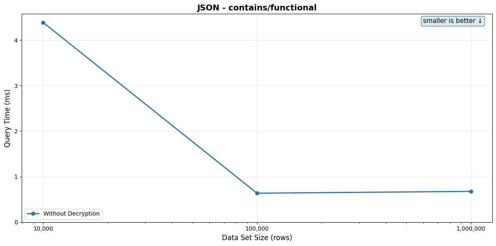
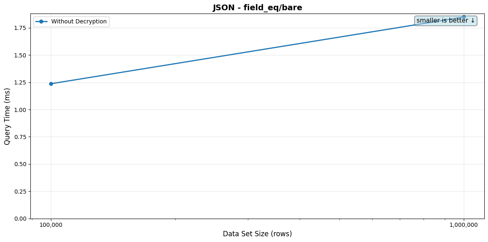
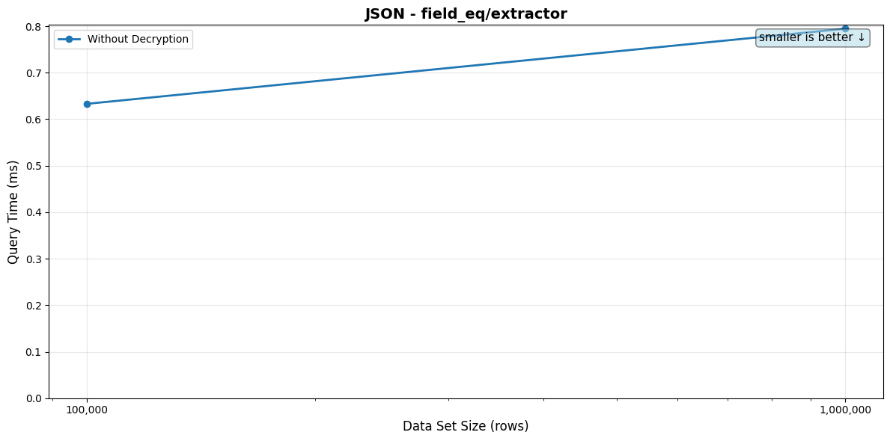
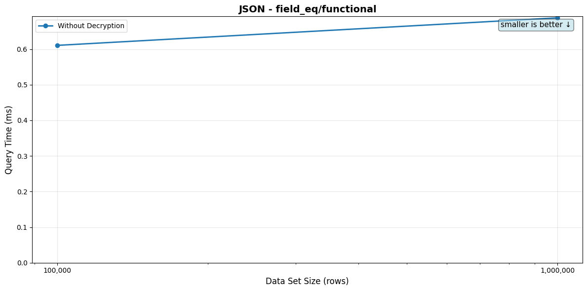
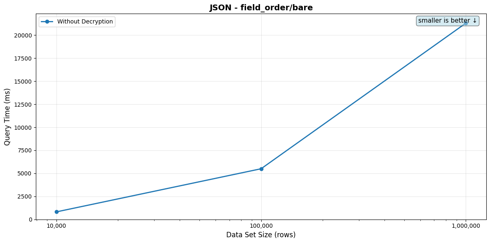
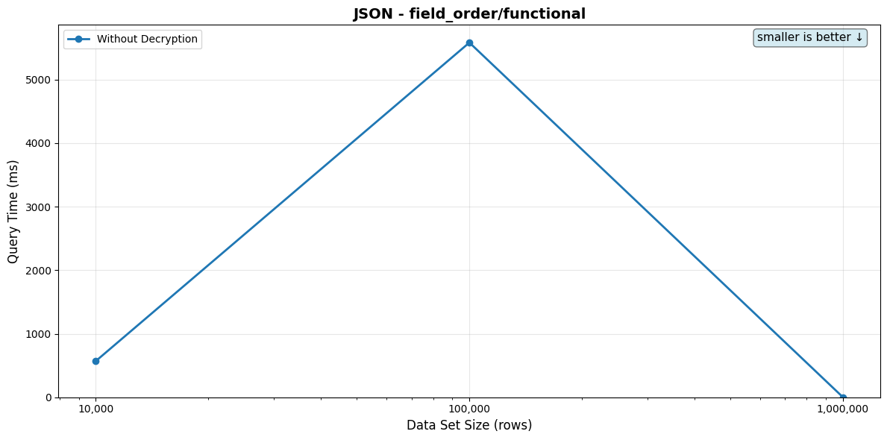

# JSON Queries

[← Back to overview](./BENCHMARK_REPORT.md)

Per-tier query performance. Each scenario lists its SQL, the indexes available on the target table, the indexes the planner actually picked per tier, the timing table, and the full EXPLAIN plan in a collapsed block.

## contains/functional

**Description:** Whole-document JSON containment via `ste_vec(...) @> ste_vec(...)`

**SQL Query:**
```sql
SELECT id FROM {TABLE} WHERE eql_v2.ste_vec(value) @> eql_v2.ste_vec($1::jsonb::eql_v2_encrypted) LIMIT 10
```

**Parameter:** `<sampled-row-value-as-jsonb>`

**Table: `json_ste_vec_small_encrypted_{rows}` with encrypted JSON documents (small four-field shape — first_name / last_name / age / email). Index: functional GIN on `eql_v2.ste_vec(value)`. Both sides of `@>` resolve to `eql_v2_encrypted[]`, which matches the GIN opclass directly. The needle is a sampled row's value, so the query matches at least that source row.

Note: the bare form `WHERE value @> $1::eql_v2_encrypted` does NOT engage the GIN today. `eql_v2."@>"` is marked inlinable SQL but wraps `ste_vec_contains()` which is PL/pgSQL — inlining stops at the wrapper, leaving the planner with a black-box function call and no path to the indexed expression. The bench omits the bare form because it would not complete at the 1M / 10M tiers.**

**Indexes available on the table:**
```sql
CREATE INDEX
json_ste_vec_small_encrypted_10000_ste_vec_index
ON json_ste_vec_small_encrypted_10000 USING GIN (
    eql_v2.ste_vec(value)
);

CREATE INDEX
json_ste_vec_small_encrypted_10000_hmac_terms_index
ON json_ste_vec_small_encrypted_10000 USING GIN (
    eql_v2.hmac_256_terms(value)
);
```

**Indexes used by the planner (per data set size):**

- 10,000: `json_ste_vec_small_encrypted_10000_ste_vec_index`
- 100,000: `json_ste_vec_small_encrypted_100000_ste_vec_index`
- 1,000,000: `json_ste_vec_small_encrypted_1000000_ste_vec_index`

| Data Set Size | Rows Returned | Query Time (no decrypt) | Query Time (with decrypt) |
|---------------|---------------|-------------------------|---------------------------|
| 10,000 | 0 | 4.39ms | N/A |
| 100,000 | 1 | 635.11μs | N/A |
| 1,000,000 | 1 | 675.27μs | N/A |

_Rows Returned is the actual count from a one-shot pre-bench execution. For LIMIT-bounded queries it matches the LIMIT (or is lower when the table doesn't have enough matching rows); for aggregates wrapped in `count(*)` it's 1._

<details>
<summary>EXPLAIN plans (per data set size)</summary>

**10,000 rows**

```
Limit
  Bitmap Heap Scan on json_ste_vec_small_encrypted_10000
    Bitmap Index Scan using json_ste_vec_small_encrypted_10000_ste_vec_index
```

Full `EXPLAIN (FORMAT JSON)`:

```json
[
  {
    "Plan": {
      "Async Capable": false,
      "Node Type": "Limit",
      "Parallel Aware": false,
      "Plan Rows": 1,
      "Plan Width": 4,
      "Plans": [
        {
          "Alias": "json_ste_vec_small_encrypted_10000",
          "Async Capable": false,
          "Node Type": "Bitmap Heap Scan",
          "Parallel Aware": false,
          "Parent Relationship": "Outer",
          "Plan Rows": 1,
          "Plan Width": 4,
          "Plans": [
            {
              "Async Capable": false,
              "Index Cond": "(eql_v2.ste_vec(value) @> '{\"(\\\"{\\\"\\\"a\\\"\\\": false, \\\"\\\"c\\\"\\\": \\\"\\\"mBbK3T*aByOk1CMFSxTjP#Y=4Z6Hee?EAWa$TKrs*W=)RO^mzFb4mO_$uKFbmBqoJ3?jmCSdS|*JN(Moifp~xZ8F^kr8$36kE|pa06wSC?zGXf2p8Em76NG}?+93UhVBl|DF^k)r7J|*FHU2Ows&T=Vp#`k`D0|>jda8yY#}xtC075XP&0VOW+C5ig2Nl+L!+O8Uq0Qu?e*KNpuh\\\"\\\", \\\"\\\"s\\\"\\\": \\\"\\\"cfef1685f0e51a1fe1da955e7ad10044\\\"\\\", \\\"\\\"b3\\\"\\\": \\\"\\\"8b169ab80ae78a13b167d44786bcad42\\\"\\\"}\\\")\",\"(\\\"{\\\"\\\"a\\\"\\\": false, \\\"\\\"c\\\"\\\": \\\"\\\"mBbK3T*aByOk1CMFSxTjP#Y=46yK^vFs;Uc^c|1GDBBx6^PwFKk;EWuAvPW*R{y0?GkC^kA>VI;!yDv7qo09aKHa?S_1mnVzy\\\"\\\", \\\"\\\"s\\\"\\\": \\\"\\\"9a2d817b8ec7abe623a1fcb4d9681003\\\"\\\", \\\"\\\"ocf\\\"\\\": \\\"\\\"3983bd5da09a48bf28a3577136828b7a5f10a703cfa83fa276dba7fdbbfe3214a72c970c5f25f4d4d2bccc92ac6b0bbd4168e3e4526ecfee50d880b5195fdaf1\\\"\\\"}\\\")\",\"(\\\"{\\\"\\\"a\\\"\\\": false, \\\"\\\"c\\\"\\\": \\\"\\\"mBbK3T*aByOk1CMFSxTjP#Y=4FQ{l`QoN5dfP)4|(soN74WX)P6G4R_CT|+=TuFy2ABxv%kmV_oYRF}Yy=_^<#2{=THXbEb|D{kfc*bTS-*1A$8{|WypMhUK-MsDf+pM6#\\\"\\\", \\\"\\\"s\\\"\\\": \\\"\\\"0342d803ea283195499ef8b163ee9a3f\\\"\\\", \\\"\\\"ocv\\\"\\\": \\\"\\\"381d8889818917026a978b42bb981c6b253b766abb3750cf0f24f00112e2bf5cf0a46bfe8171e0a74c0a4595f57ad3202418fb6f7c9544b4add563c3c36c95863a8d9c4567a897b226e7a4a43b498a4289846f3b1984d84489b4fdc1b44670ed8f29bb1013d6dd766c3ddbe3d311adfd89d7940bb64a562d9766e76b3b74f30320f78c323281eeed0924b12b2498b5d52def8f3bedbd2fa9d98cef137969716cb52b048c23871ad85c6ea0dfe64dcd828cbd386438e8c2884bc28349e8b4c7271149cb67d92cc1c40bbcdd260238cc85661d8f2b75cb5283\\\"\\\"}\\\")\",\"(\\\"{\\\"\\\"a\\\"\\\": false, \\\"\\\"c\\\"\\\": \\\"\\\"mBbK3T*aByOk1CMFSxTjP#Y=48nM_m0|K2*0bQ=4AKW0Fx&<1J8K<bPGi%JmAZ#Hv9wk=)rBE|?#%3YkZ-T=c<U^yMfnPq|yzTYdtf0U\\\"\\\", \\\"\\\"s\\\"\\\": \\\"\\\"746e042de28c05e98d1ff821a43d52b5\\\"\\\", \\\"\\\"ocv\\\"\\\": \\\"\\\"381d87e3dbbba51a469d8767c9eb55280e01588c0a1cdd619af061e64a022e3b14fcb59d0d578652283397ec66fcbb5c\\\"\\\"}\\\")\",\"(\\\"{\\\"\\\"a\\\"\\\": false, \\\"\\\"c\\\"\\\": \\\"\\\"mBbK3T*aByOk1CMFSxTjP#Y=48mBPS*m<5(LW+a*fJTesDMA&!F+}}W*qn>RAZ#Hv9wk=)rBE|?#%3YkZ-T=c<U^yMfnPq|yzTYdtf0U\\\"\\\", \\\"\\\"s\\\"\\\": \\\"\\\"2bab9d9c2aa600f519eb82a8ac3b7cdb\\\"\\\", \\\"\\\"ocv\\\"\\\": \\\"\\\"381d87e41b773f50496e2dec7b312c67be18dfa7a0c1ebc240ad111170829fb6dba55b022f55456038d72f58ebd703cb\\\"\\\"}\\\")\"}'::eql_v2_encrypted[])",
              "Index Name": "json_ste_vec_small_encrypted_10000_ste_vec_index",
              "Node Type": "Bitmap Index Scan",
              "Parallel Aware": false,
              "Parent Relationship": "Outer",
              "Plan Rows": 1,
              "Plan Width": 0,
              "Startup Cost": 0.0,
              "Total Cost": 68.89
            }
          ],
          "Recheck Cond": "(eql_v2.ste_vec(value) @> '{\"(\\\"{\\\"\\\"a\\\"\\\": false, \\\"\\\"c\\\"\\\": \\\"\\\"mBbK3T*aByOk1CMFSxTjP#Y=4Z6Hee?EAWa$TKrs*W=)RO^mzFb4mO_$uKFbmBqoJ3?jmCSdS|*JN(Moifp~xZ8F^kr8$36kE|pa06wSC?zGXf2p8Em76NG}?+93UhVBl|DF^k)r7J|*FHU2Ows&T=Vp#`k`D0|>jda8yY#}xtC075XP&0VOW+C5ig2Nl+L!+O8Uq0Qu?e*KNpuh\\\"\\\", \\\"\\\"s\\\"\\\": \\\"\\\"cfef1685f0e51a1fe1da955e7ad10044\\\"\\\", \\\"\\\"b3\\\"\\\": \\\"\\\"8b169ab80ae78a13b167d44786bcad42\\\"\\\"}\\\")\",\"(\\\"{\\\"\\\"a\\\"\\\": false, \\\"\\\"c\\\"\\\": \\\"\\\"mBbK3T*aByOk1CMFSxTjP#Y=46yK^vFs;Uc^c|1GDBBx6^PwFKk;EWuAvPW*R{y0?GkC^kA>VI;!yDv7qo09aKHa?S_1mnVzy\\\"\\\", \\\"\\\"s\\\"\\\": \\\"\\\"9a2d817b8ec7abe623a1fcb4d9681003\\\"\\\", \\\"\\\"ocf\\\"\\\": \\\"\\\"3983bd5da09a48bf28a3577136828b7a5f10a703cfa83fa276dba7fdbbfe3214a72c970c5f25f4d4d2bccc92ac6b0bbd4168e3e4526ecfee50d880b5195fdaf1\\\"\\\"}\\\")\",\"(\\\"{\\\"\\\"a\\\"\\\": false, \\\"\\\"c\\\"\\\": \\\"\\\"mBbK3T*aByOk1CMFSxTjP#Y=4FQ{l`QoN5dfP)4|(soN74WX)P6G4R_CT|+=TuFy2ABxv%kmV_oYRF}Yy=_^<#2{=THXbEb|D{kfc*bTS-*1A$8{|WypMhUK-MsDf+pM6#\\\"\\\", \\\"\\\"s\\\"\\\": \\\"\\\"0342d803ea283195499ef8b163ee9a3f\\\"\\\", \\\"\\\"ocv\\\"\\\": \\\"\\\"381d8889818917026a978b42bb981c6b253b766abb3750cf0f24f00112e2bf5cf0a46bfe8171e0a74c0a4595f57ad3202418fb6f7c9544b4add563c3c36c95863a8d9c4567a897b226e7a4a43b498a4289846f3b1984d84489b4fdc1b44670ed8f29bb1013d6dd766c3ddbe3d311adfd89d7940bb64a562d9766e76b3b74f30320f78c323281eeed0924b12b2498b5d52def8f3bedbd2fa9d98cef137969716cb52b048c23871ad85c6ea0dfe64dcd828cbd386438e8c2884bc28349e8b4c7271149cb67d92cc1c40bbcdd260238cc85661d8f2b75cb5283\\\"\\\"}\\\")\",\"(\\\"{\\\"\\\"a\\\"\\\": false, \\\"\\\"c\\\"\\\": \\\"\\\"mBbK3T*aByOk1CMFSxTjP#Y=48nM_m0|K2*0bQ=4AKW0Fx&<1J8K<bPGi%JmAZ#Hv9wk=)rBE|?#%3YkZ-T=c<U^yMfnPq|yzTYdtf0U\\\"\\\", \\\"\\\"s\\\"\\\": \\\"\\\"746e042de28c05e98d1ff821a43d52b5\\\"\\\", \\\"\\\"ocv\\\"\\\": \\\"\\\"381d87e3dbbba51a469d8767c9eb55280e01588c0a1cdd619af061e64a022e3b14fcb59d0d578652283397ec66fcbb5c\\\"\\\"}\\\")\",\"(\\\"{\\\"\\\"a\\\"\\\": false, \\\"\\\"c\\\"\\\": \\\"\\\"mBbK3T*aByOk1CMFSxTjP#Y=48mBPS*m<5(LW+a*fJTesDMA&!F+}}W*qn>RAZ#Hv9wk=)rBE|?#%3YkZ-T=c<U^yMfnPq|yzTYdtf0U\\\"\\\", \\\"\\\"s\\\"\\\": \\\"\\\"2bab9d9c2aa600f519eb82a8ac3b7cdb\\\"\\\", \\\"\\\"ocv\\\"\\\": \\\"\\\"381d87e41b773f50496e2dec7b312c67be18dfa7a0c1ebc240ad111170829fb6dba55b022f55456038d72f58ebd703cb\\\"\\\"}\\\")\"}'::eql_v2_encrypted[])",
          "Relation Name": "json_ste_vec_small_encrypted_10000",
          "Startup Cost": 68.89,
          "Total Cost": 73.15
        }
      ],
      "Startup Cost": 68.89,
      "Total Cost": 73.15
    }
  }
]
```

**100,000 rows**

```
Limit
  Bitmap Heap Scan on json_ste_vec_small_encrypted_100000
    Bitmap Index Scan using json_ste_vec_small_encrypted_100000_ste_vec_index
```

Full `EXPLAIN (FORMAT JSON)`:

```json
[
  {
    "Plan": {
      "Async Capable": false,
      "Node Type": "Limit",
      "Parallel Aware": false,
      "Plan Rows": 1,
      "Plan Width": 4,
      "Plans": [
        {
          "Alias": "json_ste_vec_small_encrypted_100000",
          "Async Capable": false,
          "Node Type": "Bitmap Heap Scan",
          "Parallel Aware": false,
          "Parent Relationship": "Outer",
          "Plan Rows": 1,
          "Plan Width": 4,
          "Plans": [
            {
              "Async Capable": false,
              "Index Cond": "(eql_v2.ste_vec(value) @> '{\"(\\\"{\\\"\\\"a\\\"\\\": false, \\\"\\\"c\\\"\\\": \\\"\\\"mBbJ_R~jd|H&w|RXh&htXQ^z&Z+yTsZISaZ%?ReCB~KB+Urapc9}h&f#Dw(Xc7FT&eecbfQ3{tBvu^E)Q_(|2H3%0(Tq<1BfGbP6<s@eDQ0<@GN?&P&%Mnr{2(2bu6U7Mmi44k?&fxNq9qj4>A~-EN-|!lmzBO#p_0~Ch#2}dpc%3&{;m<w7NU-VPJ%T<?=Q1dkXelzxT>`OYpaY=5\\\"\\\", \\\"\\\"s\\\"\\\": \\\"\\\"cfef1685f0e51a1fe1da955e7ad10044\\\"\\\", \\\"\\\"hm\\\"\\\": \\\"\\\"fb73e0f40bc991cf4b1090d0801f6447\\\"\\\"}\\\")\",\"(\\\"{\\\"\\\"a\\\"\\\": false, \\\"\\\"c\\\"\\\": \\\"\\\"mBbJ_R~jd|H&w|RXh&htXQ^z&6m*(GC}!?JLD?GlJj%MM4k!RC9K;}*3V5A2S>ew;!bq^`;5~vqPUkWxmS`z5%v}PpW}pM0zy\\\"\\\", \\\"\\\"s\\\"\\\": \\\"\\\"9a2d817b8ec7abe623a1fcb4d9681003\\\"\\\", \\\"\\\"oc\\\"\\\": \\\"\\\"8c01e097b7b04c9c7bfc0a3129231c37571881cb77fb3c9d751bb8b49b4d14f537a23c3e4e9b7319426c4c40fc9162bc835b0f4cb7c036e2bc2cbc39d6e9d8f70d\\\"\\\"}\\\")\",\"(\\\"{\\\"\\\"a\\\"\\\": false, \\\"\\\"c\\\"\\\": \\\"\\\"mBbJ_R~jd|H&w|RXh&htXQ^z&Fjkdx*2_W>X(Qd2m#c3at~C&>LX~iN9TBH1t4MkR^Gb5<jeJ4Zuv9)Oz`^n0*Tf*13V5A2S>ew;!bq^`;5~vqPUkWxmS`z5%v}PpW}pM0zy\\\"\\\", \\\"\\\"s\\\"\\\": \\\"\\\"0342d803ea283195499ef8b163ee9a3f\\\"\\\", \\\"\\\"oc\\\"\\\": \\\"\\\"8d5c371e403ea3bf3e70b0c1d4fee40ed753c4721d387e6366e17790ee3dcceb9b405cc3a7626f103937179f717f2318739be8f2324ed6df930789ed12a3780257d23fd3e09f2f54783f60623a46b146cb2db20edeef9cae784a07a862ddef19609c8bab7ce20583608757c08e7eae49cce2c6173fb30818a9802173c5d7e52950065099c954e60965007c77853ab7711fd562c81acd531c7f664b29b46066e02dd277b071de52815f79df308339ec66dadbee31b9b0aa33d1844eee59eb5a00a9031cfdfb218d2c0ae71295740c447d57a3ad8dc3491d6ec270dadfdbd3eb58561be183766064be7d\\\"\\\"}\\\")\",\"(\\\"{\\\"\\\"a\\\"\\\": false, \\\"\\\"c\\\"\\\": \\\"\\\"mBbJ_R~jd|H&w|RXh&htXQ^z&8=8SmiZ69A$9J=Na8V;^#Ri(77?|NL7*`z;#2}dpc%3&{;m<w7NU-VPJ%T<?=Q1dkXelzxT>`OYpaY=5\\\"\\\", \\\"\\\"s\\\"\\\": \\\"\\\"746e042de28c05e98d1ff821a43d52b5\\\"\\\", \\\"\\\"oc\\\"\\\": \\\"\\\"8d5c371db4984978a08a03d61cf4490a4e3f3557c4d1c6cd2cdb1c230af94ceec60ca6509c14eb1334393241f979a4aa7fd93f22939a55dc53916bd6808053c2ae\\\"\\\"}\\\")\",\"(\\\"{\\\"\\\"a\\\"\\\": false, \\\"\\\"c\\\"\\\": \\\"\\\"mBbJ_R~jd|H&w|RXh&htXQ^z&8t(V9G|Dv99g)YcsI-}hclP5nSAR3Gw-?XEAejnyoi|zG&ppCOu<77Ef<8{?GANd4DKgAm0<mVG1E9b\\\"\\\", \\\"\\\"s\\\"\\\": \\\"\\\"2bab9d9c2aa600f519eb82a8ac3b7cdb\\\"\\\", \\\"\\\"oc\\\"\\\": \\\"\\\"8d5c371db49711c282c994501ae344019314a8944c8416417f0886fba295d9084472d37e9f101d8b58f11e9acfa357fab1a9a15fe5155f76de\\\"\\\"}\\\")\"}'::eql_v2_encrypted[])",
              "Index Name": "json_ste_vec_small_encrypted_100000_ste_vec_index",
              "Node Type": "Bitmap Index Scan",
              "Parallel Aware": false,
              "Parent Relationship": "Outer",
              "Plan Rows": 1,
              "Plan Width": 0,
              "Startup Cost": 0.0,
              "Total Cost": 111.49
            }
          ],
          "Recheck Cond": "(eql_v2.ste_vec(value) @> '{\"(\\\"{\\\"\\\"a\\\"\\\": false, \\\"\\\"c\\\"\\\": \\\"\\\"mBbJ_R~jd|H&w|RXh&htXQ^z&Z+yTsZISaZ%?ReCB~KB+Urapc9}h&f#Dw(Xc7FT&eecbfQ3{tBvu^E)Q_(|2H3%0(Tq<1BfGbP6<s@eDQ0<@GN?&P&%Mnr{2(2bu6U7Mmi44k?&fxNq9qj4>A~-EN-|!lmzBO#p_0~Ch#2}dpc%3&{;m<w7NU-VPJ%T<?=Q1dkXelzxT>`OYpaY=5\\\"\\\", \\\"\\\"s\\\"\\\": \\\"\\\"cfef1685f0e51a1fe1da955e7ad10044\\\"\\\", \\\"\\\"hm\\\"\\\": \\\"\\\"fb73e0f40bc991cf4b1090d0801f6447\\\"\\\"}\\\")\",\"(\\\"{\\\"\\\"a\\\"\\\": false, \\\"\\\"c\\\"\\\": \\\"\\\"mBbJ_R~jd|H&w|RXh&htXQ^z&6m*(GC}!?JLD?GlJj%MM4k!RC9K;}*3V5A2S>ew;!bq^`;5~vqPUkWxmS`z5%v}PpW}pM0zy\\\"\\\", \\\"\\\"s\\\"\\\": \\\"\\\"9a2d817b8ec7abe623a1fcb4d9681003\\\"\\\", \\\"\\\"oc\\\"\\\": \\\"\\\"8c01e097b7b04c9c7bfc0a3129231c37571881cb77fb3c9d751bb8b49b4d14f537a23c3e4e9b7319426c4c40fc9162bc835b0f4cb7c036e2bc2cbc39d6e9d8f70d\\\"\\\"}\\\")\",\"(\\\"{\\\"\\\"a\\\"\\\": false, \\\"\\\"c\\\"\\\": \\\"\\\"mBbJ_R~jd|H&w|RXh&htXQ^z&Fjkdx*2_W>X(Qd2m#c3at~C&>LX~iN9TBH1t4MkR^Gb5<jeJ4Zuv9)Oz`^n0*Tf*13V5A2S>ew;!bq^`;5~vqPUkWxmS`z5%v}PpW}pM0zy\\\"\\\", \\\"\\\"s\\\"\\\": \\\"\\\"0342d803ea283195499ef8b163ee9a3f\\\"\\\", \\\"\\\"oc\\\"\\\": \\\"\\\"8d5c371e403ea3bf3e70b0c1d4fee40ed753c4721d387e6366e17790ee3dcceb9b405cc3a7626f103937179f717f2318739be8f2324ed6df930789ed12a3780257d23fd3e09f2f54783f60623a46b146cb2db20edeef9cae784a07a862ddef19609c8bab7ce20583608757c08e7eae49cce2c6173fb30818a9802173c5d7e52950065099c954e60965007c77853ab7711fd562c81acd531c7f664b29b46066e02dd277b071de52815f79df308339ec66dadbee31b9b0aa33d1844eee59eb5a00a9031cfdfb218d2c0ae71295740c447d57a3ad8dc3491d6ec270dadfdbd3eb58561be183766064be7d\\\"\\\"}\\\")\",\"(\\\"{\\\"\\\"a\\\"\\\": false, \\\"\\\"c\\\"\\\": \\\"\\\"mBbJ_R~jd|H&w|RXh&htXQ^z&8=8SmiZ69A$9J=Na8V;^#Ri(77?|NL7*`z;#2}dpc%3&{;m<w7NU-VPJ%T<?=Q1dkXelzxT>`OYpaY=5\\\"\\\", \\\"\\\"s\\\"\\\": \\\"\\\"746e042de28c05e98d1ff821a43d52b5\\\"\\\", \\\"\\\"oc\\\"\\\": \\\"\\\"8d5c371db4984978a08a03d61cf4490a4e3f3557c4d1c6cd2cdb1c230af94ceec60ca6509c14eb1334393241f979a4aa7fd93f22939a55dc53916bd6808053c2ae\\\"\\\"}\\\")\",\"(\\\"{\\\"\\\"a\\\"\\\": false, \\\"\\\"c\\\"\\\": \\\"\\\"mBbJ_R~jd|H&w|RXh&htXQ^z&8t(V9G|Dv99g)YcsI-}hclP5nSAR3Gw-?XEAejnyoi|zG&ppCOu<77Ef<8{?GANd4DKgAm0<mVG1E9b\\\"\\\", \\\"\\\"s\\\"\\\": \\\"\\\"2bab9d9c2aa600f519eb82a8ac3b7cdb\\\"\\\", \\\"\\\"oc\\\"\\\": \\\"\\\"8d5c371db49711c282c994501ae344019314a8944c8416417f0886fba295d9084472d37e9f101d8b58f11e9acfa357fab1a9a15fe5155f76de\\\"\\\"}\\\")\"}'::eql_v2_encrypted[])",
          "Relation Name": "json_ste_vec_small_encrypted_100000",
          "Startup Cost": 111.49,
          "Total Cost": 115.75
        }
      ],
      "Startup Cost": 111.49,
      "Total Cost": 115.75
    }
  }
]
```

**1,000,000 rows**

```
Limit
  Bitmap Heap Scan on json_ste_vec_small_encrypted_1000000
    Bitmap Index Scan using json_ste_vec_small_encrypted_1000000_ste_vec_index
```

Full `EXPLAIN (FORMAT JSON)`:

```json
[
  {
    "Plan": {
      "Async Capable": false,
      "Node Type": "Limit",
      "Parallel Aware": false,
      "Plan Rows": 1,
      "Plan Width": 4,
      "Plans": [
        {
          "Alias": "json_ste_vec_small_encrypted_1000000",
          "Async Capable": false,
          "Node Type": "Bitmap Heap Scan",
          "Parallel Aware": false,
          "Parent Relationship": "Outer",
          "Plan Rows": 1,
          "Plan Width": 4,
          "Plans": [
            {
              "Async Capable": false,
              "Index Cond": "(eql_v2.ste_vec(value) @> '{\"(\\\"{\\\"\\\"a\\\"\\\": false, \\\"\\\"c\\\"\\\": \\\"\\\"mBbLvX)6;+mT}NuDf52N=XjpPbB%Lqu+E5rN(5YFX~dM-@;6C=yjIaXcYA8sQ&XUhMz|SntOC9LIWg8lh(~O4v}g*@@V6406|l!StPJtUXo{gxtN`&Cpxf!OyzNr8AO4>@_~b*?X4luki<7a_T~Aww5d`O<u}|v^CA0UI3QOC?#30mN`EeJ)hCJ@8Sw{%ST}XhPygW`DkbumVBlZV0l`EjY\\\"\\\", \\\"\\\"s\\\"\\\": \\\"\\\"cfef1685f0e51a1fe1da955e7ad10044\\\"\\\", \\\"\\\"hm\\\"\\\": \\\"\\\"fb73e0f40bc991cf4b1090d0801f6447\\\"\\\"}\\\")\",\"(\\\"{\\\"\\\"a\\\"\\\": false, \\\"\\\"c\\\"\\\": \\\"\\\"mBbLvX)6;+mT}NuDf52N=XjpP6eD7#j$2!{OLk{3Q(@T1q^Y$3d&D5rUHNer!G=8Ut64_~$X!T)oxD6w8<2p^mLv8DG?go$zy\\\"\\\", \\\"\\\"s\\\"\\\": \\\"\\\"9a2d817b8ec7abe623a1fcb4d9681003\\\"\\\", \\\"\\\"oc\\\"\\\": \\\"\\\"8c01e097b7b04c9c7bfc0a31280642a2229a3aecc4a2654601c1b001eeab4bfdef1dbb73cb26108cac8afe910a62c7fd4c62b0aca2ec020660f9b674c4cc63338f\\\"\\\"}\\\")\",\"(\\\"{\\\"\\\"a\\\"\\\": false, \\\"\\\"c\\\"\\\": \\\"\\\"mBbLvX)6;+mT}NuDf52N=XjpPGh3nY?;-it;dbP5(lY%UE5#vvMFgh8C_0SKfk>HO<GdZcMsPaj4Mfof-VvQLLmo)h#30mN`EeJ)hCJ@8Sw{%ST}XhPygW`DkbumVBlZV0l`EjY\\\"\\\", \\\"\\\"s\\\"\\\": \\\"\\\"0342d803ea283195499ef8b163ee9a3f\\\"\\\", \\\"\\\"oc\\\"\\\": \\\"\\\"8d5c371e4113e9f962fbe6fe249a5de0f12ba7ed57fbb827b92512c89c85a8e7547b64d9afb98dcf225ec8a0a15dfec7f6cb105cbad25ccfaeecffbca7ebd49b28c326a228fa6adf01a8be94bbce35bf50c67a30b32d035b22bef36839b79c8de4c7c739e0c53abfdf4f0ca5aeabc2656b12ac8221bea884cce06446907876dd5205dba1a3558d9ba94c14aa0979ff3f8fe2eb4847c3e4d35881773c86a6617b94cc541d2c76e514b37c2158a1eb5547b9ba51d0189e07d46aad2ba4499f19ba02fe08e3af94ab7b738c8c7c7b75d5e4830dd94e56e0e1475ea17ed946b7198391c3aa343958b777da5edb0fbf62e998e0a54d9f965f2f8c7d23dcfbc460112b93\\\"\\\"}\\\")\",\"(\\\"{\\\"\\\"a\\\"\\\": false, \\\"\\\"c\\\"\\\": \\\"\\\"mBbLvX)6;+mT}NuDf52N=XjpP8y;Zn8A2b(@E99t`I|HAs@SnchoMA4?=MC}#30mN`EeJ)hCJ@8Sw{%ST}XhPygW`DkbumVBlZV0l`EjY\\\"\\\", \\\"\\\"s\\\"\\\": \\\"\\\"746e042de28c05e98d1ff821a43d52b5\\\"\\\", \\\"\\\"oc\\\"\\\": \\\"\\\"8d5c371db49711c282c9945019a0d5d828669b07666c2283603c56362cb07c395755fd5b70463afcdf62e729bf0720901dc833eb2598fc2d30695311e9b6808878\\\"\\\"}\\\")\",\"(\\\"{\\\"\\\"a\\\"\\\": false, \\\"\\\"c\\\"\\\": \\\"\\\"mBbLvX)6;+mT}NuDf52N=XjpP8{R7~NA-WOA80T{;hv5)K02Vp-AD2EfU$``#30mN`EeJ)hCJ@8Sw{%ST}XhPygW`DkbumVBlZV0l`EjY\\\"\\\", \\\"\\\"s\\\"\\\": \\\"\\\"2bab9d9c2aa600f519eb82a8ac3b7cdb\\\"\\\", \\\"\\\"oc\\\"\\\": \\\"\\\"8d5c371db49711c281dcb2bf47fbf7c225980c05de594118306d69b6c184e1cc2ad34bedbe3dcffb4fe4af5e8bb70430838ebceac45f95cd0fd5a28c077149e166\\\"\\\"}\\\")\"}'::eql_v2_encrypted[])",
              "Index Name": "json_ste_vec_small_encrypted_1000000_ste_vec_index",
              "Node Type": "Bitmap Index Scan",
              "Parallel Aware": false,
              "Parent Relationship": "Outer",
              "Plan Rows": 1,
              "Plan Width": 0,
              "Startup Cost": 0.0,
              "Total Cost": 154.09
            }
          ],
          "Recheck Cond": "(eql_v2.ste_vec(value) @> '{\"(\\\"{\\\"\\\"a\\\"\\\": false, \\\"\\\"c\\\"\\\": \\\"\\\"mBbLvX)6;+mT}NuDf52N=XjpPbB%Lqu+E5rN(5YFX~dM-@;6C=yjIaXcYA8sQ&XUhMz|SntOC9LIWg8lh(~O4v}g*@@V6406|l!StPJtUXo{gxtN`&Cpxf!OyzNr8AO4>@_~b*?X4luki<7a_T~Aww5d`O<u}|v^CA0UI3QOC?#30mN`EeJ)hCJ@8Sw{%ST}XhPygW`DkbumVBlZV0l`EjY\\\"\\\", \\\"\\\"s\\\"\\\": \\\"\\\"cfef1685f0e51a1fe1da955e7ad10044\\\"\\\", \\\"\\\"hm\\\"\\\": \\\"\\\"fb73e0f40bc991cf4b1090d0801f6447\\\"\\\"}\\\")\",\"(\\\"{\\\"\\\"a\\\"\\\": false, \\\"\\\"c\\\"\\\": \\\"\\\"mBbLvX)6;+mT}NuDf52N=XjpP6eD7#j$2!{OLk{3Q(@T1q^Y$3d&D5rUHNer!G=8Ut64_~$X!T)oxD6w8<2p^mLv8DG?go$zy\\\"\\\", \\\"\\\"s\\\"\\\": \\\"\\\"9a2d817b8ec7abe623a1fcb4d9681003\\\"\\\", \\\"\\\"oc\\\"\\\": \\\"\\\"8c01e097b7b04c9c7bfc0a31280642a2229a3aecc4a2654601c1b001eeab4bfdef1dbb73cb26108cac8afe910a62c7fd4c62b0aca2ec020660f9b674c4cc63338f\\\"\\\"}\\\")\",\"(\\\"{\\\"\\\"a\\\"\\\": false, \\\"\\\"c\\\"\\\": \\\"\\\"mBbLvX)6;+mT}NuDf52N=XjpPGh3nY?;-it;dbP5(lY%UE5#vvMFgh8C_0SKfk>HO<GdZcMsPaj4Mfof-VvQLLmo)h#30mN`EeJ)hCJ@8Sw{%ST}XhPygW`DkbumVBlZV0l`EjY\\\"\\\", \\\"\\\"s\\\"\\\": \\\"\\\"0342d803ea283195499ef8b163ee9a3f\\\"\\\", \\\"\\\"oc\\\"\\\": \\\"\\\"8d5c371e4113e9f962fbe6fe249a5de0f12ba7ed57fbb827b92512c89c85a8e7547b64d9afb98dcf225ec8a0a15dfec7f6cb105cbad25ccfaeecffbca7ebd49b28c326a228fa6adf01a8be94bbce35bf50c67a30b32d035b22bef36839b79c8de4c7c739e0c53abfdf4f0ca5aeabc2656b12ac8221bea884cce06446907876dd5205dba1a3558d9ba94c14aa0979ff3f8fe2eb4847c3e4d35881773c86a6617b94cc541d2c76e514b37c2158a1eb5547b9ba51d0189e07d46aad2ba4499f19ba02fe08e3af94ab7b738c8c7c7b75d5e4830dd94e56e0e1475ea17ed946b7198391c3aa343958b777da5edb0fbf62e998e0a54d9f965f2f8c7d23dcfbc460112b93\\\"\\\"}\\\")\",\"(\\\"{\\\"\\\"a\\\"\\\": false, \\\"\\\"c\\\"\\\": \\\"\\\"mBbLvX)6;+mT}NuDf52N=XjpP8y;Zn8A2b(@E99t`I|HAs@SnchoMA4?=MC}#30mN`EeJ)hCJ@8Sw{%ST}XhPygW`DkbumVBlZV0l`EjY\\\"\\\", \\\"\\\"s\\\"\\\": \\\"\\\"746e042de28c05e98d1ff821a43d52b5\\\"\\\", \\\"\\\"oc\\\"\\\": \\\"\\\"8d5c371db49711c282c9945019a0d5d828669b07666c2283603c56362cb07c395755fd5b70463afcdf62e729bf0720901dc833eb2598fc2d30695311e9b6808878\\\"\\\"}\\\")\",\"(\\\"{\\\"\\\"a\\\"\\\": false, \\\"\\\"c\\\"\\\": \\\"\\\"mBbLvX)6;+mT}NuDf52N=XjpP8{R7~NA-WOA80T{;hv5)K02Vp-AD2EfU$``#30mN`EeJ)hCJ@8Sw{%ST}XhPygW`DkbumVBlZV0l`EjY\\\"\\\", \\\"\\\"s\\\"\\\": \\\"\\\"2bab9d9c2aa600f519eb82a8ac3b7cdb\\\"\\\", \\\"\\\"oc\\\"\\\": \\\"\\\"8d5c371db49711c281dcb2bf47fbf7c225980c05de594118306d69b6c184e1cc2ad34bedbe3dcffb4fe4af5e8bb70430838ebceac45f95cd0fd5a28c077149e166\\\"\\\"}\\\")\"}'::eql_v2_encrypted[])",
          "Relation Name": "json_ste_vec_small_encrypted_1000000",
          "Startup Cost": 154.09,
          "Total Cost": 158.35
        }
      ],
      "Startup Cost": 154.09,
      "Total Cost": 158.35
    }
  }
]
```

</details>



## field_eq/bare

**Description:** Field-level equality via `value -> 'sel' = $1::eql_v2_encrypted` (no index)

**SQL Query:**
```sql
SELECT id FROM {TABLE} WHERE (value -> '<selector-hash>'::text) = $1::jsonb::eql_v2_encrypted LIMIT 10
```

**Parameter:** `<sampled-sv-element-as-jsonb>`

**Table: `json_ste_vec_small_encrypted_{rows}`. `eql_v2."->"` is plpgsql (not inlinable), so the planner cannot match any functional index against the LHS — forces Seq Scan + per-row sv walk. This is the natural form a JS/ORM caller would write; the bench includes it to show the cost of *not* having an inlinable extractor on `->`.**

**Indexes available on the table:**
```sql
CREATE INDEX
json_ste_vec_small_encrypted_100000_ste_vec_index
ON json_ste_vec_small_encrypted_100000 USING GIN (
    eql_v2.ste_vec(value)
);

CREATE INDEX
json_ste_vec_small_encrypted_100000_hmac_terms_index
ON json_ste_vec_small_encrypted_100000 USING GIN (
    eql_v2.hmac_256_terms(value)
);
```

**Indexes used by the planner (per data set size):**

- 100,000: _none — planner picked a sequential / hash-aggregate / sort plan_
- 1,000,000: _none — planner picked a sequential / hash-aggregate / sort plan_

| Data Set Size | Rows Returned | Query Time (no decrypt) | Query Time (with decrypt) |
|---------------|---------------|-------------------------|---------------------------|
| 100,000 | 10 | 1.24ms | N/A |
| 1,000,000 | 10 | 1.85ms | N/A |

_Rows Returned is the actual count from a one-shot pre-bench execution. For LIMIT-bounded queries it matches the LIMIT (or is lower when the table doesn't have enough matching rows); for aggregates wrapped in `count(*)` it's 1._

<details>
<summary>EXPLAIN plans (per data set size)</summary>

**100,000 rows**

```
Limit
  Seq Scan on json_ste_vec_small_encrypted_100000
```

Full `EXPLAIN (FORMAT JSON)`:

```json
[
  {
    "Plan": {
      "Async Capable": false,
      "Node Type": "Limit",
      "Parallel Aware": false,
      "Plan Rows": 10,
      "Plan Width": 4,
      "Plans": [
        {
          "Alias": "json_ste_vec_small_encrypted_100000",
          "Async Capable": false,
          "Filter": "((((value -> 'cfef1685f0e51a1fe1da955e7ad10044'::text)).data ->> 'hm'::text) = 'fb73e0f40bc991cf4b1090d0801f6447'::text)",
          "Node Type": "Seq Scan",
          "Parallel Aware": false,
          "Parent Relationship": "Outer",
          "Plan Rows": 500,
          "Plan Width": 4,
          "Relation Name": "json_ste_vec_small_encrypted_100000",
          "Startup Cost": 0.0,
          "Total Cost": 27390.0
        }
      ],
      "Startup Cost": 0.0,
      "Total Cost": 547.8
    }
  }
]
```

**1,000,000 rows**

```
Limit
  Seq Scan on json_ste_vec_small_encrypted_1000000
```

Full `EXPLAIN (FORMAT JSON)`:

```json
[
  {
    "Plan": {
      "Async Capable": false,
      "Node Type": "Limit",
      "Parallel Aware": false,
      "Plan Rows": 10,
      "Plan Width": 4,
      "Plans": [
        {
          "Alias": "json_ste_vec_small_encrypted_1000000",
          "Async Capable": false,
          "Filter": "((((value -> 'cfef1685f0e51a1fe1da955e7ad10044'::text)).data ->> 'hm'::text) = 'fb73e0f40bc991cf4b1090d0801f6447'::text)",
          "Node Type": "Seq Scan",
          "Parallel Aware": false,
          "Parent Relationship": "Outer",
          "Plan Rows": 5000,
          "Plan Width": 4,
          "Relation Name": "json_ste_vec_small_encrypted_1000000",
          "Startup Cost": 0.0,
          "Total Cost": 273893.0
        }
      ],
      "Startup Cost": 0.0,
      "Total Cost": 547.79
    }
  }
]
```

</details>



## field_eq/extractor

**Description:** Field-level equality via `hmac_256_terms @> [{s,hm}]` (functional GIN)

**SQL Query:**
```sql
SELECT id FROM {TABLE} WHERE eql_v2.hmac_256_terms(value) @> $1::jsonb LIMIT 10
```

**Parameter:** `[{"s":"<selector-hash>","hm":"<hmac>"}]`

**Table: `json_ste_vec_small_encrypted_{rows}`. Index: functional GIN on `eql_v2.hmac_256_terms(value)`. One index covers field-level equality across every selector that carries `hm`, vs the per-selector recipe below. The bench picks a (selector, hmac) pair from `sv[0]` of a sample row at startup; needle is `[{"s":"<sel>","hm":"<hash>"}]`.**

**Indexes available on the table:**
```sql
CREATE INDEX
json_ste_vec_small_encrypted_100000_ste_vec_index
ON json_ste_vec_small_encrypted_100000 USING GIN (
    eql_v2.ste_vec(value)
);

CREATE INDEX
json_ste_vec_small_encrypted_100000_hmac_terms_index
ON json_ste_vec_small_encrypted_100000 USING GIN (
    eql_v2.hmac_256_terms(value)
);
```

**Indexes used by the planner (per data set size):**

- 100,000: _none — planner picked a sequential / hash-aggregate / sort plan_
- 1,000,000: _none — planner picked a sequential / hash-aggregate / sort plan_

| Data Set Size | Rows Returned | Query Time (no decrypt) | Query Time (with decrypt) |
|---------------|---------------|-------------------------|---------------------------|
| 100,000 | 10 | 632.94μs | N/A |
| 1,000,000 | 10 | 794.60μs | N/A |

_Rows Returned is the actual count from a one-shot pre-bench execution. For LIMIT-bounded queries it matches the LIMIT (or is lower when the table doesn't have enough matching rows); for aggregates wrapped in `count(*)` it's 1._

<details>
<summary>EXPLAIN plans (per data set size)</summary>

**100,000 rows**

```
Limit
  Seq Scan on json_ste_vec_small_encrypted_100000
```

Full `EXPLAIN (FORMAT JSON)`:

```json
[
  {
    "Plan": {
      "Async Capable": false,
      "Node Type": "Limit",
      "Parallel Aware": false,
      "Plan Rows": 10,
      "Plan Width": 4,
      "Plans": [
        {
          "Alias": "json_ste_vec_small_encrypted_100000",
          "Async Capable": false,
          "Filter": "(eql_v2.hmac_256_terms(value) @> '[{\"s\": \"cfef1685f0e51a1fe1da955e7ad10044\", \"hm\": \"fb73e0f40bc991cf4b1090d0801f6447\"}]'::jsonb)",
          "Node Type": "Seq Scan",
          "Parallel Aware": false,
          "Parent Relationship": "Outer",
          "Plan Rows": 100000,
          "Plan Width": 4,
          "Relation Name": "json_ste_vec_small_encrypted_100000",
          "Startup Cost": 0.0,
          "Total Cost": 27140.0
        }
      ],
      "Startup Cost": 0.0,
      "Total Cost": 2.71
    }
  }
]
```

**1,000,000 rows**

```
Limit
  Seq Scan on json_ste_vec_small_encrypted_1000000
```

Full `EXPLAIN (FORMAT JSON)`:

```json
[
  {
    "Plan": {
      "Async Capable": false,
      "Node Type": "Limit",
      "Parallel Aware": false,
      "Plan Rows": 10,
      "Plan Width": 4,
      "Plans": [
        {
          "Alias": "json_ste_vec_small_encrypted_1000000",
          "Async Capable": false,
          "Filter": "(eql_v2.hmac_256_terms(value) @> '[{\"s\": \"cfef1685f0e51a1fe1da955e7ad10044\", \"hm\": \"fb73e0f40bc991cf4b1090d0801f6447\"}]'::jsonb)",
          "Node Type": "Seq Scan",
          "Parallel Aware": false,
          "Parent Relationship": "Outer",
          "Plan Rows": 1000000,
          "Plan Width": 4,
          "Relation Name": "json_ste_vec_small_encrypted_1000000",
          "Startup Cost": 0.0,
          "Total Cost": 271393.0
        }
      ],
      "Startup Cost": 0.0,
      "Total Cost": 2.71
    }
  }
]
```

</details>



## field_eq/functional

**Description:** Field-level equality via per-selector `hmac_256(col, 'sel')`

**SQL Query:**
```sql
SELECT id FROM {TABLE} WHERE eql_v2.hmac_256(value, '<selector-hash>') = eql_v2.hmac_256($1::eql_v2_encrypted) LIMIT 10
```

**Parameter:** `<sampled-sv-element-as-eql_v2_encrypted>`

**Table: `json_ste_vec_small_encrypted_{rows}`. Would engage `hash (eql_v2.hmac_256(col, '<sel>'))` if one existed; benches/main only creates the `hmac_256_terms` GIN (one index for all selectors), so this scenario serves as a baseline showing the cost of the per-selector recipe without a matching index.**

**Indexes available on the table:**
```sql
CREATE INDEX
json_ste_vec_small_encrypted_100000_ste_vec_index
ON json_ste_vec_small_encrypted_100000 USING GIN (
    eql_v2.ste_vec(value)
);

CREATE INDEX
json_ste_vec_small_encrypted_100000_hmac_terms_index
ON json_ste_vec_small_encrypted_100000 USING GIN (
    eql_v2.hmac_256_terms(value)
);
```

**Indexes used by the planner (per data set size):**

- 100,000: _none — planner picked a sequential / hash-aggregate / sort plan_
- 1,000,000: _none — planner picked a sequential / hash-aggregate / sort plan_

| Data Set Size | Rows Returned | Query Time (no decrypt) | Query Time (with decrypt) |
|---------------|---------------|-------------------------|---------------------------|
| 100,000 | 10 | 610.45μs | N/A |
| 1,000,000 | 10 | 687.83μs | N/A |

_Rows Returned is the actual count from a one-shot pre-bench execution. For LIMIT-bounded queries it matches the LIMIT (or is lower when the table doesn't have enough matching rows); for aggregates wrapped in `count(*)` it's 1._

<details>
<summary>EXPLAIN plans (per data set size)</summary>

**100,000 rows**

```
Limit
  Seq Scan on json_ste_vec_small_encrypted_100000
```

Full `EXPLAIN (FORMAT JSON)`:

```json
[
  {
    "Plan": {
      "Async Capable": false,
      "Node Type": "Limit",
      "Parallel Aware": false,
      "Plan Rows": 10,
      "Plan Width": 4,
      "Plans": [
        {
          "Alias": "json_ste_vec_small_encrypted_100000",
          "Async Capable": false,
          "Filter": "((eql_v2.hmac_256(value, 'cfef1685f0e51a1fe1da955e7ad10044'::text))::text = 'fb73e0f40bc991cf4b1090d0801f6447'::text)",
          "Node Type": "Seq Scan",
          "Parallel Aware": false,
          "Parent Relationship": "Outer",
          "Plan Rows": 500,
          "Plan Width": 4,
          "Relation Name": "json_ste_vec_small_encrypted_100000",
          "Startup Cost": 0.0,
          "Total Cost": 27140.0
        }
      ],
      "Startup Cost": 0.0,
      "Total Cost": 542.8
    }
  }
]
```

**1,000,000 rows**

```
Limit
  Seq Scan on json_ste_vec_small_encrypted_1000000
```

Full `EXPLAIN (FORMAT JSON)`:

```json
[
  {
    "Plan": {
      "Async Capable": false,
      "Node Type": "Limit",
      "Parallel Aware": false,
      "Plan Rows": 10,
      "Plan Width": 4,
      "Plans": [
        {
          "Alias": "json_ste_vec_small_encrypted_1000000",
          "Async Capable": false,
          "Filter": "((eql_v2.hmac_256(value, 'cfef1685f0e51a1fe1da955e7ad10044'::text))::text = 'fb73e0f40bc991cf4b1090d0801f6447'::text)",
          "Node Type": "Seq Scan",
          "Parallel Aware": false,
          "Parent Relationship": "Outer",
          "Plan Rows": 5000,
          "Plan Width": 4,
          "Relation Name": "json_ste_vec_small_encrypted_1000000",
          "Startup Cost": 0.0,
          "Total Cost": 271393.0
        }
      ],
      "Startup Cost": 0.0,
      "Total Cost": 542.79
    }
  }
]
```

</details>



## field_order/bare

**Description:** Field-level ORDER BY via `ORDER BY value -> 'sel'` (no index)

**SQL Query:**
```sql
SELECT id FROM {TABLE} ORDER BY (value -> '<selector-hash>'::text) LIMIT 10
```

**Table: `json_ste_vec_small_encrypted_{rows}`. Same `->` non-inlining problem as `field_eq/bare`. ORDER BY on `eql_v2_encrypted` uses ORE under the hood, but the planner can't see through `->` to engage any functional ORE index. Forces Seq Scan + Top-N sort.**

**Indexes available on the table:**
```sql
CREATE INDEX
json_ste_vec_small_encrypted_10000_ste_vec_index
ON json_ste_vec_small_encrypted_10000 USING GIN (
    eql_v2.ste_vec(value)
);

CREATE INDEX
json_ste_vec_small_encrypted_10000_hmac_terms_index
ON json_ste_vec_small_encrypted_10000 USING GIN (
    eql_v2.hmac_256_terms(value)
);
```

**Indexes used by the planner (per data set size):**

- 10,000: _none — planner picked a sequential / hash-aggregate / sort plan_
- 100,000: _none — planner picked a sequential / hash-aggregate / sort plan_
- 1,000,000: _none — planner picked a sequential / hash-aggregate / sort plan_

*⚠️ = Query time exceeds 100ms*

| Data Set Size | Rows Returned | Query Time (no decrypt) | Query Time (with decrypt) |
|---------------|---------------|-------------------------|---------------------------|
| 10,000 | 10 | ⚠️ 818.41ms | N/A |
| 100,000 | 10 | ⚠️ 5.498s | N/A |
| 1,000,000 | 10 | ⚠️ 21.300s | N/A |

_Rows Returned is the actual count from a one-shot pre-bench execution. For LIMIT-bounded queries it matches the LIMIT (or is lower when the table doesn't have enough matching rows); for aggregates wrapped in `count(*)` it's 1._

<details>
<summary>EXPLAIN plans (per data set size)</summary>

**10,000 rows**

```
Limit
  Sort
    Seq Scan on json_ste_vec_small_encrypted_10000
```

Full `EXPLAIN (FORMAT JSON)`:

```json
[
  {
    "Plan": {
      "Async Capable": false,
      "Node Type": "Limit",
      "Parallel Aware": false,
      "Plan Rows": 10,
      "Plan Width": 36,
      "Plans": [
        {
          "Async Capable": false,
          "Node Type": "Sort",
          "Parallel Aware": false,
          "Parent Relationship": "Outer",
          "Plan Rows": 10000,
          "Plan Width": 36,
          "Plans": [
            {
              "Alias": "json_ste_vec_small_encrypted_10000",
              "Async Capable": false,
              "Node Type": "Seq Scan",
              "Parallel Aware": false,
              "Parent Relationship": "Outer",
              "Plan Rows": 10000,
              "Plan Width": 36,
              "Relation Name": "json_ste_vec_small_encrypted_10000",
              "Startup Cost": 0.0,
              "Total Cost": 2815.0
            }
          ],
          "Sort Key": [
            "((value -> '9a2d817b8ec7abe623a1fcb4d9681003'::text))"
          ],
          "Startup Cost": 3031.1,
          "Total Cost": 3056.1
        }
      ],
      "Startup Cost": 3031.1,
      "Total Cost": 3031.12
    }
  }
]
```

**100,000 rows**

```
Limit
  Sort
    Seq Scan on json_ste_vec_small_encrypted_100000
```

Full `EXPLAIN (FORMAT JSON)`:

```json
[
  {
    "Plan": {
      "Async Capable": false,
      "Node Type": "Limit",
      "Parallel Aware": false,
      "Plan Rows": 10,
      "Plan Width": 36,
      "Plans": [
        {
          "Async Capable": false,
          "Node Type": "Sort",
          "Parallel Aware": false,
          "Parent Relationship": "Outer",
          "Plan Rows": 100000,
          "Plan Width": 36,
          "Plans": [
            {
              "Alias": "json_ste_vec_small_encrypted_100000",
              "Async Capable": false,
              "Node Type": "Seq Scan",
              "Parallel Aware": false,
              "Parent Relationship": "Outer",
              "Plan Rows": 100000,
              "Plan Width": 36,
              "Relation Name": "json_ste_vec_small_encrypted_100000",
              "Startup Cost": 0.0,
              "Total Cost": 26890.0
            }
          ],
          "Sort Key": [
            "((value -> '9a2d817b8ec7abe623a1fcb4d9681003'::text))"
          ],
          "Startup Cost": 29050.96,
          "Total Cost": 29300.96
        }
      ],
      "Startup Cost": 29050.96,
      "Total Cost": 29050.99
    }
  }
]
```

**1,000,000 rows**

```
Limit
  Gather Merge
    Sort
      Seq Scan on json_ste_vec_small_encrypted_1000000
```

Full `EXPLAIN (FORMAT JSON)`:

```json
[
  {
    "JIT": {
      "Functions": 3,
      "Options": {
        "Deforming": true,
        "Expressions": true,
        "Inlining": false,
        "Optimization": false
      }
    },
    "Plan": {
      "Async Capable": false,
      "Node Type": "Limit",
      "Parallel Aware": false,
      "Plan Rows": 10,
      "Plan Width": 36,
      "Plans": [
        {
          "Async Capable": false,
          "Node Type": "Gather Merge",
          "Parallel Aware": false,
          "Parent Relationship": "Outer",
          "Plan Rows": 833334,
          "Plan Width": 36,
          "Plans": [
            {
              "Async Capable": false,
              "Node Type": "Sort",
              "Parallel Aware": false,
              "Parent Relationship": "Outer",
              "Plan Rows": 416667,
              "Plan Width": 36,
              "Plans": [
                {
                  "Alias": "json_ste_vec_small_encrypted_1000000",
                  "Async Capable": false,
                  "Node Type": "Seq Scan",
                  "Parallel Aware": true,
                  "Parent Relationship": "Outer",
                  "Plan Rows": 416667,
                  "Plan Width": 36,
                  "Relation Name": "json_ste_vec_small_encrypted_1000000",
                  "Startup Cost": 0.0,
                  "Total Cost": 117226.42
                }
              ],
              "Sort Key": [
                "((value -> '9a2d817b8ec7abe623a1fcb4d9681003'::text))"
              ],
              "Startup Cost": 126230.44,
              "Total Cost": 127272.11
            }
          ],
          "Startup Cost": 127230.46,
          "Total Cost": 224459.55,
          "Workers Planned": 2
        }
      ],
      "Startup Cost": 127230.46,
      "Total Cost": 127231.63
    }
  }
]
```

</details>



## field_order/functional

**Description:** Field-level ORDER BY via ORE extractor on `value -> 'sel'`

**SQL Query:**
```sql
SELECT id FROM {TABLE} ORDER BY <ore_extractor>(value -> '<selector-hash>'::text) LIMIT 10
```

**Table: `json_ste_vec_small_encrypted_{rows}`. Index: functional btree on `<ore_extractor>(value -> '<selector>'::text)` using the appropriate opclass for the term type. `<ore_extractor>` is selected at bench startup based on which orderable tag the sampled sv element carries:
  - `oc` → `eql_v2.ore_cllw` (Standard mode, ORE CLLW — requires the `eql_v2.ore_cllw_ops` btree opclass from EQL #221)
  - `op` → `eql_v2.ope_cllw` (Compat mode, OPE CLLW)
  - `ob` → `eql_v2.ore_block_u64_8_256` (Block ORE — root scalars only)
When the table's `oc` index is present, the plan engages Index Scan + LIMIT (no Sort node). When absent (older bench run / index not yet rebuilt), falls back to Seq Scan + Top-N sort.**

**Indexes available on the table:**
```sql
CREATE INDEX
json_ste_vec_small_encrypted_10000_ste_vec_index
ON json_ste_vec_small_encrypted_10000 USING GIN (
    eql_v2.ste_vec(value)
);

CREATE INDEX
json_ste_vec_small_encrypted_10000_hmac_terms_index
ON json_ste_vec_small_encrypted_10000 USING GIN (
    eql_v2.hmac_256_terms(value)
);
```

**Indexes used by the planner (per data set size):**

- 10,000: _none — planner picked a sequential / hash-aggregate / sort plan_
- 100,000: _none — planner picked a sequential / hash-aggregate / sort plan_
- 1,000,000: `json_ste_vec_small_encrypted_1000000_oc_9a2d817b8ec7abe623a1fcb`

*⚠️ = Query time exceeds 100ms*

| Data Set Size | Rows Returned | Query Time (no decrypt) | Query Time (with decrypt) |
|---------------|---------------|-------------------------|---------------------------|
| 10,000 | 10 | ⚠️ 570.72ms | N/A |
| 100,000 | 10 | ⚠️ 5.583s | N/A |
| 1,000,000 | 10 | 1.55ms | N/A |

_Rows Returned is the actual count from a one-shot pre-bench execution. For LIMIT-bounded queries it matches the LIMIT (or is lower when the table doesn't have enough matching rows); for aggregates wrapped in `count(*)` it's 1._

<details>
<summary>EXPLAIN plans (per data set size)</summary>

**10,000 rows**

```
Limit
  Sort
    Seq Scan on json_ste_vec_small_encrypted_10000
```

Full `EXPLAIN (FORMAT JSON)`:

```json
[
  {
    "Plan": {
      "Async Capable": false,
      "Node Type": "Limit",
      "Parallel Aware": false,
      "Plan Rows": 10,
      "Plan Width": 36,
      "Plans": [
        {
          "Async Capable": false,
          "Node Type": "Sort",
          "Parallel Aware": false,
          "Parent Relationship": "Outer",
          "Plan Rows": 10000,
          "Plan Width": 36,
          "Plans": [
            {
              "Alias": "json_ste_vec_small_encrypted_10000",
              "Async Capable": false,
              "Node Type": "Seq Scan",
              "Parallel Aware": false,
              "Parent Relationship": "Outer",
              "Plan Rows": 10000,
              "Plan Width": 36,
              "Relation Name": "json_ste_vec_small_encrypted_10000",
              "Startup Cost": 0.0,
              "Total Cost": 5315.0
            }
          ],
          "Sort Key": [
            "(eql_v2.ore_cllw_u64_8((value -> '9a2d817b8ec7abe623a1fcb4d9681003'::text)))"
          ],
          "Startup Cost": 5531.1,
          "Total Cost": 5556.1
        }
      ],
      "Startup Cost": 5531.1,
      "Total Cost": 5531.12
    }
  }
]
```

**100,000 rows**

```
Limit
  Sort
    Seq Scan on json_ste_vec_small_encrypted_100000
```

Full `EXPLAIN (FORMAT JSON)`:

```json
[
  {
    "Plan": {
      "Async Capable": false,
      "Node Type": "Limit",
      "Parallel Aware": false,
      "Plan Rows": 10,
      "Plan Width": 36,
      "Plans": [
        {
          "Async Capable": false,
          "Node Type": "Sort",
          "Parallel Aware": false,
          "Parent Relationship": "Outer",
          "Plan Rows": 100000,
          "Plan Width": 36,
          "Plans": [
            {
              "Alias": "json_ste_vec_small_encrypted_100000",
              "Async Capable": false,
              "Node Type": "Seq Scan",
              "Parallel Aware": false,
              "Parent Relationship": "Outer",
              "Plan Rows": 100000,
              "Plan Width": 36,
              "Relation Name": "json_ste_vec_small_encrypted_100000",
              "Startup Cost": 0.0,
              "Total Cost": 51890.0
            }
          ],
          "Sort Key": [
            "(eql_v2.ore_cllw(((value -> '9a2d817b8ec7abe623a1fcb4d9681003'::text)).data))"
          ],
          "Startup Cost": 54050.96,
          "Total Cost": 54300.96
        }
      ],
      "Startup Cost": 54050.96,
      "Total Cost": 54050.99
    }
  }
]
```

**1,000,000 rows**

```
Limit
  Index Scan using json_ste_vec_small_encrypted_1000000_oc_9a2d817b8ec7abe623a1fcb on json_ste_vec_small_encrypted_1000000
```

Full `EXPLAIN (FORMAT JSON)`:

```json
[
  {
    "Plan": {
      "Async Capable": false,
      "Node Type": "Limit",
      "Parallel Aware": false,
      "Plan Rows": 10,
      "Plan Width": 36,
      "Plans": [
        {
          "Alias": "json_ste_vec_small_encrypted_1000000",
          "Async Capable": false,
          "Index Name": "json_ste_vec_small_encrypted_1000000_oc_9a2d817b8ec7abe623a1fcb",
          "Node Type": "Index Scan",
          "Parallel Aware": false,
          "Parent Relationship": "Outer",
          "Plan Rows": 1000000,
          "Plan Width": 36,
          "Relation Name": "json_ste_vec_small_encrypted_1000000",
          "Scan Direction": "Forward",
          "Startup Cost": 0.55,
          "Total Cost": 606426.08
        }
      ],
      "Startup Cost": 0.55,
      "Total Cost": 6.61
    }
  }
]
```

</details>



