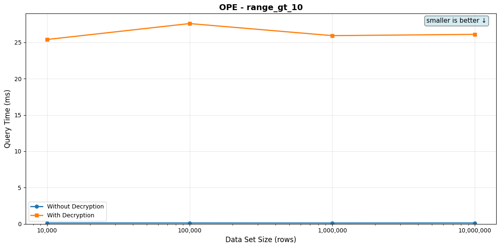
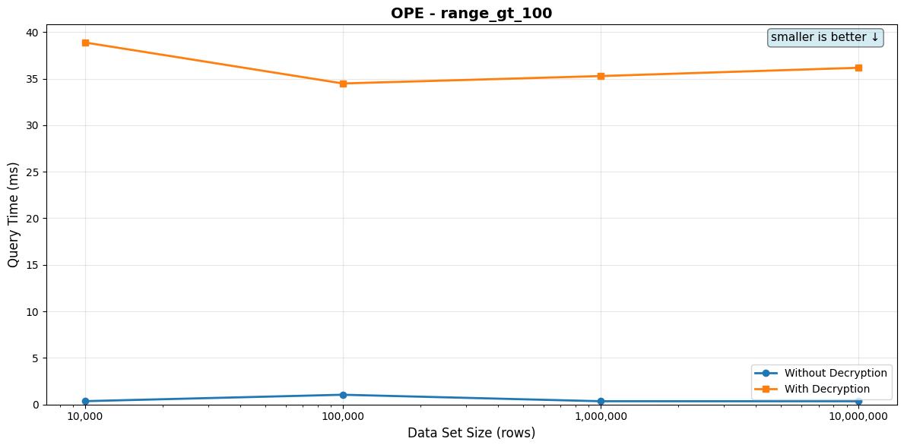
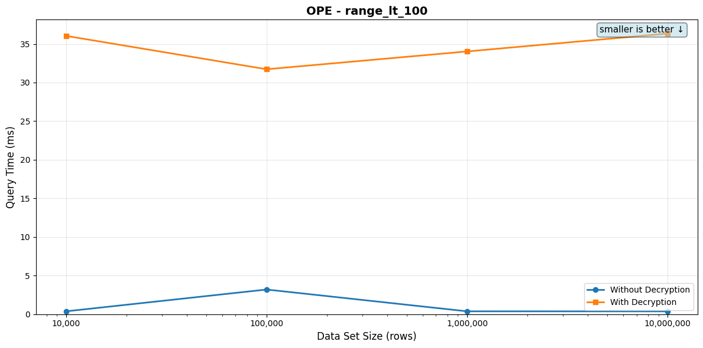
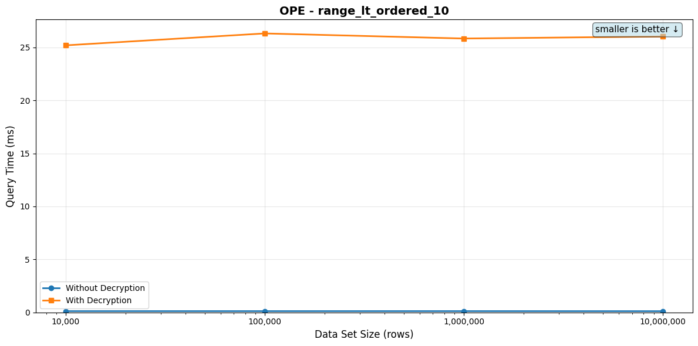

# OPE Queries

[← Back to overview](./BENCHMARK_REPORT.md)

Per-tier query performance. Each scenario lists its SQL, the indexes available on the target table, the indexes the planner actually picked per tier, the timing table, and the full EXPLAIN plan in a collapsed block.

## range_gt_10

**Description:** Unknown query

****

**Indexes used by the planner (per data set size):**

- 10,000: _none — planner picked a sequential / hash-aggregate / sort plan_
- 100,000: _none — planner picked a sequential / hash-aggregate / sort plan_
- 1,000,000: _none — planner picked a sequential / hash-aggregate / sort plan_
- 10,000,000: _none — planner picked a sequential / hash-aggregate / sort plan_

| Data Set Size | Rows Returned | Query Time (no decrypt) | Query Time (with decrypt) |
|---------------|---------------|-------------------------|---------------------------|
| 10,000 | 10 | 124.26μs | 25.40ms |
| 100,000 | 10 | 126.02μs | 27.59ms |
| 1,000,000 | 10 | 119.24μs | 25.93ms |
| 10,000,000 | 10 | 127.50μs | 26.10ms |

_Rows Returned is the actual count from a one-shot pre-bench execution. For LIMIT-bounded queries it matches the LIMIT (or is lower when the table doesn't have enough matching rows); for aggregates wrapped in `count(*)` it's 1._

<details>
<summary>EXPLAIN plans (per data set size)</summary>

**10,000 rows**

```
Limit
  Seq Scan on integer_encrypted_ope_v3_10000
```

Full `EXPLAIN (FORMAT JSON)`:

```json
[
  {
    "Plan": {
      "Async Capable": false,
      "Node Type": "Limit",
      "Parallel Aware": false,
      "Plan Rows": 10,
      "Plan Width": 310,
      "Plans": [
        {
          "Alias": "integer_encrypted_ope_v3_10000",
          "Async Capable": false,
          "Filter": "(decode(((value)::jsonb ->> 'op'::text), 'hex'::text) > decode(((('{\"c\": \"mBbKOi_ajD8RR*KEc<<Rhc89M7AqEZLH|6?q5J2Y^&Qqk@i=nYF&l`)ATCkZN4uCgR@F)1EJ+T9Uqu$7yi%^D)^Fs4;s*klfTea}Y;|SC5al#Uy4?0l?zPD$ZD>~0Vg\", \"i\": {\"c\": \"value\", \"t\": \"integer_encrypted_ope_v3_10000\"}, \"v\": 3, \"op\": \"00b6e0adc426b1981b4d97c99b6e1fb1299fdf7dd20768335b46da223ac660dd93\"}'::jsonb)::eql_v3.integer_ord_ope)::jsonb ->> 'op'::text), 'hex'::text))",
          "Node Type": "Seq Scan",
          "Parallel Aware": false,
          "Parent Relationship": "Outer",
          "Plan Rows": 4900,
          "Plan Width": 310,
          "Relation Name": "integer_encrypted_ope_v3_10000",
          "Startup Cost": 0.0,
          "Total Cost": 667.0
        }
      ],
      "Startup Cost": 0.0,
      "Total Cost": 1.36
    }
  }
]
```

**100,000 rows**

```
Limit
  Seq Scan on integer_encrypted_ope_v3_100000
```

Full `EXPLAIN (FORMAT JSON)`:

```json
[
  {
    "Plan": {
      "Async Capable": false,
      "Node Type": "Limit",
      "Parallel Aware": false,
      "Plan Rows": 10,
      "Plan Width": 310,
      "Plans": [
        {
          "Alias": "integer_encrypted_ope_v3_100000",
          "Async Capable": false,
          "Filter": "(decode(((value)::jsonb ->> 'op'::text), 'hex'::text) > decode(((('{\"c\": \"mBbJ}&XUD-x*pRImY=ziRm6wH7O8AtCGbtfs8RoE%qq?3vU?k$8NbfNAjF`?&j}TIg>yV(L?1L>$PCIfktJsGc%(32jW4JYLZx<LY;|SC5al#Uy4?0l?zPD$ZD>~0Vg\", \"i\": {\"c\": \"value\", \"t\": \"integer_encrypted_ope_v3_100000\"}, \"v\": 3, \"op\": \"00b6e0adc426b1981b4d97c99b6e1fb1299fdf7dd20768335b46da223ac660dd93\"}'::jsonb)::eql_v3.integer_ord_ope)::jsonb ->> 'op'::text), 'hex'::text))",
          "Node Type": "Seq Scan",
          "Parallel Aware": false,
          "Parent Relationship": "Outer",
          "Plan Rows": 49000,
          "Plan Width": 310,
          "Relation Name": "integer_encrypted_ope_v3_100000",
          "Startup Cost": 0.0,
          "Total Cost": 6667.0
        }
      ],
      "Startup Cost": 0.0,
      "Total Cost": 1.36
    }
  }
]
```

**1,000,000 rows**

```
Limit
  Seq Scan on integer_encrypted_ope_v3_1000000
```

Full `EXPLAIN (FORMAT JSON)`:

```json
[
  {
    "Plan": {
      "Async Capable": false,
      "Node Type": "Limit",
      "Parallel Aware": false,
      "Plan Rows": 10,
      "Plan Width": 310,
      "Plans": [
        {
          "Alias": "integer_encrypted_ope_v3_1000000",
          "Async Capable": false,
          "Filter": "(decode(((value)::jsonb ->> 'op'::text), 'hex'::text) > decode(((('{\"c\": \"mBbK+?~T_j#`TM@qnj*iH=a(!7LZxN6ukdL0nx1oml)*as3z!Jf2qpEAlsgc6z|IH`yBH)%q-Xzec<;TJAyT-&H#&y#-9D5>7{mIY;|SC5al#Uy4?0l?zPD$ZD>~0Vg\", \"i\": {\"c\": \"value\", \"t\": \"integer_encrypted_ope_v3_1000000\"}, \"v\": 3, \"op\": \"00b6e0adc426b1981b4d97c99b6e1fb1299fdf7dd20768335b46da223ac660dd93\"}'::jsonb)::eql_v3.integer_ord_ope)::jsonb ->> 'op'::text), 'hex'::text))",
          "Node Type": "Seq Scan",
          "Parallel Aware": false,
          "Parent Relationship": "Outer",
          "Plan Rows": 489999,
          "Plan Width": 310,
          "Relation Name": "integer_encrypted_ope_v3_1000000",
          "Startup Cost": 0.0,
          "Total Cost": 66666.93
        }
      ],
      "Startup Cost": 0.0,
      "Total Cost": 1.36
    }
  }
]
```

**10,000,000 rows**

```
Limit
  Seq Scan on integer_encrypted_ope_v3_10000000
```

Full `EXPLAIN (FORMAT JSON)`:

```json
[
  {
    "Plan": {
      "Async Capable": false,
      "Node Type": "Limit",
      "Parallel Aware": false,
      "Plan Rows": 10,
      "Plan Width": 310,
      "Plans": [
        {
          "Alias": "integer_encrypted_ope_v3_10000000",
          "Async Capable": false,
          "Filter": "(decode(((value)::jsonb ->> 'op'::text), 'hex'::text) > decode(((('{\"c\": \"mBbJ*D^%CH^pK*8eNzy+PiQd27MH8AXOFm^1`Y~3T6iZaN9zPUOl+XUAdm(#CHXW6rcMcPu2+gn3!Pn*r1z?aTD3E|d|Ja6rKNUZY;|SC5al#Uy4?0l?zPD$ZD>~0Vg\", \"i\": {\"c\": \"value\", \"t\": \"integer_encrypted_ope_v3_10000000\"}, \"v\": 3, \"op\": \"00b6e0adc426b1981b4d97c99b6e1fb1299fdf7dd20768335b46da223ac660dd93\"}'::jsonb)::eql_v3.integer_ord_ope)::jsonb ->> 'op'::text), 'hex'::text))",
          "Node Type": "Seq Scan",
          "Parallel Aware": false,
          "Parent Relationship": "Outer",
          "Plan Rows": 4900004,
          "Plan Width": 310,
          "Relation Name": "integer_encrypted_ope_v3_10000000",
          "Startup Cost": 0.0,
          "Total Cost": 666667.2
        }
      ],
      "Startup Cost": 0.0,
      "Total Cost": 1.36
    }
  }
]
```

</details>



## range_gt_100

**Description:** Unknown query

****

**Indexes used by the planner (per data set size):**

- 10,000: _none — planner picked a sequential / hash-aggregate / sort plan_
- 100,000: _none — planner picked a sequential / hash-aggregate / sort plan_
- 1,000,000: _none — planner picked a sequential / hash-aggregate / sort plan_
- 10,000,000: _none — planner picked a sequential / hash-aggregate / sort plan_

| Data Set Size | Rows Returned | Query Time (no decrypt) | Query Time (with decrypt) |
|---------------|---------------|-------------------------|---------------------------|
| 10,000 | 100 | 359.32μs | 38.88ms |
| 100,000 | 100 | 1.05ms | 34.48ms |
| 1,000,000 | 100 | 352.02μs | 35.28ms |
| 10,000,000 | 100 | 349.36μs | 36.17ms |

_Rows Returned is the actual count from a one-shot pre-bench execution. For LIMIT-bounded queries it matches the LIMIT (or is lower when the table doesn't have enough matching rows); for aggregates wrapped in `count(*)` it's 1._

<details>
<summary>EXPLAIN plans (per data set size)</summary>

**10,000 rows**

```
Limit
  Seq Scan on integer_encrypted_ope_v3_10000
```

Full `EXPLAIN (FORMAT JSON)`:

```json
[
  {
    "Plan": {
      "Async Capable": false,
      "Node Type": "Limit",
      "Parallel Aware": false,
      "Plan Rows": 100,
      "Plan Width": 310,
      "Plans": [
        {
          "Alias": "integer_encrypted_ope_v3_10000",
          "Async Capable": false,
          "Filter": "(decode(((value)::jsonb ->> 'op'::text), 'hex'::text) > decode(((('{\"c\": \"mBbLs&G5#%sfy7<#%LR^)WDR)7I7n!?B?=f;uf!T&BfL$Wmx_<tEX+mAOQ{uSd(?eKKbudJAux_P@(pqFY6_1epG$ZPu((#tEF~fY;|SC5al#Uy4?0l?zPD$ZD>~0Vg\", \"i\": {\"c\": \"value\", \"t\": \"integer_encrypted_ope_v3_10000\"}, \"v\": 3, \"op\": \"00b6e0adc426b1981b4d97c99b6e1fb1299fdf7dd20768335b46da223ac660dd93\"}'::jsonb)::eql_v3.integer_ord_ope)::jsonb ->> 'op'::text), 'hex'::text))",
          "Node Type": "Seq Scan",
          "Parallel Aware": false,
          "Parent Relationship": "Outer",
          "Plan Rows": 4900,
          "Plan Width": 310,
          "Relation Name": "integer_encrypted_ope_v3_10000",
          "Startup Cost": 0.0,
          "Total Cost": 667.0
        }
      ],
      "Startup Cost": 0.0,
      "Total Cost": 13.61
    }
  }
]
```

**100,000 rows**

```
Limit
  Seq Scan on integer_encrypted_ope_v3_100000
```

Full `EXPLAIN (FORMAT JSON)`:

```json
[
  {
    "Plan": {
      "Async Capable": false,
      "Node Type": "Limit",
      "Parallel Aware": false,
      "Plan Rows": 100,
      "Plan Width": 310,
      "Plans": [
        {
          "Alias": "integer_encrypted_ope_v3_100000",
          "Async Capable": false,
          "Filter": "(decode(((value)::jsonb ->> 'op'::text), 'hex'::text) > decode(((('{\"c\": \"mBbJg#7PiKl7cIG3<TF)2H23q77fsZX%@sk(S=!7Hd<K^Il!<1ERmYTAdezF=k7rJ3zv-DThS)u7%kHfwn2$4=br@GUm|+b_@#DXY;|SC5al#Uy4?0l?zPD$ZD>~0Vg\", \"i\": {\"c\": \"value\", \"t\": \"integer_encrypted_ope_v3_100000\"}, \"v\": 3, \"op\": \"00b6e0adc426b1981b4d97c99b6e1fb1299fdf7dd20768335b46da223ac660dd93\"}'::jsonb)::eql_v3.integer_ord_ope)::jsonb ->> 'op'::text), 'hex'::text))",
          "Node Type": "Seq Scan",
          "Parallel Aware": false,
          "Parent Relationship": "Outer",
          "Plan Rows": 49000,
          "Plan Width": 310,
          "Relation Name": "integer_encrypted_ope_v3_100000",
          "Startup Cost": 0.0,
          "Total Cost": 6667.0
        }
      ],
      "Startup Cost": 0.0,
      "Total Cost": 13.61
    }
  }
]
```

**1,000,000 rows**

```
Limit
  Seq Scan on integer_encrypted_ope_v3_1000000
```

Full `EXPLAIN (FORMAT JSON)`:

```json
[
  {
    "Plan": {
      "Async Capable": false,
      "Node Type": "Limit",
      "Parallel Aware": false,
      "Plan Rows": 100,
      "Plan Width": 310,
      "Plans": [
        {
          "Alias": "integer_encrypted_ope_v3_1000000",
          "Async Capable": false,
          "Filter": "(decode(((value)::jsonb ->> 'op'::text), 'hex'::text) > decode(((('{\"c\": \"mBbK^x+*{V9>s0@xqq8!@$@Ie7Hv#zmfs$2NNA)Arr0hEUddlL8e(9?Ai6MMMq+lgn2l=wZ$yw%`=a`HGHb9I67$@@1%pEHLZx<LY;|SC5al#Uy4?0l?zPD$ZD>~0Vg\", \"i\": {\"c\": \"value\", \"t\": \"integer_encrypted_ope_v3_1000000\"}, \"v\": 3, \"op\": \"00b6e0adc426b1981b4d97c99b6e1fb1299fdf7dd20768335b46da223ac660dd93\"}'::jsonb)::eql_v3.integer_ord_ope)::jsonb ->> 'op'::text), 'hex'::text))",
          "Node Type": "Seq Scan",
          "Parallel Aware": false,
          "Parent Relationship": "Outer",
          "Plan Rows": 489999,
          "Plan Width": 310,
          "Relation Name": "integer_encrypted_ope_v3_1000000",
          "Startup Cost": 0.0,
          "Total Cost": 66666.93
        }
      ],
      "Startup Cost": 0.0,
      "Total Cost": 13.61
    }
  }
]
```

**10,000,000 rows**

```
Limit
  Seq Scan on integer_encrypted_ope_v3_10000000
```

Full `EXPLAIN (FORMAT JSON)`:

```json
[
  {
    "Plan": {
      "Async Capable": false,
      "Node Type": "Limit",
      "Parallel Aware": false,
      "Plan Rows": 100,
      "Plan Width": 310,
      "Plans": [
        {
          "Alias": "integer_encrypted_ope_v3_10000000",
          "Async Capable": false,
          "Filter": "(decode(((value)::jsonb ->> 'op'::text), 'hex'::text) > decode(((('{\"c\": \"mBbLe4)1Uyz>(pXT)IoJmmYk?7GN?It1|j3GB}iQ(^@JTi*pzCuQEf#Adnq%>{7!fs*)%11%*B#nrpq4T!4k^0_9J})dwFJ5T$luY;|SC5al#Uy4?0l?zPD$ZD>~0Vg\", \"i\": {\"c\": \"value\", \"t\": \"integer_encrypted_ope_v3_10000000\"}, \"v\": 3, \"op\": \"00b6e0adc426b1981b4d97c99b6e1fb1299fdf7dd20768335b46da223ac660dd93\"}'::jsonb)::eql_v3.integer_ord_ope)::jsonb ->> 'op'::text), 'hex'::text))",
          "Node Type": "Seq Scan",
          "Parallel Aware": false,
          "Parent Relationship": "Outer",
          "Plan Rows": 4900004,
          "Plan Width": 310,
          "Relation Name": "integer_encrypted_ope_v3_10000000",
          "Startup Cost": 0.0,
          "Total Cost": 666667.2
        }
      ],
      "Startup Cost": 0.0,
      "Total Cost": 13.61
    }
  }
]
```

</details>



## range_lt_10

**Description:** Unknown query

****

**Indexes used by the planner (per data set size):**

- 10,000: _none — planner picked a sequential / hash-aggregate / sort plan_
- 100,000: _none — planner picked a sequential / hash-aggregate / sort plan_
- 1,000,000: _none — planner picked a sequential / hash-aggregate / sort plan_
- 10,000,000: _none — planner picked a sequential / hash-aggregate / sort plan_

| Data Set Size | Rows Returned | Query Time (no decrypt) | Query Time (with decrypt) |
|---------------|---------------|-------------------------|---------------------------|
| 10,000 | 10 | 121.12μs | 25.28ms |
| 100,000 | 10 | 136.33μs | 27.61ms |
| 1,000,000 | 10 | 125.81μs | 25.60ms |
| 10,000,000 | 10 | 123.44μs | 26.04ms |

_Rows Returned is the actual count from a one-shot pre-bench execution. For LIMIT-bounded queries it matches the LIMIT (or is lower when the table doesn't have enough matching rows); for aggregates wrapped in `count(*)` it's 1._

<details>
<summary>EXPLAIN plans (per data set size)</summary>

**10,000 rows**

```
Limit
  Seq Scan on integer_encrypted_ope_v3_10000
```

Full `EXPLAIN (FORMAT JSON)`:

```json
[
  {
    "Plan": {
      "Async Capable": false,
      "Node Type": "Limit",
      "Parallel Aware": false,
      "Plan Rows": 10,
      "Plan Width": 310,
      "Plans": [
        {
          "Alias": "integer_encrypted_ope_v3_10000",
          "Async Capable": false,
          "Filter": "(decode(((value)::jsonb ->> 'op'::text), 'hex'::text) < decode(((('{\"c\": \"mBbK`7(rQM<WzwK=jxi1Ix<ki7B=EPm~jJ%a8ZSAtBa|RE;v(%5qyNiAm}Ku&^H@~N_tF30$2|~QaFqdN8V_z0mQXP4hxB+c%^n>Y;|SC5al#Uy4?0l?zPD$ZD>~0Vg\", \"i\": {\"c\": \"value\", \"t\": \"integer_encrypted_ope_v3_10000\"}, \"v\": 3, \"op\": \"00b6e0adc426b1981b4d97c99b6e1fb1299fdf7dd20768335b46da223ac660dd93\"}'::jsonb)::eql_v3.integer_ord_ope)::jsonb ->> 'op'::text), 'hex'::text))",
          "Node Type": "Seq Scan",
          "Parallel Aware": false,
          "Parent Relationship": "Outer",
          "Plan Rows": 5099,
          "Plan Width": 310,
          "Relation Name": "integer_encrypted_ope_v3_10000",
          "Startup Cost": 0.0,
          "Total Cost": 667.0
        }
      ],
      "Startup Cost": 0.0,
      "Total Cost": 1.31
    }
  }
]
```

**100,000 rows**

```
Limit
  Seq Scan on integer_encrypted_ope_v3_100000
```

Full `EXPLAIN (FORMAT JSON)`:

```json
[
  {
    "Plan": {
      "Async Capable": false,
      "Node Type": "Limit",
      "Parallel Aware": false,
      "Plan Rows": 10,
      "Plan Width": 310,
      "Plans": [
        {
          "Alias": "integer_encrypted_ope_v3_100000",
          "Async Capable": false,
          "Filter": "(decode(((value)::jsonb ->> 'op'::text), 'hex'::text) < decode(((('{\"c\": \"mBbLTg=v9e4Yqyi9>ceKXo|DM7E3f^I%tzHtfr1Wua~@>kaKMk<Z;HtAdBB@7<oY{kw^{VPfn|dGSJiRyP6u^QPF9UyMhcXIi+@CY;|SC5al#Uy4?0l?zPD$ZD>~0Vg\", \"i\": {\"c\": \"value\", \"t\": \"integer_encrypted_ope_v3_100000\"}, \"v\": 3, \"op\": \"00b6e0adc426b1981b4d97c99b6e1fb1299fdf7dd20768335b46da223ac660dd93\"}'::jsonb)::eql_v3.integer_ord_ope)::jsonb ->> 'op'::text), 'hex'::text))",
          "Node Type": "Seq Scan",
          "Parallel Aware": false,
          "Parent Relationship": "Outer",
          "Plan Rows": 50999,
          "Plan Width": 310,
          "Relation Name": "integer_encrypted_ope_v3_100000",
          "Startup Cost": 0.0,
          "Total Cost": 6667.0
        }
      ],
      "Startup Cost": 0.0,
      "Total Cost": 1.31
    }
  }
]
```

**1,000,000 rows**

```
Limit
  Seq Scan on integer_encrypted_ope_v3_1000000
```

Full `EXPLAIN (FORMAT JSON)`:

```json
[
  {
    "Plan": {
      "Async Capable": false,
      "Node Type": "Limit",
      "Parallel Aware": false,
      "Plan Rows": 10,
      "Plan Width": 310,
      "Plans": [
        {
          "Alias": "integer_encrypted_ope_v3_1000000",
          "Async Capable": false,
          "Filter": "(decode(((value)::jsonb ->> 'op'::text), 'hex'::text) < decode(((('{\"c\": \"mBbLD8ij=<0B8ZygjgKfi6+d%76P1S=XL=`QPQLx;~t`H5PtZ*_i**ZAQ$JwRw%cxS!o=@!`yPKjBvotbFvcM7y<PldQ4aR9;J3+Y;|SC5al#Uy4?0l?zPD$ZD>~0Vg\", \"i\": {\"c\": \"value\", \"t\": \"integer_encrypted_ope_v3_1000000\"}, \"v\": 3, \"op\": \"00b6e0adc426b1981b4d97c99b6e1fb1299fdf7dd20768335b46da223ac660dd93\"}'::jsonb)::eql_v3.integer_ord_ope)::jsonb ->> 'op'::text), 'hex'::text))",
          "Node Type": "Seq Scan",
          "Parallel Aware": false,
          "Parent Relationship": "Outer",
          "Plan Rows": 509997,
          "Plan Width": 310,
          "Relation Name": "integer_encrypted_ope_v3_1000000",
          "Startup Cost": 0.0,
          "Total Cost": 66666.93
        }
      ],
      "Startup Cost": 0.0,
      "Total Cost": 1.31
    }
  }
]
```

**10,000,000 rows**

```
Limit
  Seq Scan on integer_encrypted_ope_v3_10000000
```

Full `EXPLAIN (FORMAT JSON)`:

```json
[
  {
    "Plan": {
      "Async Capable": false,
      "Node Type": "Limit",
      "Parallel Aware": false,
      "Plan Rows": 10,
      "Plan Width": 310,
      "Plans": [
        {
          "Alias": "integer_encrypted_ope_v3_10000000",
          "Async Capable": false,
          "Filter": "(decode(((value)::jsonb ->> 'op'::text), 'hex'::text) < decode(((('{\"c\": \"mBbJ}KN@m0Vt!q?H|+?q@!Gb;7OHRNfZTiRlhr}j(ldytUg~02ZMfCMAR}Q8>jjQ^*dZ^EXLiGP5&Q3<c;&v|4cZQZeVMLnhoyF5Y;|SC5al#Uy4?0l?zPD$ZD>~0Vg\", \"i\": {\"c\": \"value\", \"t\": \"integer_encrypted_ope_v3_10000000\"}, \"v\": 3, \"op\": \"00b6e0adc426b1981b4d97c99b6e1fb1299fdf7dd20768335b46da223ac660dd93\"}'::jsonb)::eql_v3.integer_ord_ope)::jsonb ->> 'op'::text), 'hex'::text))",
          "Node Type": "Seq Scan",
          "Parallel Aware": false,
          "Parent Relationship": "Outer",
          "Plan Rows": 5100003,
          "Plan Width": 310,
          "Relation Name": "integer_encrypted_ope_v3_10000000",
          "Startup Cost": 0.0,
          "Total Cost": 666667.2
        }
      ],
      "Startup Cost": 0.0,
      "Total Cost": 1.31
    }
  }
]
```

</details>


## range_lt_100

**Description:** Unknown query

****

**Indexes used by the planner (per data set size):**

- 10,000: _none — planner picked a sequential / hash-aggregate / sort plan_
- 100,000: _none — planner picked a sequential / hash-aggregate / sort plan_
- 1,000,000: _none — planner picked a sequential / hash-aggregate / sort plan_
- 10,000,000: _none — planner picked a sequential / hash-aggregate / sort plan_

| Data Set Size | Rows Returned | Query Time (no decrypt) | Query Time (with decrypt) |
|---------------|---------------|-------------------------|---------------------------|
| 10,000 | 100 | 375.98μs | 36.05ms |
| 100,000 | 100 | 3.20ms | 31.73ms |
| 1,000,000 | 100 | 375.96μs | 34.03ms |
| 10,000,000 | 100 | 369.13μs | 36.35ms |

_Rows Returned is the actual count from a one-shot pre-bench execution. For LIMIT-bounded queries it matches the LIMIT (or is lower when the table doesn't have enough matching rows); for aggregates wrapped in `count(*)` it's 1._

<details>
<summary>EXPLAIN plans (per data set size)</summary>

**10,000 rows**

```
Limit
  Seq Scan on integer_encrypted_ope_v3_10000
```

Full `EXPLAIN (FORMAT JSON)`:

```json
[
  {
    "Plan": {
      "Async Capable": false,
      "Node Type": "Limit",
      "Parallel Aware": false,
      "Plan Rows": 100,
      "Plan Width": 310,
      "Plans": [
        {
          "Alias": "integer_encrypted_ope_v3_10000",
          "Async Capable": false,
          "Filter": "(decode(((value)::jsonb ->> 'op'::text), 'hex'::text) < decode(((('{\"c\": \"mBbLvE10t2Akl*opobYXOeVm@7TEpdcklge_K7Q?YL@CQMc_!rl84X4AWgv~tAx-BN9<(tIQKV1-U7S^<F5HP<^BnD!v8WB?WJ~MY;|SC5al#Uy4?0l?zPD$ZD>~0Vg\", \"i\": {\"c\": \"value\", \"t\": \"integer_encrypted_ope_v3_10000\"}, \"v\": 3, \"op\": \"00b6e0adc426b1981b4d97c99b6e1fb1299fdf7dd20768335b46da223ac660dd93\"}'::jsonb)::eql_v3.integer_ord_ope)::jsonb ->> 'op'::text), 'hex'::text))",
          "Node Type": "Seq Scan",
          "Parallel Aware": false,
          "Parent Relationship": "Outer",
          "Plan Rows": 5099,
          "Plan Width": 310,
          "Relation Name": "integer_encrypted_ope_v3_10000",
          "Startup Cost": 0.0,
          "Total Cost": 667.0
        }
      ],
      "Startup Cost": 0.0,
      "Total Cost": 13.08
    }
  }
]
```

**100,000 rows**

```
Limit
  Seq Scan on integer_encrypted_ope_v3_100000
```

Full `EXPLAIN (FORMAT JSON)`:

```json
[
  {
    "Plan": {
      "Async Capable": false,
      "Node Type": "Limit",
      "Parallel Aware": false,
      "Plan Rows": 100,
      "Plan Width": 310,
      "Plans": [
        {
          "Alias": "integer_encrypted_ope_v3_100000",
          "Async Capable": false,
          "Filter": "(decode(((value)::jsonb ->> 'op'::text), 'hex'::text) < decode(((('{\"c\": \"mBbJ%R0?+PM(81m9WxGq#ia(s77qsA;%<K}n)8)2A)e{WP~QpOfmDjbAZKn9)pN*8@S2}Btc7x^lpFwVM`8j|Nx_;|t5B3k@}+iRY;|SC5al#Uy4?0l?zPD$ZD>~0Vg\", \"i\": {\"c\": \"value\", \"t\": \"integer_encrypted_ope_v3_100000\"}, \"v\": 3, \"op\": \"00b6e0adc426b1981b4d97c99b6e1fb1299fdf7dd20768335b46da223ac660dd93\"}'::jsonb)::eql_v3.integer_ord_ope)::jsonb ->> 'op'::text), 'hex'::text))",
          "Node Type": "Seq Scan",
          "Parallel Aware": false,
          "Parent Relationship": "Outer",
          "Plan Rows": 50999,
          "Plan Width": 310,
          "Relation Name": "integer_encrypted_ope_v3_100000",
          "Startup Cost": 0.0,
          "Total Cost": 6667.0
        }
      ],
      "Startup Cost": 0.0,
      "Total Cost": 13.07
    }
  }
]
```

**1,000,000 rows**

```
Limit
  Seq Scan on integer_encrypted_ope_v3_1000000
```

Full `EXPLAIN (FORMAT JSON)`:

```json
[
  {
    "Plan": {
      "Async Capable": false,
      "Node Type": "Limit",
      "Parallel Aware": false,
      "Plan Rows": 100,
      "Plan Width": 310,
      "Plans": [
        {
          "Alias": "integer_encrypted_ope_v3_1000000",
          "Async Capable": false,
          "Filter": "(decode(((value)::jsonb ->> 'op'::text), 'hex'::text) < decode(((('{\"c\": \"mBbL*TdMC>F-tFWYV>tK-6fR77Gb5r_O}cXX52nQ{mHERx3mOd5A^TEAfu38=XVTgldQz&@P#7ScrGgG!7$tJGX|G6D(&_RwxxDqY;|SC5al#Uy4?0l?zPD$ZD>~0Vg\", \"i\": {\"c\": \"value\", \"t\": \"integer_encrypted_ope_v3_1000000\"}, \"v\": 3, \"op\": \"00b6e0adc426b1981b4d97c99b6e1fb1299fdf7dd20768335b46da223ac660dd93\"}'::jsonb)::eql_v3.integer_ord_ope)::jsonb ->> 'op'::text), 'hex'::text))",
          "Node Type": "Seq Scan",
          "Parallel Aware": false,
          "Parent Relationship": "Outer",
          "Plan Rows": 509997,
          "Plan Width": 310,
          "Relation Name": "integer_encrypted_ope_v3_1000000",
          "Startup Cost": 0.0,
          "Total Cost": 66666.93
        }
      ],
      "Startup Cost": 0.0,
      "Total Cost": 13.07
    }
  }
]
```

**10,000,000 rows**

```
Limit
  Seq Scan on integer_encrypted_ope_v3_10000000
```

Full `EXPLAIN (FORMAT JSON)`:

```json
[
  {
    "Plan": {
      "Async Capable": false,
      "Node Type": "Limit",
      "Parallel Aware": false,
      "Plan Rows": 100,
      "Plan Width": 310,
      "Plans": [
        {
          "Alias": "integer_encrypted_ope_v3_10000000",
          "Async Capable": false,
          "Filter": "(decode(((value)::jsonb ->> 'op'::text), 'hex'::text) < decode(((('{\"c\": \"mBbLdM+5GJke|qCGORG`xKKvK7F?Mgu)3q~=x~dENpA(a;icNDTXy8cAYTp~cDv-iprp`767t1j2lop6k1&OJU(wGg2@nCGZKZZ$Y;|SC5al#Uy4?0l?zPD$ZD>~0Vg\", \"i\": {\"c\": \"value\", \"t\": \"integer_encrypted_ope_v3_10000000\"}, \"v\": 3, \"op\": \"00b6e0adc426b1981b4d97c99b6e1fb1299fdf7dd20768335b46da223ac660dd93\"}'::jsonb)::eql_v3.integer_ord_ope)::jsonb ->> 'op'::text), 'hex'::text))",
          "Node Type": "Seq Scan",
          "Parallel Aware": false,
          "Parent Relationship": "Outer",
          "Plan Rows": 5100003,
          "Plan Width": 310,
          "Relation Name": "integer_encrypted_ope_v3_10000000",
          "Startup Cost": 0.0,
          "Total Cost": 666667.2
        }
      ],
      "Startup Cost": 0.0,
      "Total Cost": 13.07
    }
  }
]
```

</details>



## range_lt_ordered_10

**Description:** Unknown query

****

**Indexes used by the planner (per data set size):**

- 10,000: `integer_encrypted_ope_v3_10000_ope_index`
- 100,000: `integer_encrypted_ope_v3_100000_ope_index`
- 1,000,000: `integer_encrypted_ope_v3_1000000_ope_index`
- 10,000,000: `integer_encrypted_ope_v3_10000000_ope_index`

| Data Set Size | Rows Returned | Query Time (no decrypt) | Query Time (with decrypt) |
|---------------|---------------|-------------------------|---------------------------|
| 10,000 | 10 | 121.35μs | 25.20ms |
| 100,000 | 10 | 120.86μs | 26.32ms |
| 1,000,000 | 10 | 121.70μs | 25.84ms |
| 10,000,000 | 10 | 117.03μs | 26.03ms |

_Rows Returned is the actual count from a one-shot pre-bench execution. For LIMIT-bounded queries it matches the LIMIT (or is lower when the table doesn't have enough matching rows); for aggregates wrapped in `count(*)` it's 1._

<details>
<summary>EXPLAIN plans (per data set size)</summary>

**10,000 rows**

```
Limit
  Index Scan using integer_encrypted_ope_v3_10000_ope_index on integer_encrypted_ope_v3_10000
```

Full `EXPLAIN (FORMAT JSON)`:

```json
[
  {
    "Plan": {
      "Async Capable": false,
      "Node Type": "Limit",
      "Parallel Aware": false,
      "Plan Rows": 10,
      "Plan Width": 342,
      "Plans": [
        {
          "Alias": "integer_encrypted_ope_v3_10000",
          "Async Capable": false,
          "Index Cond": "(decode(((value)::jsonb ->> 'op'::text), 'hex'::text) < decode(((('{\"c\": \"mBbL#Nr!vV5d4dUCz}Rt{Cm#C7A<DpTKYLULusc<;$tlk;iptW(J;KkASt4wT-|AWnbta9e<J-gjJF%6lzU|g!^P7`K5~bLZ>4r&Y;|SC5al#Uy4?0l?zPD$ZD>~0Vg\", \"i\": {\"c\": \"value\", \"t\": \"integer_encrypted_ope_v3_10000\"}, \"v\": 3, \"op\": \"00b6e0adc426b1981b4d97c99b6e1fb1299fdf7dd20768335b46da223ac660dd93\"}'::jsonb)::eql_v3.integer_ord_ope)::jsonb ->> 'op'::text), 'hex'::text))",
          "Index Name": "integer_encrypted_ope_v3_10000_ope_index",
          "Node Type": "Index Scan",
          "Parallel Aware": false,
          "Parent Relationship": "Outer",
          "Plan Rows": 5099,
          "Plan Width": 342,
          "Relation Name": "integer_encrypted_ope_v3_10000",
          "Scan Direction": "Forward",
          "Startup Cost": 0.29,
          "Total Cost": 1935.0
        }
      ],
      "Startup Cost": 0.29,
      "Total Cost": 4.09
    }
  }
]
```

**100,000 rows**

```
Limit
  Index Scan using integer_encrypted_ope_v3_100000_ope_index on integer_encrypted_ope_v3_100000
```

Full `EXPLAIN (FORMAT JSON)`:

```json
[
  {
    "Plan": {
      "Async Capable": false,
      "Node Type": "Limit",
      "Parallel Aware": false,
      "Plan Rows": 10,
      "Plan Width": 342,
      "Plans": [
        {
          "Alias": "integer_encrypted_ope_v3_100000",
          "Async Capable": false,
          "Index Cond": "(decode(((value)::jsonb ->> 'op'::text), 'hex'::text) < decode(((('{\"c\": \"mBbK7g!PJwK8UTvfXl!6v2XRn7Bj_VXw=|129ohRluho~2X@7`qRY+1ARo+^qDvRPLhyfvLG6yt_g@7}_fTgfr>|yg`HVRVNu_pSY;|SC5al#Uy4?0l?zPD$ZD>~0Vg\", \"i\": {\"c\": \"value\", \"t\": \"integer_encrypted_ope_v3_100000\"}, \"v\": 3, \"op\": \"00b6e0adc426b1981b4d97c99b6e1fb1299fdf7dd20768335b46da223ac660dd93\"}'::jsonb)::eql_v3.integer_ord_ope)::jsonb ->> 'op'::text), 'hex'::text))",
          "Index Name": "integer_encrypted_ope_v3_100000_ope_index",
          "Node Type": "Index Scan",
          "Parallel Aware": false,
          "Parent Relationship": "Outer",
          "Plan Rows": 50999,
          "Plan Width": 342,
          "Relation Name": "integer_encrypted_ope_v3_100000",
          "Scan Direction": "Forward",
          "Startup Cost": 0.42,
          "Total Cost": 19293.98
        }
      ],
      "Startup Cost": 0.42,
      "Total Cost": 4.21
    }
  }
]
```

**1,000,000 rows**

```
Limit
  Index Scan using integer_encrypted_ope_v3_1000000_ope_index on integer_encrypted_ope_v3_1000000
```

Full `EXPLAIN (FORMAT JSON)`:

```json
[
  {
    "Plan": {
      "Async Capable": false,
      "Node Type": "Limit",
      "Parallel Aware": false,
      "Plan Rows": 10,
      "Plan Width": 342,
      "Plans": [
        {
          "Alias": "integer_encrypted_ope_v3_1000000",
          "Async Capable": false,
          "Index Cond": "(decode(((value)::jsonb ->> 'op'::text), 'hex'::text) < decode(((('{\"c\": \"mBbKezDw|;`?yAXfWc`e9n|Z@77X~ROK@ra?bIjs@5QIeh?qk&>OD-vAY<H@KkwA8E=f-I7=WV0(K>5O%d`OQ>VG;rYwUr3prv+UY;|SC5al#Uy4?0l?zPD$ZD>~0Vg\", \"i\": {\"c\": \"value\", \"t\": \"integer_encrypted_ope_v3_1000000\"}, \"v\": 3, \"op\": \"00b6e0adc426b1981b4d97c99b6e1fb1299fdf7dd20768335b46da223ac660dd93\"}'::jsonb)::eql_v3.integer_ord_ope)::jsonb ->> 'op'::text), 'hex'::text))",
          "Index Name": "integer_encrypted_ope_v3_1000000_ope_index",
          "Node Type": "Index Scan",
          "Parallel Aware": false,
          "Parent Relationship": "Outer",
          "Plan Rows": 509997,
          "Plan Width": 342,
          "Relation Name": "integer_encrypted_ope_v3_1000000",
          "Scan Direction": "Forward",
          "Startup Cost": 0.43,
          "Total Cost": 192851.31
        }
      ],
      "Startup Cost": 0.43,
      "Total Cost": 4.21
    }
  }
]
```

**10,000,000 rows**

```
Limit
  Index Scan using integer_encrypted_ope_v3_10000000_ope_index on integer_encrypted_ope_v3_10000000
```

Full `EXPLAIN (FORMAT JSON)`:

```json
[
  {
    "Plan": {
      "Async Capable": false,
      "Node Type": "Limit",
      "Parallel Aware": false,
      "Plan Rows": 10,
      "Plan Width": 342,
      "Plans": [
        {
          "Alias": "integer_encrypted_ope_v3_10000000",
          "Async Capable": false,
          "Index Cond": "(decode(((value)::jsonb ->> 'op'::text), 'hex'::text) < decode(((('{\"c\": \"mBbL@j+;gjy@US)2m|md_5%dO7DrC@GK|Q=mXk-9KR0{>9EY9Fq>9MIAP;L)BNx=z^r}7cpPwMkOC9ix!@;H$cp(jY4`+CpVx@LrY;|SC5al#Uy4?0l?zPD$ZD>~0Vg\", \"i\": {\"c\": \"value\", \"t\": \"integer_encrypted_ope_v3_10000000\"}, \"v\": 3, \"op\": \"00b6e0adc426b1981b4d97c99b6e1fb1299fdf7dd20768335b46da223ac660dd93\"}'::jsonb)::eql_v3.integer_ord_ope)::jsonb ->> 'op'::text), 'hex'::text))",
          "Index Name": "integer_encrypted_ope_v3_10000000_ope_index",
          "Node Type": "Index Scan",
          "Parallel Aware": false,
          "Parent Relationship": "Outer",
          "Plan Rows": 5100003,
          "Plan Width": 342,
          "Relation Name": "integer_encrypted_ope_v3_10000000",
          "Scan Direction": "Forward",
          "Startup Cost": 0.57,
          "Total Cost": 1928102.41
        }
      ],
      "Startup Cost": 0.57,
      "Total Cost": 4.35
    }
  }
]
```

</details>



