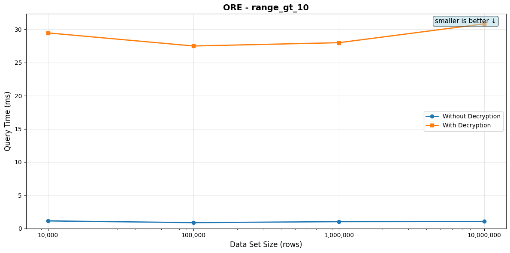
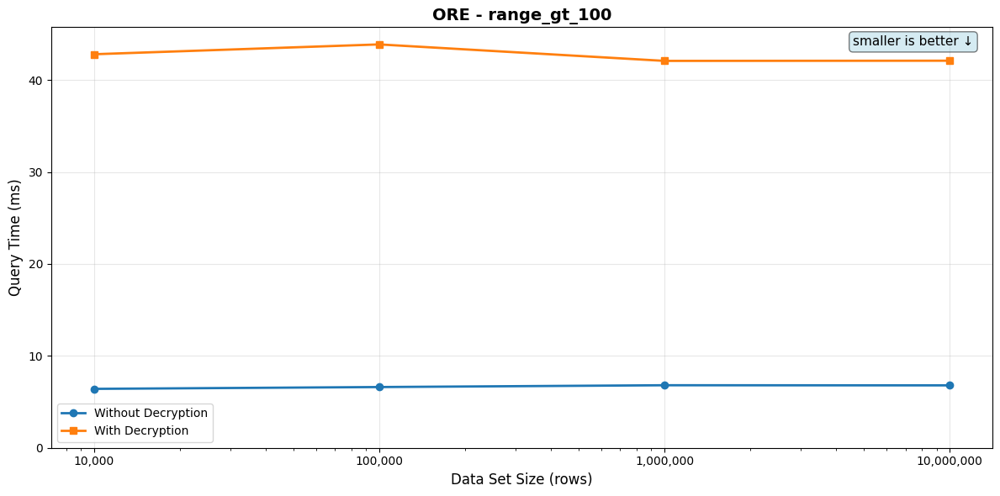
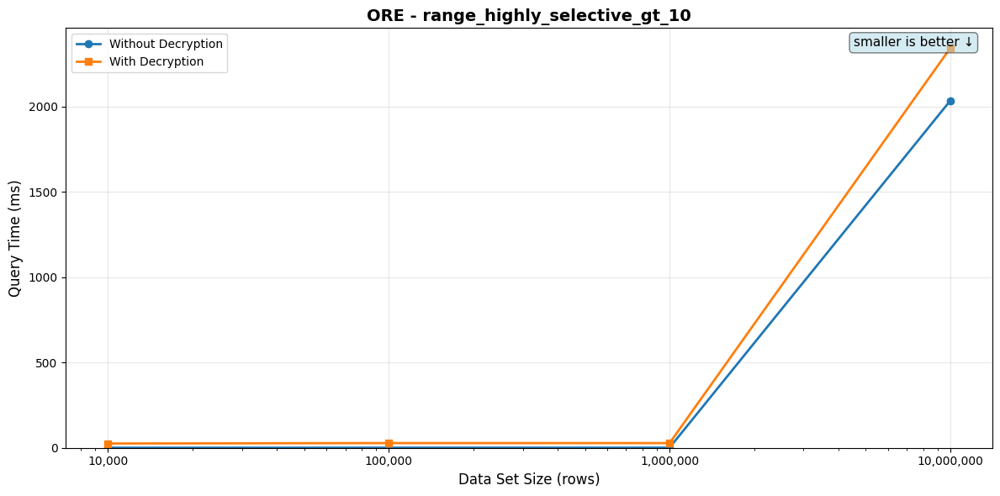
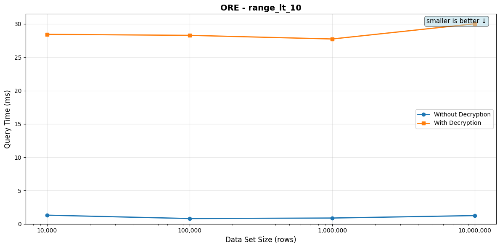
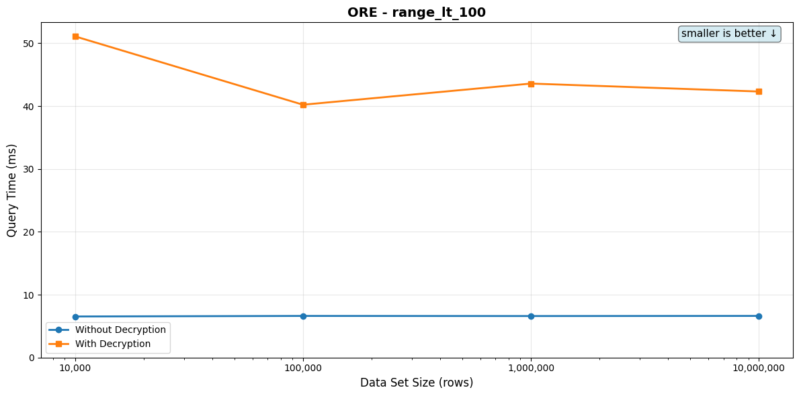
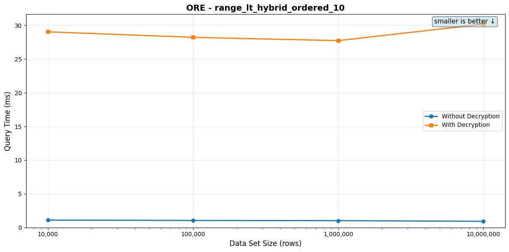
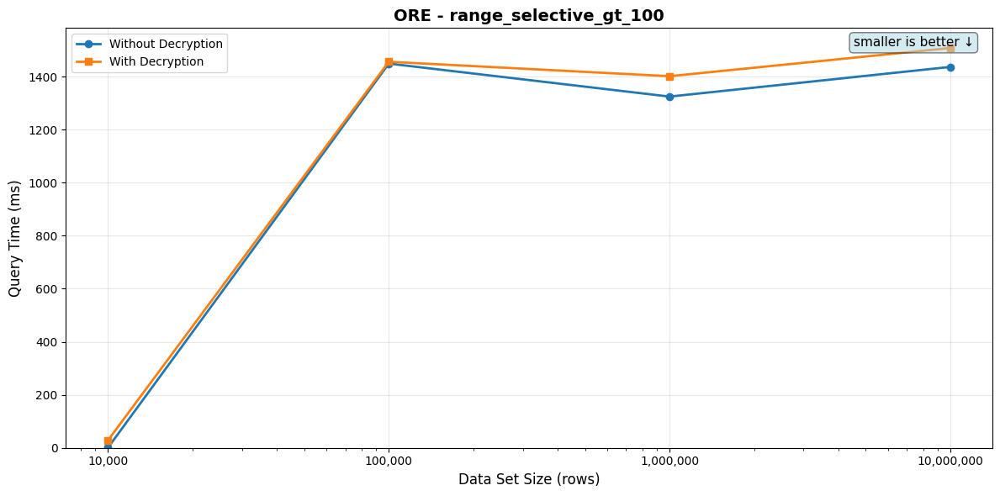

# ORE Queries

[← Back to overview](./BENCHMARK_REPORT.md)

Per-tier query performance. Each scenario lists its SQL, the indexes available on the target table, the indexes the planner actually picked per tier, the timing table, and the full EXPLAIN plan in a collapsed block.

## range_gt_10

**Description:** Range query (greater than) returning 10 results

**SQL Query:**
```sql
SELECT id,value::jsonb FROM {TABLE} WHERE value > $1 LIMIT 10
```

**Parameter:** `5000`

**Table: `integer_encrypted_{rows}` with Block-ORE-encrypted integer values. Index: functional btree on `eql_v2.ore_block_u64_8_256(value)`. The bare-form `<` / `>` operators inline to `eql_v2.ore_block_u64_8_256(a) op eql_v2.ore_block_u64_8_256(b)` post-2.3, so the index engages without query rewriting. Query: WHERE value > 5000 LIMIT 10.**

**Indexes available on the table:**
```sql
CREATE INDEX
integer_encrypted_10000_ore_index
ON integer_encrypted_10000 (
    eql_v2.ore_block_u64_8_256(value)
);
```

**Indexes used by the planner (per data set size):**

- 10,000: _none — planner picked a sequential / hash-aggregate / sort plan_
- 100,000: _none — planner picked a sequential / hash-aggregate / sort plan_
- 1,000,000: _none — planner picked a sequential / hash-aggregate / sort plan_
- 10,000,000: _none — planner picked a sequential / hash-aggregate / sort plan_

| Data Set Size | Rows Returned | Query Time (no decrypt) | Query Time (with decrypt) |
|---------------|---------------|-------------------------|---------------------------|
| 10,000 | 10 | 1.14ms | 29.47ms |
| 100,000 | 10 | 874.90μs | 27.50ms |
| 1,000,000 | 10 | 1.02ms | 27.99ms |
| 10,000,000 | 10 | 1.05ms | 30.84ms |

_Rows Returned is the actual count from a one-shot pre-bench execution. For LIMIT-bounded queries it matches the LIMIT (or is lower when the table doesn't have enough matching rows); for aggregates wrapped in `count(*)` it's 1._

<details>
<summary>EXPLAIN plans (per data set size)</summary>

**10,000 rows**

```
Limit
  Seq Scan on integer_encrypted_10000
```

Full `EXPLAIN (FORMAT JSON)`:

```json
[
  {
    "Plan": {
      "Async Capable": false,
      "Node Type": "Limit",
      "Parallel Aware": false,
      "Plan Rows": 10,
      "Plan Width": 36,
      "Plans": [
        {
          "Alias": "integer_encrypted_10000",
          "Async Capable": false,
          "Filter": "(eql_v2.ore_block_u64_8_256(value) > '(\"{\"\"(\\\\\"\"\\\\\\\\\\\\\\\\x4a4a4a4a7b75d35a800cfa2ff43dcd1b62771a15e33d22e69fda6d34f8e7f8be158e580893b02f753ecf7644fb8c1aba4adf0b01dd621fb107b51a023311e9484b76a975afea7fd7f7d3e6c4a96effd0ce52df7af438bca65a7cbad28e493fef601c3bf913156337fff25712e92fcecde5fdf2c4c33b0dcf6407e8b578be07e00aad33c3a870cb28d496a9cf2c12027027412bf84aa0661d4ff672bdd9481d3e1bc741dd39dbcdcdf706eb49e05c4c2a1ed0db3e091609b0ceaff07d1e6d3b67aee279ea47a7ea305a245a95c10cf561ea235c94bea029b1c3b7d19123d492e5a44e7659579bfd61012a8dea1d103bd60d4fe7d7b5b85fd1bc7b07b5cb8d44b0d67b56888b01a63439be4cb376c98c458a79693fe8687e5f6c20cc8f825cae1f2abe210a1f8fa7a970a79620b0f48e407d3f8d2ffc6fdcf1f223085e3a20e5a9208abfd5f0203b2693ce032139861f65a6fbcbe0be1acd7b7022e2bfcc302815c513588c5c60fad1efa9d0edf1d14d7730e22fb846d431690c2db0be33ad1893b50473b68f14d3c6a2aba04a1be63944366e489be1953701\\\\\"\")\"\"}\")'::eql_v2.ore_block_u64_8_256)",
          "Node Type": "Seq Scan",
          "Parallel Aware": false,
          "Parent Relationship": "Outer",
          "Plan Rows": 5050,
          "Plan Width": 36,
          "Relation Name": "integer_encrypted_10000",
          "Startup Cost": 0.0,
          "Total Cost": 7791.5
        }
      ],
      "Startup Cost": 0.0,
      "Total Cost": 15.43
    }
  }
]
```

**100,000 rows**

```
Limit
  Seq Scan on integer_encrypted_100000
```

Full `EXPLAIN (FORMAT JSON)`:

```json
[
  {
    "Plan": {
      "Async Capable": false,
      "Node Type": "Limit",
      "Parallel Aware": false,
      "Plan Rows": 10,
      "Plan Width": 36,
      "Plans": [
        {
          "Alias": "integer_encrypted_100000",
          "Async Capable": false,
          "Filter": "(eql_v2.ore_block_u64_8_256(value) > '(\"{\"\"(\\\\\"\"\\\\\\\\\\\\\\\\x4a4a4a4a7b75d35a800cfa2ff43dcd1b62771a15e33d22e69fda6d34f8e7f8be158e580893b02f753ecf7644fb8c1aba4adf0b01dd621fb107b51a023311e9484b76a975afea7fd7f7d3e6c4a96effd0ce52df7af438bca65a7cbad28e493fef601c3bf913156337fff25712e92fcecde5fdf2c4c33b0dcf6407e8b578be07e00aad33c3a870cb2887fa79ab6922a3fbece8a25bdef4c17916b4ddfc1858724d76eead689d241f6e289df0b37556748c0d9d2aca977f4513470000b8168f3308fd72025f31fd023d43b06dc4fc81a5e223cc54557451bc5ba4c7f7cf19e3c28ec4065c02461424ac2b0fe449e08bda47ab9ebc150527d82dbce68fa6e13a9b5bfc245afb84f357ca18d7a1a7fb8fa5501638611357c7b5828612addf3441169a9d5e29c78d6019bf186518cc170fc9b1253993f028cb937403b4ba1f0083b37ae2193bb308de175d80442984b6c4c1745d127047b76b381b6f190cb0e7e726deb6d772c9d46104cdf8014c4bc8f69b4f329ec172d2f626259c9854b69f670c2af6b923de020c1e43ba946dcc5e76b5c04b649179b5e078b5\\\\\"\")\"\"}\")'::eql_v2.ore_block_u64_8_256)",
          "Node Type": "Seq Scan",
          "Parallel Aware": false,
          "Parent Relationship": "Outer",
          "Plan Rows": 33333,
          "Plan Width": 36,
          "Relation Name": "integer_encrypted_100000",
          "Startup Cost": 0.0,
          "Total Cost": 73619.25
        }
      ],
      "Startup Cost": 0.0,
      "Total Cost": 22.09
    }
  }
]
```

**1,000,000 rows**

```
Limit
  Seq Scan on integer_encrypted_1000000
```

Full `EXPLAIN (FORMAT JSON)`:

```json
[
  {
    "Plan": {
      "Async Capable": false,
      "Node Type": "Limit",
      "Parallel Aware": false,
      "Plan Rows": 10,
      "Plan Width": 36,
      "Plans": [
        {
          "Alias": "integer_encrypted_1000000",
          "Async Capable": false,
          "Filter": "(eql_v2.ore_block_u64_8_256(value) > '(\"{\"\"(\\\\\"\"\\\\\\\\\\\\\\\\x4a4a4a4a7b75d35a800cfa2ff43dcd1b62771a15e33d22e69fda6d34f8e7f8be158e580893b02f753ecf7644fb8c1aba4adf0b01dd621fb107b51a023311e9484b76a975afea7fd7f7d3e6c4a96effd0ce52df7af438bca65a7cbad28e493fef601c3bf913156337fff25712e92fcecde5fdf2c4c33b0dcf6407e8b578be07e00aad33c3a870cb283ae2aff336287192432a7a2a377d1f6a4d3c1217b0cb2638ad900f3f27e5bd813df25230001866af892842d19eb70bc54e9a722854dac3537bbf78d6d9577f56077c86790b50d198ba195c234772d6581e4dbdf105d9af044a02ffffe87bb4bb904ddada19566bbac3132fc899ee9ab1f352323041bd8ca62814d8208b458e5c860e1bee8c63ab16351b7b8f4442d125a94d38158bf3baae8a17d53ca6b9180a2c4a0609e86999c1a930e2a77de2a04ff19096d427e1bd7ca94e9b1f04aeb145a9c8d064406f2146548e3df866a132fc1dca2b2fd1adc28d67ee24aec7415f5df7174fcc67f5e4bf2923e6f3dd029529fb855159aa232016865cfcf102e1639d5efc4a4d279cf0354c38071b894b999a\\\\\"\")\"\"}\")'::eql_v2.ore_block_u64_8_256)",
          "Node Type": "Seq Scan",
          "Parallel Aware": false,
          "Parent Relationship": "Outer",
          "Plan Rows": 333333,
          "Plan Width": 36,
          "Relation Name": "integer_encrypted_1000000",
          "Startup Cost": 0.0,
          "Total Cost": 736191.25
        }
      ],
      "Startup Cost": 0.0,
      "Total Cost": 22.09
    }
  }
]
```

**10,000,000 rows**

```
Limit
  Seq Scan on integer_encrypted_10000000
```

Full `EXPLAIN (FORMAT JSON)`:

```json
[
  {
    "Plan": {
      "Async Capable": false,
      "Node Type": "Limit",
      "Parallel Aware": false,
      "Plan Rows": 10,
      "Plan Width": 36,
      "Plans": [
        {
          "Alias": "integer_encrypted_10000000",
          "Async Capable": false,
          "Filter": "(eql_v2.ore_block_u64_8_256(value) > '(\"{\"\"(\\\\\"\"\\\\\\\\\\\\\\\\x4a4a4a4a7b75d35a800cfa2ff43dcd1b62771a15e33d22e69fda6d34f8e7f8be158e580893b02f753ecf7644fb8c1aba4adf0b01dd621fb107b51a023311e9484b76a975afea7fd7f7d3e6c4a96effd0ce52df7af438bca65a7cbad28e493fef601c3bf913156337fff25712e92fcecde5fdf2c4c33b0dcf6407e8b578be07e00aad33c3a870cb2890435d5297329edc86d5e7c41670b53c4278d42a4da24b36bc86c2fb88b9a5e51b82dfe94100c4073f909fa4b7755c9ad7420468585422afd102a59717c6dc849cc3ba8edc447958ef581c58b04035ae667cbae950f7e0878af278e28195a2d99db1a2905138ad4fe4abb06598472ceac188b6201a4f1709319be5be7f1e8aeaede760dc7df172ee60c51f32d4cafab3e51ef680e42bfa539e102accab7a612b1c3892f9f4f154e42a7404ecb964484e10caa6d8eec74eba1c698a1a8e78a5c6c9313f56367882d814868aca14ec4cff7f183b394a6ef5f40ba235247a81c9302c948a0e21ed3be1df7c42f17410d0f39e8194dfd022565a6005364dfff93f3315149e0adf66683b3432cd1ee883078d\\\\\"\")\"\"}\")'::eql_v2.ore_block_u64_8_256)",
          "Node Type": "Seq Scan",
          "Parallel Aware": false,
          "Parent Relationship": "Outer",
          "Plan Rows": 3333333,
          "Plan Width": 36,
          "Relation Name": "integer_encrypted_10000000",
          "Startup Cost": 0.0,
          "Total Cost": 7361905.25
        }
      ],
      "Startup Cost": 0.0,
      "Total Cost": 22.09
    }
  }
]
```

</details>



## range_gt_100

**Description:** Range query (greater than) returning 100 results

**SQL Query:**
```sql
SELECT id,value::jsonb FROM {TABLE} WHERE value > $1 LIMIT 100
```

**Parameter:** `5000`

**Table: `integer_encrypted_{rows}` with Block-ORE-encrypted integer values. Index: functional btree on `eql_v2.ore_block_u64_8_256(value)`. Query: WHERE value > 5000 LIMIT 100.**

**Indexes available on the table:**
```sql
CREATE INDEX
integer_encrypted_10000_ore_index
ON integer_encrypted_10000 (
    eql_v2.ore_block_u64_8_256(value)
);
```

**Indexes used by the planner (per data set size):**

- 10,000: _none — planner picked a sequential / hash-aggregate / sort plan_
- 100,000: _none — planner picked a sequential / hash-aggregate / sort plan_
- 1,000,000: _none — planner picked a sequential / hash-aggregate / sort plan_
- 10,000,000: _none — planner picked a sequential / hash-aggregate / sort plan_

| Data Set Size | Rows Returned | Query Time (no decrypt) | Query Time (with decrypt) |
|---------------|---------------|-------------------------|---------------------------|
| 10,000 | 100 | 6.41ms | 42.80ms |
| 100,000 | 100 | 6.61ms | 43.87ms |
| 1,000,000 | 100 | 6.81ms | 42.07ms |
| 10,000,000 | 100 | 6.79ms | 42.09ms |

_Rows Returned is the actual count from a one-shot pre-bench execution. For LIMIT-bounded queries it matches the LIMIT (or is lower when the table doesn't have enough matching rows); for aggregates wrapped in `count(*)` it's 1._

<details>
<summary>EXPLAIN plans (per data set size)</summary>

**10,000 rows**

```
Limit
  Seq Scan on integer_encrypted_10000
```

Full `EXPLAIN (FORMAT JSON)`:

```json
[
  {
    "Plan": {
      "Async Capable": false,
      "Node Type": "Limit",
      "Parallel Aware": false,
      "Plan Rows": 100,
      "Plan Width": 36,
      "Plans": [
        {
          "Alias": "integer_encrypted_10000",
          "Async Capable": false,
          "Filter": "(eql_v2.ore_block_u64_8_256(value) > '(\"{\"\"(\\\\\"\"\\\\\\\\\\\\\\\\x4a4a4a4a7b75d35a800cfa2ff43dcd1b62771a15e33d22e69fda6d34f8e7f8be158e580893b02f753ecf7644fb8c1aba4adf0b01dd621fb107b51a023311e9484b76a975afea7fd7f7d3e6c4a96effd0ce52df7af438bca65a7cbad28e493fef601c3bf913156337fff25712e92fcecde5fdf2c4c33b0dcf6407e8b578be07e00aad33c3a870cb288385f5e7dfa655b2dd4f453733a186c66eb453e1f46b5225f3d440c512c9badd37536b892db1eae6fa6ec72f6548ec3f29436aa5d59de334e6ba86d8ed69e8b91af923d95f965bed5bd84a5f714deb58fe502e63bb8c2a58c4c7e8bd61e53cdc81c6881d91bdb9e98782e0430e6c727844f22bfd798ab931e62980cba256e80538b3813db73be32603a8aa3142664dba1dbc09c7029f81b21f64624ae9e646e22166b68e6d4c5d52a6da0688640cb2ac07c1404de8e86e8e1aa664369a305493e00a01567f48a6e2c34aa90a08c681771601bf864e94bdd23689234fb86c6d6d603bea30e999a6622403405f4de053474de09080f2df7366b0d007e84910347a907bb352f323018c5600dd4d500b59fe\\\\\"\")\"\"}\")'::eql_v2.ore_block_u64_8_256)",
          "Node Type": "Seq Scan",
          "Parallel Aware": false,
          "Parent Relationship": "Outer",
          "Plan Rows": 5050,
          "Plan Width": 36,
          "Relation Name": "integer_encrypted_10000",
          "Startup Cost": 0.0,
          "Total Cost": 7791.5
        }
      ],
      "Startup Cost": 0.0,
      "Total Cost": 154.29
    }
  }
]
```

**100,000 rows**

```
Limit
  Seq Scan on integer_encrypted_100000
```

Full `EXPLAIN (FORMAT JSON)`:

```json
[
  {
    "Plan": {
      "Async Capable": false,
      "Node Type": "Limit",
      "Parallel Aware": false,
      "Plan Rows": 100,
      "Plan Width": 36,
      "Plans": [
        {
          "Alias": "integer_encrypted_100000",
          "Async Capable": false,
          "Filter": "(eql_v2.ore_block_u64_8_256(value) > '(\"{\"\"(\\\\\"\"\\\\\\\\\\\\\\\\x4a4a4a4a7b75d35a800cfa2ff43dcd1b62771a15e33d22e69fda6d34f8e7f8be158e580893b02f753ecf7644fb8c1aba4adf0b01dd621fb107b51a023311e9484b76a975afea7fd7f7d3e6c4a96effd0ce52df7af438bca65a7cbad28e493fef601c3bf913156337fff25712e92fcecde5fdf2c4c33b0dcf6407e8b578be07e00aad33c3a870cb28de69a9ae665f6b140b5ae556a1bbfc214537ac7b4624f8f12be09e19c2f06490769a9e19355bb8d959d556d0fe5becf2aa7664874299016671fcf332a5dac73c584a66dec6ae50bbe29d9dbda833ee0487a3c7dd125ec2a35de08e5e134a1469cdf9a8259c72d5efb04b11d73eaa4f4052636c3532a562b47e6741dfb89f15440de4fb7f5628d89455e3621d46914ed72158a86590ea0f048991bbfa9b229ee7fd07f985078ebbbdcba8ae35f3748c2743d6aa369c04126f691babd6b457a5fec7ef29cfcb9e0c04b6a2a7ea16965b95c7247f5391463d4c748aa98039b82a27b364291101ee56eb753d20e4a78bd89a36c90155e29b3212a9148c82e31720d49da083aed5ddc5479caa9c6b1f8aea01\\\\\"\")\"\"}\")'::eql_v2.ore_block_u64_8_256)",
          "Node Type": "Seq Scan",
          "Parallel Aware": false,
          "Parent Relationship": "Outer",
          "Plan Rows": 33333,
          "Plan Width": 36,
          "Relation Name": "integer_encrypted_100000",
          "Startup Cost": 0.0,
          "Total Cost": 73619.25
        }
      ],
      "Startup Cost": 0.0,
      "Total Cost": 220.86
    }
  }
]
```

**1,000,000 rows**

```
Limit
  Seq Scan on integer_encrypted_1000000
```

Full `EXPLAIN (FORMAT JSON)`:

```json
[
  {
    "Plan": {
      "Async Capable": false,
      "Node Type": "Limit",
      "Parallel Aware": false,
      "Plan Rows": 100,
      "Plan Width": 36,
      "Plans": [
        {
          "Alias": "integer_encrypted_1000000",
          "Async Capable": false,
          "Filter": "(eql_v2.ore_block_u64_8_256(value) > '(\"{\"\"(\\\\\"\"\\\\\\\\\\\\\\\\x4a4a4a4a7b75d35a800cfa2ff43dcd1b62771a15e33d22e69fda6d34f8e7f8be158e580893b02f753ecf7644fb8c1aba4adf0b01dd621fb107b51a023311e9484b76a975afea7fd7f7d3e6c4a96effd0ce52df7af438bca65a7cbad28e493fef601c3bf913156337fff25712e92fcecde5fdf2c4c33b0dcf6407e8b578be07e00aad33c3a870cb287f55c1e235f0f2c4954872c6effcdb6edd6a2940b22e632067473197cf10c783e2c93c17d9a82492f0260804fc091c241b25cbc45693d49bb8364dd1e135ac5ff25400f46370d4fdbe89b63f53c2fc0ca05e29208f2fb04f52a33ba87df85488ef74ae5af4add7dd00e389c4d0066a565fa2fda6978c3330b22fa5dc8915eb8ed9fad6c1db12384a5aab884f4f6eff88ffb6a4d64c184311dbf1a44e37273df568f410499f666747a94dd20781a1b5e212ffee6e2fca807cbd3530d8c5a71e30eb9ce9331b3d758d7d224e0e628b5fed0b9a24d3303e2b024c7e92430d23bca54ffabb77607f2beb7c2bf63b80bbf3c58116d7ae7ceb24a747621f603465de861b8fa5ee75e972d9d1398704cc76e397\\\\\"\")\"\"}\")'::eql_v2.ore_block_u64_8_256)",
          "Node Type": "Seq Scan",
          "Parallel Aware": false,
          "Parent Relationship": "Outer",
          "Plan Rows": 333333,
          "Plan Width": 36,
          "Relation Name": "integer_encrypted_1000000",
          "Startup Cost": 0.0,
          "Total Cost": 736191.25
        }
      ],
      "Startup Cost": 0.0,
      "Total Cost": 220.86
    }
  }
]
```

**10,000,000 rows**

```
Limit
  Seq Scan on integer_encrypted_10000000
```

Full `EXPLAIN (FORMAT JSON)`:

```json
[
  {
    "Plan": {
      "Async Capable": false,
      "Node Type": "Limit",
      "Parallel Aware": false,
      "Plan Rows": 100,
      "Plan Width": 36,
      "Plans": [
        {
          "Alias": "integer_encrypted_10000000",
          "Async Capable": false,
          "Filter": "(eql_v2.ore_block_u64_8_256(value) > '(\"{\"\"(\\\\\"\"\\\\\\\\\\\\\\\\x4a4a4a4a7b75d35a800cfa2ff43dcd1b62771a15e33d22e69fda6d34f8e7f8be158e580893b02f753ecf7644fb8c1aba4adf0b01dd621fb107b51a023311e9484b76a975afea7fd7f7d3e6c4a96effd0ce52df7af438bca65a7cbad28e493fef601c3bf913156337fff25712e92fcecde5fdf2c4c33b0dcf6407e8b578be07e00aad33c3a870cb286fc7afee084401523cecb4d81e10569a8f9fee17361a1accb02196423076ff98b90453c77c7cdc92c397985defaa9e17f2b614b6253eec43052d40d6f0dc58aa2a15cad39fbe16decbe07921bc15da6cfa68d23f783aec815c9132e545f09e7d975cb8d8a4bc3e63cec57f7b9c8fdbb90188736a8e1bae34e8af038f77c6c6f4c302d6c0aa2ea37f3a54ee49034c4ba7792f39b92219c791f0bcea669a7e8570709add80217cc0ae3d3ad58b6d348d96e9dc1ccac1ee177438942d12c563d269ce7880789a03e6f82247cc72d8993ca1b03f3bb006feb36265c2d6add3c48ae270f7f361c17820ded8c40188ede8bb1c3bf216c9db901c52ffb46600826796c9037a7224a75ba002f049befea4207916\\\\\"\")\"\"}\")'::eql_v2.ore_block_u64_8_256)",
          "Node Type": "Seq Scan",
          "Parallel Aware": false,
          "Parent Relationship": "Outer",
          "Plan Rows": 3333333,
          "Plan Width": 36,
          "Relation Name": "integer_encrypted_10000000",
          "Startup Cost": 0.0,
          "Total Cost": 7361905.25
        }
      ],
      "Startup Cost": 0.0,
      "Total Cost": 220.86
    }
  }
]
```

</details>



## range_highly_selective_gt_10

**Description:** Highly selective range query (~0.011% selectivity) returning up to 10 results

**SQL Query:**
```sql
SELECT id,value::jsonb FROM {TABLE} WHERE value > $1 LIMIT 10
```

**Parameter:** `2147000000`

**Table: `integer_encrypted_{rows}` with Block-ORE-encrypted integer values. Index: functional btree on `eql_v2.ore_block_u64_8_256(value)`. Query: WHERE value > 2_147_000_000 LIMIT 10. The threshold sits 483k values below `i32::MAX`. Even at 10k rows the planner picks Index Scan: with 0.011% selectivity it expects ~1 matching row, which it finds at the top of the b-tree in a single page read. Useful as the upper-bound demonstration of how cheap a selective range lookup becomes when the functional index engages.**

**Indexes available on the table:**
```sql
CREATE INDEX
integer_encrypted_10000_ore_index
ON integer_encrypted_10000 (
    eql_v2.ore_block_u64_8_256(value)
);
```

**Indexes used by the planner (per data set size):**

- 10,000: `integer_encrypted_10000_ore_index`
- 100,000: _none — planner picked a sequential / hash-aggregate / sort plan_
- 1,000,000: _none — planner picked a sequential / hash-aggregate / sort plan_
- 10,000,000: _none — planner picked a sequential / hash-aggregate / sort plan_

*⚠️ = Query time exceeds 100ms*

| Data Set Size | Rows Returned | Query Time (no decrypt) | Query Time (with decrypt) |
|---------------|---------------|-------------------------|---------------------------|
| 10,000 | 1 | 707.62μs | 25.40ms |
| 100,000 | 10 | 785.99μs | 27.90ms |
| 1,000,000 | 10 | 924.11μs | 27.72ms |
| 10,000,000 | 10 | ⚠️ 2.035s | ⚠️ 2.344s |

_Rows Returned is the actual count from a one-shot pre-bench execution. For LIMIT-bounded queries it matches the LIMIT (or is lower when the table doesn't have enough matching rows); for aggregates wrapped in `count(*)` it's 1._

<details>
<summary>EXPLAIN plans (per data set size)</summary>

**10,000 rows**

```
Limit
  Index Scan using integer_encrypted_10000_ore_index on integer_encrypted_10000
```

Full `EXPLAIN (FORMAT JSON)`:

```json
[
  {
    "Plan": {
      "Async Capable": false,
      "Node Type": "Limit",
      "Parallel Aware": false,
      "Plan Rows": 10,
      "Plan Width": 36,
      "Plans": [
        {
          "Alias": "integer_encrypted_10000",
          "Async Capable": false,
          "Index Cond": "(eql_v2.ore_block_u64_8_256(value) > '(\"{\"\"(\\\\\"\"\\\\\\\\\\\\\\\\x4a4a4a4af391252a800cfa2ff43dcd1b62771a15e33d22e69fda6d34f8e7f8be158e580893b02f753ecf7644fb8c1aba4adf0b01dd621fb107b51a023311e9484b76a975afea7fd7009e9d384e0a1948ba24bd23106f78832bb9ab1c62d6173375d24578f37a3a1894af5fffa9bb07282f385b6a950f871d007ea7bab7ad6a555492b307b4323b6aa980fdc390f88b2c4f8ba1ce48984b408d7786b85d6952020359294210bb89a853960740e38339a5d089ee4643523719c74de8b1da34690e5b508103853d5ce147f0016c2a396da1b28b45fd0075aa52f85e4d7e4a96bc4f0b0066e40092445c39e0c2fa7fca297e0abfb2ec341c09b3320bd6f394cbbe694143a5072fac5bd988993e7080c71951767ab3743b896dcbdc1649c5965f7ebc3f9a920352a81a53640edd035c20ef76feeef51c8279004359d05e7daf293813099ea14506303240b16ed5707ef6f8b32c987ec547a47a44c143fcb8f8a1e4eabe8eefe3d489870390a5c95bc0b106ef490f6b2cbc7c8fe35cc151a9269608fac38392eb51478459851be6fdcac086fbc4ca4d687c5de2ae\\\\\"\")\"\"}\")'::eql_v2.ore_block_u64_8_256)",
          "Index Name": "integer_encrypted_10000_ore_index",
          "Node Type": "Index Scan",
          "Parallel Aware": false,
          "Parent Relationship": "Outer",
          "Plan Rows": 50,
          "Plan Width": 36,
          "Relation Name": "integer_encrypted_10000",
          "Scan Direction": "Forward",
          "Startup Cost": 0.54,
          "Total Cost": 229.91
        }
      ],
      "Startup Cost": 0.54,
      "Total Cost": 46.41
    }
  }
]
```

**100,000 rows**

```
Limit
  Seq Scan on integer_encrypted_100000
```

Full `EXPLAIN (FORMAT JSON)`:

```json
[
  {
    "Plan": {
      "Async Capable": false,
      "Node Type": "Limit",
      "Parallel Aware": false,
      "Plan Rows": 10,
      "Plan Width": 36,
      "Plans": [
        {
          "Alias": "integer_encrypted_100000",
          "Async Capable": false,
          "Filter": "(eql_v2.ore_block_u64_8_256(value) > '(\"{\"\"(\\\\\"\"\\\\\\\\\\\\\\\\x4a4a4a4af391252a800cfa2ff43dcd1b62771a15e33d22e69fda6d34f8e7f8be158e580893b02f753ecf7644fb8c1aba4adf0b01dd621fb107b51a023311e9484b76a975afea7fd7009e9d384e0a1948ba24bd23106f78832bb9ab1c62d6173375d24578f37a3a1894af5fffa9bb07282f385b6a950f871d007ea7bab7ad6a555492b307b4323b6a00f6966051d014749ba52eaa1bb230ce41a9faada4aee59be57cf4ec741a7fb258b9f7815ccdea099dbc335b6390db8717b18e2b055cd6e57d723d01082a67c113226b78e83bd5456ddbb1ac3e8dff0f0c2c1b4c53720f9e9f81dd34dcfec28164deca3ce89a9917dd7a0714fe52c2b56ace4760b061260b94a47e640cb4ba566adf27a929056cf9dbc86adfd3e0d902d0b077f97282f92e9329bba2982e9f8a833dcccf6ae7a41bd55921185805ff395812de5f12cbb828df155f3511c7cd7afd89ba51ea0713bd13fe3d8fdb8a72dd2f4415685ce582109778d90a5eb7ec29091c11eba3fce250007838c5f55a4f385f154163ab80723451c8e9e51c710a294af896e1bea184210ac5667e575a7982\\\\\"\")\"\"}\")'::eql_v2.ore_block_u64_8_256)",
          "Node Type": "Seq Scan",
          "Parallel Aware": false,
          "Parent Relationship": "Outer",
          "Plan Rows": 33333,
          "Plan Width": 36,
          "Relation Name": "integer_encrypted_100000",
          "Startup Cost": 0.0,
          "Total Cost": 73619.25
        }
      ],
      "Startup Cost": 0.0,
      "Total Cost": 22.09
    }
  }
]
```

**1,000,000 rows**

```
Limit
  Seq Scan on integer_encrypted_1000000
```

Full `EXPLAIN (FORMAT JSON)`:

```json
[
  {
    "Plan": {
      "Async Capable": false,
      "Node Type": "Limit",
      "Parallel Aware": false,
      "Plan Rows": 10,
      "Plan Width": 36,
      "Plans": [
        {
          "Alias": "integer_encrypted_1000000",
          "Async Capable": false,
          "Filter": "(eql_v2.ore_block_u64_8_256(value) > '(\"{\"\"(\\\\\"\"\\\\\\\\\\\\\\\\x4a4a4a4af391252a800cfa2ff43dcd1b62771a15e33d22e69fda6d34f8e7f8be158e580893b02f753ecf7644fb8c1aba4adf0b01dd621fb107b51a023311e9484b76a975afea7fd7009e9d384e0a1948ba24bd23106f78832bb9ab1c62d6173375d24578f37a3a1894af5fffa9bb07282f385b6a950f871d007ea7bab7ad6a555492b307b4323b6aefac50f0f74635b3881a4cdfdf8bb62df6f62e8c586a8c1173af02b38f225da4d7c2030abba38883489be56b9fdf0805e14951eb9c6e25c1f9a453195eaf90e3bf2e4fa805365cd3c818b9b0b6395027877f48f5a25b15887fc87f2f7b257a2fb06dd9cb56d97e294e5cb337697938de8d572fa825483e33060f78e474229c2a7f224463984dc23337a7dd22b354f29519595665b72c009aaab90f1425dfe2068722c1726dd38a2132c5637b970dd1388f4e1234586addb836434e22a209df6affacc64fa4082f00dd51427a2a6894ff2e4e15eefb24c0498a5603e7afe1007aa1dd032e284ffc9f070c7d93d54a55e0d0ff48146e119bad6ebcd1527b3bd6f38865fe4474dd6451c836d671e9c5ac09\\\\\"\")\"\"}\")'::eql_v2.ore_block_u64_8_256)",
          "Node Type": "Seq Scan",
          "Parallel Aware": false,
          "Parent Relationship": "Outer",
          "Plan Rows": 333333,
          "Plan Width": 36,
          "Relation Name": "integer_encrypted_1000000",
          "Startup Cost": 0.0,
          "Total Cost": 736191.25
        }
      ],
      "Startup Cost": 0.0,
      "Total Cost": 22.09
    }
  }
]
```

**10,000,000 rows**

```
Limit
  Seq Scan on integer_encrypted_10000000
```

Full `EXPLAIN (FORMAT JSON)`:

```json
[
  {
    "Plan": {
      "Async Capable": false,
      "Node Type": "Limit",
      "Parallel Aware": false,
      "Plan Rows": 10,
      "Plan Width": 36,
      "Plans": [
        {
          "Alias": "integer_encrypted_10000000",
          "Async Capable": false,
          "Filter": "(eql_v2.ore_block_u64_8_256(value) > '(\"{\"\"(\\\\\"\"\\\\\\\\\\\\\\\\x4a4a4a4af391252a800cfa2ff43dcd1b62771a15e33d22e69fda6d34f8e7f8be158e580893b02f753ecf7644fb8c1aba4adf0b01dd621fb107b51a023311e9484b76a975afea7fd7009e9d384e0a1948ba24bd23106f78832bb9ab1c62d6173375d24578f37a3a1894af5fffa9bb07282f385b6a950f871d007ea7bab7ad6a555492b307b4323b6a4ef19f8523420e65a1a7df8c684dbe8a33d50f7dade962583576499a00d171564d7b5b7704d2855c0e1b5ef7bfab4a460881932be411843599c2f9b1afee75c9b2584c9da8d21493d18972699f847f11a0653e2e20769c12b8af9e554b4dd04d40f4e2fbbc0dec2ecdb4aaa6f6ed54d3fcd4fac2e0471dbe0a00bb21911917c02d50394068a7597c922cc91d7dadb9b72ff2848652c8340707589cb2949a4b592fff3fa91279accf1f32f3d57994065050162c5e29ccc1513714628e08622ef73901e55aeb29f389c517ef8bb63f2f5983b9bfb125a3449208641cbff5b019fd5e743c3fff5c357a620a0ffbc64a2aecde5faeb4ce11578dffd4db267c7d77351593ab9a598c28e41ea538e16f3d5364\\\\\"\")\"\"}\")'::eql_v2.ore_block_u64_8_256)",
          "Node Type": "Seq Scan",
          "Parallel Aware": false,
          "Parent Relationship": "Outer",
          "Plan Rows": 3333333,
          "Plan Width": 36,
          "Relation Name": "integer_encrypted_10000000",
          "Startup Cost": 0.0,
          "Total Cost": 7361905.25
        }
      ],
      "Startup Cost": 0.0,
      "Total Cost": 22.09
    }
  }
]
```

</details>



## range_lt_10

**Description:** Range query (less than) returning 10 results

**SQL Query:**
```sql
SELECT id,value::jsonb FROM {TABLE} WHERE value < $1 LIMIT 10
```

**Parameter:** `5000`

**Table: `integer_encrypted_{rows}` with Block-ORE-encrypted integer values. Index: functional btree on `eql_v2.ore_block_u64_8_256(value)`. Query: WHERE value < 5000 LIMIT 10.**

**Indexes available on the table:**
```sql
CREATE INDEX
integer_encrypted_10000_ore_index
ON integer_encrypted_10000 (
    eql_v2.ore_block_u64_8_256(value)
);
```

**Indexes used by the planner (per data set size):**

- 10,000: _none — planner picked a sequential / hash-aggregate / sort plan_
- 100,000: _none — planner picked a sequential / hash-aggregate / sort plan_
- 1,000,000: _none — planner picked a sequential / hash-aggregate / sort plan_
- 10,000,000: _none — planner picked a sequential / hash-aggregate / sort plan_

| Data Set Size | Rows Returned | Query Time (no decrypt) | Query Time (with decrypt) |
|---------------|---------------|-------------------------|---------------------------|
| 10,000 | 10 | 1.31ms | 28.44ms |
| 100,000 | 10 | 806.68μs | 28.29ms |
| 1,000,000 | 10 | 883.58μs | 27.74ms |
| 10,000,000 | 10 | 1.25ms | 30.03ms |

_Rows Returned is the actual count from a one-shot pre-bench execution. For LIMIT-bounded queries it matches the LIMIT (or is lower when the table doesn't have enough matching rows); for aggregates wrapped in `count(*)` it's 1._

<details>
<summary>EXPLAIN plans (per data set size)</summary>

**10,000 rows**

```
Limit
  Seq Scan on integer_encrypted_10000
```

Full `EXPLAIN (FORMAT JSON)`:

```json
[
  {
    "Plan": {
      "Async Capable": false,
      "Node Type": "Limit",
      "Parallel Aware": false,
      "Plan Rows": 10,
      "Plan Width": 36,
      "Plans": [
        {
          "Alias": "integer_encrypted_10000",
          "Async Capable": false,
          "Filter": "(eql_v2.ore_block_u64_8_256(value) < '(\"{\"\"(\\\\\"\"\\\\\\\\\\\\\\\\x4a4a4a4a7b75d35a800cfa2ff43dcd1b62771a15e33d22e69fda6d34f8e7f8be158e580893b02f753ecf7644fb8c1aba4adf0b01dd621fb107b51a023311e9484b76a975afea7fd7f7d3e6c4a96effd0ce52df7af438bca65a7cbad28e493fef601c3bf913156337fff25712e92fcecde5fdf2c4c33b0dcf6407e8b578be07e00aad33c3a870cb28af0b28a7adb73b651daebf5951ac82dbe77560df3f76a23f1924bccf00064b7e9bec34a2dca21271dddd4659c9cb13047e9794461f65c7dd4fd8159329c09980bd29a99adcf6c919998d7a748922682bdaa1ad4f6e6a33a2670f0a9cfa53615bad5b286fdf19b57c6460973f3eade7ec118f5a8a9c89df97563f1550ed0088090079264d6ed8d809426c4987bc2c803ff0947663a02f7270d9b1090a46c333ab65d4b72ed6897e63035357c169081f98cea9584f89b83bd356cc969f94ea9ec2310ba21e9bfb111b50f9c62643e2d9a5d9af90cc2fdf437955cf703faa9f4b8033d153f446e2b17d4004a69b2f5eb6f04e5d101063649636e0f70a1e748a39064934ea89984dc00903461dec76cf095c\\\\\"\")\"\"}\")'::eql_v2.ore_block_u64_8_256)",
          "Node Type": "Seq Scan",
          "Parallel Aware": false,
          "Parent Relationship": "Outer",
          "Plan Rows": 4949,
          "Plan Width": 36,
          "Relation Name": "integer_encrypted_10000",
          "Startup Cost": 0.0,
          "Total Cost": 7766.25
        }
      ],
      "Startup Cost": 0.0,
      "Total Cost": 15.69
    }
  }
]
```

**100,000 rows**

```
Limit
  Seq Scan on integer_encrypted_100000
```

Full `EXPLAIN (FORMAT JSON)`:

```json
[
  {
    "Plan": {
      "Async Capable": false,
      "Node Type": "Limit",
      "Parallel Aware": false,
      "Plan Rows": 10,
      "Plan Width": 36,
      "Plans": [
        {
          "Alias": "integer_encrypted_100000",
          "Async Capable": false,
          "Filter": "(eql_v2.ore_block_u64_8_256(value) < '(\"{\"\"(\\\\\"\"\\\\\\\\\\\\\\\\x4a4a4a4a7b75d35a800cfa2ff43dcd1b62771a15e33d22e69fda6d34f8e7f8be158e580893b02f753ecf7644fb8c1aba4adf0b01dd621fb107b51a023311e9484b76a975afea7fd7f7d3e6c4a96effd0ce52df7af438bca65a7cbad28e493fef601c3bf913156337fff25712e92fcecde5fdf2c4c33b0dcf6407e8b578be07e00aad33c3a870cb28b2c5ac0a2da469ce95406da3e10b08a23f33dc21e4b4939b1b0138b627bc085fa2d8895e011f487226b5957f55c2e0a0039d8417243c881975f41308ffbb19a656cb32c787e3ba41587fa9e43f32d8b30cb06eb5f410a25bb22c796d354461d479a5231ee4ab0421dfb711e595731bfdc6ba468abbadcb2a7b5b5d930eba74359974a3c92ca8f26ffaad6cc48e643853f3a5dfd8d7ba9c04e5b3a7d5838f2e39d45e2ec9c20df33424f4cc99449d67a4792b403b67167f998327b0d5e9f38392232307449b2c240347932c141da4f50672c6b791ae8c511190ff51ec18efee11b76d26a7a0b1ec0eafaaa4da17c7b22e394e4b2fe4a6bd7fd0d810d483e16a5d6ec157ff8f57711777b135f1a41fa3bc\\\\\"\")\"\"}\")'::eql_v2.ore_block_u64_8_256)",
          "Node Type": "Seq Scan",
          "Parallel Aware": false,
          "Parent Relationship": "Outer",
          "Plan Rows": 33333,
          "Plan Width": 36,
          "Relation Name": "integer_encrypted_100000",
          "Startup Cost": 0.0,
          "Total Cost": 73619.25
        }
      ],
      "Startup Cost": 0.0,
      "Total Cost": 22.09
    }
  }
]
```

**1,000,000 rows**

```
Limit
  Seq Scan on integer_encrypted_1000000
```

Full `EXPLAIN (FORMAT JSON)`:

```json
[
  {
    "Plan": {
      "Async Capable": false,
      "Node Type": "Limit",
      "Parallel Aware": false,
      "Plan Rows": 10,
      "Plan Width": 36,
      "Plans": [
        {
          "Alias": "integer_encrypted_1000000",
          "Async Capable": false,
          "Filter": "(eql_v2.ore_block_u64_8_256(value) < '(\"{\"\"(\\\\\"\"\\\\\\\\\\\\\\\\x4a4a4a4a7b75d35a800cfa2ff43dcd1b62771a15e33d22e69fda6d34f8e7f8be158e580893b02f753ecf7644fb8c1aba4adf0b01dd621fb107b51a023311e9484b76a975afea7fd7f7d3e6c4a96effd0ce52df7af438bca65a7cbad28e493fef601c3bf913156337fff25712e92fcecde5fdf2c4c33b0dcf6407e8b578be07e00aad33c3a870cb288713e20e778acc2e1c6e33c100e3ec2a420e1952508a3c48723395329058e990c9913ad85b9b7b250b5cee55946a3e4a56ebae9b3c01e8d7f969b8b823b22bfc9fb64f4abb9b041294aee6abb0739b7b4fb64bbbdeceacf6fbbd0b21078a2d72e5230f3e7f4c4b693ef50ebc41946630b79e338845dc760513eeba3de49404d8b41bcec3801093ebee9a8ea495dd40204e38d6af32b68d64fe34b5fd94f48ec43722f4613c9b2f9c2950514ab42c80b4acb0e95be1951aeaf547499131698e83edb71239ba11bd4231171348e5375f35f9d5c8e69182b38e09aef99f76ebf3efc872a36c5ff269615a449d665a99c5b24e554df192c56a9c70cb362fef91daeaf2df04c02f32c5856bafd2aefbbf4032\\\\\"\")\"\"}\")'::eql_v2.ore_block_u64_8_256)",
          "Node Type": "Seq Scan",
          "Parallel Aware": false,
          "Parent Relationship": "Outer",
          "Plan Rows": 333333,
          "Plan Width": 36,
          "Relation Name": "integer_encrypted_1000000",
          "Startup Cost": 0.0,
          "Total Cost": 736191.25
        }
      ],
      "Startup Cost": 0.0,
      "Total Cost": 22.09
    }
  }
]
```

**10,000,000 rows**

```
Limit
  Seq Scan on integer_encrypted_10000000
```

Full `EXPLAIN (FORMAT JSON)`:

```json
[
  {
    "Plan": {
      "Async Capable": false,
      "Node Type": "Limit",
      "Parallel Aware": false,
      "Plan Rows": 10,
      "Plan Width": 36,
      "Plans": [
        {
          "Alias": "integer_encrypted_10000000",
          "Async Capable": false,
          "Filter": "(eql_v2.ore_block_u64_8_256(value) < '(\"{\"\"(\\\\\"\"\\\\\\\\\\\\\\\\x4a4a4a4a7b75d35a800cfa2ff43dcd1b62771a15e33d22e69fda6d34f8e7f8be158e580893b02f753ecf7644fb8c1aba4adf0b01dd621fb107b51a023311e9484b76a975afea7fd7f7d3e6c4a96effd0ce52df7af438bca65a7cbad28e493fef601c3bf913156337fff25712e92fcecde5fdf2c4c33b0dcf6407e8b578be07e00aad33c3a870cb2845d75a224f5206768695f8e66fce45e9a9a8c7458bfa511468ecbdbe92bfc8ac59c0a8f658ca9497da56c37234dc809295b7c3ca69a29761c072d10570571746a24abeda8d6f8b4b835c2c6d5ae63d6372a7005b6ca4e8ffca128ef1ee97b22582ef4260c29418a2295f82629c10386d031c48f71416044308f414e1740c4e3859dd97b6e8ad126d25047af0254f9253d1c7ee6a6123c2bef8fcdc24a396896b6ef0ad75832ace6c2517f6f99718db08e8d79a6826d72cfdf07800865d40640abeca43f0463688d60a5fa0e4f9f7b09831d61322131173c6da5030e8d0a7f0074e2e51b6c7361747b55b6ebf98d53e59be0e8c2c20f34c98a2e71da01de019eed0146350a7fbc77aba6dc5138a99414d\\\\\"\")\"\"}\")'::eql_v2.ore_block_u64_8_256)",
          "Node Type": "Seq Scan",
          "Parallel Aware": false,
          "Parent Relationship": "Outer",
          "Plan Rows": 3333333,
          "Plan Width": 36,
          "Relation Name": "integer_encrypted_10000000",
          "Startup Cost": 0.0,
          "Total Cost": 7361905.25
        }
      ],
      "Startup Cost": 0.0,
      "Total Cost": 22.09
    }
  }
]
```

</details>



## range_lt_100

**Description:** Range query (less than) returning 100 results

**SQL Query:**
```sql
SELECT id,value::jsonb FROM {TABLE} WHERE value < $1 LIMIT 100
```

**Parameter:** `5000`

**Table: `integer_encrypted_{rows}` with Block-ORE-encrypted integer values. Index: functional btree on `eql_v2.ore_block_u64_8_256(value)`. Query: WHERE value < 5000 LIMIT 100.**

**Indexes available on the table:**
```sql
CREATE INDEX
integer_encrypted_10000_ore_index
ON integer_encrypted_10000 (
    eql_v2.ore_block_u64_8_256(value)
);
```

**Indexes used by the planner (per data set size):**

- 10,000: _none — planner picked a sequential / hash-aggregate / sort plan_
- 100,000: _none — planner picked a sequential / hash-aggregate / sort plan_
- 1,000,000: _none — planner picked a sequential / hash-aggregate / sort plan_
- 10,000,000: _none — planner picked a sequential / hash-aggregate / sort plan_

| Data Set Size | Rows Returned | Query Time (no decrypt) | Query Time (with decrypt) |
|---------------|---------------|-------------------------|---------------------------|
| 10,000 | 100 | 6.53ms | 51.09ms |
| 100,000 | 100 | 6.62ms | 40.21ms |
| 1,000,000 | 100 | 6.60ms | 43.58ms |
| 10,000,000 | 100 | 6.62ms | 42.32ms |

_Rows Returned is the actual count from a one-shot pre-bench execution. For LIMIT-bounded queries it matches the LIMIT (or is lower when the table doesn't have enough matching rows); for aggregates wrapped in `count(*)` it's 1._

<details>
<summary>EXPLAIN plans (per data set size)</summary>

**10,000 rows**

```
Limit
  Seq Scan on integer_encrypted_10000
```

Full `EXPLAIN (FORMAT JSON)`:

```json
[
  {
    "Plan": {
      "Async Capable": false,
      "Node Type": "Limit",
      "Parallel Aware": false,
      "Plan Rows": 100,
      "Plan Width": 36,
      "Plans": [
        {
          "Alias": "integer_encrypted_10000",
          "Async Capable": false,
          "Filter": "(eql_v2.ore_block_u64_8_256(value) < '(\"{\"\"(\\\\\"\"\\\\\\\\\\\\\\\\x4a4a4a4a7b75d35a800cfa2ff43dcd1b62771a15e33d22e69fda6d34f8e7f8be158e580893b02f753ecf7644fb8c1aba4adf0b01dd621fb107b51a023311e9484b76a975afea7fd7f7d3e6c4a96effd0ce52df7af438bca65a7cbad28e493fef601c3bf913156337fff25712e92fcecde5fdf2c4c33b0dcf6407e8b578be07e00aad33c3a870cb285c978dec1b963bc7f60328f5e80987d0fd5c266ddfe367bc45ae9d35c78b62216a88578fd6b7f3353b0fa522a49300f909b7e4eb8a4cb21b595928c4cec39ada57da373fe98b35da780b9543a776ed4ded7c12bd4a235469aa7cb73060b1daca38770c691ab287a26ff3442951680b464c65d98e856871c6f8ea6ad100dd170f6a0a40e79ea5e8e88453b49b22c9c4b3984e3f2f9cbc7de39942eecebe0a2ddf50064dc5444858a4d3d68ab497f985e186087a7e693f55ee9cd0b152defb4771292c472ce71e3e041fc2ed819ef9c64a216f2efd24ae8f5ad84bca30d962e3db6e9a4ec9e6769502cbe0ca2ab0c4bb8d4594051a872ae5146ac98dd993b43be39dfcdf2acf50f8d4cf930295704f8606\\\\\"\")\"\"}\")'::eql_v2.ore_block_u64_8_256)",
          "Node Type": "Seq Scan",
          "Parallel Aware": false,
          "Parent Relationship": "Outer",
          "Plan Rows": 4949,
          "Plan Width": 36,
          "Relation Name": "integer_encrypted_10000",
          "Startup Cost": 0.0,
          "Total Cost": 7766.25
        }
      ],
      "Startup Cost": 0.0,
      "Total Cost": 156.93
    }
  }
]
```

**100,000 rows**

```
Limit
  Seq Scan on integer_encrypted_100000
```

Full `EXPLAIN (FORMAT JSON)`:

```json
[
  {
    "Plan": {
      "Async Capable": false,
      "Node Type": "Limit",
      "Parallel Aware": false,
      "Plan Rows": 100,
      "Plan Width": 36,
      "Plans": [
        {
          "Alias": "integer_encrypted_100000",
          "Async Capable": false,
          "Filter": "(eql_v2.ore_block_u64_8_256(value) < '(\"{\"\"(\\\\\"\"\\\\\\\\\\\\\\\\x4a4a4a4a7b75d35a800cfa2ff43dcd1b62771a15e33d22e69fda6d34f8e7f8be158e580893b02f753ecf7644fb8c1aba4adf0b01dd621fb107b51a023311e9484b76a975afea7fd7f7d3e6c4a96effd0ce52df7af438bca65a7cbad28e493fef601c3bf913156337fff25712e92fcecde5fdf2c4c33b0dcf6407e8b578be07e00aad33c3a870cb28fd6c2742e900b23d5877101beff1a03dd83ded73210dfcb0cc15acc98c37cfbd7d27c306f2c86e7c37d59dfdc35a00f966cfed157e45508526ea26b733710176aa28b533cee713aca07d458ccf470f946a823f0d57ecfff013ab9a059f0e0dd954a4fc89398c2673bd656bbc49a27a156b257130230c80e61029665b6e7d6ae3d29a20b928abb6c7b0d4a9d67165308591e5288e303f8fd36f5470f822a77449182dee99899d16e9a65b62ab17714cb794da8af30e2411ca7b59e1776a37d6ca89bd5eb0d18fdaabc6b0ae968c437d2a501c4fe385896194bd680a255cdd6df77f8d454e955b474773dac0f4448d51724113022490b497034284b75b1fe0d24092fee0207405b57af5158aa9e7a08cd9\\\\\"\")\"\"}\")'::eql_v2.ore_block_u64_8_256)",
          "Node Type": "Seq Scan",
          "Parallel Aware": false,
          "Parent Relationship": "Outer",
          "Plan Rows": 33333,
          "Plan Width": 36,
          "Relation Name": "integer_encrypted_100000",
          "Startup Cost": 0.0,
          "Total Cost": 73619.25
        }
      ],
      "Startup Cost": 0.0,
      "Total Cost": 220.86
    }
  }
]
```

**1,000,000 rows**

```
Limit
  Seq Scan on integer_encrypted_1000000
```

Full `EXPLAIN (FORMAT JSON)`:

```json
[
  {
    "Plan": {
      "Async Capable": false,
      "Node Type": "Limit",
      "Parallel Aware": false,
      "Plan Rows": 100,
      "Plan Width": 36,
      "Plans": [
        {
          "Alias": "integer_encrypted_1000000",
          "Async Capable": false,
          "Filter": "(eql_v2.ore_block_u64_8_256(value) < '(\"{\"\"(\\\\\"\"\\\\\\\\\\\\\\\\x4a4a4a4a7b75d35a800cfa2ff43dcd1b62771a15e33d22e69fda6d34f8e7f8be158e580893b02f753ecf7644fb8c1aba4adf0b01dd621fb107b51a023311e9484b76a975afea7fd7f7d3e6c4a96effd0ce52df7af438bca65a7cbad28e493fef601c3bf913156337fff25712e92fcecde5fdf2c4c33b0dcf6407e8b578be07e00aad33c3a870cb28d67163957f50c5d31ccbced07f36cd7e222bc9f071eccedaf37ba38c38b0b793f97cb988458441e003cbb82497bd85fe8cd223c31cb2e856ee7dd39fd1a8e0221eb112adffb09704e33243abaebd016238a7a72b0499b9b4d4137f2a5e220910a4c46b35318ef4d1c521ca6d3461921b51012547f79d165a5e3adf0fca0c1ce04683702c75f5019d866e2bd2832a16f3e795cc15536227ae743fc3170851a729301a9e94efcb2542428943889e4a21c4f3c04113109ab8bd5520da702db1422e217efb5eae238ab89e5902ffecd312b934a1b03dd5e3ae61fe9c33c051c7bc0cc23603aef10e6f5082132a0d346f0b97ae7f6fd089b840b0afb6fb01919fc5e12da6e245a9114f0d622ae017fd540630\\\\\"\")\"\"}\")'::eql_v2.ore_block_u64_8_256)",
          "Node Type": "Seq Scan",
          "Parallel Aware": false,
          "Parent Relationship": "Outer",
          "Plan Rows": 333333,
          "Plan Width": 36,
          "Relation Name": "integer_encrypted_1000000",
          "Startup Cost": 0.0,
          "Total Cost": 736191.25
        }
      ],
      "Startup Cost": 0.0,
      "Total Cost": 220.86
    }
  }
]
```

**10,000,000 rows**

```
Limit
  Seq Scan on integer_encrypted_10000000
```

Full `EXPLAIN (FORMAT JSON)`:

```json
[
  {
    "Plan": {
      "Async Capable": false,
      "Node Type": "Limit",
      "Parallel Aware": false,
      "Plan Rows": 100,
      "Plan Width": 36,
      "Plans": [
        {
          "Alias": "integer_encrypted_10000000",
          "Async Capable": false,
          "Filter": "(eql_v2.ore_block_u64_8_256(value) < '(\"{\"\"(\\\\\"\"\\\\\\\\\\\\\\\\x4a4a4a4a7b75d35a800cfa2ff43dcd1b62771a15e33d22e69fda6d34f8e7f8be158e580893b02f753ecf7644fb8c1aba4adf0b01dd621fb107b51a023311e9484b76a975afea7fd7f7d3e6c4a96effd0ce52df7af438bca65a7cbad28e493fef601c3bf913156337fff25712e92fcecde5fdf2c4c33b0dcf6407e8b578be07e00aad33c3a870cb288bc855279c7f8173154bffd191b24d8ad6b8ed1b0107dbe327ca21d59767580d87bb3dfd4c5c08ee085a44201d3f73f9ff12ccdb2b795d42fa590bad9f9c8bb5390e2bdb936bb213f915428fcc22863abdd304f25005fa25d22fb67e03b1dfada9e4c14c445468acc43155da1b0cdea8892d7046952c5a4c9b8c6a62de9848de2cb4a38e4c2d21539337cb0beab59d03ba4a7de9f88633af14539ec908857bda4f2b239efdc96aee483f65b313b624e62b1112425958726ec94f8fac74e8fa4daaacc4eaff24565c37fdb6a353365042dfad11d5bc812d0f16ba53ef2b37dbc8b75fe170b95caf47ff58cf61ad1147f8a7a87393fe2f950d60997d7ab07fb5bbb2f0fcdded8f1998b46d498293409e88\\\\\"\")\"\"}\")'::eql_v2.ore_block_u64_8_256)",
          "Node Type": "Seq Scan",
          "Parallel Aware": false,
          "Parent Relationship": "Outer",
          "Plan Rows": 3333333,
          "Plan Width": 36,
          "Relation Name": "integer_encrypted_10000000",
          "Startup Cost": 0.0,
          "Total Cost": 7361905.25
        }
      ],
      "Startup Cost": 0.0,
      "Total Cost": 220.86
    }
  }
]
```

</details>



## range_lt_hybrid_ordered_10

**Description:** Ordered range query (hybrid form: natural WHERE, extractor ORDER BY)

**SQL Query:**
```sql
SELECT id,value::jsonb FROM {TABLE} WHERE value < $1 ORDER BY eql_v2.ore_block_u64_8_256(value) LIMIT 10
```

**Parameter:** `5000`

**Table: `integer_encrypted_{rows}` with Block-ORE-encrypted integer values. Index: functional btree on `eql_v2.ore_block_u64_8_256(value)`. Query: WHERE value < 5000 ORDER BY eql_v2.ore_block_u64_8_256(value) LIMIT 10. The sort key matches the index expression syntactically, so rows stream out of the index already ordered — no Sort node. See §4 of the EQL query-performance guide for the natural-form sort-key trap that this shape avoids.**

**Indexes available on the table:**
```sql
CREATE INDEX
integer_encrypted_10000_ore_index
ON integer_encrypted_10000 (
    eql_v2.ore_block_u64_8_256(value)
);
```

**Indexes used by the planner (per data set size):**

- 10,000: `integer_encrypted_10000_ore_index`
- 100,000: `integer_encrypted_100000_ore_index`
- 1,000,000: `integer_encrypted_1000000_ore_index`
- 10,000,000: `integer_encrypted_10000000_ore_index`

| Data Set Size | Rows Returned | Query Time (no decrypt) | Query Time (with decrypt) |
|---------------|---------------|-------------------------|---------------------------|
| 10,000 | 10 | 1.11ms | 29.05ms |
| 100,000 | 10 | 1.05ms | 28.23ms |
| 1,000,000 | 10 | 1.02ms | 27.74ms |
| 10,000,000 | 10 | 924.76μs | 30.19ms |

_Rows Returned is the actual count from a one-shot pre-bench execution. For LIMIT-bounded queries it matches the LIMIT (or is lower when the table doesn't have enough matching rows); for aggregates wrapped in `count(*)` it's 1._

<details>
<summary>EXPLAIN plans (per data set size)</summary>

**10,000 rows**

```
Limit
  Index Scan using integer_encrypted_10000_ore_index on integer_encrypted_10000
```

Full `EXPLAIN (FORMAT JSON)`:

```json
[
  {
    "Plan": {
      "Async Capable": false,
      "Node Type": "Limit",
      "Parallel Aware": false,
      "Plan Rows": 10,
      "Plan Width": 68,
      "Plans": [
        {
          "Alias": "integer_encrypted_10000",
          "Async Capable": false,
          "Index Cond": "(eql_v2.ore_block_u64_8_256(value) < '(\"{\"\"(\\\\\"\"\\\\\\\\\\\\\\\\x4a4a4a4a7b75d35a800cfa2ff43dcd1b62771a15e33d22e69fda6d34f8e7f8be158e580893b02f753ecf7644fb8c1aba4adf0b01dd621fb107b51a023311e9484b76a975afea7fd7f7d3e6c4a96effd0ce52df7af438bca65a7cbad28e493fef601c3bf913156337fff25712e92fcecde5fdf2c4c33b0dcf6407e8b578be07e00aad33c3a870cb28fa597283f14cd500b5ab76d12edda4cfb5911b350739fe2b2c4d928845173ae80d26eeb1ea64d99536a10252d25c51df841f74f2fc79cf2593a72d5c75a95b69fd9edbec2f2acacc2e9d83f03596f9baa07863b79d4c889d29c4045e2da13f8deef2feecd03d2f703b7387dc39b18d25faf252483c93855ff52f66be2628b280fbdc0fc46169a63baabe59d0cfbe0efef4498a79eb5b971b5e4094fb83ebe2e3f0e7ab4d5ab80cab21547e41c23597d709a3b8c1d4d80ec742793a09b32ed2bc310afa37260a09ca4e9def5f1c032463bc9287295ad8f8328e8d523ef28bee2a55350ee1b499b0d080a17d999648e50e9426706dcde1fabb05e335cd73a95799e005ca08ed6f0a3f12ad7dec97354bf9\\\\\"\")\"\"}\")'::eql_v2.ore_block_u64_8_256)",
          "Index Name": "integer_encrypted_10000_ore_index",
          "Node Type": "Index Scan",
          "Parallel Aware": false,
          "Parent Relationship": "Outer",
          "Plan Rows": 4949,
          "Plan Width": 68,
          "Relation Name": "integer_encrypted_10000",
          "Scan Direction": "Forward",
          "Startup Cost": 0.54,
          "Total Cost": 9829.55
        }
      ],
      "Startup Cost": 0.54,
      "Total Cost": 20.4
    }
  }
]
```

**100,000 rows**

```
Limit
  Index Scan using integer_encrypted_100000_ore_index on integer_encrypted_100000
```

Full `EXPLAIN (FORMAT JSON)`:

```json
[
  {
    "Plan": {
      "Async Capable": false,
      "Node Type": "Limit",
      "Parallel Aware": false,
      "Plan Rows": 10,
      "Plan Width": 68,
      "Plans": [
        {
          "Alias": "integer_encrypted_100000",
          "Async Capable": false,
          "Index Cond": "(eql_v2.ore_block_u64_8_256(value) < '(\"{\"\"(\\\\\"\"\\\\\\\\\\\\\\\\x4a4a4a4a7b75d35a800cfa2ff43dcd1b62771a15e33d22e69fda6d34f8e7f8be158e580893b02f753ecf7644fb8c1aba4adf0b01dd621fb107b51a023311e9484b76a975afea7fd7f7d3e6c4a96effd0ce52df7af438bca65a7cbad28e493fef601c3bf913156337fff25712e92fcecde5fdf2c4c33b0dcf6407e8b578be07e00aad33c3a870cb2830e3a6812683faa41ab7d28d6fb1186f9ad804728320ad991542e5a17bbcdead50e95733f8c9c9b32a5ce4f729ae4f44ae3300cfce0d573dcdf1642fb8ac849d6b9c49baf5f27908edc7f95674333be35f085c5f037bb42c990fe4f5ccba9235f42a34426ad223b73cdf0eb1e0e23fe755a1e74604981f9ee7d97f475d9854d9e823e05f5222bbf6491c9d6065a90fb8aac1bf5c6e019136aa14f19ef67feac356150483810f55f5d672d78128df5be7768157811644bd9bc3a9bec0351f3ede9258d24c0727a48687712722d0b30ef007dfc98244b2009bd159628040d89e912e63915fc261c20d99022ad227b073adc891acde0072ab8958d17bac41e0a5f0c05ec87080960d07eb896418141083c2\\\\\"\")\"\"}\")'::eql_v2.ore_block_u64_8_256)",
          "Index Name": "integer_encrypted_100000_ore_index",
          "Node Type": "Index Scan",
          "Parallel Aware": false,
          "Parent Relationship": "Outer",
          "Plan Rows": 33333,
          "Plan Width": 68,
          "Relation Name": "integer_encrypted_100000",
          "Scan Direction": "Forward",
          "Startup Cost": 0.67,
          "Total Cost": 84790.49
        }
      ],
      "Startup Cost": 0.67,
      "Total Cost": 26.1
    }
  }
]
```

**1,000,000 rows**

```
Limit
  Index Scan using integer_encrypted_1000000_ore_index on integer_encrypted_1000000
```

Full `EXPLAIN (FORMAT JSON)`:

```json
[
  {
    "Plan": {
      "Async Capable": false,
      "Node Type": "Limit",
      "Parallel Aware": false,
      "Plan Rows": 10,
      "Plan Width": 68,
      "Plans": [
        {
          "Alias": "integer_encrypted_1000000",
          "Async Capable": false,
          "Index Cond": "(eql_v2.ore_block_u64_8_256(value) < '(\"{\"\"(\\\\\"\"\\\\\\\\\\\\\\\\x4a4a4a4a7b75d35a800cfa2ff43dcd1b62771a15e33d22e69fda6d34f8e7f8be158e580893b02f753ecf7644fb8c1aba4adf0b01dd621fb107b51a023311e9484b76a975afea7fd7f7d3e6c4a96effd0ce52df7af438bca65a7cbad28e493fef601c3bf913156337fff25712e92fcecde5fdf2c4c33b0dcf6407e8b578be07e00aad33c3a870cb28c3ff1d9bc42d48ea059867df14ce571a087c08dff7a5a4254c4cae26485e56566aab51653fb7638745706735e8ad9c2717ebaf590e12ce0086569000c709b77ddb914b56100a549f758c76f804638f17eb646e31fa597d422a9c3ea7caa87e2b83a729026f7b4a2e5042569818380945ce023ec705d9e9ab4ae5251fa22f90812d8f200c02790c55365eca4ff72850cc572445911aa8907b9a7a7341b4d5f1b2b61f25c5fc526851f24381195169656d5ffc0d5f7c34ff5f80b97adadba7d49b4ef92f363bc0b2fee139218129068a32d29f6c3d507842ffbfd3c06a52071bbffab7ce1abd8a3181b9d06459d15bfc978e2096516087f348f35c8813a4fb1dc579b622ff040262e46bfa2b18fa8e231b\\\\\"\")\"\"}\")'::eql_v2.ore_block_u64_8_256)",
          "Index Name": "integer_encrypted_1000000_ore_index",
          "Node Type": "Index Scan",
          "Parallel Aware": false,
          "Parent Relationship": "Outer",
          "Plan Rows": 333333,
          "Plan Width": 68,
          "Relation Name": "integer_encrypted_1000000",
          "Scan Direction": "Forward",
          "Startup Cost": 0.8,
          "Total Cost": 847836.63
        }
      ],
      "Startup Cost": 0.8,
      "Total Cost": 26.24
    }
  }
]
```

**10,000,000 rows**

```
Limit
  Index Scan using integer_encrypted_10000000_ore_index on integer_encrypted_10000000
```

Full `EXPLAIN (FORMAT JSON)`:

```json
[
  {
    "Plan": {
      "Async Capable": false,
      "Node Type": "Limit",
      "Parallel Aware": false,
      "Plan Rows": 10,
      "Plan Width": 68,
      "Plans": [
        {
          "Alias": "integer_encrypted_10000000",
          "Async Capable": false,
          "Index Cond": "(eql_v2.ore_block_u64_8_256(value) < '(\"{\"\"(\\\\\"\"\\\\\\\\\\\\\\\\x4a4a4a4a7b75d35a800cfa2ff43dcd1b62771a15e33d22e69fda6d34f8e7f8be158e580893b02f753ecf7644fb8c1aba4adf0b01dd621fb107b51a023311e9484b76a975afea7fd7f7d3e6c4a96effd0ce52df7af438bca65a7cbad28e493fef601c3bf913156337fff25712e92fcecde5fdf2c4c33b0dcf6407e8b578be07e00aad33c3a870cb283f81157123a8bcc98fadb7f09f77317799059f03f13dfea2bf0628e2b7a8bfdb0bcb6e0640bd29a9078309d8b087dffb0551480bc90ce1c75013b19d14c5f4cf0532741eee644facf53eade4d6867fda0cab4cda3da19f173838cf53eb88f897d5bf8c97449dac3326e0e85b91875c2548e134111454290899a54f8657ff198b0f8d083352004d329c18e6730ffb7156d9b79c9b19fc43d9dbacbe51f6d8657e35e848a53552ee182f700db8fcd2ca08f5f8f889293d745dcc49427244c7c5425df832c3e85d5cb5f091e0c1f415cf5c89c2a55a42f418c956a85b0eb3617aaa7ec69ae94574e817b7c2efec608410a8643aef102c5b1576133b4c3c20252a0e51416eed619477be302a2c96fc350b2a\\\\\"\")\"\"}\")'::eql_v2.ore_block_u64_8_256)",
          "Index Name": "integer_encrypted_10000000_ore_index",
          "Node Type": "Index Scan",
          "Parallel Aware": false,
          "Parent Relationship": "Outer",
          "Plan Rows": 3333333,
          "Plan Width": 68,
          "Relation Name": "integer_encrypted_10000000",
          "Scan Direction": "Forward",
          "Startup Cost": 0.94,
          "Total Cost": 13113848.76
        }
      ],
      "Startup Cost": 0.94,
      "Total Cost": 40.28
    }
  }
]
```

</details>



## range_selective_gt_100

**Description:** Selective range query (~0.17% selectivity) returning up to 100 results

**SQL Query:**
```sql
SELECT id,value::jsonb FROM {TABLE} WHERE value > $1 LIMIT 100
```

**Parameter:** `2140000000`

**Table: `integer_encrypted_{rows}` with Block-ORE-encrypted integer values. Index: functional btree on `eql_v2.ore_block_u64_8_256(value)`. Query: WHERE value > 2_140_000_000 LIMIT 100. The threshold sits 7.5M values below `i32::MAX`, so on `Faker.fake::<i32>()` uniform random data only ~0.17% of rows match. At this selectivity the planner switches from the Seq Scan + LIMIT shape it picked for the non-selective baselines (`range_gt_*` with threshold 5000) to Index Scan — walking the b-tree from the top and returning the first 100 matches is cheaper than scanning the whole table. This is the same functional-btree path the EQL query-performance guide §4 documents; the non-selective baselines demonstrate that the planner correctly *avoids* the index when selectivity is too low for the lookup to win.**

**Indexes available on the table:**
```sql
CREATE INDEX
integer_encrypted_10000_ore_index
ON integer_encrypted_10000 (
    eql_v2.ore_block_u64_8_256(value)
);
```

**Indexes used by the planner (per data set size):**

- 10,000: `integer_encrypted_10000_ore_index`
- 100,000: _none — planner picked a sequential / hash-aggregate / sort plan_
- 1,000,000: _none — planner picked a sequential / hash-aggregate / sort plan_
- 10,000,000: _none — planner picked a sequential / hash-aggregate / sort plan_

*⚠️ = Query time exceeds 100ms*

| Data Set Size | Rows Returned | Query Time (no decrypt) | Query Time (with decrypt) |
|---------------|---------------|-------------------------|---------------------------|
| 10,000 | 16 | 1.02ms | 28.74ms |
| 100,000 | 100 | ⚠️ 1.449s | ⚠️ 1.456s |
| 1,000,000 | 100 | ⚠️ 1.324s | ⚠️ 1.401s |
| 10,000,000 | 100 | ⚠️ 1.436s | ⚠️ 1.508s |

_Rows Returned is the actual count from a one-shot pre-bench execution. For LIMIT-bounded queries it matches the LIMIT (or is lower when the table doesn't have enough matching rows); for aggregates wrapped in `count(*)` it's 1._

<details>
<summary>EXPLAIN plans (per data set size)</summary>

**10,000 rows**

```
Limit
  Bitmap Heap Scan on integer_encrypted_10000
    Bitmap Index Scan using integer_encrypted_10000_ore_index
```

Full `EXPLAIN (FORMAT JSON)`:

```json
[
  {
    "Plan": {
      "Async Capable": false,
      "Node Type": "Limit",
      "Parallel Aware": false,
      "Plan Rows": 50,
      "Plan Width": 36,
      "Plans": [
        {
          "Alias": "integer_encrypted_10000",
          "Async Capable": false,
          "Node Type": "Bitmap Heap Scan",
          "Parallel Aware": false,
          "Parent Relationship": "Outer",
          "Plan Rows": 50,
          "Plan Width": 36,
          "Plans": [
            {
              "Async Capable": false,
              "Index Cond": "(eql_v2.ore_block_u64_8_256(value) > '(\"{\"\"(\\\\\"\"\\\\\\\\\\\\\\\\x4a4a4a4af3965ab3800cfa2ff43dcd1b62771a15e33d22e69fda6d34f8e7f8be158e580893b02f753ecf7644fb8c1aba4adf0b01dd621fb107b51a023311e9484b76a975afea7fd7009e9d384e0a1948ba24bd23106f78839e5375b93148d2c7258c7c5b10da6baaf6161425134bf7a220b78fc411dc6f7124f9da3212acff12515e2eed9100ed1bd14cf178b5b2bc249907e3fd3c316685c21da18b9799bb2019a55b33a03ec10016e5df6f52463e42a5f7c65bc262835c7f386cbcbe1cce4365354aeb256ed6ba39c5fd8fdfdce54ff35ffa6c805b8f29bb0d735259363a817e90f37bdf77bf3b497030fbd74c204989269243cebd42fa6c3df44bbbbed0343baad9c36c62c757cec82ad28ce60ebe091a0d770f6af73a76548b89eaeaaa72f67207dbb325dc491512e93e9088472e63df942e3d9e7f620b53c4d28c1c3e814d03d73c1a2a38096f6548a6c9c8cab0bcb4976ac8371db29f1db84adb4ed0b046e345c67a22d5a8ea0b95c4b7b7940d63d4764f178f0779012f34475326cad8355ddfa988277344bfe76f3e73b78e0581a852eb5a69c899\\\\\"\")\"\"}\")'::eql_v2.ore_block_u64_8_256)",
              "Index Name": "integer_encrypted_10000_ore_index",
              "Node Type": "Bitmap Index Scan",
              "Parallel Aware": false,
              "Parent Relationship": "Outer",
              "Plan Rows": 50,
              "Plan Width": 0,
              "Startup Cost": 0.0,
              "Total Cost": 16.91
            }
          ],
          "Recheck Cond": "(eql_v2.ore_block_u64_8_256(value) > '(\"{\"\"(\\\\\"\"\\\\\\\\\\\\\\\\x4a4a4a4af3965ab3800cfa2ff43dcd1b62771a15e33d22e69fda6d34f8e7f8be158e580893b02f753ecf7644fb8c1aba4adf0b01dd621fb107b51a023311e9484b76a975afea7fd7009e9d384e0a1948ba24bd23106f78839e5375b93148d2c7258c7c5b10da6baaf6161425134bf7a220b78fc411dc6f7124f9da3212acff12515e2eed9100ed1bd14cf178b5b2bc249907e3fd3c316685c21da18b9799bb2019a55b33a03ec10016e5df6f52463e42a5f7c65bc262835c7f386cbcbe1cce4365354aeb256ed6ba39c5fd8fdfdce54ff35ffa6c805b8f29bb0d735259363a817e90f37bdf77bf3b497030fbd74c204989269243cebd42fa6c3df44bbbbed0343baad9c36c62c757cec82ad28ce60ebe091a0d770f6af73a76548b89eaeaaa72f67207dbb325dc491512e93e9088472e63df942e3d9e7f620b53c4d28c1c3e814d03d73c1a2a38096f6548a6c9c8cab0bcb4976ac8371db29f1db84adb4ed0b046e345c67a22d5a8ea0b95c4b7b7940d63d4764f178f0779012f34475326cad8355ddfa988277344bfe76f3e73b78e0581a852eb5a69c899\\\\\"\")\"\"}\")'::eql_v2.ore_block_u64_8_256)",
          "Relation Name": "integer_encrypted_10000",
          "Startup Cost": 16.92,
          "Total Cost": 226.86
        }
      ],
      "Startup Cost": 16.92,
      "Total Cost": 226.86
    }
  }
]
```

**100,000 rows**

```
Limit
  Seq Scan on integer_encrypted_100000
```

Full `EXPLAIN (FORMAT JSON)`:

```json
[
  {
    "Plan": {
      "Async Capable": false,
      "Node Type": "Limit",
      "Parallel Aware": false,
      "Plan Rows": 100,
      "Plan Width": 36,
      "Plans": [
        {
          "Alias": "integer_encrypted_100000",
          "Async Capable": false,
          "Filter": "(eql_v2.ore_block_u64_8_256(value) > '(\"{\"\"(\\\\\"\"\\\\\\\\\\\\\\\\x4a4a4a4af3965ab3800cfa2ff43dcd1b62771a15e33d22e69fda6d34f8e7f8be158e580893b02f753ecf7644fb8c1aba4adf0b01dd621fb107b51a023311e9484b76a975afea7fd7009e9d384e0a1948ba24bd23106f78839e5375b93148d2c7258c7c5b10da6baaf6161425134bf7a220b78fc411dc6f7124f9da3212acff12515e2eed9100ed1bbb7b8e94bc9493304a6a2ffc7d98bf729ed1f9df61ecaa947365a8db06c5606e67c0690c9b2ece73c34a469b21e9fdae0da5ee9cf7ca0450f8ae0891c55b9eb19cfcdaa5c4dab13167f727789b59bfb5714b926ee4715ca0b728030903b03c62115448572bd33dbc08be3cc5520c3ccc56468970c77985aafe1bdce865f6667b0bdc83cb2ae1214a1bd62b173349080fb6dbe9ac51ca1278e75f58eafec4632b832e75266f26c0358edcf68e4a6e17a0f24eb36d88634f0c996b16e0b39f71178f8f18a66a3e98efb16b9bcdd586870297fdbf30d654966cc2f2c30b35b7ecacd1ac767381b330a3332394a52f14b5e6a526e967a3fad744764f660c744e46c00dcfffc91b843bef8aa0de06ba91beb1\\\\\"\")\"\"}\")'::eql_v2.ore_block_u64_8_256)",
          "Node Type": "Seq Scan",
          "Parallel Aware": false,
          "Parent Relationship": "Outer",
          "Plan Rows": 33333,
          "Plan Width": 36,
          "Relation Name": "integer_encrypted_100000",
          "Startup Cost": 0.0,
          "Total Cost": 73619.25
        }
      ],
      "Startup Cost": 0.0,
      "Total Cost": 220.86
    }
  }
]
```

**1,000,000 rows**

```
Limit
  Seq Scan on integer_encrypted_1000000
```

Full `EXPLAIN (FORMAT JSON)`:

```json
[
  {
    "Plan": {
      "Async Capable": false,
      "Node Type": "Limit",
      "Parallel Aware": false,
      "Plan Rows": 100,
      "Plan Width": 36,
      "Plans": [
        {
          "Alias": "integer_encrypted_1000000",
          "Async Capable": false,
          "Filter": "(eql_v2.ore_block_u64_8_256(value) > '(\"{\"\"(\\\\\"\"\\\\\\\\\\\\\\\\x4a4a4a4af3965ab3800cfa2ff43dcd1b62771a15e33d22e69fda6d34f8e7f8be158e580893b02f753ecf7644fb8c1aba4adf0b01dd621fb107b51a023311e9484b76a975afea7fd7009e9d384e0a1948ba24bd23106f78839e5375b93148d2c7258c7c5b10da6baaf6161425134bf7a220b78fc411dc6f7124f9da3212acff12515e2eed9100ed1bb3912de219c31a9599c80779fba57c1cfe168b393d1ff9334196da7f199fb25173eccfbb9a27f0a7e8706ac80c12f11187e9935c4c04ce1ad5096ca88f082bbb4aa082a56ed7abe712ba1559c603be9c9572932184c0c614e78cdbd7230db76ff9f7102838284c7d2fb4cc48bf15a4e02f6bf374dff6833e300b7509ae00855cc22eb7587e09aae068b2f82a8e1ee51b630b495b90b825b9fb6fab5ed7acb991c43dcf7a962d718663b42f6bb0e221172772adfa9304b40533c9fab3011175acc78c177835fd00a174c86551b2c2c9f280f3238beb03a8882083024212bcef9d6556ee7daae0877924005ae62de0a1ff7e909f8eddf537234089f49747427273701c7be291d64db45132955f80358b5d\\\\\"\")\"\"}\")'::eql_v2.ore_block_u64_8_256)",
          "Node Type": "Seq Scan",
          "Parallel Aware": false,
          "Parent Relationship": "Outer",
          "Plan Rows": 333333,
          "Plan Width": 36,
          "Relation Name": "integer_encrypted_1000000",
          "Startup Cost": 0.0,
          "Total Cost": 736191.25
        }
      ],
      "Startup Cost": 0.0,
      "Total Cost": 220.86
    }
  }
]
```

**10,000,000 rows**

```
Limit
  Seq Scan on integer_encrypted_10000000
```

Full `EXPLAIN (FORMAT JSON)`:

```json
[
  {
    "Plan": {
      "Async Capable": false,
      "Node Type": "Limit",
      "Parallel Aware": false,
      "Plan Rows": 100,
      "Plan Width": 36,
      "Plans": [
        {
          "Alias": "integer_encrypted_10000000",
          "Async Capable": false,
          "Filter": "(eql_v2.ore_block_u64_8_256(value) > '(\"{\"\"(\\\\\"\"\\\\\\\\\\\\\\\\x4a4a4a4af3965ab3800cfa2ff43dcd1b62771a15e33d22e69fda6d34f8e7f8be158e580893b02f753ecf7644fb8c1aba4adf0b01dd621fb107b51a023311e9484b76a975afea7fd7009e9d384e0a1948ba24bd23106f78839e5375b93148d2c7258c7c5b10da6baaf6161425134bf7a220b78fc411dc6f7124f9da3212acff12515e2eed9100ed1b06bee8d036bcc3d921ba65ad066669be107aaeda5b7930d617d169a5d50ccd575c046d4ab111a575be6c2f7972dc38ef4949889519da256e1174cbc3cd362d9a093333d16245b611f6ccea14f8de6268f7772fd4dae66c7b8980d481b1dc492ec09e84cf602770cf2fc011fbf3371a74ac3b7a99597ec167f5f9eb6f02456e71f1841147d862cddbbfd1ccc7242e35a87fbb5a2fa37b1c0a5230ef4f326d825c7db7e97204948e6ab11220e15fcae1e1680d06d6ae93047551aa3549a13f9961b114e33920b25eab36f02d7304487f7fac9284cf46ac56e8fdc895d127e379a22b49dab3bbbd195f564a1380f725ecb9f8ac67ff676a7ec6970a5b06c9a5897e12674cdc4ba22adab3656e02f582ba76\\\\\"\")\"\"}\")'::eql_v2.ore_block_u64_8_256)",
          "Node Type": "Seq Scan",
          "Parallel Aware": false,
          "Parent Relationship": "Outer",
          "Plan Rows": 3333333,
          "Plan Width": 36,
          "Relation Name": "integer_encrypted_10000000",
          "Startup Cost": 0.0,
          "Total Cost": 7361905.25
        }
      ],
      "Startup Cost": 0.0,
      "Total Cost": 220.86
    }
  }
]
```

</details>



