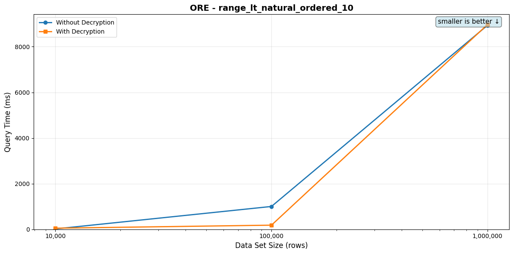

# ORE Queries

[← Back to overview](./BENCHMARK_REPORT.md)

Per-tier query performance. Each scenario lists its SQL, the indexes available on the target table, the indexes the planner actually picked per tier, the timing table, and the full EXPLAIN plan in a collapsed block.

## range_gt_10

**Description:** Range query (greater than) returning 10 results

**SQL Query:**
```sql
SELECT id,value::jsonb FROM {TABLE} WHERE value > $1 LIMIT 10
```

**Parameter:** `5000`

**Table: `integer_encrypted_{rows}` with Block-ORE-encrypted integer values. Index: functional btree on `eql_v2.ore_block_u64_8_256(value)`. The bare-form `<` / `>` operators inline to `eql_v2.ore_block_u64_8_256(a) op eql_v2.ore_block_u64_8_256(b)` post-2.3, so the index engages without query rewriting. Query: WHERE value > 5000 LIMIT 10.**

**Indexes available on the table:**
```sql
CREATE INDEX
integer_encrypted_10000_ore_index
ON integer_encrypted_10000 (
    eql_v2.ore_block_u64_8_256(value)
);
```

**Indexes used by the planner (per data set size):**

- 10,000: _none — planner picked a sequential / hash-aggregate / sort plan_
- 100,000: _none — planner picked a sequential / hash-aggregate / sort plan_
- 1,000,000: _none — planner picked a sequential / hash-aggregate / sort plan_
- 10,000,000: _none — planner picked a sequential / hash-aggregate / sort plan_

| Data Set Size | Rows Returned | Query Time (no decrypt) | Query Time (with decrypt) |
|---------------|---------------|-------------------------|---------------------------|
| 10,000 | 10 | 1.77ms | 29.51ms |
| 100,000 | 10 | 3.01ms | 27.54ms |
| 1,000,000 | 10 | 1.62ms | 28.32ms |
| 10,000,000 | 10 | 1.42ms | 29.93ms |

_Rows Returned is the actual count from a one-shot pre-bench execution. For LIMIT-bounded queries it matches the LIMIT (or is lower when the table doesn't have enough matching rows); for aggregates wrapped in `count(*)` it's 1._

<details>
<summary>EXPLAIN plans (per data set size)</summary>

**10,000 rows**

```
Limit
  Seq Scan on integer_encrypted_10000
```

Full `EXPLAIN (FORMAT JSON)`:

```json
[
  {
    "Plan": {
      "Async Capable": false,
      "Node Type": "Limit",
      "Parallel Aware": false,
      "Plan Rows": 10,
      "Plan Width": 36,
      "Plans": [
        {
          "Alias": "integer_encrypted_10000",
          "Async Capable": false,
          "Filter": "(eql_v2.ore_block_u64_8_256(value) > '(\"{\"\"(\\\\\"\"\\\\\\\\\\\\\\\\x818181813d3ba05650f0e2e50041a4028946d3b901f2227b9f40ca2d24ae4855610af3b93ab3fb03fb06a17df7471b16a573428a9f4c92b3cc79a164992485a18ab87494b45830f48144b2318d70dbf219e5ccc1d1871c3b4249148392b5dab99ef56f446d7e2b2ee6e9f2875635d6b2b1b5c167a713e05cee6d388100bab0f678d763ff3cbe16bcc2c2749bd0925af8a1e22d6cd6dd2b577ae66c9f5ec71e25204fe69cb73a23de2d39cc53bed70de952d7477e8c4369458561074500cfdce659e0a6f0ceb09988c237d66b709c3d4a5b21c05a57d512b315c5592404aac5a03209c6c6a6c491e7eb9b4660441593231030a8a49d986610a059b88c06d243b56df2ce84ace36c07627660c8dfde46e6a0b78c9524710b734fc09b553a8f6e363b00ac83ac28e91bc40f38ab43895df0c841ed6912f80ee497b9e4ff804099c4f0b40d961dbd53410a2772ec7907aa412108f07ea53b16895f84df2c2cff957289f0ddc60b608177f55b385a1b33fa1cc12ddfbba680fe97ae7a255f87746e3bf74b9abe093496b4d0a96cb34ebc626d546f54f643bded4b\\\\\"\")\"\"}\")'::eql_v2.ore_block_u64_8_256)",
          "Node Type": "Seq Scan",
          "Parallel Aware": false,
          "Parent Relationship": "Outer",
          "Plan Rows": 4950,
          "Plan Width": 36,
          "Relation Name": "integer_encrypted_10000",
          "Startup Cost": 0.0,
          "Total Cost": 7766.5
        }
      ],
      "Startup Cost": 0.0,
      "Total Cost": 15.69
    }
  }
]
```

**100,000 rows**

```
Limit
  Seq Scan on integer_encrypted_100000
```

Full `EXPLAIN (FORMAT JSON)`:

```json
[
  {
    "Plan": {
      "Async Capable": false,
      "Node Type": "Limit",
      "Parallel Aware": false,
      "Plan Rows": 10,
      "Plan Width": 36,
      "Plans": [
        {
          "Alias": "integer_encrypted_100000",
          "Async Capable": false,
          "Filter": "(eql_v2.ore_block_u64_8_256(value) > '(\"{\"\"(\\\\\"\"\\\\\\\\\\\\\\\\x818181813d3ba05650f0e2e50041a4028946d3b901f2227b9f40ca2d24ae4855610af3b93ab3fb03fb06a17df7471b16a573428a9f4c92b3cc79a164992485a18ab87494b45830f48144b2318d70dbf219e5ccc1d1871c3b4249148392b5dab99ef56f446d7e2b2ee6e9f2875635d6b2b1b5c167a713e05cee6d388100bab0f678d763ff3cbe16bca78676b20404c013fe26b482707cd00d1ab366809c25c35345c13dbdb017811bd1f39c386fc69a547cffcd498c2474613e236ae5ba54a36a916234787e799adff414f00d0909fbe76330d24ea7b2fc193aec4d67ae9d38f724daaf4f15ec97e7c54cf4f56c31720111e108e904d76176383691447286cd10d7f640be806e5c407998237cb876ab68dd186c84e1102c6e500c75461ac9e94be98d383413b304ccd9af57eabd133124ed557ed45efd0351fe39bd22621bd6e306433ccce92c08060b7be5317d42f8bf95dbd709a9ff27bad3fe8df7eae2894a967648024be42de8e6ddc4b321001d07a367e7de8c9fe91fdd72435cba7f286933b817d43580a386b2c7f8bd8e3254654bd61022ea2eaf0b\\\\\"\")\"\"}\")'::eql_v2.ore_block_u64_8_256)",
          "Node Type": "Seq Scan",
          "Parallel Aware": false,
          "Parent Relationship": "Outer",
          "Plan Rows": 50500,
          "Plan Width": 36,
          "Relation Name": "integer_encrypted_100000",
          "Startup Cost": 0.0,
          "Total Cost": 77911.0
        }
      ],
      "Startup Cost": 0.0,
      "Total Cost": 15.43
    }
  }
]
```

**1,000,000 rows**

```
Limit
  Seq Scan on integer_encrypted_1000000
```

Full `EXPLAIN (FORMAT JSON)`:

```json
[
  {
    "Plan": {
      "Async Capable": false,
      "Node Type": "Limit",
      "Parallel Aware": false,
      "Plan Rows": 10,
      "Plan Width": 36,
      "Plans": [
        {
          "Alias": "integer_encrypted_1000000",
          "Async Capable": false,
          "Filter": "(eql_v2.ore_block_u64_8_256(value) > '(\"{\"\"(\\\\\"\"\\\\\\\\\\\\\\\\x818181813d3ba05650f0e2e50041a4028946d3b901f2227b9f40ca2d24ae4855610af3b93ab3fb03fb06a17df7471b16a573428a9f4c92b3cc79a164992485a18ab87494b45830f48144b2318d70dbf219e5ccc1d1871c3b4249148392b5dab99ef56f446d7e2b2ee6e9f2875635d6b2b1b5c167a713e05cee6d388100bab0f678d763ff3cbe16bc4e319d9b274aeb2a6111d2064ad747e95fa23515a69967bb1940f42d006e124181085d3986b65ea7ce81cda9e99bc893bb48476ce6963f73e1e4b365c0f6c2556e2edb53141f030b7f2dd96b1b58740132f602596fcfe7df4c45a32e897f4d836eaad80fc04683619d71e3263d598a33cb6005306c1244c0734c641e021dfec4f931e0a9e0f5f2710e226361252f2eb4edc060a7ca46d115a6335efc33507a414ed3ca299a0b2055896331b583732975ba71496bf282aaa32aee2961d8fdbc0067ec8ee6b4696e18376ff813644a3bb266f212f218f78486de88b8e0e43f1cedd97475219dfcbae08f16794d4ef55516af77218122ae37348b59af46a6980a484d4833d3201c789f93d58091bef594d9\\\\\"\")\"\"}\")'::eql_v2.ore_block_u64_8_256)",
          "Node Type": "Seq Scan",
          "Parallel Aware": false,
          "Parent Relationship": "Outer",
          "Plan Rows": 495003,
          "Plan Width": 36,
          "Relation Name": "integer_encrypted_1000000",
          "Startup Cost": 0.0,
          "Total Cost": 776611.81
        }
      ],
      "Startup Cost": 0.0,
      "Total Cost": 15.69
    }
  }
]
```

**10,000,000 rows**

```
Limit
  Seq Scan on integer_encrypted_10000000
```

Full `EXPLAIN (FORMAT JSON)`:

```json
[
  {
    "Plan": {
      "Async Capable": false,
      "Node Type": "Limit",
      "Parallel Aware": false,
      "Plan Rows": 10,
      "Plan Width": 36,
      "Plans": [
        {
          "Alias": "integer_encrypted_10000000",
          "Async Capable": false,
          "Filter": "(eql_v2.ore_block_u64_8_256(value) > '(\"{\"\"(\\\\\"\"\\\\\\\\\\\\\\\\x818181813d3ba05650f0e2e50041a4028946d3b901f2227b9f40ca2d24ae4855610af3b93ab3fb03fb06a17df7471b16a573428a9f4c92b3cc79a164992485a18ab87494b45830f48144b2318d70dbf219e5ccc1d1871c3b4249148392b5dab99ef56f446d7e2b2ee6e9f2875635d6b2b1b5c167a713e05cee6d388100bab0f678d763ff3cbe16bce035ad53ca2690eed1e71042c260c9e6ee809838442e212025aab171a1e201c10b8f1ed816c170862c88e71d8f1bbb6ea753a69763773f04aa828616f2dd406571a5105ffb7f0fd2645e30ab97bd8db9695307bc53fef51485e3703569531275349e644604a43d3dc36351733b7ab42841f7e31c17334884cab9c34c825f3e4f1eb5ca73ed4ae08cd4472b1de7923671aa4023c454c0477c0b6bb635e84ffa6a933f1b8bbd2247eb853b54615ff841f7df80eb76849f616aef146bd19016cb3248887cbf00ecfd99745dc8bbf3aaeb514286a2cab99df87029a71ff87e63358b9d0688b079fb4c720e5d1461b38f5b2cfb3c42be361bdce13d4ea5b336f9e8e58d8844c007786f9f4c3abb0fb42e9fc9\\\\\"\")\"\"}\")'::eql_v2.ore_block_u64_8_256)",
          "Node Type": "Seq Scan",
          "Parallel Aware": false,
          "Parent Relationship": "Outer",
          "Plan Rows": 5050002,
          "Plan Width": 36,
          "Relation Name": "integer_encrypted_10000000",
          "Startup Cost": 0.0,
          "Total Cost": 7791074.54
        }
      ],
      "Startup Cost": 0.0,
      "Total Cost": 15.43
    }
  }
]
```

</details>


## range_gt_100

**Description:** Range query (greater than) returning 100 results

**SQL Query:**
```sql
SELECT id,value::jsonb FROM {TABLE} WHERE value > $1 LIMIT 100
```

**Parameter:** `5000`

**Table: `integer_encrypted_{rows}` with Block-ORE-encrypted integer values. Index: functional btree on `eql_v2.ore_block_u64_8_256(value)`. Query: WHERE value > 5000 LIMIT 100.**

**Indexes available on the table:**
```sql
CREATE INDEX
integer_encrypted_10000_ore_index
ON integer_encrypted_10000 (
    eql_v2.ore_block_u64_8_256(value)
);
```

**Indexes used by the planner (per data set size):**

- 10,000: _none — planner picked a sequential / hash-aggregate / sort plan_
- 100,000: _none — planner picked a sequential / hash-aggregate / sort plan_
- 1,000,000: _none — planner picked a sequential / hash-aggregate / sort plan_
- 10,000,000: _none — planner picked a sequential / hash-aggregate / sort plan_

| Data Set Size | Rows Returned | Query Time (no decrypt) | Query Time (with decrypt) |
|---------------|---------------|-------------------------|---------------------------|
| 10,000 | 100 | 7.10ms | 42.40ms |
| 100,000 | 100 | 7.59ms | 42.50ms |
| 1,000,000 | 100 | 7.51ms | 43.28ms |
| 10,000,000 | 100 | 8.14ms | 45.46ms |

_Rows Returned is the actual count from a one-shot pre-bench execution. For LIMIT-bounded queries it matches the LIMIT (or is lower when the table doesn't have enough matching rows); for aggregates wrapped in `count(*)` it's 1._

<details>
<summary>EXPLAIN plans (per data set size)</summary>

**10,000 rows**

```
Limit
  Seq Scan on integer_encrypted_10000
```

Full `EXPLAIN (FORMAT JSON)`:

```json
[
  {
    "Plan": {
      "Async Capable": false,
      "Node Type": "Limit",
      "Parallel Aware": false,
      "Plan Rows": 100,
      "Plan Width": 36,
      "Plans": [
        {
          "Alias": "integer_encrypted_10000",
          "Async Capable": false,
          "Filter": "(eql_v2.ore_block_u64_8_256(value) > '(\"{\"\"(\\\\\"\"\\\\\\\\\\\\\\\\x818181813d3ba05650f0e2e50041a4028946d3b901f2227b9f40ca2d24ae4855610af3b93ab3fb03fb06a17df7471b16a573428a9f4c92b3cc79a164992485a18ab87494b45830f48144b2318d70dbf219e5ccc1d1871c3b4249148392b5dab99ef56f446d7e2b2ee6e9f2875635d6b2b1b5c167a713e05cee6d388100bab0f678d763ff3cbe16bcc89f2e59736df1517ce83c9dad584086c97d362ba74d07444e1ca0e9f2bd84cfe15f14f530fc1f192cccc87521cd4b7358b978e9d81c719216bd8ae6ac822c03ba0fa77e5785403f37e71edf6d3b83e5bc235ce6a77c8e91e19d1060218fa1d860c7c1bae56d7282f80cf289f3feac2953c11f1ba860cd29f44c5a482c60ed147244a6bf5f771b0c711c0b54366feaa0a744e31eb37ca1d3c53a8e9ab313a7fd0506efd35ada098adf665fa2f6e69edf8d206fac45052e57c3a6687643cd0434580fdaeeb7977380c39ace21dafc2945d42294e48c793f4522debac27cc383dbc28f31c8b2eea99e239f07fd5521079e915d6b209e136a44ef1ff855a503682ef717c970b8edf95099ebf89a97d4c04a\\\\\"\")\"\"}\")'::eql_v2.ore_block_u64_8_256)",
          "Node Type": "Seq Scan",
          "Parallel Aware": false,
          "Parent Relationship": "Outer",
          "Plan Rows": 4950,
          "Plan Width": 36,
          "Relation Name": "integer_encrypted_10000",
          "Startup Cost": 0.0,
          "Total Cost": 7766.5
        }
      ],
      "Startup Cost": 0.0,
      "Total Cost": 156.9
    }
  }
]
```

**100,000 rows**

```
Limit
  Seq Scan on integer_encrypted_100000
```

Full `EXPLAIN (FORMAT JSON)`:

```json
[
  {
    "Plan": {
      "Async Capable": false,
      "Node Type": "Limit",
      "Parallel Aware": false,
      "Plan Rows": 100,
      "Plan Width": 36,
      "Plans": [
        {
          "Alias": "integer_encrypted_100000",
          "Async Capable": false,
          "Filter": "(eql_v2.ore_block_u64_8_256(value) > '(\"{\"\"(\\\\\"\"\\\\\\\\\\\\\\\\x818181813d3ba05650f0e2e50041a4028946d3b901f2227b9f40ca2d24ae4855610af3b93ab3fb03fb06a17df7471b16a573428a9f4c92b3cc79a164992485a18ab87494b45830f48144b2318d70dbf219e5ccc1d1871c3b4249148392b5dab99ef56f446d7e2b2ee6e9f2875635d6b2b1b5c167a713e05cee6d388100bab0f678d763ff3cbe16bcdb37c7a96623887a9714494dbf8e18baa79b45c3cc7ed7f7bb89a3bc6f790cca414853f2f81abc730f1880a243eb077b737e04dc8fbece7da3e4cfe69d3f3094fdbb2c7aff4f9c47348f6ad7c46a153369fe0dfc1047481c40b0abc91eb286e8249721aa556463f3d7d8bf64dfd00471ca83d5ed32b90312fa61230caf7fea1281935a9d7b4fe91652e0fa4d91cc45209028669f2e91d20f53753529027d13efd1bcc8d7e83a710486211d217f00b8508633ce1773c59007745667610bca2548a27a79be41465f2d89660a021484c8c424be3baf24a5fe4e111c5325780008c5be5999d62a0444d1078525862f318a53fc955467ac578b0d00f2084a2fe5bdb93a2af37c777abc35f6ff64f9bf7597a8\\\\\"\")\"\"}\")'::eql_v2.ore_block_u64_8_256)",
          "Node Type": "Seq Scan",
          "Parallel Aware": false,
          "Parent Relationship": "Outer",
          "Plan Rows": 50500,
          "Plan Width": 36,
          "Relation Name": "integer_encrypted_100000",
          "Startup Cost": 0.0,
          "Total Cost": 77911.0
        }
      ],
      "Startup Cost": 0.0,
      "Total Cost": 154.28
    }
  }
]
```

**1,000,000 rows**

```
Limit
  Seq Scan on integer_encrypted_1000000
```

Full `EXPLAIN (FORMAT JSON)`:

```json
[
  {
    "Plan": {
      "Async Capable": false,
      "Node Type": "Limit",
      "Parallel Aware": false,
      "Plan Rows": 100,
      "Plan Width": 36,
      "Plans": [
        {
          "Alias": "integer_encrypted_1000000",
          "Async Capable": false,
          "Filter": "(eql_v2.ore_block_u64_8_256(value) > '(\"{\"\"(\\\\\"\"\\\\\\\\\\\\\\\\x818181813d3ba05650f0e2e50041a4028946d3b901f2227b9f40ca2d24ae4855610af3b93ab3fb03fb06a17df7471b16a573428a9f4c92b3cc79a164992485a18ab87494b45830f48144b2318d70dbf219e5ccc1d1871c3b4249148392b5dab99ef56f446d7e2b2ee6e9f2875635d6b2b1b5c167a713e05cee6d388100bab0f678d763ff3cbe16bc2f39ce64833ec9551cb3c1e1a30db102ba5f64d0c14489a32114455f3ea077dcff9220a5d837a51b4b8e7a904e6229ae4461d8fb0bbc481e210dc8b490b5c136c9803f81264270bb85cc7b67944bcc093b070dc2ccdcc8c1ef7f7cd178287b47184479377d3644c18dd009ec67b95d7da8d69523bd3d2011c2a065bae07d0bd44905d8309fd6cb39f381c9b08d63380efd3f2e6ff6aa41a978e9af485679b588deae6dc9925108b22a62b7157f9924b6a0287c7f3172042565dafc0b74614773e24bc41dcb8d2a8c590aea4532207b85ef0e0e482908f86b67500638ab200393d11fed4b088aa32f5f42a1ac4783df9f499e57699e5c28ea478982124186c13a3dcdd3fdce8247e510a60f08c0044315\\\\\"\")\"\"}\")'::eql_v2.ore_block_u64_8_256)",
          "Node Type": "Seq Scan",
          "Parallel Aware": false,
          "Parent Relationship": "Outer",
          "Plan Rows": 495003,
          "Plan Width": 36,
          "Relation Name": "integer_encrypted_1000000",
          "Startup Cost": 0.0,
          "Total Cost": 776611.81
        }
      ],
      "Startup Cost": 0.0,
      "Total Cost": 156.89
    }
  }
]
```

**10,000,000 rows**

```
Limit
  Seq Scan on integer_encrypted_10000000
```

Full `EXPLAIN (FORMAT JSON)`:

```json
[
  {
    "Plan": {
      "Async Capable": false,
      "Node Type": "Limit",
      "Parallel Aware": false,
      "Plan Rows": 100,
      "Plan Width": 36,
      "Plans": [
        {
          "Alias": "integer_encrypted_10000000",
          "Async Capable": false,
          "Filter": "(eql_v2.ore_block_u64_8_256(value) > '(\"{\"\"(\\\\\"\"\\\\\\\\\\\\\\\\x818181813d3ba05650f0e2e50041a4028946d3b901f2227b9f40ca2d24ae4855610af3b93ab3fb03fb06a17df7471b16a573428a9f4c92b3cc79a164992485a18ab87494b45830f48144b2318d70dbf219e5ccc1d1871c3b4249148392b5dab99ef56f446d7e2b2ee6e9f2875635d6b2b1b5c167a713e05cee6d388100bab0f678d763ff3cbe16bcf22472e31028b9267367f6ae1d7fda813082cc9cede20d048630743a6358ec81ec542cc9f6638716caebf2ce1f3762a70e5907b839e860e32106815dca3b98bb4969532c49f6ad74a4315ffe634396b78b23adbb4846f88d9a3cd0598023a858f9a7753d96f8339f75788a1d5b79f25feced5e50cffeb151ea84df8e7ecb1ce650d5f8df0c69ef1e48f9d6e3957861dcc67a7072167564a1813f95f16d860d59631db8e9ea7428bcf21fd4706f395b021f320f2ce0202437cd94de9512285cfa2ccb8080509ce91e0c4567e5894e9aef6af305ac3deb09565ed88596b21fd8f80021e5ee348af72b7c6e39195a8c5359a5a4b90d1dbd6d0275879c823624b255a7aae72714955c9987ab9437af111958\\\\\"\")\"\"}\")'::eql_v2.ore_block_u64_8_256)",
          "Node Type": "Seq Scan",
          "Parallel Aware": false,
          "Parent Relationship": "Outer",
          "Plan Rows": 5050002,
          "Plan Width": 36,
          "Relation Name": "integer_encrypted_10000000",
          "Startup Cost": 0.0,
          "Total Cost": 7791074.54
        }
      ],
      "Startup Cost": 0.0,
      "Total Cost": 154.28
    }
  }
]
```

</details>


## range_highly_selective_gt_10

**Description:** Highly selective range query (~0.011% selectivity) with LIMIT 10

**SQL Query:**
```sql
SELECT id,value::jsonb FROM {TABLE} WHERE value > $1 LIMIT 10
```

**Parameter:** `2147000000`

**Table: `integer_encrypted_{rows}` with Block-ORE-encrypted integer values. Index: functional btree on `eql_v2.ore_block_u64_8_256(value)`. Query: WHERE value > 2_147_000_000 LIMIT 10. Threshold sits 483k values below `i32::MAX` (~0.011% selectivity). Engages the ORE btree at every tier (with current stats — see the note on `range_selective_gt_100`). Useful as the upper-bound demonstration of how cheap a selective range lookup becomes when the functional index engages.**

**Indexes available on the table:**
```sql
CREATE INDEX
integer_encrypted_10000_ore_index
ON integer_encrypted_10000 (
    eql_v2.ore_block_u64_8_256(value)
);
```

**Indexes used by the planner (per data set size):**

- 10,000: `integer_encrypted_10000_ore_index`
- 100,000: `integer_encrypted_100000_ore_index`
- 1,000,000: `integer_encrypted_1000000_ore_index`
- 10,000,000: `integer_encrypted_10000000_ore_index`

*⚠️ = Query time exceeds 100ms*

| Data Set Size | Rows Returned | Query Time (no decrypt) | Query Time (with decrypt) |
|---------------|---------------|-------------------------|---------------------------|
| 10,000 | 3 | 1.80ms | 28.69ms |
| 100,000 | 8 | 979.00μs | 27.07ms |
| 1,000,000 | 10 | 1.16ms | 27.99ms |
| 10,000,000 | 10 | ⚠️ 3.157s | ⚠️ 3.605s |

_Rows Returned is the actual count from a one-shot pre-bench execution. For LIMIT-bounded queries it matches the LIMIT (or is lower when the table doesn't have enough matching rows); for aggregates wrapped in `count(*)` it's 1._

<details>
<summary>EXPLAIN plans (per data set size)</summary>

**10,000 rows**

```
Limit
  Index Scan using integer_encrypted_10000_ore_index on integer_encrypted_10000
```

Full `EXPLAIN (FORMAT JSON)`:

```json
[
  {
    "Plan": {
      "Async Capable": false,
      "Node Type": "Limit",
      "Parallel Aware": false,
      "Plan Rows": 10,
      "Plan Width": 36,
      "Plans": [
        {
          "Alias": "integer_encrypted_10000",
          "Async Capable": false,
          "Index Cond": "(eql_v2.ore_block_u64_8_256(value) > '(\"{\"\"(\\\\\"\"\\\\\\\\\\\\\\\\x818181819c74696450f0e2e50041a4028946d3b901f2227b9f40ca2d24ae4855610af3b93ab3fb03fb06a17df7471b16a573428a9f4c92b3cc79a164992485a18ab87494b45830f40b0aaa51599711df6ba2dcc070bb9c12000c1ce2da49187443be7a630b7bba4e4c788d889b7eef636659fb4d6b64dbab777c3973caa72a76ec3c372074623e3652385cd3dc827654132a695c2e8a8246ecc06d7f20d0562e21033dde5f0c6064a74a7501ff283533269cc8b24e32bf679cbac014f931928b288a995ad31ecffe781857ddfa997dd77f063d471147e23fe59aa48ae1f044fa81c2ec73bebf0fe2238465edb18fa21f7a41ad55d01b29517508e1f4544815367080575de594574f9a342579c89a007576bf0a4ffe4d6a91233d3e6ad47a22e3caa40df6970790274bef8d814d380277c5097d356aa13ce9a7d3851da718638a0f52bb722332107d412236dc6da859bafc807bf04383ee6a2a5a61e748ae982531a2b997d56daa216da0296b8e42fa576f55ed66b6eb9088a5efb0a926826525212315f2eed11d82f58e6f20f7c88326c9cc69086db1c406\\\\\"\")\"\"}\")'::eql_v2.ore_block_u64_8_256)",
          "Index Name": "integer_encrypted_10000_ore_index",
          "Node Type": "Index Scan",
          "Parallel Aware": false,
          "Parent Relationship": "Outer",
          "Plan Rows": 50,
          "Plan Width": 36,
          "Relation Name": "integer_encrypted_10000",
          "Scan Direction": "Forward",
          "Startup Cost": 0.54,
          "Total Cost": 229.9
        }
      ],
      "Startup Cost": 0.54,
      "Total Cost": 46.41
    }
  }
]
```

**100,000 rows**

```
Limit
  Index Scan using integer_encrypted_100000_ore_index on integer_encrypted_100000
```

Full `EXPLAIN (FORMAT JSON)`:

```json
[
  {
    "Plan": {
      "Async Capable": false,
      "Node Type": "Limit",
      "Parallel Aware": false,
      "Plan Rows": 10,
      "Plan Width": 36,
      "Plans": [
        {
          "Alias": "integer_encrypted_100000",
          "Async Capable": false,
          "Index Cond": "(eql_v2.ore_block_u64_8_256(value) > '(\"{\"\"(\\\\\"\"\\\\\\\\\\\\\\\\x818181819c74696450f0e2e50041a4028946d3b901f2227b9f40ca2d24ae4855610af3b93ab3fb03fb06a17df7471b16a573428a9f4c92b3cc79a164992485a18ab87494b45830f40b0aaa51599711df6ba2dcc070bb9c12000c1ce2da49187443be7a630b7bba4e4c788d889b7eef636659fb4d6b64dbab777c3973caa72a76ec3c372074623e3678597023e193efb2e9196a6da91e85552babf12364c265684d11f6954f63d07583f4e9ff62928ba824dd94415410d410531bc75c3f584c7b74055cb2f4fd02a40e5ee0fb36557f4cce9f17916912ba51bd8a5367130dbcebe1d35f86413c3fa8bf38947065e943d8bbd53092e52f3be2f7a4b670c1ba3676c4e1eea3c0f26d3c3499aa98c1bb6bc34d7770ca15514546224391442add1e54de41a5f0a66ccbdec6af14932638e610363ac2aa0a20c2a9559c70ab975fdd367a975b1defbe4cecab0d05cb7d63c73ebb238dbc28148f2b9f9214c07515dc3144086e89c5aebb7b8fd2be2b9b41d9972eac193b8cd77bb93a581aa059480d55ba26b01ba6d2dbd0f9a446e387a6dee3b8fd2689b1a5c823\\\\\"\")\"\"}\")'::eql_v2.ore_block_u64_8_256)",
          "Index Name": "integer_encrypted_100000_ore_index",
          "Node Type": "Index Scan",
          "Parallel Aware": false,
          "Parent Relationship": "Outer",
          "Plan Rows": 500,
          "Plan Width": 36,
          "Relation Name": "integer_encrypted_100000",
          "Scan Direction": "Forward",
          "Startup Cost": 0.67,
          "Total Cost": 2258.41
        }
      ],
      "Startup Cost": 0.67,
      "Total Cost": 45.82
    }
  }
]
```

**1,000,000 rows**

```
Limit
  Index Scan using integer_encrypted_1000000_ore_index on integer_encrypted_1000000
```

Full `EXPLAIN (FORMAT JSON)`:

```json
[
  {
    "Plan": {
      "Async Capable": false,
      "Node Type": "Limit",
      "Parallel Aware": false,
      "Plan Rows": 10,
      "Plan Width": 36,
      "Plans": [
        {
          "Alias": "integer_encrypted_1000000",
          "Async Capable": false,
          "Index Cond": "(eql_v2.ore_block_u64_8_256(value) > '(\"{\"\"(\\\\\"\"\\\\\\\\\\\\\\\\x818181819c74696450f0e2e50041a4028946d3b901f2227b9f40ca2d24ae4855610af3b93ab3fb03fb06a17df7471b16a573428a9f4c92b3cc79a164992485a18ab87494b45830f40b0aaa51599711df6ba2dcc070bb9c12000c1ce2da49187443be7a630b7bba4e4c788d889b7eef636659fb4d6b64dbab777c3973caa72a76ec3c372074623e366324abb2b43f37c7ee3e094df628b2d3a596f2095367cfd166f5dfa4697e66fecbb76ddf9934702fa2351d5c57fb6793a01beebed98480ea4e60fd010b611aacf7721dff553ee0b5fa58129c11d4209d4395ce5b0c4292c397e04e726950ba1af9d0a12c4890fb755c1ba2442a3b5b0567befbf61b13a1b721cbed7a07c899bd31724643c7ffffc2ad549811aaabbdfb55e2cdd1369823197a27a24ce8ab08180605ed4542f89fe8c94786317a91f6c112d73f4595fbc0e4ba4c37a3a5098f6c25e0203eb3d2b2e0fe41624d4a148225e248c991fc59c9b90aaf2863fc759bbdb62243fdf0228462e8337617af838b49ec1ab87267bb1be3428b46b135e73143c8e7bdc080d68dc3be1faa6400d06a59\\\\\"\")\"\"}\")'::eql_v2.ore_block_u64_8_256)",
          "Index Name": "integer_encrypted_1000000_ore_index",
          "Node Type": "Index Scan",
          "Parallel Aware": false,
          "Parent Relationship": "Outer",
          "Plan Rows": 5000,
          "Plan Width": 36,
          "Relation Name": "integer_encrypted_1000000",
          "Scan Direction": "Forward",
          "Startup Cost": 0.8,
          "Total Cost": 22557.45
        }
      ],
      "Startup Cost": 0.8,
      "Total Cost": 45.91
    }
  }
]
```

**10,000,000 rows**

```
Limit
  Index Scan using integer_encrypted_10000000_ore_index on integer_encrypted_10000000
```

Full `EXPLAIN (FORMAT JSON)`:

```json
[
  {
    "Plan": {
      "Async Capable": false,
      "Node Type": "Limit",
      "Parallel Aware": false,
      "Plan Rows": 10,
      "Plan Width": 36,
      "Plans": [
        {
          "Alias": "integer_encrypted_10000000",
          "Async Capable": false,
          "Index Cond": "(eql_v2.ore_block_u64_8_256(value) > '(\"{\"\"(\\\\\"\"\\\\\\\\\\\\\\\\x818181819c74696450f0e2e50041a4028946d3b901f2227b9f40ca2d24ae4855610af3b93ab3fb03fb06a17df7471b16a573428a9f4c92b3cc79a164992485a18ab87494b45830f40b0aaa51599711df6ba2dcc070bb9c12000c1ce2da49187443be7a630b7bba4e4c788d889b7eef636659fb4d6b64dbab777c3973caa72a76ec3c372074623e36b9581b419d45178f30a9a1425f682756e3bdfbb522e3ae4b80e8ce1396a389b264d8022ba559ca8817d1bad7b3dd81c3fae9777aad6410b408d953019daf32eb05ddaa96c7c307d44f5f562258b020e845f7225c1f7a24d2bc579cea64ed2466d3443af5da3191984de5ef5d676a3be46ac355a6e12de53fa351bf664472b87e4f8a84afee754fb4de1d907d8c93dfe73cbc2cfbdbf0d7d0b71f106de7d77b5dfe34a4fc4fc1723d32268d84dfa3c2b3eeba29fbd74be16a38e18ba0d22a1efa91de07ff11fb8be9a6a341f7da6d641af43018f1987d5b2aceb44e68592d1fa032f56cb4dba6226a4cddcb76d6e47b214ec07204ac1fd370df4588df09fb18e9fe9bb541594b3c0e15632acdd041728e\\\\\"\")\"\"}\")'::eql_v2.ore_block_u64_8_256)",
          "Index Name": "integer_encrypted_10000000_ore_index",
          "Node Type": "Index Scan",
          "Parallel Aware": false,
          "Parent Relationship": "Outer",
          "Plan Rows": 50000,
          "Plan Width": 36,
          "Relation Name": "integer_encrypted_10000000",
          "Scan Direction": "Forward",
          "Startup Cost": 0.94,
          "Total Cost": 225527.79
        }
      ],
      "Startup Cost": 0.94,
      "Total Cost": 46.04
    }
  }
]
```

</details>


## range_highly_selective_gt_count

**Description:** Highly selective range count (~0.011% selectivity), no LIMIT

**SQL Query:**
```sql
SELECT count(*) FROM {TABLE} WHERE value > $1
```

**Parameter:** `2147000000`

**Table: `integer_encrypted_{rows}` with Block-ORE-encrypted integer values. Index: functional btree on `eql_v2.ore_block_u64_8_256(value)`. Query: `SELECT count(*) FROM tbl WHERE value > 2_147_000_000`. Tighter selectivity than `range_selective_gt_count`; near-floor cost for an indexed lookup.**

**Indexes available on the table:**
```sql
CREATE INDEX
integer_encrypted_10000_ore_index
ON integer_encrypted_10000 (
    eql_v2.ore_block_u64_8_256(value)
);
```

**Indexes used by the planner (per data set size):**

- 10,000: `integer_encrypted_10000_ore_index`
- 100,000: `integer_encrypted_100000_ore_index`
- 1,000,000: `integer_encrypted_1000000_ore_index`
- 10,000,000: `integer_encrypted_10000000_ore_index`

| Data Set Size | Rows Returned | Query Time (no decrypt) | Query Time (with decrypt) |
|---------------|---------------|-------------------------|---------------------------|
| 10,000 | 1 | 1.11ms | N/A |
| 100,000 | 1 | 1.21ms | N/A |
| 1,000,000 | 1 | 16.01ms | N/A |
| 10,000,000 | 1 | 19.96ms | N/A |

_Rows Returned is the actual count from a one-shot pre-bench execution. For LIMIT-bounded queries it matches the LIMIT (or is lower when the table doesn't have enough matching rows); for aggregates wrapped in `count(*)` it's 1._

<details>
<summary>EXPLAIN plans (per data set size)</summary>

**10,000 rows**

```
Aggregate
  Bitmap Heap Scan on integer_encrypted_10000
    Bitmap Index Scan using integer_encrypted_10000_ore_index
```

Full `EXPLAIN (FORMAT JSON)`:

```json
[
  {
    "Plan": {
      "Async Capable": false,
      "Node Type": "Aggregate",
      "Parallel Aware": false,
      "Partial Mode": "Simple",
      "Plan Rows": 1,
      "Plan Width": 8,
      "Plans": [
        {
          "Alias": "integer_encrypted_10000",
          "Async Capable": false,
          "Node Type": "Bitmap Heap Scan",
          "Parallel Aware": false,
          "Parent Relationship": "Outer",
          "Plan Rows": 50,
          "Plan Width": 0,
          "Plans": [
            {
              "Async Capable": false,
              "Index Cond": "(eql_v2.ore_block_u64_8_256(value) > '(\"{\"\"(\\\\\"\"\\\\\\\\\\\\\\\\x818181819c74696450f0e2e50041a4028946d3b901f2227b9f40ca2d24ae4855610af3b93ab3fb03fb06a17df7471b16a573428a9f4c92b3cc79a164992485a18ab87494b45830f40b0aaa51599711df6ba2dcc070bb9c12000c1ce2da49187443be7a630b7bba4e4c788d889b7eef636659fb4d6b64dbab777c3973caa72a76ec3c372074623e3600b6b20699b5a15937ccc4647acddb22060132addf24d95e78e82a55eaae02c671b5a72924030ba15b2282d6fd9ff9226cc1f7b6d1cb491e01e3254a40bd8eceb3f25fab018e83755e380666c6842ed61d4b1fbdcd6e290e91c7b779ff4abf85e53f5707f030b3319e6be730c68bf900ffc10caaa9f9464dcf4b062a863e4108c660fca347ca4e5a01c4c8a536bb94d0e3fc85ecaa3831e48786c3e128de42b2dd168de5330db09f2eeeddf86c0862f2be3988222d09799241e27bd791c59de8e9d10213358c4df16e10abe15c871adf42f8d4ccbd75755af81c3ff7c2e00315babd2d638a30d6b0d21fb0dcab909856f0d823686a588911fafd385dd284c2c20c9f817f5ebf4e8b37c98243e1132aca\\\\\"\")\"\"}\")'::eql_v2.ore_block_u64_8_256)",
              "Index Name": "integer_encrypted_10000_ore_index",
              "Node Type": "Bitmap Index Scan",
              "Parallel Aware": false,
              "Parent Relationship": "Outer",
              "Plan Rows": 50,
              "Plan Width": 0,
              "Startup Cost": 0.0,
              "Total Cost": 16.91
            }
          ],
          "Recheck Cond": "(eql_v2.ore_block_u64_8_256(value) > '(\"{\"\"(\\\\\"\"\\\\\\\\\\\\\\\\x818181819c74696450f0e2e50041a4028946d3b901f2227b9f40ca2d24ae4855610af3b93ab3fb03fb06a17df7471b16a573428a9f4c92b3cc79a164992485a18ab87494b45830f40b0aaa51599711df6ba2dcc070bb9c12000c1ce2da49187443be7a630b7bba4e4c788d889b7eef636659fb4d6b64dbab777c3973caa72a76ec3c372074623e3600b6b20699b5a15937ccc4647acddb22060132addf24d95e78e82a55eaae02c671b5a72924030ba15b2282d6fd9ff9226cc1f7b6d1cb491e01e3254a40bd8eceb3f25fab018e83755e380666c6842ed61d4b1fbdcd6e290e91c7b779ff4abf85e53f5707f030b3319e6be730c68bf900ffc10caaa9f9464dcf4b062a863e4108c660fca347ca4e5a01c4c8a536bb94d0e3fc85ecaa3831e48786c3e128de42b2dd168de5330db09f2eeeddf86c0862f2be3988222d09799241e27bd791c59de8e9d10213358c4df16e10abe15c871adf42f8d4ccbd75755af81c3ff7c2e00315babd2d638a30d6b0d21fb0dcab909856f0d823686a588911fafd385dd284c2c20c9f817f5ebf4e8b37c98243e1132aca\\\\\"\")\"\"}\")'::eql_v2.ore_block_u64_8_256)",
          "Relation Name": "integer_encrypted_10000",
          "Startup Cost": 16.92,
          "Total Cost": 214.36
        }
      ],
      "Startup Cost": 214.49,
      "Strategy": "Plain",
      "Total Cost": 214.5
    }
  }
]
```

**100,000 rows**

```
Aggregate
  Bitmap Heap Scan on integer_encrypted_100000
    Bitmap Index Scan using integer_encrypted_100000_ore_index
```

Full `EXPLAIN (FORMAT JSON)`:

```json
[
  {
    "Plan": {
      "Async Capable": false,
      "Node Type": "Aggregate",
      "Parallel Aware": false,
      "Partial Mode": "Simple",
      "Plan Rows": 1,
      "Plan Width": 8,
      "Plans": [
        {
          "Alias": "integer_encrypted_100000",
          "Async Capable": false,
          "Node Type": "Bitmap Heap Scan",
          "Parallel Aware": false,
          "Parent Relationship": "Outer",
          "Plan Rows": 500,
          "Plan Width": 0,
          "Plans": [
            {
              "Async Capable": false,
              "Index Cond": "(eql_v2.ore_block_u64_8_256(value) > '(\"{\"\"(\\\\\"\"\\\\\\\\\\\\\\\\x818181819c74696450f0e2e50041a4028946d3b901f2227b9f40ca2d24ae4855610af3b93ab3fb03fb06a17df7471b16a573428a9f4c92b3cc79a164992485a18ab87494b45830f40b0aaa51599711df6ba2dcc070bb9c12000c1ce2da49187443be7a630b7bba4e4c788d889b7eef636659fb4d6b64dbab777c3973caa72a76ec3c372074623e3613134b36942f2610137e4f1e85ed3af85db29cbeb0c1a7a1165c6bdff7664e4481a89c914e0b35b927adff59889315e081289684c74fb52de40c7c2f2ecd7cc2ef9b8c21533af668b734acb76027711b2f8a636c7ecfa4e19d693fa98d1a99b82287dc3be68425c2b5b800213d789066f02c987c1058694c841816d208a0c19c937646687b74bbcd936cca88f92c7c2d17c2802fa434931b14655bb253e12468597223906671b5e152e2355f46a994d30ee56e2df1f8e6af5f108c22150dc21c151e2dc1891107e1791ff604464b58f1320bc68654fac3b9d9099bd45bee1d0b0147507fc1dc9f9c2db940f0b13ec31886488d85f9e84e3227403b722cc6b3729cfcc83287f9de25e79c172ab0398693\\\\\"\")\"\"}\")'::eql_v2.ore_block_u64_8_256)",
              "Index Name": "integer_encrypted_100000_ore_index",
              "Node Type": "Bitmap Index Scan",
              "Parallel Aware": false,
              "Parent Relationship": "Outer",
              "Plan Rows": 500,
              "Plan Width": 0,
              "Startup Cost": 0.0,
              "Total Cost": 160.42
            }
          ],
          "Recheck Cond": "(eql_v2.ore_block_u64_8_256(value) > '(\"{\"\"(\\\\\"\"\\\\\\\\\\\\\\\\x818181819c74696450f0e2e50041a4028946d3b901f2227b9f40ca2d24ae4855610af3b93ab3fb03fb06a17df7471b16a573428a9f4c92b3cc79a164992485a18ab87494b45830f40b0aaa51599711df6ba2dcc070bb9c12000c1ce2da49187443be7a630b7bba4e4c788d889b7eef636659fb4d6b64dbab777c3973caa72a76ec3c372074623e3613134b36942f2610137e4f1e85ed3af85db29cbeb0c1a7a1165c6bdff7664e4481a89c914e0b35b927adff59889315e081289684c74fb52de40c7c2f2ecd7cc2ef9b8c21533af668b734acb76027711b2f8a636c7ecfa4e19d693fa98d1a99b82287dc3be68425c2b5b800213d789066f02c987c1058694c841816d208a0c19c937646687b74bbcd936cca88f92c7c2d17c2802fa434931b14655bb253e12468597223906671b5e152e2355f46a994d30ee56e2df1f8e6af5f108c22150dc21c151e2dc1891107e1791ff604464b58f1320bc68654fac3b9d9099bd45bee1d0b0147507fc1dc9f9c2db940f0b13ec31886488d85f9e84e3227403b722cc6b3729cfcc83287f9de25e79c172ab0398693\\\\\"\")\"\"}\")'::eql_v2.ore_block_u64_8_256)",
          "Relation Name": "integer_encrypted_100000",
          "Startup Cost": 160.54,
          "Total Cost": 2109.63
        }
      ],
      "Startup Cost": 2110.88,
      "Strategy": "Plain",
      "Total Cost": 2110.89
    }
  }
]
```

**1,000,000 rows**

```
Aggregate
  Gather
    Aggregate
      Bitmap Heap Scan on integer_encrypted_1000000
        Bitmap Index Scan using integer_encrypted_1000000_ore_index
```

Full `EXPLAIN (FORMAT JSON)`:

```json
[
  {
    "Plan": {
      "Async Capable": false,
      "Node Type": "Aggregate",
      "Parallel Aware": false,
      "Partial Mode": "Finalize",
      "Plan Rows": 1,
      "Plan Width": 8,
      "Plans": [
        {
          "Async Capable": false,
          "Node Type": "Gather",
          "Parallel Aware": false,
          "Parent Relationship": "Outer",
          "Plan Rows": 2,
          "Plan Width": 8,
          "Plans": [
            {
              "Async Capable": false,
              "Node Type": "Aggregate",
              "Parallel Aware": false,
              "Parent Relationship": "Outer",
              "Partial Mode": "Partial",
              "Plan Rows": 1,
              "Plan Width": 8,
              "Plans": [
                {
                  "Alias": "integer_encrypted_1000000",
                  "Async Capable": false,
                  "Node Type": "Bitmap Heap Scan",
                  "Parallel Aware": true,
                  "Parent Relationship": "Outer",
                  "Plan Rows": 2083,
                  "Plan Width": 0,
                  "Plans": [
                    {
                      "Async Capable": false,
                      "Index Cond": "(eql_v2.ore_block_u64_8_256(value) > '(\"{\"\"(\\\\\"\"\\\\\\\\\\\\\\\\x818181819c74696450f0e2e50041a4028946d3b901f2227b9f40ca2d24ae4855610af3b93ab3fb03fb06a17df7471b16a573428a9f4c92b3cc79a164992485a18ab87494b45830f40b0aaa51599711df6ba2dcc070bb9c12000c1ce2da49187443be7a630b7bba4e4c788d889b7eef636659fb4d6b64dbab777c3973caa72a76ec3c372074623e36eabe09ae2a865ad9f47aeb101ace7e8db4964b3d9571b0f3562e82616e1e72fb238d0cf938499ecf30b8c08d9b3e10ec246b0550cd9f7245106836d60d2ea2fe1bd9588b96406d16b0a1347ac7560f0bf043fce7db99467e97fff0096e40f3bf29dae302e45b8e4f393bf8279c1d9c29c48569b66534ea4852ac266ca38a6558ef31364de539b7f1f958d8fad5785b67c0c11aeddaa47fbd8bf21f459d467ecd19776c9014e7bca2cb795917eb256eb5fa9e68843cd907bcb1a412ca37afa4d0b50883dcbccf17270c30cad871511a3328216239ca09dfa97518cb8d07d2d27e36ce79f9689c8307ba96acd709a812533697fc127829d8fc2654c5e1664429047040165f6ea7c04bdba6d3e470ff4e62\\\\\"\")\"\"}\")'::eql_v2.ore_block_u64_8_256)",
                      "Index Name": "integer_encrypted_1000000_ore_index",
                      "Node Type": "Bitmap Index Scan",
                      "Parallel Aware": false,
                      "Parent Relationship": "Outer",
                      "Plan Rows": 5000,
                      "Plan Width": 0,
                      "Startup Cost": 0.0,
                      "Total Cost": 1598.3
                    }
                  ],
                  "Recheck Cond": "(eql_v2.ore_block_u64_8_256(value) > '(\"{\"\"(\\\\\"\"\\\\\\\\\\\\\\\\x818181819c74696450f0e2e50041a4028946d3b901f2227b9f40ca2d24ae4855610af3b93ab3fb03fb06a17df7471b16a573428a9f4c92b3cc79a164992485a18ab87494b45830f40b0aaa51599711df6ba2dcc070bb9c12000c1ce2da49187443be7a630b7bba4e4c788d889b7eef636659fb4d6b64dbab777c3973caa72a76ec3c372074623e36eabe09ae2a865ad9f47aeb101ace7e8db4964b3d9571b0f3562e82616e1e72fb238d0cf938499ecf30b8c08d9b3e10ec246b0550cd9f7245106836d60d2ea2fe1bd9588b96406d16b0a1347ac7560f0bf043fce7db99467e97fff0096e40f3bf29dae302e45b8e4f393bf8279c1d9c29c48569b66534ea4852ac266ca38a6558ef31364de539b7f1f958d8fad5785b67c0c11aeddaa47fbd8bf21f459d467ecd19776c9014e7bca2cb795917eb256eb5fa9e68843cd907bcb1a412ca37afa4d0b50883dcbccf17270c30cad871511a3328216239ca09dfa97518cb8d07d2d27e36ce79f9689c8307ba96acd709a812533697fc127829d8fc2654c5e1664429047040165f6ea7c04bdba6d3e470ff4e62\\\\\"\")\"\"}\")'::eql_v2.ore_block_u64_8_256)",
                  "Relation Name": "integer_encrypted_1000000",
                  "Startup Cost": 1599.55,
                  "Total Cost": 19587.07
                }
              ],
              "Startup Cost": 19592.28,
              "Strategy": "Plain",
              "Total Cost": 19592.29
            }
          ],
          "Single Copy": false,
          "Startup Cost": 20592.28,
          "Total Cost": 20592.49,
          "Workers Planned": 2
        }
      ],
      "Startup Cost": 20592.49,
      "Strategy": "Plain",
      "Total Cost": 20592.5
    }
  }
]
```

**10,000,000 rows**

```
Aggregate
  Gather
    Aggregate
      Bitmap Heap Scan on integer_encrypted_10000000
        Bitmap Index Scan using integer_encrypted_10000000_ore_index
```

Full `EXPLAIN (FORMAT JSON)`:

```json
[
  {
    "JIT": {
      "Functions": 7,
      "Options": {
        "Deforming": true,
        "Expressions": true,
        "Inlining": false,
        "Optimization": false
      }
    },
    "Plan": {
      "Async Capable": false,
      "Node Type": "Aggregate",
      "Parallel Aware": false,
      "Partial Mode": "Finalize",
      "Plan Rows": 1,
      "Plan Width": 8,
      "Plans": [
        {
          "Async Capable": false,
          "Node Type": "Gather",
          "Parallel Aware": false,
          "Parent Relationship": "Outer",
          "Plan Rows": 2,
          "Plan Width": 8,
          "Plans": [
            {
              "Async Capable": false,
              "Node Type": "Aggregate",
              "Parallel Aware": false,
              "Parent Relationship": "Outer",
              "Partial Mode": "Partial",
              "Plan Rows": 1,
              "Plan Width": 8,
              "Plans": [
                {
                  "Alias": "integer_encrypted_10000000",
                  "Async Capable": false,
                  "Node Type": "Bitmap Heap Scan",
                  "Parallel Aware": true,
                  "Parent Relationship": "Outer",
                  "Plan Rows": 20833,
                  "Plan Width": 0,
                  "Plans": [
                    {
                      "Async Capable": false,
                      "Index Cond": "(eql_v2.ore_block_u64_8_256(value) > '(\"{\"\"(\\\\\"\"\\\\\\\\\\\\\\\\x818181819c74696450f0e2e50041a4028946d3b901f2227b9f40ca2d24ae4855610af3b93ab3fb03fb06a17df7471b16a573428a9f4c92b3cc79a164992485a18ab87494b45830f40b0aaa51599711df6ba2dcc070bb9c12000c1ce2da49187443be7a630b7bba4e4c788d889b7eef636659fb4d6b64dbab777c3973caa72a76ec3c372074623e3636a48cacc6fa21cf8b6d7e9397f66d65db0bf1139c96af507702882ec0a2b2e6788ed111afd249f56cfd3ab4345e84ff9c24a3d868f851280738122f536435565d32364de6a0ce34331f73783093fe7d25b468c99da1ba0f27cdce6fe1cbd01142f5fa9c226ebefde9fdf008cc082e47e151a647218343e65430dc173e30dfd2e73d8194c5260d63c3576f2e31b1a7bb22ca6af9cbb6becdb745325c2dd4241fadc83b7a650ec9be1ec1c808b7a9ce3c7cee5eb0706c4bc89df7f7b3c3bb11352cca1986ab8b1bc3d9d02d2c30039258bf6c0a045f6933e4c532028601e760996e0e463b5cad6bf39064caebf7f8b6a2ae3946bdcb70fbebefb6d729ad9cb1406564f445922fb1653bf5c6183ea56fbd\\\\\"\")\"\"}\")'::eql_v2.ore_block_u64_8_256)",
                      "Index Name": "integer_encrypted_10000000_ore_index",
                      "Node Type": "Bitmap Index Scan",
                      "Parallel Aware": false,
                      "Parent Relationship": "Outer",
                      "Plan Rows": 50000,
                      "Plan Width": 0,
                      "Startup Cost": 0.0,
                      "Total Cost": 15963.93
                    }
                  ],
                  "Recheck Cond": "(eql_v2.ore_block_u64_8_256(value) > '(\"{\"\"(\\\\\"\"\\\\\\\\\\\\\\\\x818181819c74696450f0e2e50041a4028946d3b901f2227b9f40ca2d24ae4855610af3b93ab3fb03fb06a17df7471b16a573428a9f4c92b3cc79a164992485a18ab87494b45830f40b0aaa51599711df6ba2dcc070bb9c12000c1ce2da49187443be7a630b7bba4e4c788d889b7eef636659fb4d6b64dbab777c3973caa72a76ec3c372074623e3636a48cacc6fa21cf8b6d7e9397f66d65db0bf1139c96af507702882ec0a2b2e6788ed111afd249f56cfd3ab4345e84ff9c24a3d868f851280738122f536435565d32364de6a0ce34331f73783093fe7d25b468c99da1ba0f27cdce6fe1cbd01142f5fa9c226ebefde9fdf008cc082e47e151a647218343e65430dc173e30dfd2e73d8194c5260d63c3576f2e31b1a7bb22ca6af9cbb6becdb745325c2dd4241fadc83b7a650ec9be1ec1c808b7a9ce3c7cee5eb0706c4bc89df7f7b3c3bb11352cca1986ab8b1bc3d9d02d2c30039258bf6c0a045f6933e4c532028601e760996e0e463b5cad6bf39064caebf7f8b6a2ae3946bdcb70fbebefb6d729ad9cb1406564f445922fb1653bf5c6183ea56fbd\\\\\"\")\"\"}\")'::eql_v2.ore_block_u64_8_256)",
                  "Relation Name": "integer_encrypted_10000000",
                  "Startup Cost": 15976.43,
                  "Total Cost": 195823.06
                }
              ],
              "Startup Cost": 195875.15,
              "Strategy": "Plain",
              "Total Cost": 195875.16
            }
          ],
          "Single Copy": false,
          "Startup Cost": 196875.15,
          "Total Cost": 196875.36,
          "Workers Planned": 2
        }
      ],
      "Startup Cost": 196875.36,
      "Strategy": "Plain",
      "Total Cost": 196875.37
    }
  }
]
```

</details>


## range_lt_10

**Description:** Range query (less than) returning 10 results

**SQL Query:**
```sql
SELECT id,value::jsonb FROM {TABLE} WHERE value < $1 LIMIT 10
```

**Parameter:** `5000`

**Table: `integer_encrypted_{rows}` with Block-ORE-encrypted integer values. Index: functional btree on `eql_v2.ore_block_u64_8_256(value)`. Query: WHERE value < 5000 LIMIT 10.**

**Indexes available on the table:**
```sql
CREATE INDEX
integer_encrypted_10000_ore_index
ON integer_encrypted_10000 (
    eql_v2.ore_block_u64_8_256(value)
);
```

**Indexes used by the planner (per data set size):**

- 10,000: _none — planner picked a sequential / hash-aggregate / sort plan_
- 100,000: _none — planner picked a sequential / hash-aggregate / sort plan_
- 1,000,000: _none — planner picked a sequential / hash-aggregate / sort plan_
- 10,000,000: _none — planner picked a sequential / hash-aggregate / sort plan_

| Data Set Size | Rows Returned | Query Time (no decrypt) | Query Time (with decrypt) |
|---------------|---------------|-------------------------|---------------------------|
| 10,000 | 10 | 1.57ms | 28.34ms |
| 100,000 | 10 | 2.14ms | 27.71ms |
| 1,000,000 | 10 | 1.37ms | 26.09ms |
| 10,000,000 | 10 | 1.72ms | 30.15ms |

_Rows Returned is the actual count from a one-shot pre-bench execution. For LIMIT-bounded queries it matches the LIMIT (or is lower when the table doesn't have enough matching rows); for aggregates wrapped in `count(*)` it's 1._

<details>
<summary>EXPLAIN plans (per data set size)</summary>

**10,000 rows**

```
Limit
  Seq Scan on integer_encrypted_10000
```

Full `EXPLAIN (FORMAT JSON)`:

```json
[
  {
    "Plan": {
      "Async Capable": false,
      "Node Type": "Limit",
      "Parallel Aware": false,
      "Plan Rows": 10,
      "Plan Width": 36,
      "Plans": [
        {
          "Alias": "integer_encrypted_10000",
          "Async Capable": false,
          "Filter": "(eql_v2.ore_block_u64_8_256(value) < '(\"{\"\"(\\\\\"\"\\\\\\\\\\\\\\\\x818181813d3ba05650f0e2e50041a4028946d3b901f2227b9f40ca2d24ae4855610af3b93ab3fb03fb06a17df7471b16a573428a9f4c92b3cc79a164992485a18ab87494b45830f48144b2318d70dbf219e5ccc1d1871c3b4249148392b5dab99ef56f446d7e2b2ee6e9f2875635d6b2b1b5c167a713e05cee6d388100bab0f678d763ff3cbe16bc960442414fab64531ffb3af196f9b683ee277ae2cc66b24c3846af58d5492611f16edcfb9b4cc30d9918cef6b7eddb43f7df9c91c7c183eaedc4e06faba167723eb03e8629945c6eb8a4184629665e714f998856cd940615b66b8045fa5ebee3689a7c62772de1cd5934c1c4578b0ea37fff3bc5847d74bbb9a32b0e65b97ebf20b0ecf2e4ee1ea556321e496d33c4205eb62436815bb586dc17b1a11be4c7e5a62d90c01188ec3d64cd7eb27dac9041c49c5e3c04eedc790ae52c375774d155226515bd445da46c85a086f4bf01305ef94fe59a4e796f47b37cebb0ec8977e3eaa7651dc0e20a3eb6d5fb96a71f9ede5fd0a38d3c6841b76ec3416e7e5a8f54c0b821f65617012cd5d4582ae267591d\\\\\"\")\"\"}\")'::eql_v2.ore_block_u64_8_256)",
          "Node Type": "Seq Scan",
          "Parallel Aware": false,
          "Parent Relationship": "Outer",
          "Plan Rows": 5049,
          "Plan Width": 36,
          "Relation Name": "integer_encrypted_10000",
          "Startup Cost": 0.0,
          "Total Cost": 7791.25
        }
      ],
      "Startup Cost": 0.0,
      "Total Cost": 15.43
    }
  }
]
```

**100,000 rows**

```
Limit
  Seq Scan on integer_encrypted_100000
```

Full `EXPLAIN (FORMAT JSON)`:

```json
[
  {
    "Plan": {
      "Async Capable": false,
      "Node Type": "Limit",
      "Parallel Aware": false,
      "Plan Rows": 10,
      "Plan Width": 36,
      "Plans": [
        {
          "Alias": "integer_encrypted_100000",
          "Async Capable": false,
          "Filter": "(eql_v2.ore_block_u64_8_256(value) < '(\"{\"\"(\\\\\"\"\\\\\\\\\\\\\\\\x818181813d3ba05650f0e2e50041a4028946d3b901f2227b9f40ca2d24ae4855610af3b93ab3fb03fb06a17df7471b16a573428a9f4c92b3cc79a164992485a18ab87494b45830f48144b2318d70dbf219e5ccc1d1871c3b4249148392b5dab99ef56f446d7e2b2ee6e9f2875635d6b2b1b5c167a713e05cee6d388100bab0f678d763ff3cbe16bc6424894db966a762a7dad2ad987101d47a349b28565fe8665208828e97fc75134b6a03d2ae1853b268a33dfd53bee85217901381c1f38f651bfa39a0f2b50f23fb93321249fdcf7e1dd2361b99128862a8028488d08cdbde5f1407b6e0bc8cdc2c918edf74d2aae3b88cf4e1dc4bd93c5991fff530302e9c1a20b414aa7b055a1a21ab2cd76561ca811fdfa1ea770d46c30dffaa80ca7d080436dd0c8f5de98d6ba23b810b8ad17bbd58479f4a04b1d535f93f112a20a64900d5b0c4940b375a0ba10368dc826adac254d1fffcaecd57103345bf84480c023761bc40c72992a15aa23ad8638783c08d914caf6edf9918d2c8fb30d885893a1682ead1b983a3c35c6c8a7f02a9839af5d303bfa42c54d8\\\\\"\")\"\"}\")'::eql_v2.ore_block_u64_8_256)",
          "Node Type": "Seq Scan",
          "Parallel Aware": false,
          "Parent Relationship": "Outer",
          "Plan Rows": 49499,
          "Plan Width": 36,
          "Relation Name": "integer_encrypted_100000",
          "Startup Cost": 0.0,
          "Total Cost": 77660.75
        }
      ],
      "Startup Cost": 0.0,
      "Total Cost": 15.69
    }
  }
]
```

**1,000,000 rows**

```
Limit
  Seq Scan on integer_encrypted_1000000
```

Full `EXPLAIN (FORMAT JSON)`:

```json
[
  {
    "Plan": {
      "Async Capable": false,
      "Node Type": "Limit",
      "Parallel Aware": false,
      "Plan Rows": 10,
      "Plan Width": 36,
      "Plans": [
        {
          "Alias": "integer_encrypted_1000000",
          "Async Capable": false,
          "Filter": "(eql_v2.ore_block_u64_8_256(value) < '(\"{\"\"(\\\\\"\"\\\\\\\\\\\\\\\\x818181813d3ba05650f0e2e50041a4028946d3b901f2227b9f40ca2d24ae4855610af3b93ab3fb03fb06a17df7471b16a573428a9f4c92b3cc79a164992485a18ab87494b45830f48144b2318d70dbf219e5ccc1d1871c3b4249148392b5dab99ef56f446d7e2b2ee6e9f2875635d6b2b1b5c167a713e05cee6d388100bab0f678d763ff3cbe16bcfd23816eace434c48790d1f053a58fe8456c159674e26a3916749a0f6e3e7c215968473742607115c54598365c524673839a1bbffe578056785b8b11b90a149d338ede991244df6b9e129128656f5b5f40e7c89c03f8712701c98fc892dbd0de3cad51671e4e765357d79dded124b491e2415e6b3a0430dfc16eb58fd10d1c4b90719ba3b00e5f812818c72be48fec85741cfde75dccb816924e9e7c54d3d3a20059bbba80df4bac2aedf6a377b5f4755374acc45713ad453c5867a2d9e651e316b2faf5ef57786c0b452a4261f565d478a0637416ca22128ee990e8e53faab4a74fc443083fa9eab3439cd879709e0413b34b51f175a6dd49c752ebf27b9497e2fb5d21adefa6cea46f4e5b71d25fee\\\\\"\")\"\"}\")'::eql_v2.ore_block_u64_8_256)",
          "Node Type": "Seq Scan",
          "Parallel Aware": false,
          "Parent Relationship": "Outer",
          "Plan Rows": 505002,
          "Plan Width": 36,
          "Relation Name": "integer_encrypted_1000000",
          "Startup Cost": 0.0,
          "Total Cost": 779111.56
        }
      ],
      "Startup Cost": 0.0,
      "Total Cost": 15.43
    }
  }
]
```

**10,000,000 rows**

```
Limit
  Seq Scan on integer_encrypted_10000000
```

Full `EXPLAIN (FORMAT JSON)`:

```json
[
  {
    "Plan": {
      "Async Capable": false,
      "Node Type": "Limit",
      "Parallel Aware": false,
      "Plan Rows": 10,
      "Plan Width": 36,
      "Plans": [
        {
          "Alias": "integer_encrypted_10000000",
          "Async Capable": false,
          "Filter": "(eql_v2.ore_block_u64_8_256(value) < '(\"{\"\"(\\\\\"\"\\\\\\\\\\\\\\\\x818181813d3ba05650f0e2e50041a4028946d3b901f2227b9f40ca2d24ae4855610af3b93ab3fb03fb06a17df7471b16a573428a9f4c92b3cc79a164992485a18ab87494b45830f48144b2318d70dbf219e5ccc1d1871c3b4249148392b5dab99ef56f446d7e2b2ee6e9f2875635d6b2b1b5c167a713e05cee6d388100bab0f678d763ff3cbe16bc3f0e300ff67bc4d9fee3701c15fd2a1379f439472f348072a34d3f9e6dfc5ce064217764ce8b4d315ad49b082c9b558dd12a8de0b0c42022f1ebe75a86cf5cedd7f8a9a8446da81e80db2e3c8959ac852eee567cae6de44594030ced59d4ce678e56033858cb3ba2f7553aeebcd6fec71a72837339d1ce83b8ed6a66f88568d6769afa9ef42abbbd8f68dccfc307ad6a1ac90dd2c3f8b146db56bbfafdad3f08d921085fd9663a490327334c5021a249c5f9e3778f9b4ebdfbc85a24b4ae50921d7e553e55e07f7aa2afbdcf19bc9c7f2cfa52237826319241571e936806059603958a1b582ccfd35346335856af92aa6d8a1587b331b3359c39837c88063ba6a17ceefa37b187db9920dd4f8ba88ee5\\\\\"\")\"\"}\")'::eql_v2.ore_block_u64_8_256)",
          "Node Type": "Seq Scan",
          "Parallel Aware": false,
          "Parent Relationship": "Outer",
          "Plan Rows": 4950001,
          "Plan Width": 36,
          "Relation Name": "integer_encrypted_10000000",
          "Startup Cost": 0.0,
          "Total Cost": 7766074.29
        }
      ],
      "Startup Cost": 0.0,
      "Total Cost": 15.69
    }
  }
]
```

</details>


## range_lt_100

**Description:** Range query (less than) returning 100 results

**SQL Query:**
```sql
SELECT id,value::jsonb FROM {TABLE} WHERE value < $1 LIMIT 100
```

**Parameter:** `5000`

**Table: `integer_encrypted_{rows}` with Block-ORE-encrypted integer values. Index: functional btree on `eql_v2.ore_block_u64_8_256(value)`. Query: WHERE value < 5000 LIMIT 100.**

**Indexes available on the table:**
```sql
CREATE INDEX
integer_encrypted_10000_ore_index
ON integer_encrypted_10000 (
    eql_v2.ore_block_u64_8_256(value)
);
```

**Indexes used by the planner (per data set size):**

- 10,000: _none — planner picked a sequential / hash-aggregate / sort plan_
- 100,000: _none — planner picked a sequential / hash-aggregate / sort plan_
- 1,000,000: _none — planner picked a sequential / hash-aggregate / sort plan_
- 10,000,000: _none — planner picked a sequential / hash-aggregate / sort plan_

| Data Set Size | Rows Returned | Query Time (no decrypt) | Query Time (with decrypt) |
|---------------|---------------|-------------------------|---------------------------|
| 10,000 | 100 | 11.20ms | 44.62ms |
| 100,000 | 100 | 22.21ms | 46.28ms |
| 1,000,000 | 100 | 6.89ms | 40.34ms |
| 10,000,000 | 100 | 7.58ms | 45.56ms |

_Rows Returned is the actual count from a one-shot pre-bench execution. For LIMIT-bounded queries it matches the LIMIT (or is lower when the table doesn't have enough matching rows); for aggregates wrapped in `count(*)` it's 1._

<details>
<summary>EXPLAIN plans (per data set size)</summary>

**10,000 rows**

```
Limit
  Seq Scan on integer_encrypted_10000
```

Full `EXPLAIN (FORMAT JSON)`:

```json
[
  {
    "Plan": {
      "Async Capable": false,
      "Node Type": "Limit",
      "Parallel Aware": false,
      "Plan Rows": 100,
      "Plan Width": 36,
      "Plans": [
        {
          "Alias": "integer_encrypted_10000",
          "Async Capable": false,
          "Filter": "(eql_v2.ore_block_u64_8_256(value) < '(\"{\"\"(\\\\\"\"\\\\\\\\\\\\\\\\x818181813d3ba05650f0e2e50041a4028946d3b901f2227b9f40ca2d24ae4855610af3b93ab3fb03fb06a17df7471b16a573428a9f4c92b3cc79a164992485a18ab87494b45830f48144b2318d70dbf219e5ccc1d1871c3b4249148392b5dab99ef56f446d7e2b2ee6e9f2875635d6b2b1b5c167a713e05cee6d388100bab0f678d763ff3cbe16bc09519b020541fab20be4f380297be2b1da521ab1778e1214a6b8b2a5d240b6607afd30f3fb0ccc2df68e5d28aa699477f699fbc3cbc508518817d0636bd6ff08e1f1c9967b3bc4eee442af295f800602612c6b8104bcc1aa81b2dc59f2dbe0c0c13de104bb46496a72190b86fc5b9dda1133acea4a4c3876d1bdc2123479dd5fc6fefdac3ceec871c8aaaa157eec5c8c43de349393f6185c3e964a09a20752a5eb7c7b9e9fc6709bb72ab8cac536d32b66d896e12a5c59da280a7d169991fa93ae72e4766fc84c36eb372c1ea07cc1fb5b325de8be13603abbb2009808599acb695ddc773439e09374aece38b9c79c53dc6be6d528dcc5547319a93bee9a8a0a35314d5159d0a867ed8b70f7a116fb8c\\\\\"\")\"\"}\")'::eql_v2.ore_block_u64_8_256)",
          "Node Type": "Seq Scan",
          "Parallel Aware": false,
          "Parent Relationship": "Outer",
          "Plan Rows": 5049,
          "Plan Width": 36,
          "Relation Name": "integer_encrypted_10000",
          "Startup Cost": 0.0,
          "Total Cost": 7791.25
        }
      ],
      "Startup Cost": 0.0,
      "Total Cost": 154.31
    }
  }
]
```

**100,000 rows**

```
Limit
  Seq Scan on integer_encrypted_100000
```

Full `EXPLAIN (FORMAT JSON)`:

```json
[
  {
    "Plan": {
      "Async Capable": false,
      "Node Type": "Limit",
      "Parallel Aware": false,
      "Plan Rows": 100,
      "Plan Width": 36,
      "Plans": [
        {
          "Alias": "integer_encrypted_100000",
          "Async Capable": false,
          "Filter": "(eql_v2.ore_block_u64_8_256(value) < '(\"{\"\"(\\\\\"\"\\\\\\\\\\\\\\\\x818181813d3ba05650f0e2e50041a4028946d3b901f2227b9f40ca2d24ae4855610af3b93ab3fb03fb06a17df7471b16a573428a9f4c92b3cc79a164992485a18ab87494b45830f48144b2318d70dbf219e5ccc1d1871c3b4249148392b5dab99ef56f446d7e2b2ee6e9f2875635d6b2b1b5c167a713e05cee6d388100bab0f678d763ff3cbe16bc9813cd3d505f807426c730116a588c0d09f61e173068d6a67d63dda16a21c7bc3086e85ed69a64a08ff5d5a21e67191c4820611dc16fb02a5d75ec5497bc20d8293eab241fb6c36415b09b5c04de38bc90ce27cc84053a89eac17f02da38819e823bf39fd19ba9828a441b57a20bec43018fa797bb91e914a091ef1a412c2f9f2479e4950ebe05ac73e00710d83c5684813fff7cc362ed899821e3a8f4ec652456aeed958e1e1d084f74f9e56d4c7d2f2c38cd306d8058cec51b396278c15a4b33f37ece798128df5001f52207cc9762011b4d47b87cee587ecc5beabcecd472695d6f19c0027878ae39d878982f0889f28771df26f2f2df5f059bbbcdbd80695f7c8d9e655cc781a3b9654e9f8a9a2e\\\\\"\")\"\"}\")'::eql_v2.ore_block_u64_8_256)",
          "Node Type": "Seq Scan",
          "Parallel Aware": false,
          "Parent Relationship": "Outer",
          "Plan Rows": 49499,
          "Plan Width": 36,
          "Relation Name": "integer_encrypted_100000",
          "Startup Cost": 0.0,
          "Total Cost": 77660.75
        }
      ],
      "Startup Cost": 0.0,
      "Total Cost": 156.89
    }
  }
]
```

**1,000,000 rows**

```
Limit
  Seq Scan on integer_encrypted_1000000
```

Full `EXPLAIN (FORMAT JSON)`:

```json
[
  {
    "Plan": {
      "Async Capable": false,
      "Node Type": "Limit",
      "Parallel Aware": false,
      "Plan Rows": 100,
      "Plan Width": 36,
      "Plans": [
        {
          "Alias": "integer_encrypted_1000000",
          "Async Capable": false,
          "Filter": "(eql_v2.ore_block_u64_8_256(value) < '(\"{\"\"(\\\\\"\"\\\\\\\\\\\\\\\\x818181813d3ba05650f0e2e50041a4028946d3b901f2227b9f40ca2d24ae4855610af3b93ab3fb03fb06a17df7471b16a573428a9f4c92b3cc79a164992485a18ab87494b45830f48144b2318d70dbf219e5ccc1d1871c3b4249148392b5dab99ef56f446d7e2b2ee6e9f2875635d6b2b1b5c167a713e05cee6d388100bab0f678d763ff3cbe16bc86c5c1c7b9ae37ef9cab8d4add67419bebe4804d4730c5a4e733f14db495652adc9bbfbaae9cb8400cb3d5116d0e089671077db6df4507afb9c9c4f6f7c6ea41966b221ace7284cb4d4e0787907c793820c81885f047ec2001da9ac8a4b9e888fdbf394e3a7ccfd4bb0aee38044ddb930a856934eeef44be6db27bbb298de83bca10937b450ee52d0d661545418ef6415ee962b8d3cffd7e06213e9cc778275e715f7bf0bbc95154206ed4e547c8a736737794e7316ae43dadb9aea27e2d7eab50769f3113cad3911606926cf8bd9e549a577feca6124382b3cd7f97a4d4114437deb003ffc729bebd06b2cccaab54086153e5d14497ac78cb65184d043e69c43d9d96e4493d63b6c99586771b89f3b3\\\\\"\")\"\"}\")'::eql_v2.ore_block_u64_8_256)",
          "Node Type": "Seq Scan",
          "Parallel Aware": false,
          "Parent Relationship": "Outer",
          "Plan Rows": 505002,
          "Plan Width": 36,
          "Relation Name": "integer_encrypted_1000000",
          "Startup Cost": 0.0,
          "Total Cost": 779111.56
        }
      ],
      "Startup Cost": 0.0,
      "Total Cost": 154.28
    }
  }
]
```

**10,000,000 rows**

```
Limit
  Seq Scan on integer_encrypted_10000000
```

Full `EXPLAIN (FORMAT JSON)`:

```json
[
  {
    "Plan": {
      "Async Capable": false,
      "Node Type": "Limit",
      "Parallel Aware": false,
      "Plan Rows": 100,
      "Plan Width": 36,
      "Plans": [
        {
          "Alias": "integer_encrypted_10000000",
          "Async Capable": false,
          "Filter": "(eql_v2.ore_block_u64_8_256(value) < '(\"{\"\"(\\\\\"\"\\\\\\\\\\\\\\\\x818181813d3ba05650f0e2e50041a4028946d3b901f2227b9f40ca2d24ae4855610af3b93ab3fb03fb06a17df7471b16a573428a9f4c92b3cc79a164992485a18ab87494b45830f48144b2318d70dbf219e5ccc1d1871c3b4249148392b5dab99ef56f446d7e2b2ee6e9f2875635d6b2b1b5c167a713e05cee6d388100bab0f678d763ff3cbe16bc43a1ddec1ade1332d580d84e400ad9bf21691674d9edec0a1ca27d2c2d11e7c071cb97f10b33a98bc723350a42423ab0dd795c5a8347e3988a57f57599d058b161c97821aadcfaa8106ba32a7e21dbe4b46b57f4a2a1d79b56e96fd3d35520a235cda31312ecdcc17aec5b43aded4495b31006a25d72dca981c939e0351b3dfcfe98cf25896c488f13541336442e82cddbc625fb593b534672cac0b3a3dd30bd63be28eae0f3540007fc26fcbf7cb79633325cd94c3ce52b9260e85ec9368c777849d03910f89a6be4afbeb542104f507e5a4d4f9275d2922fa250c56b443739cccf1f5e74f71728219714d637e4773fdbebd76e6ec9a3d5fe303715a9d0f0a604840ba7f9df2af6aa1dc5cf16e406c6\\\\\"\")\"\"}\")'::eql_v2.ore_block_u64_8_256)",
          "Node Type": "Seq Scan",
          "Parallel Aware": false,
          "Parent Relationship": "Outer",
          "Plan Rows": 4950001,
          "Plan Width": 36,
          "Relation Name": "integer_encrypted_10000000",
          "Startup Cost": 0.0,
          "Total Cost": 7766074.29
        }
      ],
      "Startup Cost": 0.0,
      "Total Cost": 156.89
    }
  }
]
```

</details>


## range_lt_hybrid_ordered_10

**Description:** Ordered range query (hybrid form: natural WHERE, extractor ORDER BY)

**SQL Query:**
```sql
SELECT id,value::jsonb FROM {TABLE} WHERE value < $1 ORDER BY eql_v2.ore_block_u64_8_256(value) LIMIT 10
```

**Parameter:** `5000`

**Table: `integer_encrypted_{rows}` with Block-ORE-encrypted integer values. Index: functional btree on `eql_v2.ore_block_u64_8_256(value)`. Query: WHERE value < 5000 ORDER BY eql_v2.ore_block_u64_8_256(value) LIMIT 10. The sort key matches the index expression syntactically, so rows stream out of the index already ordered — no Sort node. See §4 of the EQL query-performance guide for the natural-form sort-key trap that this shape avoids.**

**Indexes available on the table:**
```sql
CREATE INDEX
integer_encrypted_10000_ore_index
ON integer_encrypted_10000 (
    eql_v2.ore_block_u64_8_256(value)
);
```

**Indexes used by the planner (per data set size):**

- 10,000: `integer_encrypted_10000_ore_index`
- 100,000: `integer_encrypted_100000_ore_index`
- 1,000,000: `integer_encrypted_1000000_ore_index`
- 10,000,000: `integer_encrypted_10000000_ore_index`

| Data Set Size | Rows Returned | Query Time (no decrypt) | Query Time (with decrypt) |
|---------------|---------------|-------------------------|---------------------------|
| 10,000 | 10 | 2.20ms | 28.77ms |
| 100,000 | 10 | 1.89ms | 27.76ms |
| 1,000,000 | 10 | 1.29ms | 27.49ms |
| 10,000,000 | 10 | 1.16ms | 29.07ms |

_Rows Returned is the actual count from a one-shot pre-bench execution. For LIMIT-bounded queries it matches the LIMIT (or is lower when the table doesn't have enough matching rows); for aggregates wrapped in `count(*)` it's 1._

<details>
<summary>EXPLAIN plans (per data set size)</summary>

**10,000 rows**

```
Limit
  Index Scan using integer_encrypted_10000_ore_index on integer_encrypted_10000
```

Full `EXPLAIN (FORMAT JSON)`:

```json
[
  {
    "Plan": {
      "Async Capable": false,
      "Node Type": "Limit",
      "Parallel Aware": false,
      "Plan Rows": 10,
      "Plan Width": 68,
      "Plans": [
        {
          "Alias": "integer_encrypted_10000",
          "Async Capable": false,
          "Index Cond": "(eql_v2.ore_block_u64_8_256(value) < '(\"{\"\"(\\\\\"\"\\\\\\\\\\\\\\\\x818181813d3ba05650f0e2e50041a4028946d3b901f2227b9f40ca2d24ae4855610af3b93ab3fb03fb06a17df7471b16a573428a9f4c92b3cc79a164992485a18ab87494b45830f48144b2318d70dbf219e5ccc1d1871c3b4249148392b5dab99ef56f446d7e2b2ee6e9f2875635d6b2b1b5c167a713e05cee6d388100bab0f678d763ff3cbe16bcd38d312b6884dc96718bc0647378a22783061454526ef63c21086a3b89dcc5106da9f3659a6d4b8d1db331e4e9d2193ba866a75de1d85217ada1e3efb000dc57c77dcd6a1bc4261cd3c86d72fa65a2529a5fe1b9ff0cfe255c70e2987810bc59f32fff16c4d0e7bc8baad8d7b22472754ba0b9a3c8326a32d38243fd2ecc6fd5d0e667767f7e91704202beb1e3336c205fc05ae5e63a511a34354924f7df78ef7795b18f7b9692f6c797674d64684d5e205cabfa6dfcd7313c6de376bebbc6f6cecb01fd5be1780c1522af593783c73d2abd50068965d3dd14c5bd3ecc6de96ee8f6f9614c05c5f234f956e9161296609e826d89343cac0ea1f4bca53c34e585be46b85c32df6dfec0044e6800e6bd8a\\\\\"\")\"\"}\")'::eql_v2.ore_block_u64_8_256)",
          "Index Name": "integer_encrypted_10000_ore_index",
          "Node Type": "Index Scan",
          "Parallel Aware": false,
          "Parent Relationship": "Outer",
          "Plan Rows": 5049,
          "Plan Width": 68,
          "Relation Name": "integer_encrypted_10000",
          "Scan Direction": "Forward",
          "Startup Cost": 0.54,
          "Total Cost": 9909.19
        }
      ],
      "Startup Cost": 0.54,
      "Total Cost": 20.16
    }
  }
]
```

**100,000 rows**

```
Limit
  Index Scan using integer_encrypted_100000_ore_index on integer_encrypted_100000
```

Full `EXPLAIN (FORMAT JSON)`:

```json
[
  {
    "Plan": {
      "Async Capable": false,
      "Node Type": "Limit",
      "Parallel Aware": false,
      "Plan Rows": 10,
      "Plan Width": 68,
      "Plans": [
        {
          "Alias": "integer_encrypted_100000",
          "Async Capable": false,
          "Index Cond": "(eql_v2.ore_block_u64_8_256(value) < '(\"{\"\"(\\\\\"\"\\\\\\\\\\\\\\\\x818181813d3ba05650f0e2e50041a4028946d3b901f2227b9f40ca2d24ae4855610af3b93ab3fb03fb06a17df7471b16a573428a9f4c92b3cc79a164992485a18ab87494b45830f48144b2318d70dbf219e5ccc1d1871c3b4249148392b5dab99ef56f446d7e2b2ee6e9f2875635d6b2b1b5c167a713e05cee6d388100bab0f678d763ff3cbe16bcbc7c8274a33a145ba778c4fed6683a9069ff3cf2c7d7f6564e9c401d95e63502f99eb06c28930c9a606a40ec6b8595241e5f957d3c110769f4ce130873f9fcdbe1163d35d59f557a62a2742819d9961d254ff1395dab2bd3e1a3b2b83a85e8c3f5d99da0830bcae596bab76c3520f776a4a39cbde5934c9ed8f39e58881b2ae8f21f67ef4954f0bdb1ed612a0c45af8ef96a88e61358e0c0abd7dbdba8515cc8eecee7cf2d197bb9ddfaf4db7e9ff856dbc814d051c2676a0bedfc328498e4992835e64580d5a6dccb4e8634f92ea759bd956ac053d36db7ab447eccc172433097a832f6d3b843e646561fb09544d3365251d31e6a7b97b77b2baf5c6740635bb58d978d3408ec3c8f4fef0aa052c496\\\\\"\")\"\"}\")'::eql_v2.ore_block_u64_8_256)",
          "Index Name": "integer_encrypted_100000_ore_index",
          "Node Type": "Index Scan",
          "Parallel Aware": false,
          "Parent Relationship": "Outer",
          "Plan Rows": 49499,
          "Plan Width": 68,
          "Relation Name": "integer_encrypted_100000",
          "Scan Direction": "Forward",
          "Startup Cost": 0.67,
          "Total Cost": 98196.21
        }
      ],
      "Startup Cost": 0.67,
      "Total Cost": 20.51
    }
  }
]
```

**1,000,000 rows**

```
Limit
  Index Scan using integer_encrypted_1000000_ore_index on integer_encrypted_1000000
```

Full `EXPLAIN (FORMAT JSON)`:

```json
[
  {
    "Plan": {
      "Async Capable": false,
      "Node Type": "Limit",
      "Parallel Aware": false,
      "Plan Rows": 10,
      "Plan Width": 68,
      "Plans": [
        {
          "Alias": "integer_encrypted_1000000",
          "Async Capable": false,
          "Index Cond": "(eql_v2.ore_block_u64_8_256(value) < '(\"{\"\"(\\\\\"\"\\\\\\\\\\\\\\\\x818181813d3ba05650f0e2e50041a4028946d3b901f2227b9f40ca2d24ae4855610af3b93ab3fb03fb06a17df7471b16a573428a9f4c92b3cc79a164992485a18ab87494b45830f48144b2318d70dbf219e5ccc1d1871c3b4249148392b5dab99ef56f446d7e2b2ee6e9f2875635d6b2b1b5c167a713e05cee6d388100bab0f678d763ff3cbe16bc45b0dd673458e3f6a5827f98ed11e9f1fec7f5792abb6dd42259f98208f6d54dd2b085d3c53725eebbdc294826477d90e8cf0feeade3dcd69f022fb5b5636ed2e706446a2b931c69c2f1adbdc3a85b1239d9c0884dcd9c07c3e4a4fefae804eaefedfa595e1bd208b60e6049ea2b44ebd755f902bb38b21c333b6a20bc3a7c5ae29c41d5d32d9a27e2c51893f502815c29cd2f079bddaed229ad5cd68f4a2042d4dc6f2591959ee8f569bac0cd7fde791820117d4e01e081963355e292f009f89c86b9c14bbc39159e93f8800afd82ba4511b751eab045800e814e34ac242dd6daa699b8e0d35d018173b726ed154ba92e24f64417f8d5e3367b25a36259c59ad01d5fc6928ce59a994807c7ce00711d\\\\\"\")\"\"}\")'::eql_v2.ore_block_u64_8_256)",
          "Index Name": "integer_encrypted_1000000_ore_index",
          "Node Type": "Index Scan",
          "Parallel Aware": false,
          "Parent Relationship": "Outer",
          "Plan Rows": 505002,
          "Plan Width": 68,
          "Relation Name": "integer_encrypted_1000000",
          "Scan Direction": "Forward",
          "Startup Cost": 0.8,
          "Total Cost": 990161.03
        }
      ],
      "Startup Cost": 0.8,
      "Total Cost": 20.41
    }
  }
]
```

**10,000,000 rows**

```
Limit
  Index Scan using integer_encrypted_10000000_ore_index on integer_encrypted_10000000
```

Full `EXPLAIN (FORMAT JSON)`:

```json
[
  {
    "Plan": {
      "Async Capable": false,
      "Node Type": "Limit",
      "Parallel Aware": false,
      "Plan Rows": 10,
      "Plan Width": 68,
      "Plans": [
        {
          "Alias": "integer_encrypted_10000000",
          "Async Capable": false,
          "Index Cond": "(eql_v2.ore_block_u64_8_256(value) < '(\"{\"\"(\\\\\"\"\\\\\\\\\\\\\\\\x818181813d3ba05650f0e2e50041a4028946d3b901f2227b9f40ca2d24ae4855610af3b93ab3fb03fb06a17df7471b16a573428a9f4c92b3cc79a164992485a18ab87494b45830f48144b2318d70dbf219e5ccc1d1871c3b4249148392b5dab99ef56f446d7e2b2ee6e9f2875635d6b2b1b5c167a713e05cee6d388100bab0f678d763ff3cbe16bc24f6a359f41fa3cb965233c1f31d65223e5fd83fa64ff6710ae83260a215b9d9b4d148c6297672bab63eb4affa1c28e64db59dd5af66b045c7d6be898b226b92ae831f7603e284bb1fefaa90bc751f632bb090d4438d5f600fb7289fd77b5485af1071fa0fc7f1bdcc45fbdffa5bb08e330bcf5987b536e9bba026c6f030ce6564f7107a72dbeaa665eceaacaa37f766d8bf8026a214aaaf8c79467ed8db91eb01414832c4742e38f909e8b234049d6e80c34d6533388ec2305aedc60868a03d63986a148a7952194a8ac88f122b8273a30ac4c14b1cb76adecce5a397aa7db67f507bd3d5b86e8e080e4c7cfb8bf96c59e31254b3fe5685f67c6414e79b01174f5146ddd77969c4a9f330134252ef67\\\\\"\")\"\"}\")'::eql_v2.ore_block_u64_8_256)",
          "Index Name": "integer_encrypted_10000000_ore_index",
          "Node Type": "Index Scan",
          "Parallel Aware": false,
          "Parent Relationship": "Outer",
          "Plan Rows": 4950001,
          "Plan Width": 68,
          "Relation Name": "integer_encrypted_10000000",
          "Scan Direction": "Forward",
          "Startup Cost": 0.94,
          "Total Cost": 19385383.19
        }
      ],
      "Startup Cost": 0.94,
      "Total Cost": 40.1
    }
  }
]
```

</details>


## range_lt_natural_ordered_10

**Description:** Ordered range query (natural form: column in ORDER BY)

**SQL Query:**
```sql
SELECT id,value::jsonb FROM {TABLE} WHERE value < $1 ORDER BY value LIMIT 10
```

**Parameter:** `5000`

**Table: `integer_encrypted_{rows}` with Block-ORE-encrypted integer values. Index: functional btree on `eql_v2.ore_block_u64_8_256(value)`. Query: WHERE value < 5000 ORDER BY value LIMIT 10. The sort key doesn't match the index expression, so the plan keeps a residual Top-N Sort over the bitmap-scan output. Post-EQL #218 each comparison in the sort is the inlined ORE-term path (no plpgsql dispatch per row), but the Sort cost still scales with the size of the post-WHERE set. Companion to `range_lt_hybrid_ordered_10`; the cost delta is the price of the §4 sort-key shortcut.**

**Indexes available on the table:**
```sql
CREATE INDEX
integer_encrypted_10000_ore_index
ON integer_encrypted_10000 (
    eql_v2.ore_block_u64_8_256(value)
);
```

**Indexes used by the planner (per data set size):**

- 10,000: _none — planner picked a sequential / hash-aggregate / sort plan_
- 100,000: _none — planner picked a sequential / hash-aggregate / sort plan_
- 1,000,000: _none — planner picked a sequential / hash-aggregate / sort plan_

*⚠️ = Query time exceeds 100ms*

| Data Set Size | Rows Returned | Query Time (no decrypt) | Query Time (with decrypt) |
|---------------|---------------|-------------------------|---------------------------|
| 10,000 | 10 | 18.56ms | 50.13ms |
| 100,000 | 10 | ⚠️ 1.003s | ⚠️ 182.90ms |
| 1,000,000 | 10 | ⚠️ 8.938s | ⚠️ 8.969s |

_Rows Returned is the actual count from a one-shot pre-bench execution. For LIMIT-bounded queries it matches the LIMIT (or is lower when the table doesn't have enough matching rows); for aggregates wrapped in `count(*)` it's 1._

<details>
<summary>EXPLAIN plans (per data set size)</summary>

**10,000 rows**

```
Limit
  Gather Merge
    Sort
      Seq Scan on integer_encrypted_10000
```

Full `EXPLAIN (FORMAT JSON)`:

```json
[
  {
    "Plan": {
      "Async Capable": false,
      "Node Type": "Limit",
      "Parallel Aware": false,
      "Plan Rows": 10,
      "Plan Width": 36,
      "Plans": [
        {
          "Async Capable": false,
          "Node Type": "Gather Merge",
          "Parallel Aware": false,
          "Parent Relationship": "Outer",
          "Plan Rows": 2970,
          "Plan Width": 36,
          "Plans": [
            {
              "Async Capable": false,
              "Node Type": "Sort",
              "Parallel Aware": false,
              "Parent Relationship": "Outer",
              "Plan Rows": 2970,
              "Plan Width": 36,
              "Plans": [
                {
                  "Alias": "integer_encrypted_10000",
                  "Async Capable": false,
                  "Filter": "(eql_v2.ore_block_u64_8_256(value) < '(\"{\"\"(\\\\\"\"\\\\\\\\\\\\\\\\x818181813d3ba05650f0e2e50041a4028946d3b901f2227b9f40ca2d24ae4855610af3b93ab3fb03fb06a17df7471b16a573428a9f4c92b3cc79a164992485a18ab87494b45830f48144b2318d70dbf219e5ccc1d1871c3b4249148392b5dab99ef56f446d7e2b2ee6e9f2875635d6b2b1b5c167a713e05cee6d388100bab0f678d763ff3cbe16bcfc0b15d2c4887920050c7851f381c46fb6e466211f9e9a83b784830fd2e6904c44a07245577fe87ddf04f12e3305f5de5ef78a8d81a78829ad70c131337b7c5def9be9d051f7a63dedcfc7810353caacdd6ea9982da8aa83e3c4b24f63be7c18616527bd6927a5d61208362cdb6e53b210da2afdce43ef59e8609ca3cd5de92898be409689f1024ef3898d8aced4f284e111ca242d45e70a8e35adeea8dfd5540e5a52f37a52039f13f16906c21f53822047a19035828a43f5938b6c544f9c928488d870b704af33a60489fd8622e396b2e0887c33e3c28c7ee8e92435daf84af4747134b1ebcbfe2334e58f2837bd3e39125518ed192584c109215ae6ca62f639563dc6825086d14af4ef029ea72791\\\\\"\")\"\"}\")'::eql_v2.ore_block_u64_8_256)",
                  "Node Type": "Seq Scan",
                  "Parallel Aware": true,
                  "Parent Relationship": "Outer",
                  "Plan Rows": 2970,
                  "Plan Width": 36,
                  "Relation Name": "integer_encrypted_10000",
                  "Startup Cost": 0.0,
                  "Total Cost": 5171.5
                }
              ],
              "Sort Key": [
                "((value)::jsonb)"
              ],
              "Startup Cost": 5235.68,
              "Total Cost": 5243.11
            }
          ],
          "Startup Cost": 6235.69,
          "Total Cost": 6577.24,
          "Workers Planned": 1
        }
      ],
      "Startup Cost": 6235.69,
      "Total Cost": 6236.84
    }
  }
]
```

**100,000 rows**

```
Limit
  Gather Merge
    Sort
      Seq Scan on integer_encrypted_100000
```

Full `EXPLAIN (FORMAT JSON)`:

```json
[
  {
    "Plan": {
      "Async Capable": false,
      "Node Type": "Limit",
      "Parallel Aware": false,
      "Plan Rows": 10,
      "Plan Width": 36,
      "Plans": [
        {
          "Async Capable": false,
          "Node Type": "Gather Merge",
          "Parallel Aware": false,
          "Parent Relationship": "Outer",
          "Plan Rows": 41250,
          "Plan Width": 36,
          "Plans": [
            {
              "Async Capable": false,
              "Node Type": "Sort",
              "Parallel Aware": false,
              "Parent Relationship": "Outer",
              "Plan Rows": 20625,
              "Plan Width": 36,
              "Plans": [
                {
                  "Alias": "integer_encrypted_100000",
                  "Async Capable": false,
                  "Filter": "(eql_v2.ore_block_u64_8_256(value) < '(\"{\"\"(\\\\\"\"\\\\\\\\\\\\\\\\x818181813d3ba05650f0e2e50041a4028946d3b901f2227b9f40ca2d24ae4855610af3b93ab3fb03fb06a17df7471b16a573428a9f4c92b3cc79a164992485a18ab87494b45830f48144b2318d70dbf219e5ccc1d1871c3b4249148392b5dab99ef56f446d7e2b2ee6e9f2875635d6b2b1b5c167a713e05cee6d388100bab0f678d763ff3cbe16bc3f279d331ece256cebf090007065e68500f23a4f686c523ce60997462200611a147d74da34c4466201ff4845306153979f62c81c7fe8deb9a03057e32d1a32412b11742a6ebf2bc21f5161d1b57138872d9829ede147a855bf56cd4eb7a99595c24daccb5b5cd2966a54d6eef40ab6276e45ddda080c36fad5e47a4871101c639dc04e3afa2cc1fce4497b14ce6f4d114ff258cbfa776b8aae3cd508470be306c587b3fa009e1d471d3208a5a764f48b51ece3e52ecae1400be344935ee80be56d5769da767bd4b16ceda001c1b08e7d328ee35f5041797bc4d72e7d2649704cd91c8934b0ab86f7e8975ee970cd92548c768ee0ba185593a2ac1f4149497d3e288ecdc3c9f21e4f6848d1e130185726\\\\\"\")\"\"}\")'::eql_v2.ore_block_u64_8_256)",
                  "Node Type": "Seq Scan",
                  "Parallel Aware": true,
                  "Parent Relationship": "Outer",
                  "Plan Rows": 20625,
                  "Plan Width": 36,
                  "Relation Name": "integer_encrypted_100000",
                  "Startup Cost": 0.0,
                  "Total Cost": 40692.25
                }
              ],
              "Sort Key": [
                "((value)::jsonb)"
              ],
              "Startup Cost": 41137.95,
              "Total Cost": 41189.51
            }
          ],
          "Startup Cost": 42137.97,
          "Total Cost": 46950.81,
          "Workers Planned": 2
        }
      ],
      "Startup Cost": 42137.97,
      "Total Cost": 42139.14
    }
  }
]
```

**1,000,000 rows**

```
Limit
  Gather Merge
    Sort
      Seq Scan on integer_encrypted_1000000
```

Full `EXPLAIN (FORMAT JSON)`:

```json
[
  {
    "JIT": {
      "Functions": 5,
      "Options": {
        "Deforming": true,
        "Expressions": true,
        "Inlining": false,
        "Optimization": false
      }
    },
    "Plan": {
      "Async Capable": false,
      "Node Type": "Limit",
      "Parallel Aware": false,
      "Plan Rows": 10,
      "Plan Width": 36,
      "Plans": [
        {
          "Async Capable": false,
          "Node Type": "Gather Merge",
          "Parallel Aware": false,
          "Parent Relationship": "Outer",
          "Plan Rows": 420836,
          "Plan Width": 36,
          "Plans": [
            {
              "Async Capable": false,
              "Node Type": "Sort",
              "Parallel Aware": false,
              "Parent Relationship": "Outer",
              "Plan Rows": 210418,
              "Plan Width": 36,
              "Plans": [
                {
                  "Alias": "integer_encrypted_1000000",
                  "Async Capable": false,
                  "Filter": "(eql_v2.ore_block_u64_8_256(value) < '(\"{\"\"(\\\\\"\"\\\\\\\\\\\\\\\\x818181813d3ba05650f0e2e50041a4028946d3b901f2227b9f40ca2d24ae4855610af3b93ab3fb03fb06a17df7471b16a573428a9f4c92b3cc79a164992485a18ab87494b45830f48144b2318d70dbf219e5ccc1d1871c3b4249148392b5dab99ef56f446d7e2b2ee6e9f2875635d6b2b1b5c167a713e05cee6d388100bab0f678d763ff3cbe16bc63716c9a62564d7438cf809dadaef4977a499384f72ab456733e9f30e1c3e981ad675198ab257b443bc1de0d5f88e2bd3659a656e1956dbe81960d49bf700706224e81ffd0e594b6b113ee3004a14691204633053a7edd11f7c0e3d005359312c8d48928c9f811ee78630a227a7a0b342ab0a0fc19e6022250c41962ae7d9aeabbac696e67722469614c8ee9eeac25e26ad84191b5eb6d96a9807faf100bb5252d850abba069baeb5fb071cfd3dd328d2a83333e60015b576a69030f05c1ba62f78a716b955e3301790a111359c15eaadf8173c77fcfd1f3c71603144f174c967ddec14c4b2499b1c16ef74e4cc2058d4f16c19c8132fdb35c2c824c89777cc18822ffa2bae392f5b768a7a9302c7c1c\\\\\"\")\"\"}\")'::eql_v2.ore_block_u64_8_256)",
                  "Node Type": "Seq Scan",
                  "Parallel Aware": true,
                  "Parent Relationship": "Outer",
                  "Plan Rows": 210418,
                  "Plan Width": 36,
                  "Relation Name": "integer_encrypted_1000000",
                  "Startup Cost": 0.0,
                  "Total Cost": 407963.78
                }
              ],
              "Sort Key": [
                "((value)::jsonb)"
              ],
              "Startup Cost": 412510.83,
              "Total Cost": 413036.88
            }
          ],
          "Startup Cost": 413510.86,
          "Total Cost": 462611.82,
          "Workers Planned": 2
        }
      ],
      "Startup Cost": 413510.86,
      "Total Cost": 413512.02
    }
  }
]
```

</details>



## range_selective_gt_100

**Description:** Selective range query (~0.17% selectivity) with LIMIT 100

**SQL Query:**
```sql
SELECT id,value::jsonb FROM {TABLE} WHERE value > $1 LIMIT 100
```

**Parameter:** `2140000000`

**Table: `integer_encrypted_{rows}` with Block-ORE-encrypted integer values. Index: functional btree on `eql_v2.ore_block_u64_8_256(value)`. Query: WHERE value > 2_140_000_000 LIMIT 100. The threshold sits 7.5M values below `i32::MAX`, so ~0.17% of rows match on `Faker.fake::<i32>()` uniform random data. Engages the ORE btree at every tier (10k → 10M) — walking the b-tree from the top and returning the first 100 matches is cheaper than scanning the table once the planner knows the predicate is selective. **Note on stats**: this requires up-to-date planner stats on the functional index expression (`ANALYZE <table>` after re-ingest). Without current stats the planner falls back to default `>` selectivity (~14%) and picks Seq Scan, which is silent but produces misleading timing. The bench's `prepare:_table` now ANALYZE's automatically.**

**Indexes available on the table:**
```sql
CREATE INDEX
integer_encrypted_10000_ore_index
ON integer_encrypted_10000 (
    eql_v2.ore_block_u64_8_256(value)
);
```

**Indexes used by the planner (per data set size):**

- 10,000: `integer_encrypted_10000_ore_index`
- 100,000: `integer_encrypted_100000_ore_index`
- 1,000,000: `integer_encrypted_1000000_ore_index`
- 10,000,000: `integer_encrypted_10000000_ore_index`

*⚠️ = Query time exceeds 100ms*

| Data Set Size | Rows Returned | Query Time (no decrypt) | Query Time (with decrypt) |
|---------------|---------------|-------------------------|---------------------------|
| 10,000 | 21 | 1.70ms | 30.36ms |
| 100,000 | 100 | 2.27ms | 38.80ms |
| 1,000,000 | 100 | 1.94ms | 51.35ms |
| 10,000,000 | 100 | ⚠️ 2.092s | ⚠️ 2.262s |

_Rows Returned is the actual count from a one-shot pre-bench execution. For LIMIT-bounded queries it matches the LIMIT (or is lower when the table doesn't have enough matching rows); for aggregates wrapped in `count(*)` it's 1._

<details>
<summary>EXPLAIN plans (per data set size)</summary>

**10,000 rows**

```
Limit
  Bitmap Heap Scan on integer_encrypted_10000
    Bitmap Index Scan using integer_encrypted_10000_ore_index
```

Full `EXPLAIN (FORMAT JSON)`:

```json
[
  {
    "Plan": {
      "Async Capable": false,
      "Node Type": "Limit",
      "Parallel Aware": false,
      "Plan Rows": 50,
      "Plan Width": 36,
      "Plans": [
        {
          "Alias": "integer_encrypted_10000",
          "Async Capable": false,
          "Node Type": "Bitmap Heap Scan",
          "Parallel Aware": false,
          "Parent Relationship": "Outer",
          "Plan Rows": 50,
          "Plan Width": 36,
          "Plans": [
            {
              "Async Capable": false,
              "Index Cond": "(eql_v2.ore_block_u64_8_256(value) > '(\"{\"\"(\\\\\"\"\\\\\\\\\\\\\\\\x818181819c54c4cd50f0e2e50041a4028946d3b901f2227b9f40ca2d24ae4855610af3b93ab3fb03fb06a17df7471b16a573428a9f4c92b3cc79a164992485a18ab87494b45830f40b0aaa51599711df6ba2dcc070bb9c12bbb0bd496b07fcd3fb5f6023b99f693a88b0a0e8c51a1c10c2af20a0e7cfc0a7e40c25d147a0ac4821b8eae3d8d762b9dece8e0ecfa8a6c14c02abb2332348480784c2fb9e5561393dd442ae16a503e904bcbd32025a1a6b1d28dbd8cace19473d56f3f796ede4afc4ebcf6d9e49a78ee44267dd0528c4a720844cd487ef7f3635eef619988aa586c23466c69bd87c752d99af8c02aaa207fddd10c1001f3967fc3f88b0ba6e9d084b224f7338eb78a9b61796d04396d96d1509fad43372c6b60eb36a9a793cdbf7251691aefac22a97caad0465ff6244e94e2067d0addece162b9d1000a2b514c98d756e4a2a1cab43b518c9c6dba8d9fd3147eb7ac4ff4ab50cbabf5713819bb92f4a7da869ef37dfc264ff48b528b65d16aa2262f326fa9949cad2c8d90d600baf8ecc61f6d3f236eb439b950018334a3fbf06fa1e143a5a\\\\\"\")\"\"}\")'::eql_v2.ore_block_u64_8_256)",
              "Index Name": "integer_encrypted_10000_ore_index",
              "Node Type": "Bitmap Index Scan",
              "Parallel Aware": false,
              "Parent Relationship": "Outer",
              "Plan Rows": 50,
              "Plan Width": 0,
              "Startup Cost": 0.0,
              "Total Cost": 16.91
            }
          ],
          "Recheck Cond": "(eql_v2.ore_block_u64_8_256(value) > '(\"{\"\"(\\\\\"\"\\\\\\\\\\\\\\\\x818181819c54c4cd50f0e2e50041a4028946d3b901f2227b9f40ca2d24ae4855610af3b93ab3fb03fb06a17df7471b16a573428a9f4c92b3cc79a164992485a18ab87494b45830f40b0aaa51599711df6ba2dcc070bb9c12bbb0bd496b07fcd3fb5f6023b99f693a88b0a0e8c51a1c10c2af20a0e7cfc0a7e40c25d147a0ac4821b8eae3d8d762b9dece8e0ecfa8a6c14c02abb2332348480784c2fb9e5561393dd442ae16a503e904bcbd32025a1a6b1d28dbd8cace19473d56f3f796ede4afc4ebcf6d9e49a78ee44267dd0528c4a720844cd487ef7f3635eef619988aa586c23466c69bd87c752d99af8c02aaa207fddd10c1001f3967fc3f88b0ba6e9d084b224f7338eb78a9b61796d04396d96d1509fad43372c6b60eb36a9a793cdbf7251691aefac22a97caad0465ff6244e94e2067d0addece162b9d1000a2b514c98d756e4a2a1cab43b518c9c6dba8d9fd3147eb7ac4ff4ab50cbabf5713819bb92f4a7da869ef37dfc264ff48b528b65d16aa2262f326fa9949cad2c8d90d600baf8ecc61f6d3f236eb439b950018334a3fbf06fa1e143a5a\\\\\"\")\"\"}\")'::eql_v2.ore_block_u64_8_256)",
          "Relation Name": "integer_encrypted_10000",
          "Startup Cost": 16.92,
          "Total Cost": 226.86
        }
      ],
      "Startup Cost": 16.92,
      "Total Cost": 226.86
    }
  }
]
```

**100,000 rows**

```
Limit
  Index Scan using integer_encrypted_100000_ore_index on integer_encrypted_100000
```

Full `EXPLAIN (FORMAT JSON)`:

```json
[
  {
    "Plan": {
      "Async Capable": false,
      "Node Type": "Limit",
      "Parallel Aware": false,
      "Plan Rows": 100,
      "Plan Width": 36,
      "Plans": [
        {
          "Alias": "integer_encrypted_100000",
          "Async Capable": false,
          "Index Cond": "(eql_v2.ore_block_u64_8_256(value) > '(\"{\"\"(\\\\\"\"\\\\\\\\\\\\\\\\x818181819c54c4cd50f0e2e50041a4028946d3b901f2227b9f40ca2d24ae4855610af3b93ab3fb03fb06a17df7471b16a573428a9f4c92b3cc79a164992485a18ab87494b45830f40b0aaa51599711df6ba2dcc070bb9c12bbb0bd496b07fcd3fb5f6023b99f693a88b0a0e8c51a1c10c2af20a0e7cfc0a7e40c25d147a0ac4821b8eae3d8d762b9123c70ac3bae77e4006b5fd94ef8d12b354c2e1ca6e06fed060f01390ff744798890ed727ab4576f5294ecb789ed2687e060587e9c1f2024b507b6949bb210e61abc33d50b23138dce7c622dad885c406017b38587554dc64f3bb33d73ec018dbf792d6511282d97d9832a1086b87ec875851403be30a306defcc22333f03712996fc3310fdcc04991f2e7bf00a38073786d0d673eced697d261796f47cb1075c81f6ac917b23d7ef145fd8a5660b4399e59421c5bdc35869e4413be5003da1cbd32f2d1ee5d5375e13980bb8ca3b0104284f7b97c54b19c8fd7ccd893ddba59c41f81154414749aaeba124907a8c652c06466ef933bb777cf33ebc85aa69b413d79032509c41c3082c31f6c59678db5\\\\\"\")\"\"}\")'::eql_v2.ore_block_u64_8_256)",
          "Index Name": "integer_encrypted_100000_ore_index",
          "Node Type": "Index Scan",
          "Parallel Aware": false,
          "Parent Relationship": "Outer",
          "Plan Rows": 500,
          "Plan Width": 36,
          "Relation Name": "integer_encrypted_100000",
          "Scan Direction": "Forward",
          "Startup Cost": 0.67,
          "Total Cost": 2258.41
        }
      ],
      "Startup Cost": 0.67,
      "Total Cost": 452.22
    }
  }
]
```

**1,000,000 rows**

```
Limit
  Index Scan using integer_encrypted_1000000_ore_index on integer_encrypted_1000000
```

Full `EXPLAIN (FORMAT JSON)`:

```json
[
  {
    "Plan": {
      "Async Capable": false,
      "Node Type": "Limit",
      "Parallel Aware": false,
      "Plan Rows": 100,
      "Plan Width": 36,
      "Plans": [
        {
          "Alias": "integer_encrypted_1000000",
          "Async Capable": false,
          "Index Cond": "(eql_v2.ore_block_u64_8_256(value) > '(\"{\"\"(\\\\\"\"\\\\\\\\\\\\\\\\x818181819c54c4cd50f0e2e50041a4028946d3b901f2227b9f40ca2d24ae4855610af3b93ab3fb03fb06a17df7471b16a573428a9f4c92b3cc79a164992485a18ab87494b45830f40b0aaa51599711df6ba2dcc070bb9c12bbb0bd496b07fcd3fb5f6023b99f693a88b0a0e8c51a1c10c2af20a0e7cfc0a7e40c25d147a0ac4821b8eae3d8d762b9dbb374263f9ad8b3e5474eebf01430b25309ac4114905339ea68e6c26f4a25ea43c6a50efa6b195c1c678656e250f647100a8a409f11669b172d95bf5ff56221b8a3f5c4bb4701f8aae1c604d9458f2384a1a5f4755ec7cb3341128efa477cb51b052a60a1f9bb8c4be2d4b75e28ea0edd2c6a4b3dd97d9ee99ec2173d95e36da6cedf61988f39c5dac460c466c531eef6bc48afd82f3b44b8824a1015dad29901be837508067b7b28bbd09ef3cb5ddc8e64f54a32390ee5d0efaeac803a5ee46f7812972d8716a06c322fa23eea4977598367ab4f753a546d608415fb554a5bcacc1f26d59f229bcfa331129951d9d9cadeca0c51e37787bddcf9f6a0863eb6f29545b8eef5a00a0120b081423311fc\\\\\"\")\"\"}\")'::eql_v2.ore_block_u64_8_256)",
          "Index Name": "integer_encrypted_1000000_ore_index",
          "Node Type": "Index Scan",
          "Parallel Aware": false,
          "Parent Relationship": "Outer",
          "Plan Rows": 5000,
          "Plan Width": 36,
          "Relation Name": "integer_encrypted_1000000",
          "Scan Direction": "Forward",
          "Startup Cost": 0.8,
          "Total Cost": 22557.45
        }
      ],
      "Startup Cost": 0.8,
      "Total Cost": 451.93
    }
  }
]
```

**10,000,000 rows**

```
Limit
  Index Scan using integer_encrypted_10000000_ore_index on integer_encrypted_10000000
```

Full `EXPLAIN (FORMAT JSON)`:

```json
[
  {
    "Plan": {
      "Async Capable": false,
      "Node Type": "Limit",
      "Parallel Aware": false,
      "Plan Rows": 100,
      "Plan Width": 36,
      "Plans": [
        {
          "Alias": "integer_encrypted_10000000",
          "Async Capable": false,
          "Index Cond": "(eql_v2.ore_block_u64_8_256(value) > '(\"{\"\"(\\\\\"\"\\\\\\\\\\\\\\\\x818181819c54c4cd50f0e2e50041a4028946d3b901f2227b9f40ca2d24ae4855610af3b93ab3fb03fb06a17df7471b16a573428a9f4c92b3cc79a164992485a18ab87494b45830f40b0aaa51599711df6ba2dcc070bb9c12bbb0bd496b07fcd3fb5f6023b99f693a88b0a0e8c51a1c10c2af20a0e7cfc0a7e40c25d147a0ac4821b8eae3d8d762b94da6a5c9730d37d11cfa0560bc682cabfa753c419e4719a7b1568265a12319e2b810be016244a215aa315ce894faf33a304c17197f68ddc0c5203ca82fd55a34870e5f445a834781ec684e007b489678f925aa5ea2083eda4bace925157a22ee9c1f48d64c33d18907cba79f728961e13d1457e95644139c3df24d89ffeb31d195b06d4893ca4d8a90cbadeed07fdba653fb4c62ee72e9e2c00336ba41dfc6160151c5370f7344881919a877daa7d473d628ed92b04e39da3e29347b705829051cc6cefdc8151e26582eaaa618fee547cf762daa98399af7347ed463730a56f6801c3495c5e0f880f51bf6820df041c0e16f67d4e85b0582a3f4d52fe493c66ab0f6378b831e6fe5edadb596c59260eb\\\\\"\")\"\"}\")'::eql_v2.ore_block_u64_8_256)",
          "Index Name": "integer_encrypted_10000000_ore_index",
          "Node Type": "Index Scan",
          "Parallel Aware": false,
          "Parent Relationship": "Outer",
          "Plan Rows": 50000,
          "Plan Width": 36,
          "Relation Name": "integer_encrypted_10000000",
          "Scan Direction": "Forward",
          "Startup Cost": 0.94,
          "Total Cost": 225527.79
        }
      ],
      "Startup Cost": 0.94,
      "Total Cost": 451.99
    }
  }
]
```

</details>


## range_selective_gt_count

**Description:** Selective range count (~0.17% selectivity), no LIMIT

**SQL Query:**
```sql
SELECT count(*) FROM {TABLE} WHERE value > $1
```

**Parameter:** `2140000000`

**Table: `integer_encrypted_{rows}` with Block-ORE-encrypted integer values. Index: functional btree on `eql_v2.ore_block_u64_8_256(value)`. Query: `SELECT count(*) FROM tbl WHERE value > 2_140_000_000`. With no LIMIT the planner must process every matching row, which at low selectivity strongly favours Index Scan over Seq Scan. The companion to `range_selective_gt_100` — removes any LIMIT-related cost-model edge cases and demonstrates the index path in pure form.**

**Indexes available on the table:**
```sql
CREATE INDEX
integer_encrypted_10000_ore_index
ON integer_encrypted_10000 (
    eql_v2.ore_block_u64_8_256(value)
);
```

**Indexes used by the planner (per data set size):**

- 10,000: `integer_encrypted_10000_ore_index`
- 100,000: `integer_encrypted_100000_ore_index`
- 1,000,000: `integer_encrypted_1000000_ore_index`
- 10,000,000: `integer_encrypted_10000000_ore_index`

| Data Set Size | Rows Returned | Query Time (no decrypt) | Query Time (with decrypt) |
|---------------|---------------|-------------------------|---------------------------|
| 10,000 | 1 | 10.37ms | N/A |
| 100,000 | 1 | 3.37ms | N/A |
| 1,000,000 | 1 | 16.15ms | N/A |
| 10,000,000 | 1 | 77.18ms | N/A |

_Rows Returned is the actual count from a one-shot pre-bench execution. For LIMIT-bounded queries it matches the LIMIT (or is lower when the table doesn't have enough matching rows); for aggregates wrapped in `count(*)` it's 1._

<details>
<summary>EXPLAIN plans (per data set size)</summary>

**10,000 rows**

```
Aggregate
  Bitmap Heap Scan on integer_encrypted_10000
    Bitmap Index Scan using integer_encrypted_10000_ore_index
```

Full `EXPLAIN (FORMAT JSON)`:

```json
[
  {
    "Plan": {
      "Async Capable": false,
      "Node Type": "Aggregate",
      "Parallel Aware": false,
      "Partial Mode": "Simple",
      "Plan Rows": 1,
      "Plan Width": 8,
      "Plans": [
        {
          "Alias": "integer_encrypted_10000",
          "Async Capable": false,
          "Node Type": "Bitmap Heap Scan",
          "Parallel Aware": false,
          "Parent Relationship": "Outer",
          "Plan Rows": 50,
          "Plan Width": 0,
          "Plans": [
            {
              "Async Capable": false,
              "Index Cond": "(eql_v2.ore_block_u64_8_256(value) > '(\"{\"\"(\\\\\"\"\\\\\\\\\\\\\\\\x818181819c54c4cd50f0e2e50041a4028946d3b901f2227b9f40ca2d24ae4855610af3b93ab3fb03fb06a17df7471b16a573428a9f4c92b3cc79a164992485a18ab87494b45830f40b0aaa51599711df6ba2dcc070bb9c12bbb0bd496b07fcd3fb5f6023b99f693a88b0a0e8c51a1c10c2af20a0e7cfc0a7e40c25d147a0ac4821b8eae3d8d762b9179c10c60e1216365ac1d416fcedd9ae1d1809705315ba05401e7611813fa199cc653d8af58c1312389e9d0d8698ae6ad3509eb5c0c89de66aa202ab6a78ae72aa254ba67c0b5dee7fa7c56f39fbbf3ed5d5e97c89a1338ee0b30f5c69bb4cb1add975027fbe4628471b59671c72212c6861a912a4094941bf73ad9494d184a61c0dd3b80a47fcf941a2b88f78588e52283cf4fcea8d3a78172021ff01b58727cace7d1409754bc1ad0ce95980825628eb1af1b7fa0432c958d7608f21e4af00761743655faaaa3e1136c64ca87ba09cb0fd41a514a943b8be8172bde2059ec8877f79f85af2a47513e9de528be5cdbddfa4d90d2426025420da421a9cbec9ecc35ae9422e216bd297f6db5efeb790fe\\\\\"\")\"\"}\")'::eql_v2.ore_block_u64_8_256)",
              "Index Name": "integer_encrypted_10000_ore_index",
              "Node Type": "Bitmap Index Scan",
              "Parallel Aware": false,
              "Parent Relationship": "Outer",
              "Plan Rows": 50,
              "Plan Width": 0,
              "Startup Cost": 0.0,
              "Total Cost": 16.91
            }
          ],
          "Recheck Cond": "(eql_v2.ore_block_u64_8_256(value) > '(\"{\"\"(\\\\\"\"\\\\\\\\\\\\\\\\x818181819c54c4cd50f0e2e50041a4028946d3b901f2227b9f40ca2d24ae4855610af3b93ab3fb03fb06a17df7471b16a573428a9f4c92b3cc79a164992485a18ab87494b45830f40b0aaa51599711df6ba2dcc070bb9c12bbb0bd496b07fcd3fb5f6023b99f693a88b0a0e8c51a1c10c2af20a0e7cfc0a7e40c25d147a0ac4821b8eae3d8d762b9179c10c60e1216365ac1d416fcedd9ae1d1809705315ba05401e7611813fa199cc653d8af58c1312389e9d0d8698ae6ad3509eb5c0c89de66aa202ab6a78ae72aa254ba67c0b5dee7fa7c56f39fbbf3ed5d5e97c89a1338ee0b30f5c69bb4cb1add975027fbe4628471b59671c72212c6861a912a4094941bf73ad9494d184a61c0dd3b80a47fcf941a2b88f78588e52283cf4fcea8d3a78172021ff01b58727cace7d1409754bc1ad0ce95980825628eb1af1b7fa0432c958d7608f21e4af00761743655faaaa3e1136c64ca87ba09cb0fd41a514a943b8be8172bde2059ec8877f79f85af2a47513e9de528be5cdbddfa4d90d2426025420da421a9cbec9ecc35ae9422e216bd297f6db5efeb790fe\\\\\"\")\"\"}\")'::eql_v2.ore_block_u64_8_256)",
          "Relation Name": "integer_encrypted_10000",
          "Startup Cost": 16.92,
          "Total Cost": 214.36
        }
      ],
      "Startup Cost": 214.49,
      "Strategy": "Plain",
      "Total Cost": 214.5
    }
  }
]
```

**100,000 rows**

```
Aggregate
  Bitmap Heap Scan on integer_encrypted_100000
    Bitmap Index Scan using integer_encrypted_100000_ore_index
```

Full `EXPLAIN (FORMAT JSON)`:

```json
[
  {
    "Plan": {
      "Async Capable": false,
      "Node Type": "Aggregate",
      "Parallel Aware": false,
      "Partial Mode": "Simple",
      "Plan Rows": 1,
      "Plan Width": 8,
      "Plans": [
        {
          "Alias": "integer_encrypted_100000",
          "Async Capable": false,
          "Node Type": "Bitmap Heap Scan",
          "Parallel Aware": false,
          "Parent Relationship": "Outer",
          "Plan Rows": 500,
          "Plan Width": 0,
          "Plans": [
            {
              "Async Capable": false,
              "Index Cond": "(eql_v2.ore_block_u64_8_256(value) > '(\"{\"\"(\\\\\"\"\\\\\\\\\\\\\\\\x818181819c54c4cd50f0e2e50041a4028946d3b901f2227b9f40ca2d24ae4855610af3b93ab3fb03fb06a17df7471b16a573428a9f4c92b3cc79a164992485a18ab87494b45830f40b0aaa51599711df6ba2dcc070bb9c12bbb0bd496b07fcd3fb5f6023b99f693a88b0a0e8c51a1c10c2af20a0e7cfc0a7e40c25d147a0ac4821b8eae3d8d762b93c6a44456b452e6f873d5752dc96e13648559de06fd43c3f5d228a77488531427e9ecd0cfd040c296d42e6f4f9833d4add4dfd2912342d6dfec3c3c9f46796892941a2aacb66e9e0dee1752c2aef05663b72fd6b500f13c68bba1e2dd881f9a7c90d465338cd029b37e4ca88f2570130ae6dc900e1ba1a557c9dd39f0b87d34a9d55c3d035872fdfccd33c1e7bb024646d449b00ffa67c2423891558285951b4393cde7a26ae28ccdd120f81fdebf7abae99974b84330f60191ef083c2ef8e5575895ca8029fdf715658c922d401b2e682ec09de585265fcd5727311367c77a6d8c110e4cbbf4eceb4e72acc167ebdde8e32f328ca82541fad93814bd3266959e82d6ddd003f2490f7fc803208144fd2\\\\\"\")\"\"}\")'::eql_v2.ore_block_u64_8_256)",
              "Index Name": "integer_encrypted_100000_ore_index",
              "Node Type": "Bitmap Index Scan",
              "Parallel Aware": false,
              "Parent Relationship": "Outer",
              "Plan Rows": 500,
              "Plan Width": 0,
              "Startup Cost": 0.0,
              "Total Cost": 160.42
            }
          ],
          "Recheck Cond": "(eql_v2.ore_block_u64_8_256(value) > '(\"{\"\"(\\\\\"\"\\\\\\\\\\\\\\\\x818181819c54c4cd50f0e2e50041a4028946d3b901f2227b9f40ca2d24ae4855610af3b93ab3fb03fb06a17df7471b16a573428a9f4c92b3cc79a164992485a18ab87494b45830f40b0aaa51599711df6ba2dcc070bb9c12bbb0bd496b07fcd3fb5f6023b99f693a88b0a0e8c51a1c10c2af20a0e7cfc0a7e40c25d147a0ac4821b8eae3d8d762b93c6a44456b452e6f873d5752dc96e13648559de06fd43c3f5d228a77488531427e9ecd0cfd040c296d42e6f4f9833d4add4dfd2912342d6dfec3c3c9f46796892941a2aacb66e9e0dee1752c2aef05663b72fd6b500f13c68bba1e2dd881f9a7c90d465338cd029b37e4ca88f2570130ae6dc900e1ba1a557c9dd39f0b87d34a9d55c3d035872fdfccd33c1e7bb024646d449b00ffa67c2423891558285951b4393cde7a26ae28ccdd120f81fdebf7abae99974b84330f60191ef083c2ef8e5575895ca8029fdf715658c922d401b2e682ec09de585265fcd5727311367c77a6d8c110e4cbbf4eceb4e72acc167ebdde8e32f328ca82541fad93814bd3266959e82d6ddd003f2490f7fc803208144fd2\\\\\"\")\"\"}\")'::eql_v2.ore_block_u64_8_256)",
          "Relation Name": "integer_encrypted_100000",
          "Startup Cost": 160.54,
          "Total Cost": 2109.63
        }
      ],
      "Startup Cost": 2110.88,
      "Strategy": "Plain",
      "Total Cost": 2110.89
    }
  }
]
```

**1,000,000 rows**

```
Aggregate
  Gather
    Aggregate
      Bitmap Heap Scan on integer_encrypted_1000000
        Bitmap Index Scan using integer_encrypted_1000000_ore_index
```

Full `EXPLAIN (FORMAT JSON)`:

```json
[
  {
    "Plan": {
      "Async Capable": false,
      "Node Type": "Aggregate",
      "Parallel Aware": false,
      "Partial Mode": "Finalize",
      "Plan Rows": 1,
      "Plan Width": 8,
      "Plans": [
        {
          "Async Capable": false,
          "Node Type": "Gather",
          "Parallel Aware": false,
          "Parent Relationship": "Outer",
          "Plan Rows": 2,
          "Plan Width": 8,
          "Plans": [
            {
              "Async Capable": false,
              "Node Type": "Aggregate",
              "Parallel Aware": false,
              "Parent Relationship": "Outer",
              "Partial Mode": "Partial",
              "Plan Rows": 1,
              "Plan Width": 8,
              "Plans": [
                {
                  "Alias": "integer_encrypted_1000000",
                  "Async Capable": false,
                  "Node Type": "Bitmap Heap Scan",
                  "Parallel Aware": true,
                  "Parent Relationship": "Outer",
                  "Plan Rows": 2083,
                  "Plan Width": 0,
                  "Plans": [
                    {
                      "Async Capable": false,
                      "Index Cond": "(eql_v2.ore_block_u64_8_256(value) > '(\"{\"\"(\\\\\"\"\\\\\\\\\\\\\\\\x818181819c54c4cd50f0e2e50041a4028946d3b901f2227b9f40ca2d24ae4855610af3b93ab3fb03fb06a17df7471b16a573428a9f4c92b3cc79a164992485a18ab87494b45830f40b0aaa51599711df6ba2dcc070bb9c12bbb0bd496b07fcd3fb5f6023b99f693a88b0a0e8c51a1c10c2af20a0e7cfc0a7e40c25d147a0ac4821b8eae3d8d762b92ae281d07b6824aba9cd26ba2c92ab9659a21969014489f2d55387434db37a8999366e834bfd4bbe174cc478c32bbc80ac213794e5d36327115c81da10687481223b1564fcd8d89536bbcfb35698c9fc9efaf33aaf69fbc7ee0f9f837966f115bcf569928483835b05410786d8a2d11cff25229b6e15f855816e3b280603ab3e012d39a1a9764346445021155a5da24fb9c5a30e9aae7b3af0f336cbfd14c07cad0deb52e6545f642b52dd26252d26318bc73b1f75187bc2bfe17fdb78e244811bbd9bec9dceb1407d5da6b55ee41247e90ffbff28d8118072ba2e829d6f0f3b776fb79302093bec4c46bfa4f359018667fce1fde26d7c32959065839745ad9b026414226ad3e059d5fa3f5ca637d94a\\\\\"\")\"\"}\")'::eql_v2.ore_block_u64_8_256)",
                      "Index Name": "integer_encrypted_1000000_ore_index",
                      "Node Type": "Bitmap Index Scan",
                      "Parallel Aware": false,
                      "Parent Relationship": "Outer",
                      "Plan Rows": 5000,
                      "Plan Width": 0,
                      "Startup Cost": 0.0,
                      "Total Cost": 1598.3
                    }
                  ],
                  "Recheck Cond": "(eql_v2.ore_block_u64_8_256(value) > '(\"{\"\"(\\\\\"\"\\\\\\\\\\\\\\\\x818181819c54c4cd50f0e2e50041a4028946d3b901f2227b9f40ca2d24ae4855610af3b93ab3fb03fb06a17df7471b16a573428a9f4c92b3cc79a164992485a18ab87494b45830f40b0aaa51599711df6ba2dcc070bb9c12bbb0bd496b07fcd3fb5f6023b99f693a88b0a0e8c51a1c10c2af20a0e7cfc0a7e40c25d147a0ac4821b8eae3d8d762b92ae281d07b6824aba9cd26ba2c92ab9659a21969014489f2d55387434db37a8999366e834bfd4bbe174cc478c32bbc80ac213794e5d36327115c81da10687481223b1564fcd8d89536bbcfb35698c9fc9efaf33aaf69fbc7ee0f9f837966f115bcf569928483835b05410786d8a2d11cff25229b6e15f855816e3b280603ab3e012d39a1a9764346445021155a5da24fb9c5a30e9aae7b3af0f336cbfd14c07cad0deb52e6545f642b52dd26252d26318bc73b1f75187bc2bfe17fdb78e244811bbd9bec9dceb1407d5da6b55ee41247e90ffbff28d8118072ba2e829d6f0f3b776fb79302093bec4c46bfa4f359018667fce1fde26d7c32959065839745ad9b026414226ad3e059d5fa3f5ca637d94a\\\\\"\")\"\"}\")'::eql_v2.ore_block_u64_8_256)",
                  "Relation Name": "integer_encrypted_1000000",
                  "Startup Cost": 1599.55,
                  "Total Cost": 19587.07
                }
              ],
              "Startup Cost": 19592.28,
              "Strategy": "Plain",
              "Total Cost": 19592.29
            }
          ],
          "Single Copy": false,
          "Startup Cost": 20592.28,
          "Total Cost": 20592.49,
          "Workers Planned": 2
        }
      ],
      "Startup Cost": 20592.49,
      "Strategy": "Plain",
      "Total Cost": 20592.5
    }
  }
]
```

**10,000,000 rows**

```
Aggregate
  Gather
    Aggregate
      Bitmap Heap Scan on integer_encrypted_10000000
        Bitmap Index Scan using integer_encrypted_10000000_ore_index
```

Full `EXPLAIN (FORMAT JSON)`:

```json
[
  {
    "JIT": {
      "Functions": 7,
      "Options": {
        "Deforming": true,
        "Expressions": true,
        "Inlining": false,
        "Optimization": false
      }
    },
    "Plan": {
      "Async Capable": false,
      "Node Type": "Aggregate",
      "Parallel Aware": false,
      "Partial Mode": "Finalize",
      "Plan Rows": 1,
      "Plan Width": 8,
      "Plans": [
        {
          "Async Capable": false,
          "Node Type": "Gather",
          "Parallel Aware": false,
          "Parent Relationship": "Outer",
          "Plan Rows": 2,
          "Plan Width": 8,
          "Plans": [
            {
              "Async Capable": false,
              "Node Type": "Aggregate",
              "Parallel Aware": false,
              "Parent Relationship": "Outer",
              "Partial Mode": "Partial",
              "Plan Rows": 1,
              "Plan Width": 8,
              "Plans": [
                {
                  "Alias": "integer_encrypted_10000000",
                  "Async Capable": false,
                  "Node Type": "Bitmap Heap Scan",
                  "Parallel Aware": true,
                  "Parent Relationship": "Outer",
                  "Plan Rows": 20833,
                  "Plan Width": 0,
                  "Plans": [
                    {
                      "Async Capable": false,
                      "Index Cond": "(eql_v2.ore_block_u64_8_256(value) > '(\"{\"\"(\\\\\"\"\\\\\\\\\\\\\\\\x818181819c54c4cd50f0e2e50041a4028946d3b901f2227b9f40ca2d24ae4855610af3b93ab3fb03fb06a17df7471b16a573428a9f4c92b3cc79a164992485a18ab87494b45830f40b0aaa51599711df6ba2dcc070bb9c12bbb0bd496b07fcd3fb5f6023b99f693a88b0a0e8c51a1c10c2af20a0e7cfc0a7e40c25d147a0ac4821b8eae3d8d762b9c22306bb84f2ee781c0cb8f7d53003060948ab2ed3082927e8862e763fa2342a844ff626ab7fe272b282a43d4e0c68d8c0d6a3874b55845ede4a7703ac1cba89ef0a4218b287cc7c21458d042a0664196c4eb69769dbaa42e692a0a14a23523453cc5186247a554401d396c8659a21420c6d22ea18e03dc07820a4dcf1c15045cefd19f78505615b38ea28d297f05fdda6da1ea2af15e5e09a5adb5f364a00ef6f72370675bb96f4c0ac07a8f7e56a5319f20543b1978620990d71c1089600ce66d6121202d28663652ad230098e1da5856d5874f2438c3a87f3c5cac4d906885bc95325fca5794b131cb8590ff5081e67ec424fb85f94a5c243d8589487a0aa86f4fc09859e72eeed9ad139336d9112\\\\\"\")\"\"}\")'::eql_v2.ore_block_u64_8_256)",
                      "Index Name": "integer_encrypted_10000000_ore_index",
                      "Node Type": "Bitmap Index Scan",
                      "Parallel Aware": false,
                      "Parent Relationship": "Outer",
                      "Plan Rows": 50000,
                      "Plan Width": 0,
                      "Startup Cost": 0.0,
                      "Total Cost": 15963.93
                    }
                  ],
                  "Recheck Cond": "(eql_v2.ore_block_u64_8_256(value) > '(\"{\"\"(\\\\\"\"\\\\\\\\\\\\\\\\x818181819c54c4cd50f0e2e50041a4028946d3b901f2227b9f40ca2d24ae4855610af3b93ab3fb03fb06a17df7471b16a573428a9f4c92b3cc79a164992485a18ab87494b45830f40b0aaa51599711df6ba2dcc070bb9c12bbb0bd496b07fcd3fb5f6023b99f693a88b0a0e8c51a1c10c2af20a0e7cfc0a7e40c25d147a0ac4821b8eae3d8d762b9c22306bb84f2ee781c0cb8f7d53003060948ab2ed3082927e8862e763fa2342a844ff626ab7fe272b282a43d4e0c68d8c0d6a3874b55845ede4a7703ac1cba89ef0a4218b287cc7c21458d042a0664196c4eb69769dbaa42e692a0a14a23523453cc5186247a554401d396c8659a21420c6d22ea18e03dc07820a4dcf1c15045cefd19f78505615b38ea28d297f05fdda6da1ea2af15e5e09a5adb5f364a00ef6f72370675bb96f4c0ac07a8f7e56a5319f20543b1978620990d71c1089600ce66d6121202d28663652ad230098e1da5856d5874f2438c3a87f3c5cac4d906885bc95325fca5794b131cb8590ff5081e67ec424fb85f94a5c243d8589487a0aa86f4fc09859e72eeed9ad139336d9112\\\\\"\")\"\"}\")'::eql_v2.ore_block_u64_8_256)",
                  "Relation Name": "integer_encrypted_10000000",
                  "Startup Cost": 15976.43,
                  "Total Cost": 195823.06
                }
              ],
              "Startup Cost": 195875.15,
              "Strategy": "Plain",
              "Total Cost": 195875.16
            }
          ],
          "Single Copy": false,
          "Startup Cost": 196875.15,
          "Total Cost": 196875.36,
          "Workers Planned": 2
        }
      ],
      "Startup Cost": 196875.36,
      "Strategy": "Plain",
      "Total Cost": 196875.37
    }
  }
]
```

</details>


