# Benchmark Report (EQL v3)

This report summarises the performance benchmarks for encrypted database operations. Per-query-type detail lives on its own page — click through from the Query Performance section below.

## Table of Contents

1. [Ingest Throughput](#ingest-throughput)
   - [Category](#category)
   - [Int](#int)
   - [Int Ope](#int-ope)
   - [Ste Vec Small](#ste-vec-small)
   - [String](#string)
2. [Query Performance](#query-performance)
   - [COMBO Queries](combo.md)
   - [EXACT Queries](exact.md)
   - [GROUP_BY Queries](group_by.md)
   - [JSON Queries](json.md)
   - [MATCH Queries](match.md)
   - [OPE Queries](ope.md)
   - [ORE Queries](ore.md)
   - [PLAINTEXT Queries](plaintext.md)
   - [SCALAR_SMOKE Queries](scalar_smoke.md)

---

## Ingest Throughput

This section measures the throughput of inserting encrypted records into the database.

### Comparison at 10,000 Records

Comparing all benchmark types at 10,000 records.

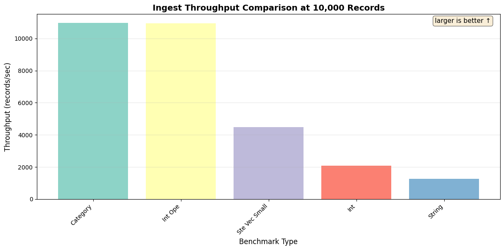

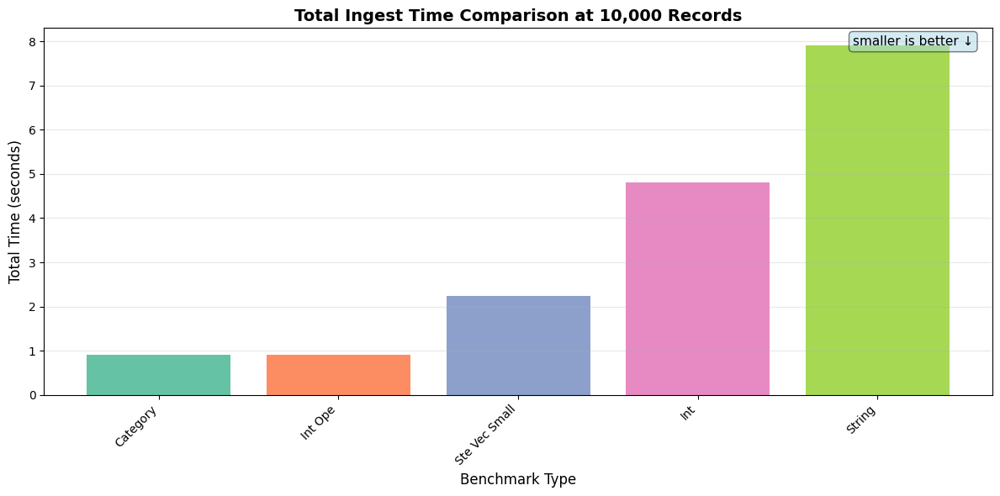

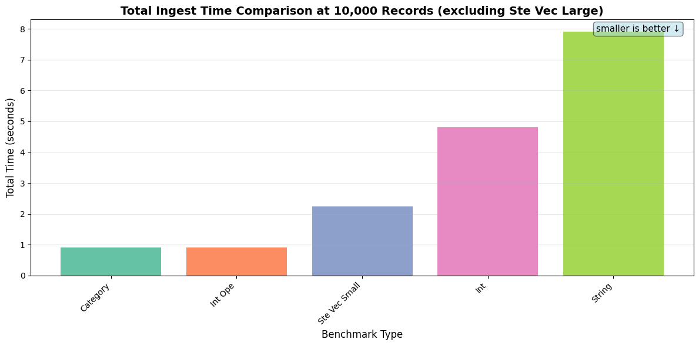

### Category

| Records | Throughput (records/sec) | Total Time | Avg Memory |
|---------|--------------------------|------------|------------|
| 500 | 665.19 | 0.75s | 18.72 MB |
| 1,000 | 3.67K | 0.27s | 20.22 MB |
| 10,000 | 10.97K | 0.91s | 22.28 MB |

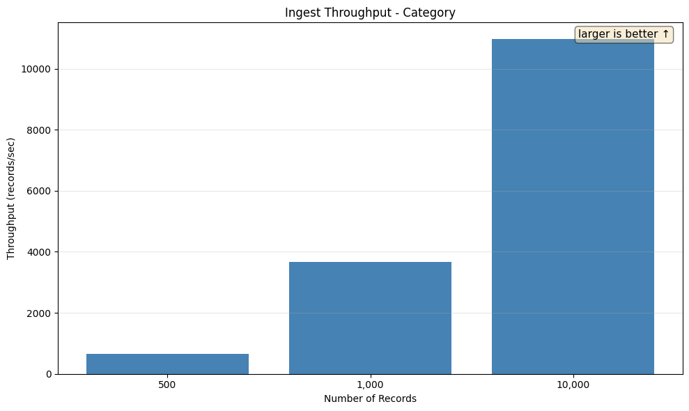

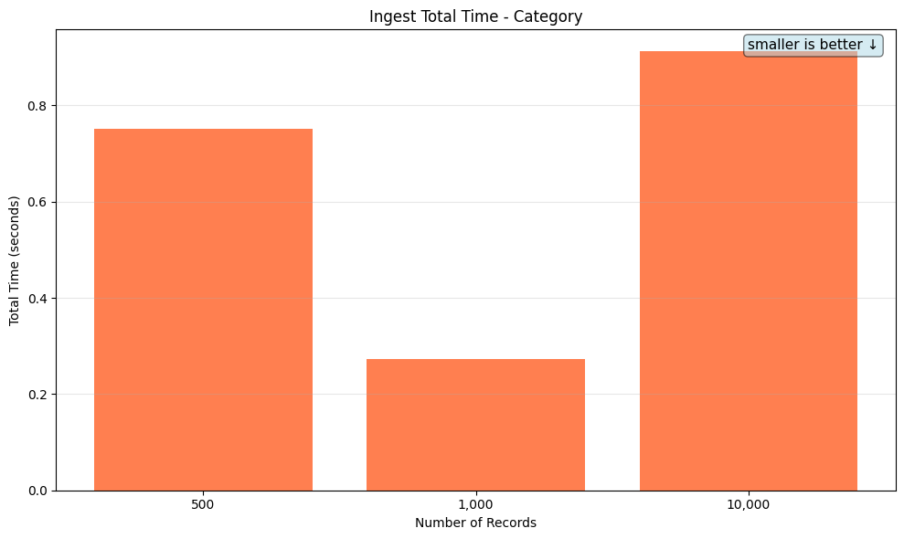

### Int

Tests insertion of encrypted integer values.

| Records | Throughput (records/sec) | Total Time | Avg Memory |
|---------|--------------------------|------------|------------|
| 500 | 418.51 | 1.19s | 19.06 MB |
| 1,000 | 1.48K | 0.68s | 23.80 MB |
| 10,000 | 2.08K | 4.82s | 26.45 MB |

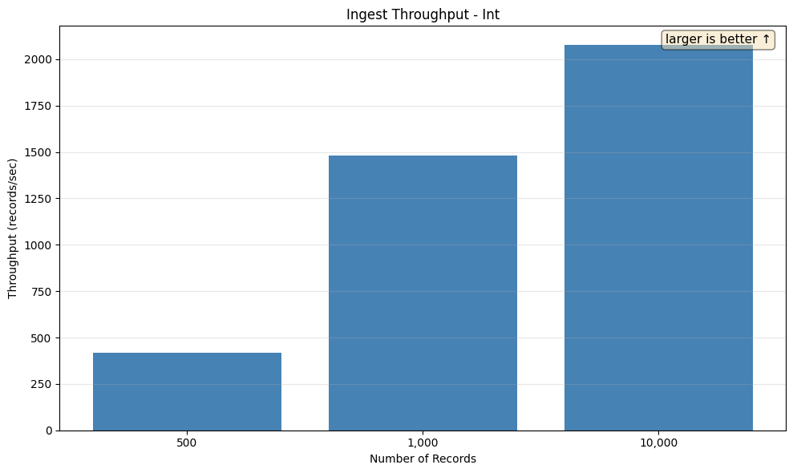

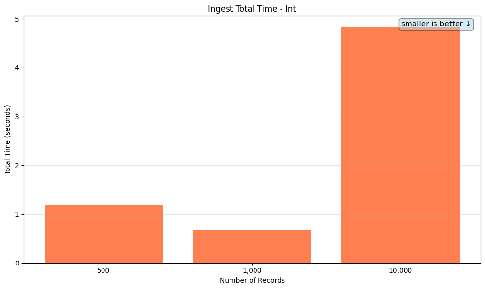

### Int Ope

| Records | Throughput (records/sec) | Total Time | Avg Memory |
|---------|--------------------------|------------|------------|
| 500 | 987.73 | 0.51s | 18.73 MB |
| 1,000 | 3.58K | 0.28s | 20.00 MB |
| 10,000 | 10.93K | 0.91s | 21.81 MB |

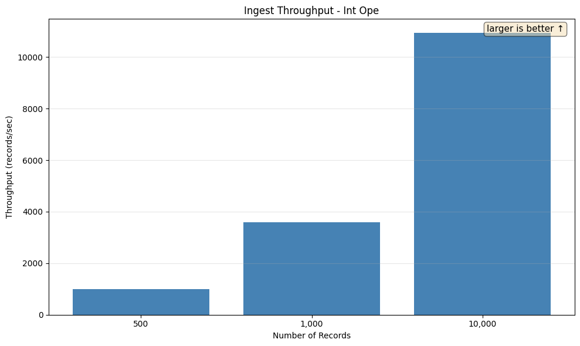

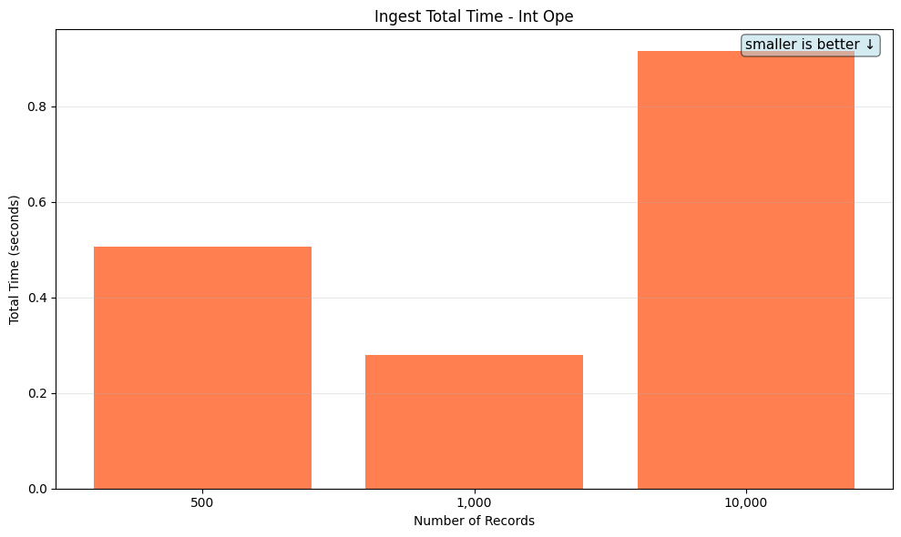

### Ste Vec Small

Tests insertion of small JSON objects with SteVec (searchable encrypted vector) indexing.

| Records | Throughput (records/sec) | Total Time | Avg Memory |
|---------|--------------------------|------------|------------|
| 500 | 317.82 | 1.57s | 23.88 MB |
| 1,000 | 2.38K | 0.42s | 35.89 MB |
| 10,000 | 4.47K | 2.23s | 37.78 MB |

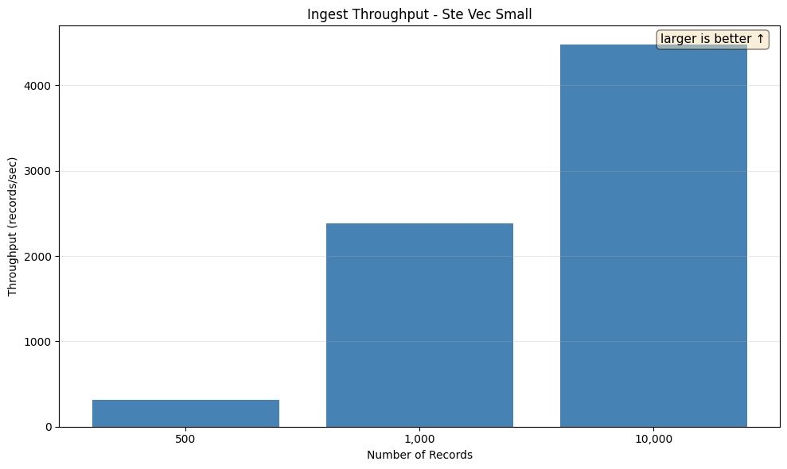

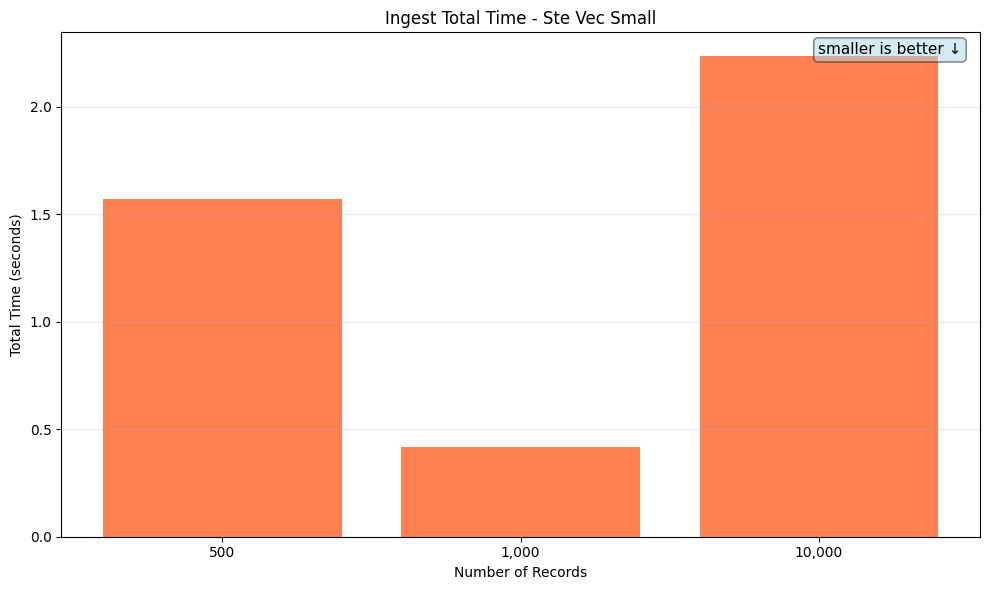

### String

Tests insertion of encrypted string values.

| Records | Throughput (records/sec) | Total Time | Avg Memory |
|---------|--------------------------|------------|------------|
| 500 | 318.12 | 1.57s | 23.48 MB |
| 1,000 | 1.02K | 0.98s | 32.64 MB |
| 10,000 | 1.27K | 7.90s | 36.31 MB |

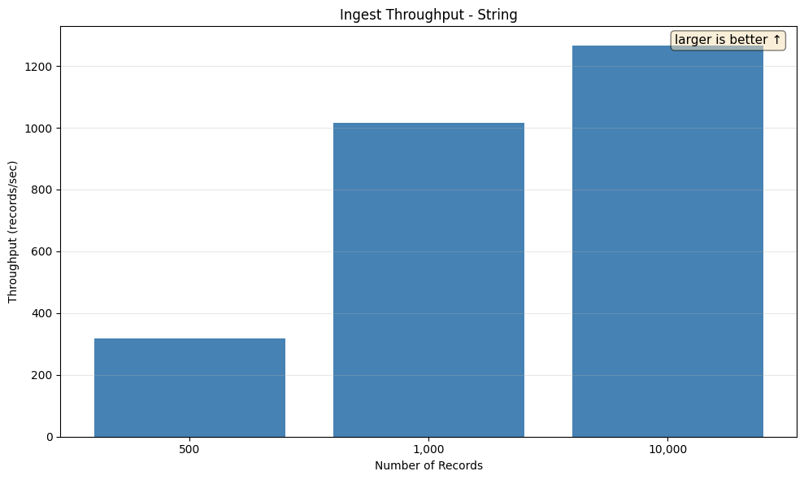

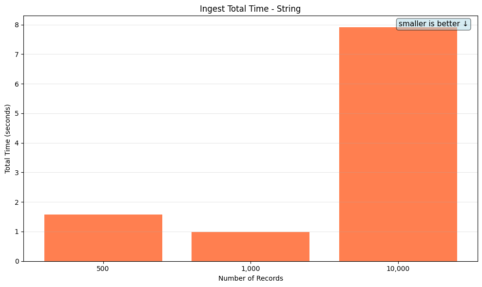

## Query Performance

Per-query-type detail is broken out into separate pages — click into a scenario family for the SQL, per-tier timings, the indexes the planner picked, and the EXPLAIN plan tree.

| Query Type | Scenarios | Tiers | Largest-tier median (no decrypt) | Detail |
|-|-|-|-|-|
| COMBO | `bloom_ore_order_limit`, `filtered_group_by`, `top_n_filtered_group_by` | 10,000, 100,000, 1,000,000 | 8.20ms | [open](combo.md) |
| EXACT | `eql_cast`, `eql_hash` | 10,000, 100,000, 1,000,000, 10,000,000 | 135.64μs | [open](exact.md) |
| GROUP_BY | `low_cardinality_groups_encrypted`, `low_cardinality_groups_plaintext`, `top_n_groups_encrypted`, `top_n_groups_plaintext` | 10,000, 100,000, 1,000,000 | 61.10ms | [open](group_by.md) |
| JSON | `contains/functional`, `field_eq/bare`, `field_eq/extractor`, `field_eq/functional`, `field_order/functional` | 10,000, 100,000, 1,000,000, 10,000,000 | 886.45μs | [open](json.md) |
| MATCH | `eql_bloom`, `eql_bloom_noindex`, `eql_cast_firstname`, `eql_cast_firstname_noindex`, `eql_cast_lastname`, `eql_cast_lastname_noindex` | 10,000, 100,000, 1,000,000 | 11.57ms | [open](match.md) |
| OPE | `range_gt_10`, `range_gt_100`, `range_lt_10`, `range_lt_100`, `range_lt_ordered_10` | 10,000, 100,000, 1,000,000, 10,000,000 | 215.61μs | [open](ope.md) |
| ORE | `range_gt_10`, `range_gt_100`, `range_lt_10`, `range_lt_100`, `range_lt_ordered_10` | 10,000, 100,000, 1,000,000, 10,000,000 | 685.33μs | [open](ore.md) |
| PLAINTEXT | `exact_eq`, `json_contains`, `json_field_eq`, `range_gt_10`, `range_lt_ordered_10` | 10,000, 100,000, 1,000,000, 10,000,000 | 114.62μs | [open](plaintext.md) |
| SCALAR_SMOKE | `bigint_ord/range_gt_10`, `bigint_ord/range_gt_ordered_10`, `boolean/select_back`, `date_ord/range_gt_10`, `date_ord/range_gt_ordered_10`, `double_ord/range_gt_10`, `double_ord/range_gt_ordered_10`, `numeric_ord/range_gt_10`, `numeric_ord/range_gt_ordered_10`, `timestamp_ord/range_gt_10`, `timestamp_ord/range_gt_ordered_10` | 10,000 | 838.93μs | [open](scalar_smoke.md) |

---

*Report generated by `report_benchmarks.py`*
